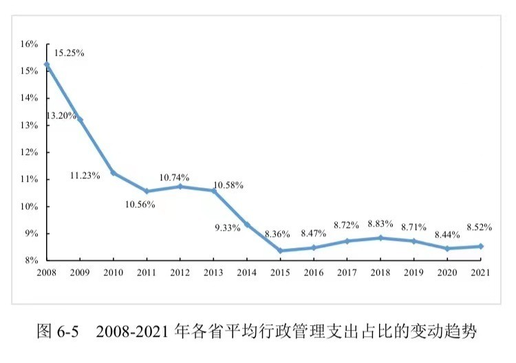

# 31省份强调要过紧日子，天津提出严控财政供养人员规模

近些年财政收支矛盾不断加大，地方政府过紧日子力度越来越大，今年亦不例外。

根据31省（自治区、直辖市）近日公开的2022年预算执行情况和2023年预算报告（下称“预算报告”），第一财经梳理发现所有省份都强调今年要坚持党政机关过紧日子，这包括继续严控一般性支出，“三公”经费等，压减非急需非刚性支出，以腾出更多资金来保民生。

尽管2023年各省份财政收入预期普遍好于去年，但民生等刚性支出压力不减反增，不少省份预计今年地方财政收支矛盾依然突出，政府继续过紧日子也是缓解收支矛盾的一项重要举措，而这并非短期应对措施，是国家一项长期方针政策。

事实上，近些年各地都坚持过紧日子，尤其是去年不少地方财政收入下滑，过紧日子力度加大。

一些省份预算报告公布了去年过紧日子的情况。

重庆预算报告称，去年主动应对财政减收压力，提早调整预算，全市压减非急需、非刚性支出120亿元左右，持续优化支出结构，缓解财政收支矛盾，确保财政运行平稳可持续。

北京预算报告也表示，去年当地全年压减非刚性、非重点项目及一般性支出40.6亿元。贵州预算报告称，去年压减一般性支出2.52亿元，清理盘活存量资金29.52亿元，全部统筹用于民生急需上和发展紧要处。

天津预算报告称，去年坚持真过紧日子,在近年严控一般性支出基础上,2022年按5%、10%两档比例压减公用经费1.6亿元，按照20%比例压减部门行政支出3亿元。执行事业单位新增人员“退一进一”政策，财政供养人员经费按月据实增减，净收回资金1.8亿元。

另外去年广东省本级支出下降6.5%，行政经费和三公经费只减不增。江苏省级单位 2022 年“三公两费”等公用经费以及运转类项目等一般性支出压减
10%，统筹用于保障中央和省确定的急需或重点支出。

政府过紧日子备受市场关注。去年安徽发布过紧日子若干举措文件中，因要求开会不发笔，文件印双面等，还一度上了热搜。从上述省份披露的数据来看，去年各地落实过紧日子要求，腾出资金用于保民生等。

当然，包括江苏、北京、河南等在预算报告中也指出当前一些问题，比如一些地方仍存在过紧日子思想不牢，落实过日子要求不够有力有效等。

无一例外，31省份在对今年预算编制中，都强调了要坚持过紧日子，从而降低行政运行成本，腾出资金用于保民生促发展。

比如，天津预算报告要求，今年坚持真过紧日子。大兴艰苦奋斗之风,继续严格执行零基预算，严控财政供养人员规模，严格新增资产配置管理，继续清理规范业务费,强化“三公”经费管理，大力压减公用经费预算，努力降低行政运行开支。

不少省份对今年过紧日子给出了具体指标。

山东预算报告称，今年大力压减一般性支出，对省直部门日常公用经费定额标准压减20%以上，业务类运转项目预算实行“零增长”，“三公”经费和会议费、培训费规模只减不增，从严控制资产购置，非急需非刚性支出一律不予安排。福建要求省直部门一般性支出总体上按
5%比例压减。

贵州预算报告要求，省级继续按6%压减党政机关行政经费，按15%压减省级机关事业单位公用经费，结合预算执行进度，按比例分档压减非刚性非重点项目支出，为保障重大政策落地和民生事业发展腾出更多财力空间。

根据中国人民大学财税研究所《中国各地区财政发展指数报告2022》，2008年以来中国行政管理支出占一般公共预算支出比重有力显著下降，从2008年的15.25%降至2021年8%左右，尤其近年在8%左右小幅波动。

上述《报告》认为，尽管一般性支出的压缩空间日益缩小，但是严控一般性支出增长，严控“三公”经费预算，取消低效无效支出应该久久为功、毫不松懈，防止一般性支出的反弹。

另外，《报告》称，部分省份的行政管理支出比重仍然较高，应该继续淡化“吃饭财政”的色彩，落实过紧日子要求，厉行节约，从严控制和压缩以“三公经费”为代表的行政管理经费支出，将更多的财政资金用于改善和保障民生方面。

中国政法大学教授施正文曾告诉第一财经，要真正落实紧日子，需要牢固树立官员“过紧日子”思想，严格执行预算法规等法定程序，推进零基预算和支出标准科学化，提高预算科学性，并强化监督。

中央财经大学预算管理研究所所长李燕认为，一些地方没有落实过紧日子，其中大多隐藏着体制机制问题、部门利益以及预算管理等问题，涉及到预算的编制、执行等环节，因此要想整治顽症，就既要进行“经济体检”，找出病灶，更要通过制度技术创新，未病先防，以优化支出结构为契机，建立长效机制，从源头上推动见成效。

李燕建议，对预算管理体制机制还不完善的要深化改革加大建章立制；对由于部门财务管理能力滞后、政策制度不理解的要加大学习与培训；对主体责任不到位的、制度执行不到位的加大追责与问责；对故意违法违规屡审屡犯的要加大曝光力度，坚决予以查处。

财政部近日对《行政单位财务规则》进行了修订。其中增加“艰苦奋斗，厉行节约”“从严从简，勤俭办一切事业”等要求，明确各单位不得擅自扩大开支范围、提高开支标准，应合理安排支出进度，严控一般性支出。

