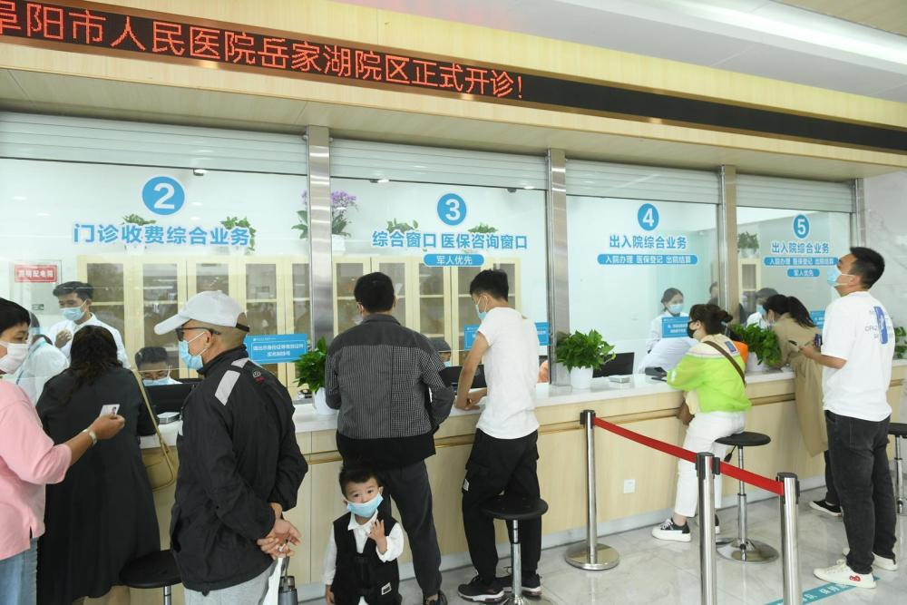

# “新冠患者住院费全额保障”调查：多地执行细节不一，有患者需先结算后退费

感染新冠病毒之后，湖南邵阳佘女士的父亲反复进入ICU，此后又感染超级耐药菌鲍曼，光14天的ICU费用就达5万多。1月7日，佘女士看到国家出台了新冠肺炎感染住院全额保障的政策，但医院告诉她“财政没拨款，医院也没钱垫”，此外“怎么区别新冠感染和基础病还要研究”，她至今没有结账。

根据四部门1月6日印发的《关于实施“乙类乙管”后优化新型冠状病毒感染患者治疗费用医疗保障相关政策的通知》（下称《通知》），新冠患者在所有收治医疗机构发生的符合卫健部门制定的新冠诊疗方案的住院医疗费用，执行前期费用保障政策，由基本医保、大病保险、医疗救助等按规定支付后，个人负担部分由财政给予补助，所需资金由地方财政先行支付，中央财政按实际发生费用的60%予以补助。该政策以患者入院时间计算，先行执行至2023年3月31日。

但在此过程中，“全额保障”的落地执行细节有待厘清。红星新闻记者了解到：有人反映没有得到住院费用的全额报销，只按普通住院由基本医保报销了部分费用，咨询后得到的答复不一，理由包括“在1月8日‘乙类乙管’前入院”“新冠肺炎不是第一诊断”等。

**1月8日前入院能否享受全额报销？**

**各地在时间、医院、药品目录上回答不一**

近日，有多地1月8日前入院的患者向红星新闻记者反映，“所在地的医院和医保局表示‘全额报销政策只给到1月8日后住院患者’”。对此，红星新闻记者采访、梳理了多地政策，答案不一。

2月4日，湖南省医保局答复红星新闻记者，2022年12月8日到2023年1月8日之间入院患者的费用，医院正在统计名单，通过财政审核后，可以纳入补助的，到时候会通知，该省财政厅工作人员则表示1月8日前后“应该是一样的”。2月7日，江西省财政厅工作人员向红星新闻记者表示，1月8日前入院的，只有在新冠定点医院治疗才能享受政策。

_图据广州发布微信公众号_

广东省医保局近日通过“广东发布”回应了1月8日前入院的政策：1月8日前，确认疑似和确诊为新型冠状病毒感染的患者的住院医疗费用，同样纳入特殊医疗保障政策。与1月8日后的规定相比，该规定包括疑似患者，且没有对是否第一诊断作出限定。

广东清远医保局1月30日在公众号发文表示，由于当时医疗费用保障政策的调整滞后，目前卫健部门联合医保部门正在收集统计1月8日前入院新冠病人的信息，待有关行政部门明确保障方案后，认定符合保障范围的，再由医院另行通知办理退费手续。这部分患者应先按普通医保政策结算。

西安市医保局通过媒体表示，2022年12月7日至2023年1月7日期间住院的新冠患者，个人负担部分仍会由财政补助。

**基础病治疗费用能否报销？**

**多省财政称“费用认定由卫健部门和医院负责”**

对四部门《通知》，各地对“符合诊疗方案的住院医疗费用”的理解成为关键。在此过程中，不少患者的核心关切有两点，一是基础病治疗费用能否全额报销。

对此，广东给出了详细规定，要看新冠是否是入院第一诊断：“乙类乙管”后，入院第一诊断为新冠病毒感染患者的留观、住院医疗费用，包括治疗相应的基础病、合并症、并发症等，给予全额保障。入院第一诊断为其他疾病的新冠病毒感染患者，符合诊疗方案的住院医疗费用，给予全额保障，其他疾病治疗费用按普通住院政策支付。

_资料图 图据图虫创意_

据海南官方通知和西安市医保局对媒体的介绍，两地都需要把新冠治疗费用和其他疾病费用分开结算，不属于新冠治疗的不纳入补助；无法分开的，一同纳入补助。天津也表示，要分开上传。这也导致无法当场直接补助。

多省财政厅在向红星新闻记者明确了财政报销政策之后表示，具体符合条件费用的认定，由卫健部门和医院负责。山东、江西省财政厅工作人员明确表示，只报销经卫健部门细则认定的新冠治疗费用。

另一个关切点是“未作新冠诊断”如何报销。

对于“请问病历写的是病毒性肺炎能报吗？”的问题，广东省医保局在“广东发布”的回应重申了上述“乙类乙管”前后的政策支付范围。还有“阳过”的问题。

有病人表示，“之前在家治疗的时候是抗原阳性，转阴后才去医院，诊断上没写新冠，但明显开了阿兹夫定，该怎么算？”对于类似疑问，广西梧州市医保部门回应，“阳过”的肺炎是否由新冠病毒感染导致，需要由专业医生诊断认定。

**个人负担部分谁来支付？**

**财政资金待下达，“可先结算后退费”**

红星新闻记者了解到，对于个人负担部分具体由哪一级地方财政先行支付，部分省份规定为“就医地财政”。更具体的规定有，海南为省级财政；山东、江苏、陕西为市级或以下财政；广西和广东佛山为收治医疗机构同级财政。天津规定，财政补助费用先行由医保经办机构按规定与收治医疗机构结算，定期汇总后与财政部门结算；江西明确，参保患者住院医疗费用先由就医地定点医疗机构垫付，再向财政部门申请结算。对此，江西省财政厅工作人员向红星新闻记者表示，资金量比较大，可能有些医院没有垫付，财政补助工作在后续开展，有时间差。

_资料图 图据视觉中国_

江西某三级医院院长告诉红星新闻记者，该医院之前是新冠定点医院，但去年12月以来对新冠患者住院基本都是按普通住院结算，并没有垫付个人负担部分。该医院有部分患者选择了暂不结账。据其了解，江西省内只有个别医院实现了患者住院费用零自付。

2月3日，山东省财政厅工作人员向红星新闻记者介绍，1月19日下发了文件要求当日开始医院垫付个人负担部分，也开会通知了，但“可能有些医院执行有点滞后”。2月8日，浙江省医保局和浙江省财政厅工作人员向红星新闻记者表示，省里的规定是医院先判断是否符合诊疗方案、是否属于结算范围，并垫付财政补助部分再挂账上报。浙江省医保局还表示，出现没有报销的情况患者需要找医院退费，“可能是还没拨钱”。

2月7日，湖南省财政厅工作人员向红星新闻记者表示，财政厅正会同卫健和医保部门在加班加点汇总数据，现在的关键是怎么界定基础病、并发症等，还需要与医院协商划分，“只要资金一来就会由医院补发或者退回。”她表示，清算过程需要时间，初步预计要到4月份才会清算完毕，其保证“个人先行支付的款项到时会退回”。

山东省财政厅工作人员估计，上级财政资金2月能补到各个医院，他建议还没结账的患者“先等一等，会报的”，已经结账的医院也会给退。据华商报报道，陕西省的住院医疗费用医疗保障实施细则明确，财政补助部分由医疗机构先行支付。部分医院进度较快，已对部分出院患者进行了退费。

**各地医保支付能力如何？**

**多地加强运行与收支分析**

从国家规定来看，无论是否参保，费用只要符合条件，即使基本医保未能报销一分钱，也由财政全买单，贵州即明确“非参保患者的医疗费用由财政承担”；“所有收治医疗机构”意味着无论是否医保定点医疗机构（区别于新冠救治定点医院）都可以全额报销，黑龙江直接明确“所有收治医疗机构”包含非医保定点医疗机构。不过，有省份对医疗机构的规定为“各定点医疗机构（含临时纳入医保协议管理的医疗机构）”。

《通知》表示，各地根据需要，与具有新冠治疗能力的非医保定点医疗机构签订《新型冠状病毒感染患者收治医疗机构医保费用结算临时专项协议》。广西和湖南明确，协议签订之前的费用不再向前追溯，其他省份或有明确纳入保障从“协议签订之日起”。

面对巨量新冠治疗费用，各地医保基金支付能力如何呢？对外经济贸易大学保险学院教授于保荣接受红星新闻记者采访时表示，这要看整体的数据。2022年12月前，因为疫情防控政策，部分医院诊疗需求被抑制，为医保基金省下了一部分钱。高峰又正好发生在2022年底和2023年初，摊到了两个年份，因此他认为，医保基金应该不会透支。于保荣还表示，对于全额保障新冠治疗费用，应该有更清晰的法理依据。

红星新闻记者了解到，目前各地也在关注相关影响。山东表示要加强基金运行分析，掌握新冠救治费用对基金影响，制定基金调整工作预案；天津表示要密切跟踪医疗保障基金收支情况，做好新冠患者支出情况统计分析；多省也强调要加强医保基金监管。而《通知》则提出，医保基金出现收不抵支的统筹地区，可由地方财政给予适当补助。适时推动省内基金调剂。

红星新闻记者 胡伊文 吴阳 实习生 易千雪 北京报道

编辑 郭宇 责任编辑 魏孔明

