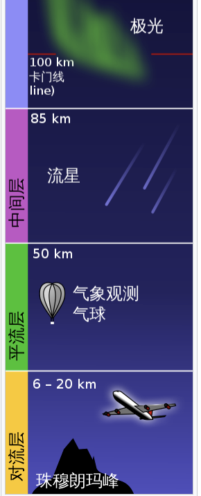

# “流浪气球”故事：2万米以上高空何以成为探索热点？

**2.9**

**知识分子**

The Intellectual

图源：pixabay

**撰文 | 冯灏**

**责编 | 徐卓君**

● ● ●

在过去的两周，来自中国的两个气球形状的飞行器分别在美国和拉丁美洲上空漂流，引发关注，被网友们戏称为“流浪气球”。

最开始是美国观测到第一个飞行器，中国外交部在第一时间回应，该飞行器是民用性质，因为不可抗力误入美国领空，是个意外事件；不过，美国还是于2月4日出动F-22战斗机发射空对空导弹在2万米（20公里）左右的高空将其击落。[1]

此后又在拉丁美洲上空发现了另一个飞行器，拉丁美洲各国暂无动作。

据外媒报道，飞行器此前出现的高度在20到40公里之间，后降到20公里左右。

1944年《芝加哥公约》确定了缔约国拥有其领土之上的“空中主权”，但领空主权的高度上限在国际法中是没有确定的。

民间组织国际航空联合会认为，外太空和地球大气层的分界线在100公里，也即100公里以外、卫星的运行空域被视为属于国际空间法的范畴，不属于某个国家的领空，各国都可以和平利用。

**“气球”为什么上得去下不来？**

在气象领域，气球是常用的探测工具，主要用于天气预报，根据世界气象组织，全球有超过10,000个地面气象站和1,200个左右的探空气象站，探空站每天同步2次释放探空气球，以进行大气的垂直观测并分析当下的大气条件。这些气球会随球携带一个无线电探空包，监测从地面到高空的大气状况，比如风速、温度、湿度和气压，并通过无线电将探测数据传送回地面站点。

这个全球共享的观测系统在中国有约120个气象站点，中科院大气所研究员卞建春说，“总的来讲，常规的探空气球是由可生物降解的天然乳胶制成的充氢或充氦气球，一般飞到30到40公里的高空自己就炸掉了，而且从上升、球炸到下降，一般不超过两个小时。”

大气分层示意图，图源：美国国家海洋和大气管理局

“风速大的时候水平方向上能到200公里，风速小的时候可能有几十公里的，所以一般不会出中国国境，除非在边境附近的测空站点，才有可能飘到境外。这是世界共享的气球探空业务，入境国一般都会理解，而且常规的中国气象局的业务气球不会很大，也就是750克或1600克的一个乳胶球，即使飘到境外去，肉眼也基本上看不见。”卞建春说。

此次长度约61米的设备不是常规的气象气球，中国外交部使用了更准确的说法——无人飞艇。

二者的主要差别在于推进装置。气球是不带推进装置的，因此不能自由控制方向，只能随风漂流；飞艇又名可操纵气球，它颇像一艘空中飞船，能在很大的高度范围内，按照规定的方向飞行。[2]

但从其在美国上方被观测到的漂流轨迹来看，更多只是风吹到哪就去哪。

卞建春告诉《知识分子》，这类飞行器最重要的就是“上得去、稳得住、下得来”。

“它能上到高空去，然后在空中理想高度稳得住，最后要下得来，这是个完整的流程。相对而言，停留有一定技术难度，上去和下来难度反而没有那么大。下来有很多方法，可以远程控制，也可以按照预先设置的时间、地点启动放气装置自动放气。这次可能是释放气体装置失能了。”卞建春说。

放气技术故障也曾出现在加拿大的气象气球上。25年前，由于一块塑料覆盖住了放气阀门，气球难以自然放气导致了技术故障，未能在两三天内按计划降落。当时，加拿大工程师Dale
Sommerfeldt对美联社解释，终端设备失灵，备份系统失灵，随后，加拿大军方向气球发射了1000多发弹药，也未能将其击落。当时民航不得不改变跨大西洋航班的航线以绕过这枚顽固的气球，它最终在九天之后降落在芬兰。[3]

**这个高度为何举世瞩目？**

按照中国外交部的回应，在美国和拉丁美洲上空的无人飞艇属于民用性质，用于飞行实验。

实际上，此次无人飞艇“流浪”的临近空间，是各国探索的焦点。

临近空间是指距离地面20到100公里的空域，不在传统民航（20公里以下）和航天卫星（300-400公里以上）的覆盖范畴内，是人类尚未进行大规模利用的空白空域。

中国科学院国家空间科学中心研究员胡雄告诉《知识分子》，最近这一二十年，各国特别关注这个空间，很多国家都在开发利用。

胡雄说，中国也在做临近空间环境的探测研究，比如，原位测量临近空间的环境要素，认识大气的、电场磁场的、辐射的规律，认识太阳风暴的影响、研究环境变化机理都是很重要的内容，为将来进一步的开发利用做基础的准备。

除了传统意义上的探空气象预报，对于临近空间的开发利用设想中还包括不少让人耳目一新的内容。比如，通信中继、太空旅行、快速远距离交通、救灾辅助等等。

“毕竟用卫星通讯成本还是很高的，如果在临近空间上加一个中转站，成本会比卫星小很多，这是一个可能的商业应用”，卞建春说，“这部分一开始研发的时候会交给企业，最终应用的时候，国家可能就会向这个企业倾斜”。

而太空领域的应用也在扩大，不再是富裕国家政府机构和大型国防承包商主导的市场，私人公司已经赢得了一席之地。目前有90个国家在太空运营，大约有10000家公司和5000名投资者参与太空产业。[4]包括埃隆·马斯克、杰夫·贝佐斯和理查德·布兰森在内的亿万富翁，在SpaceX、蓝色起源和维珍银河等公司的掌舵下发射自己的火箭、航天器和卫星。

大家更为熟悉的是亿万富翁进入外太空，但这些航程票价动辄千万美元，劝退了绝大多数人。美国的蓝色起源和英国的维珍银河就分别开设了临近空间太空旅行的业务，票价在20万到25万美元之间，大大降低了门槛。

到目前为止，蓝色起源已经向太空发射了六次客运航班。不过，去年9月，一艘未载人的蓝色起源号飞船因与火箭助推器分离而起火，这导致美国联邦航空管理局暂停了该公司的所有发射，[5]计划2024年重启全女性成员的航程。

此外，美国谷歌公司也有成功的高空气球应用，这种由聚乙烯材料制成，直径15米、高12米，内置太阳能电池板、GPS定位设备，无线电收发器、环境检测器等设备的气球，工作原理是将互联网连接的气球漂浮到同温层，为当地电信公司提供一种选择，让他们可以通过互联网接入更多的用户，而不必花费数亿美元来建立一个物理互联网主干网，以将互联网覆盖到偏远地区。

2017年，秘鲁洪灾与袭击波多黎各的玛利亚飓风等环境灾难中，大面积停电，谷歌气球飞去当地上空建立临时通讯，为数以千万计的用户提供了通讯服务。

2005年，法国科学家曾在南极上空成功实现了超高压气球的长时间飞行，16次飞行持续时间超过2个月，但试验的大多数航行还是由于飞出授权区域而被终止了。[6]

胡雄告诉《知识分子》，“很多国家的飞行器选择南半球做实验，因为南半球国家少、海域面积比较大，主权争端就会少一些，我们从事科学研究的工作者，特别希望能多做一些试飞，绕着地球飞，时间越长，可以获得的科学数据就越多。”

2010年2月，法国科学家从印度洋塞舌尔岛发射了三个气球，在17至19公里的高度飞行了约三个月，覆盖了整个赤道带。[7]

“不过，这需要和飞越国家打好招呼，事先沟通好。” 卞建春说。

**参考文献：** （上下滑动可浏览）

1\. https://www.defense.gov/News/News-
Stories/Article/Article/3288543/f-22-safely-shoots-down-chinese-spy-balloon-
off-south-carolina-coast/

2\. https://aircraftdesign.nuaa.edu.cn/5077/list.htm

3\. https://www.bbc.com/news/world-us-canada-64546767

4\. https://www.weforum.org/agenda/2022/10/space-economy-industry-benefits/

5\. https://phys.org/news/2022-09-uncrewed-blue-rocket-setback-space.html

6\. https://journals.ametsoc.org/view/journals/atot/24/12/2007jtecha948_1.xml

7\. https://www.mdpi.com/2073-4433/10/2/102

