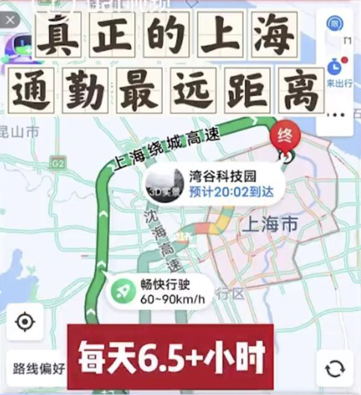
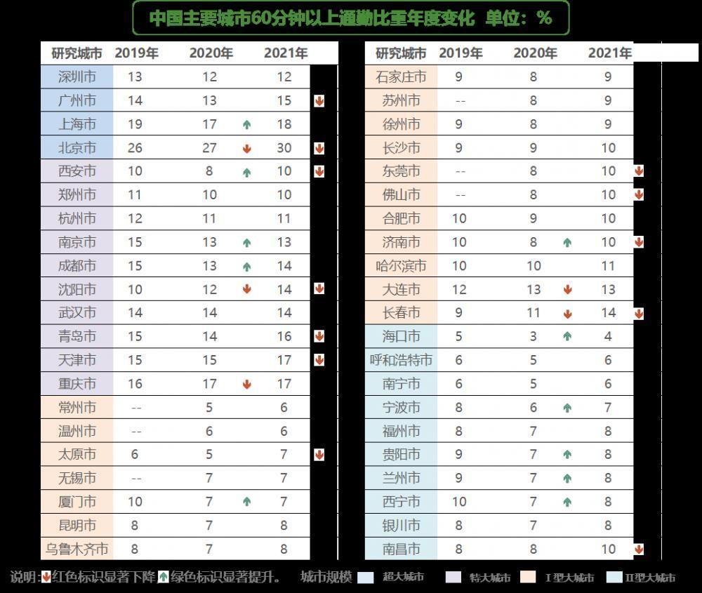
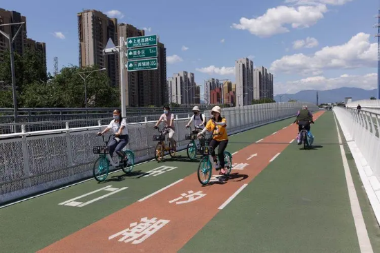

# 上海一女士通勤6.5小时背后：全国超1400万人正承受“极端通勤”

你梦想的工作是什么？事少、钱多、离家近？对大部分打工人来说，以上三点能满足一点就很幸福了。尤其在一线城市里，居住在郊区工作在市区，再寻常不过。

这两天，通勤话题“女生极限通勤每天来回6.5小时”登上了热搜——上海的金女士，每天通过“电动车—公交—地铁—班车—步行”去上班，单程需要3小时15分钟。

最新研究报告显示，目前我国至少有1400万人正忍受着“极端通勤”。上班途中耗时多少算是极端通勤？在我国，哪些城市的极端通勤最突出？哪些城市的上班族最惬意?各大城市有何应对之策？极端通勤对于打工人有何影响？上游新闻进行了梳理。

**上海女士每天上班来回6.5小时**

上海的金女士，家住金山区朱泾镇，在杨浦区某公司上班。

由于路程较远，她先要骑电动自行车到公交站，坐一个半小时的公交后，再换乘地铁。到站后再坐班车到公司所在园区上班，单程需要3小时15分钟。为了赶上早晨9点钟打卡，她每天5点20分就要起床。

电动车—公交—地铁—班车—步行，金女士每月交通费在800元左右。她不是没有考虑过自驾，但开车单程在100公里左右，早晚高峰单程也要将近2小时，加上油费、过路费、停车费每月花费要在5000元左右。

她也不是没有考虑过在公司附近租房，“但这样成本更高”。由于通勤时间过长等原因，金女士目前已从公司离职。

此话题引起网友的热议。对于有没有必要每天这么“折腾”，大家看法不一。有人觉得没必要这么折腾，找工作的时候就应该考虑周全。也有人分享了自己的通勤经历“比惨”，感叹打工人就是奔波的命。

_▲90后女孩斌斌在江苏昆山买房，在上海工作，坐高铁上班。_

**坐高铁跨省上班并不鲜见**

2021年，天津90后姑娘@我是韩小姨，把自己通勤的Vlog发到网上，引起网友共鸣。每周她要从天津乘坐高铁到济南上班，全程4个多小时。为了赶车，早上5点多就要起床，路上很累很困，只能在地铁和高铁上眯一会。天津到济南，300多公里，她就这样在双城间奔波了七年。

小韩说，7年来，没有其他突发状况时，每个周日下午或周一上午，她都会从天津家里赶到济南公司上班；周五下午或周六上午，再赶回天津过周末，其余时间在济南租房。7年间，她已经积攒了一沓车票，有高铁票，也有绿皮火车票，车票中最常出现的站点是天津站、天津南站、济南站、济南西站。

2022年8月，一个每天坐高铁跨省上班女孩的视频上了热搜。视频中，90后女孩斌斌在江苏昆山买房，在上海工作，每天上下班都需要坐高铁转地铁，从家步行6分钟到高铁站，乘高铁17分钟，乘地铁20分钟，步行8分钟到公司，一趟耗时50分钟，比很多同城通勤的同事用时还短。

“我当时买房子时就想着一定要离高铁站近。”每天坐高铁通勤的费用，一个月算下来1000元左右。她表示，“这个钱在上海只能合租，而且位置会比较偏。”

_▲
在超大、特大城市中，深圳的“幸福通勤”的比重为58%，系最高水平。_

**监测报告称超1400万人承受“极端通勤”**

2022年7月29日，中国城市规划设计研究院在北京发布《2022年度中国主要城市通勤监测报告》（以下称《报告》），选取了我国44个主要城市，汇聚9000万人的职住通勤数据。以下是要点解读。

**深圳“幸福通勤”比重最高**

单程5公里以内的通勤，又称“幸福通勤”，其比重反映就近职住、可以慢行通勤的人口占比，是城市宜居性的重要指标。

《报告》显示，2021年，各城市“幸福通勤”比重全线下降，主要城市“幸福通勤”人口比重总体平均水平为51%，同比降低2%。其中，超大城市48%，同比降低1%；特大城市49%，同比降低2%。

在超大、特大城市中，深圳的“幸福通勤”的比重为58%，系最高水平。其次是杭州54%、郑州51%、天津51%、广州50%；北京占比最低，仅为37%。

_▲北京60分钟以上通勤比重为30%，是全国极端通勤人口最多的城市。_

**北京“极端通勤”占30%，人口也最多**

单程时间60分钟以上的通勤被称为“极端通勤”。《报告》显示，44个国内主要城市中，超过1400万人在承受极端通勤，单程时间60分钟以上通勤比重为13%，同比增加1%。32个城市的极端通勤比重增加。其中，超大城市平均水平19%，同比增加2%；特大城市14%，同比增加1%。

从城市来看，北京60分钟以上通勤比重为30%，是全国极端通勤人口最多的城市，同比增加3%。广州、青岛、沈阳、天津、西安、长春、东莞、佛山、济南、太原、南昌等城市极端通勤比重也同比增加2%。而深圳、南京、杭州、郑州、厦门5个城市连续3年极端通勤比重减少。

**超七成人通勤在45分钟以内**

44个国内主要城市中，单程平均通勤时耗36分钟，同比持平。其中，超大城市总体平均41分钟，同比增加1分钟；特大城市38分钟、Ⅰ型大城市34分钟、Ⅱ型大城市33分钟，同比无变化。

提高45分钟以内通勤比重，是改善城市人居环境的重要目标。《报告》显示，44个国内主要城市中，76%的通勤者45分钟以内可达工作场所。其中，深圳45分钟通勤比重77%、杭州79%，分别是超大、特大城市的最高水平。

平均通勤距离体现真实的职住（居住与就业）分离情况。特大城市平均通勤距离增长最为显著，10个特大城市中，沈阳、青岛、西安、南京、郑州等7个城市同比增加超过0.5公里。郑州、徐州、乌鲁木齐同比增长超过0.7公里，是年度通勤距离增加最多的城市。

其中，北京平均通勤距离11.3公里，同比增加0.2公里，仍是通勤距离最长的城市。上海、成都、广州平均通勤距离超过9公里。厦门平均通勤距离7.1公里，连续3年保持不变。

**多个城市推出通勤提升专项行动**

自2020年5月以来，成都、北京、苏州、南宁、长沙等城市，陆续推出通勤提升专项行动。

2021年，成都市委制定《成都市人民政府关于实施幸福美好生活十大工程的意见》，提升城市通勤效率。成都市公交交管局指挥中心自2021年以来，引导2600万人次智慧避堵。

2022年5月，北京发布《2022年北京市交通综合治理行动计划》，明确2022年年底45分钟以内通勤出行占比达到56%，推出需求响应公交服务试点，开行“定制快巴”通勤班车，围绕服务通勤打造品质慢行交通系统，贯彻“以人为本”和“慢行优先、公交优先、绿色优先”理念。

2021年，苏州市印发《关于加快推进苏州市轨道交通场站及周边土地综合开发利用的实施意见》，明确要求实现轨道交通建设与TOD综合开发“齐步走”，统筹规划、土地、指标等资源，引导优化城市空间结构布局。

2021年南宁市《政府工作报告》明确提出以站城一体化（TOD）理念推进城市框架拉开，推动多中心、多组团发展。

长沙交警推出面向通勤的智能网联精准公交，实时传送车辆定位、行驶速度等数据。已开行的3条线路，将全程公交时间由60分钟压缩至30分钟，约24.7%的乘客由开车通勤转变为乘坐智慧通勤公交。

**“极端通勤”患抑郁症风险增加33%**

研究普遍认为，长时间通勤会降低人们的幸福感。根据剑桥大学等机构的一项研究，单程通勤时间超30分钟，可对员工健康和工作效率带来不利影响；而单程通勤超过60分钟，患抑郁症的风险则会增加33%，肥胖的可能性也会提升21%。

但也有财经专家认为，通勤时间长对个体是坏的，对企业和城市发展不一定就是“坏”的。比如，会倒逼员工更加努力工作。长时间通勤还可能提高居民收入，拉动家庭消费。比如，过长的通勤时间会减少工作人口的闲暇，居民将通过购买更多服务来增加闲暇，如家政服务、餐饮服务、衣着加工服务。

还有观点认为，诸如阅读、玩游戏、看电影等“网络消费”，有利于缓解通勤时间过长带来的负面影响，提升居民通勤的幸福感。

**相关新闻：上海跨城通勤者九成来自苏州**

近日，由同济大学建筑与城市规划学院与智慧足迹数据科技联合编制的《2022长三角城市跨城通勤年度报告》发布。

报告显示，在上海周边地级市中，苏州与上海跨城通勤联系最为紧密。苏州是流入上海跨城通勤者的主要居住地，占通勤者总规模的九成左右。具体到区县，苏州下辖的昆山是跨城通勤者的主要居住地，近七成的跨城通勤者居住于此。

昆山紧邻上海，上海地铁11号线延伸到昆山境内，是全国首条跨省地铁。每天有不少跨城通勤者在昆山的花桥站上车，乘坐地铁前往上海。

除苏州以外，其他城市往返上海的跨城通勤者比例相对较低，其中居住在嘉兴的人数排在第二位。南通、无锡、杭州、常州等地，也有一定数量的人群每天往返上海工作。

与粤港澳大湾区相比，长三角地区跨城通勤人数不算高。据广州市规划和自然资源局发布的《2021年广州市交通发展年度报告》，2021年广东9大城市间跨城通勤人口总量达到121万人，广州和佛山、深圳和东莞、珠海和中山等城市之间的跨城通勤者数量最多。

上游新闻综合上观新闻、中国经济网、界面新闻、中国消费者报、中国建设报等 图片来源 齐鲁晚报、中国建设新闻网、中规智库、网络等

编辑：朱亮

责编：王蓉 官毅

审核：冯飞

