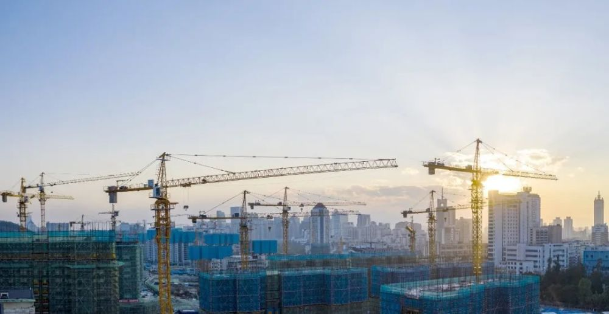
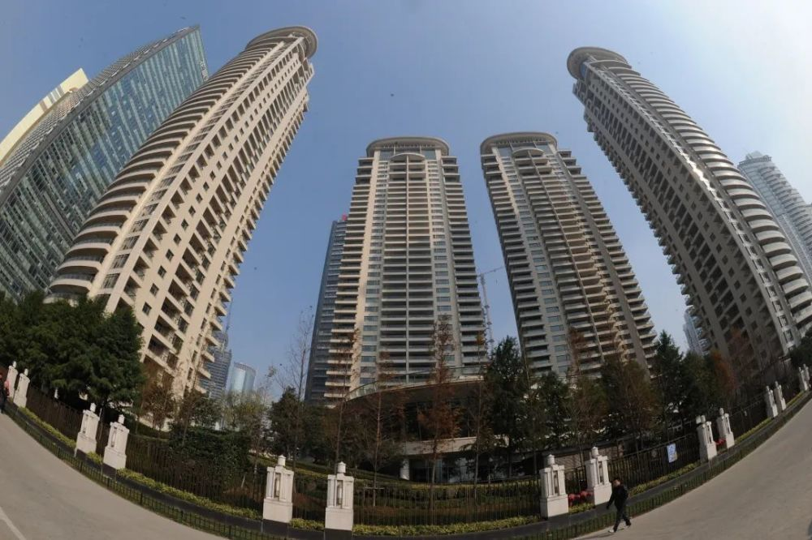

# 北京开年首场土拍揽金132亿，粤系房企越秀59亿逆势买地

**作者 |** 李逗

**编辑 |** 田晏林

作为地产开发商重要的生产资料，土地是整个房地产开发链条中最基础的“原料”，也是未来楼市的风向标。然而，面对北京的土地市场，开发商已经很久不在意拿地这件事了。

可对于大多数房企来说，困难是摆在眼前的，再不拍上地，巧妇也难为无米之炊，来年企业可能就要颗粒无收了。

2023年2月8日，在北京开年首场土地拍卖中，情况发生了变化，一批来自南方的地方国资房企涌入拍地现场，抢了许多深耕北京市场多年的房企的风头。

据悉，本次不仅是春节后北京土地市场的第一拍，还是2022年第五批次集中供地的收官，共计出让6宗地块，吸引了33家房企及联合体报名竞逐。

具体来看，这6宗地块分别位于经济技术开发区、朝阳区、石景山区、通州区、昌平区、房山区，土地总面积约21.47万平米，总建面约53.18万平米，总起始价122.52亿元。

其中，有3宗地块底价成交，另外3宗地块，经过房企的激烈争夺，触顶成交。最终，北京土地市场在当日总共收金132.09亿元。

对于北京房地产市场而言，开年土拍之所以引发关注，还有一个原因是，近日一份自然资源部办公厅在2022年12月8日发布的《关于进一步规范住宅用地供应信息公开工作的通知》在网上流传。文件显示，出让地块由一年三次的集中供地，调整为多次小集中供地。

因此，部分媒体将此解读为今年22城将取消集中供地制度。事实真的如此吗？

南方房企突袭北京

开年北京的首场土拍释放出的楼市信号，如供地价格、开发商拿地态度、规划方案等，都在不同维度透露出北京楼市未来的走向。

2023年2月8日下午，北京市政服务大厅的土拍现场，座无虚席，参与报名的14家房企及联合体举牌人，齐刷刷地坐在了拍卖席位。他们都是前来参与昌平区信息产业基地地块的买家。

房企们看重这块地的原因并不复杂，这里不仅地段位置优秀，周边的配套如商业、学区、地铁等也一应俱全，可以说是北京土拍市场难得一见的好地块。

为了成功拿到“黄金宝地”，越秀、城建、建发、厦门国贸、招商、首开、中建智地等14家房企开展了激烈“厮杀”。

竞拍开始前，该地块已经过14轮报价，报价金额达30.75亿元，距离地价上限仅不到3万元。因此在正式的开拍现场，仅仅用时1分钟，房企的叫价便触及土地合理价格上限。紧接着，现房销售面积的竞拍环节，也很快达到了上限。

按照规定，哪家房企能拿到该地块需要通过现场摇号确定。最终，来自广州的国企越秀地产成了这名“幸运儿”，以“33.12亿元+4.5万平的现房销售面积”摘得该地块，楼面价约3.7万/㎡，溢价率15%。

但越秀地产猛烈的攻势并未停止。

为了拿下石景山苹果园的土地，越秀地产和中海地产之间展开了激烈比拼。尽管中海地产是长期深耕石景山区域的“大地主”，但还是在最后一轮竞拍中被越秀击败。

最终，越秀地产历经6次报价，以“25.99亿元+1.5万平方米现房销售面积”竞得该地块，溢价率15%，成交楼面价43117元/平方米。

上述两宗地块，越秀地产总计投入了59亿元，被认为是本场土拍的“最大赢家”。

据业内人士分析，越秀的这次大手笔拿地，和刚任职越秀华北区域副总裁的董毅有很大关系，该公司希望借助董毅在北京市场的投拓能力打开市场。

在本次北京首场土拍中，越秀赚足了眼球。但除了这个“外来客”，总部位于上海、背靠中建八局的中建东孚，也在当日上午的竞拍中，收获了朝阳小红门地块。

据悉，该地块还引来龙湖、首开、华润、建发等10家房企争抢。在龙湖第一个报出13.1亿元的价格后，两分钟便触及地块价格上限，转为摇号方式确定竞得人。最终，朝阳小红门地块被中建东孚以14.26亿元摘得，溢价率达到15%。

要知道，最近两年间，参与北京土拍的房企基本都是国企、央企，每次土拍的参与者少不了中海、华润等老面孔。当绝大部分民营房企减速后，以中建为代表的“建筑系”央企和地方国资企业开始逆势补仓，成为房地产行业一批新隐形“地主”。

回顾整个2022年的土地投资，除保利发展、万科、中海地产、招商蛇口、华润置地等头部房企外，建筑类央企和新闽系等地方国资的力度，开始变得极为强劲，并明显展露在北京的土地市场。

以北京去年第三批集中供地的建发房产为例，建发房产击败首开、保利、华润、绿城、中海、金茂等多家房企，以33.8亿元将位于丰台的热点地块槐房村地块收入囊中。

然而，这次来自南方的地方国资表现凶猛，与众多深耕北京的房企展开一番正面较量。来自厦门的企业同样不甘落后，自2022年下半年以来，厦门国贸曾多次参与北京土拍。

而在本次土拍中，该公司在朝阳小红门地块率先递交《高标准住宅建设承诺书》，竞争石景山苹果园地块中，只是受限于摇号机制，最终遗憾错过。

_（图源/视觉中国）_

供地规则更灵活

本次地方国资看中北京市场的原因，离不开北京市场灵活的供地调整规则。

自“集中供地”实施两年以来，北京土拍市场经历了2021年的“火爆—冷淡—平稳”的变化规律，以及2022年的“高开低走”后，终于在2023年迎来了一次难得的回暖。这其中重要的原因在于，始于2021年的集中供地制度，开始有了更多灵活调整的空间。

2021年2月，自然资源部要求22个重点城市住宅用地实现“两集中”的政策落地，集中发布出让公告、集中组织出让活动，且原则上全年发布出让公告不超过3次。这份公告的推出，让土拍市场发生了许多实质变化。土地成功出让的难度越来越高，房企们的投拓压力也越来越大。

东方金诚分析师唐晓琳认为，“集中供地政策在一定程度上提高了房企的投资门槛，在当前的行业环境下，有能力深度参与集中供地的房企数量十分有限。因此，部分城市调整集中供地节奏，是在土地市场低迷期的一种必然选择。”

而作为一线城市之首的北京，2022年第三、第四季度时，便已开始灵活调整供地政策。譬如，2022年第三批次和第四批次集中土拍中，北京市场多个地块均由当地国资企业“申请激活”，并最终以底价成交的方式确定归属。

同时，实行“集中供地”的22城中，包括北京、杭州、苏州等多座城市也开始增加供地次数，由三次增加为四次、五次、六次。也因此，随着“集中供地”的“一年三批供地”升级到“一年多批供地”后，行业内也开始流传着“取消集中供地”的说法。

对此，自然资源部发文表示：“不是要取消集中供地制度，而是优化完善集中供地政策，更好发挥充分公开披露信息对于稳定和引导市场预期的积极作用。”

而从北京本次的土拍来看，也明显能感知到政策调整的灵活空间。相比以往，不仅指导价格空间有所扩大，出让地块中也有了明确的规划和配套提升计划，更有利于房企针对性地打造产品。

广东省住房政策研究中心首席研究员李宇嘉分析指出，“阶段性调整集中供地是必要的，比如增加土地出让的批次，每一批次供应的地块尽量减少，增加土地出让的优质程度，适当调整土地出让的底价和溢价率，减少竞配建、竞自持，从而降低拿地的实际成本。同时，在需求端对开发商资金链进行纾困，对已经出让的地块采取各种方式进行二次出让或尽快开发，以回补土地市场的资金需求，促进楼市和地市的良性循环。”

_（图源/视觉中国）_

“黑马”国企亦面临挑战

对于本次土拍的“大赢家”越秀地产而言，这并不是它第一次登上北京土拍的舞台。

2021年，北京首次集中供地推出之时，越秀联手西城区属房企天恒置业，以底价45.7亿元共同拿下了位于怀柔区刘各庄的1宗棚户区改造地块，成为越秀地产进军北京的“首秀”。

据媒体报道，当时，越秀想要拿下的地块不止这一个，其不仅和天恒联合报名参拍了朝阳区金盏两宗地块，同时也联合华发报名了朝阳崔各庄地块。但最终，由于竞地过于激烈，越秀还是未能收获朝阳市场地块。

而进入2023年，越秀不再选择和北京地方房企结盟，而是干脆单枪匹马单独拿地了。一连夺下两宗热门地块的拿地攻势，也暗含了越秀进一步布局北京市场的意图。

但以越秀地产目前的营销成绩来看，其在北京的首个项目去化成绩并不如意。住建委官网显示，越秀于2021年5月拿地的楼盘，目前已取证房源1000余套，已签约套数仅19套；成交均价为3.66万/平方米，也远未达到该地块的销售指导均价4万/平方米。

除了越秀地产之外，此前曾在北京市场击败越秀并拿下热门地块“昌平北四村”的建发房产，也同样面临着一定的项目销售压力。住建委官网显示，自2022年末开盘至今，建发房产期待的文源府的网签去化率为26%。

实际上，过去一年来，不管是供地数量还是成交金额，北京土拍市场都呈现出下跌趋势。数据显示，2022年累计上架59宗地块，成交55宗，成交面积485万平方米，同比下降30%，实现土地出让金收入共计约1615亿元，较去年下降24%。

与此同时，在全国楼市环境下行、行业收缩等因素影响下，北京市场新房库存量开始出现了严重过剩的迹象。据中指研究院监测，截止2022年12月底，北京新房库存规模约为1263万平方米，同比增加8%，再次回到高位水平，短期库存出清周期达到18.3个月，目前库存去化时间超出正常水平，整体去化风险较为突出。

房地产市场出现的上述新变化，给即将推盘的开发商带来了更多销售压力。而进入2023年，北京新房供应仍将推出一大批住宅用地。这对于目前市面上的项目而言，销售竞争压力更大了。

2022年12月30日，北京市规划和自然资源委员会网站发布，2023年部分拟供商品住宅用地项目清单（第一批）共计17宗地块，涉及朝阳、丰台、石景山、大兴、经开、通州、顺义、昌平、门头沟等9区，总建筑面积约157万平方米。

对此，中指研究院指数事业部市场研究总监陈文静指出，随着新房供应不断放量，当前北京新房库存增加，去化压力亦在提升，但北京住房需求相对旺盛，政策边际改善下，市场情绪有望延续修复态势，短期市场活跃度或将保持，性价比较高的优质项目仍是购房者关注的焦点。

