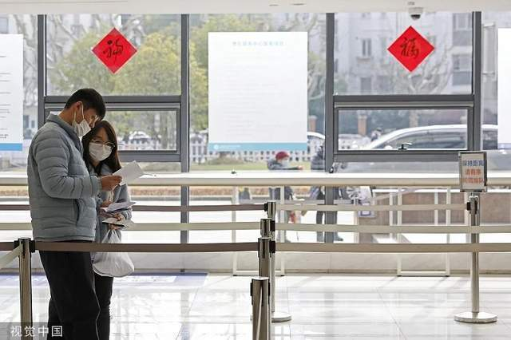

# 医保个账改革进行时：多地落地传来“阵痛”，退休人员反应强烈

“医保个账改革”落地的“阵痛”，正在各地上演。

近日，在华中某中心城市，“医保个账改革”落地后的反对声，让这场本就“谨慎再谨慎”的改革，变得再度紧张。在此前，政策落地时的“阵痛声”也偶有传来。

这场被认为是25年来中国最大的一次、几乎是最谨慎的一次、也几乎是最必要的一次医保改革，早在征求意见时就不断引起争论。

这次改革不仅关涉全国3.5亿在职职工医保个人账户里的1.1万亿资金，而且其带来的门诊统筹机制，是终结小病大治，节约住院资金，建立完善的分级诊疗制度的重要一步。

对于此次改革的认知鸿沟，数专业人士和普罗大众之间的差距最大。

2021年4月，当《关于建立健全职工基本医疗保险门诊共济保障机制的指导意见》出台，面对着那份要把占医保个人账户缴费一半左右的单位部分转入统筹账户的文件，公众舆论质问：是不是“我的钱被国家拿走了？”而专业人士曾告诉八点健闻：“当时我们提的意见是全部取消（个账），留这一半做什么？”

某种意义上，公众的不解和阻力在预期之中，各地落地时如履薄冰，亦进行了大量的政策解释和宣传，结果一些地区落地实施时，仍然招来了大量不解和反对。

双方争论核心仍然围绕那个旧话题：医保个人账户里的这些钱，究竟是保险，还是储蓄？

“个账改革”政策本身已经给予了回答，改革落地时要进一步体现共济性。简单讲，就是提高门诊共济保障水平，来冲抵个账资金减少带来的落差。

纵观各地“阵痛”，最叫疼的莫过于退休职工，尤其是年纪较大的退休职工。改革前每月划拨个人医保账户上的金额不少，改革后可能直接少了一多半；有相当部分老年人担忧，以后药店购药可能会变得非常困难，被迫前往医院就医购药，变相加重了自己和医院的负担。

灵活就业人员也觉不满，因为有些地区改革后不再对其个人账户予以补助，灵活就业人员会认为就医负担似乎更重。

但现实情况是，全国有几百个医保统筹区，各地医保报销水平、待遇、门诊共济保障能力都差异巨大。原本制度本身的碎片化，加之涉及民众口袋里的钱，让情况变得更复杂——不仅容易互相攀比，而且敏感也会加倍。

在“医保个账改革”在各地集中落地的今年，一位医保领域研究者强调，个账改革在落地中带来的阵痛可能会持续数月甚至经年，各地须做好妥善应对，务求在政策实施中实现“软着陆”。

各地步伐不同，差异巨大

按照“个账改革”方案的设计，自2021年12月底算起，各统筹区域有三年的缓冲期研究和推动这项改革。

这也意味着，改革的压力由上至下，从中央传递给了地方。

截至2021年4月26日宁夏发布方案，内地31个省级行政区已全部发布地方方案，而今已经发布地市级地方方案的统筹区超过百个。

改革提出的划拨比例“划一半，留一半”的门诊统筹改革方案，已经是相对温和且折中的方案，可谓“层层上了保护套”，为何落地时仍震动频发？尤其是具体落地到各个城市时，有的“润物细无声”，有的确遭遇激烈舆论反弹，为何如此？

业内多位专家表示，建立门诊统筹的基础，以及政策实施时的宣传引导是否充分得当，也许是影响各地改革效果和舆论反应的最大影响因素。

在改革初始，直接调低个账划拨比例是见效最快的手段。过去十年间，镇江、北京、成都、珠海等城市都走过这一步，但其伴生的舆论风险也最大，需要政策制定者有全盘思考的智慧和自信，施以合理的配套手段，有城市就因反对声音过大而最终放弃。

以青岛为例，在政策落地前，青岛市原社保局便做了大量的舆情宣传与应对工作，发布新闻稿件解释改革目的与参保人获益，使用一些生动的“话术”：把死钱变活钱，把小钱变大钱，弘扬同舟共济的中国传统文化等。

而更常见的现实是，全国医保医保统筹区数以百计。各医保统筹区的筹资水平不同，医疗资源丰沛度不同，政策制定能力不同，导致各统筹区域的“个账改革”方案也存在巨大差异，步调不太一致。

比如近日在舆情旋涡的华中某市，多方信源表示，其医保资金的状况并不乐观。

该城市统筹区的医疗资源丰富，但是当地企业缴纳医保的标准却并不高，统计下来个人账户占总医保资金的比例超过了50%，可以说医保的资金绝大部分都“藏富于民”了，并没有得到合理的利用。种种因素叠加之下，该统筹区的医保资金几乎每年都会亏损，甚至曾接受国家补贴，医保基金压力巨大。

对于这些地区来说，腾挪个人账户资金，缓解医保资金压力的冲动或许会更加强烈。在这种冲动之下，一步到位的改革难免带来“疼痛”。

为了应对这种问题，华东地区部分统筹区采取了两步走的策略——第一步，在职人员医保个人账户单位划拨部分减半，同时门诊方面提高报销比例、降低起付线，个人账户家庭共济之余还扩大适用范围；第二步，调整退休人员个账计入政策。

不过，据了解，这些把退休人员个账调整难题放在第二步解决的统筹区，对于未来也充满忧虑，甚至已经在谋划批评之声翻涌时的应对之策。

八点健闻发现，虽然有的地区能直接调整，有的则需要分两步调整到位，但各地在职职工个人账户比例调整的部分基本与国家方案保持一致，其较大的差异体现在了门诊保障待遇的水平。

有改革基础较为薄弱的地方，统筹支付比例分别为50%（在职职工）、60%（退休职工），仅略高于国家标准；一些已有改革经验的地方，如上海，能直接将报销比例和分级诊疗挂钩，从三级到一级医疗机构支付比例达到70%～90%。

退休人员反应强烈

各地医保个人账户改革政策落地，在第一时间引发了退休人员的强烈反应。

这首先与中老年人“看病多”有关。多位地方医保局人士告诉八点健闻，个账改革中受影响最大的就是退休人员，因为看病多、账户使用多，“年轻人不看病没感觉的。而老人退了休没事做，就关注退休金和医保，你突然给他减少了那肯定不愿意。”

另外，个账改革后，由于个人医保账户上的钱减少，原本可以从药店购买的药品需要通过频繁就医获得，这同时加重了患者方和医院方的负担——尤其对有基础病的老人来说。

在一位医保行业研究者看来，这的确是有可能出现的情况。这时要做的就是修正和调整。“制定公共政策后，还是要尽量让利益相关者发表意见，这可能是推动改革需要注意的地方。”

一位地方医保局相关人士推测，公众的这一担忧或许还和当地门诊统筹定点数量，甚至是否实行了门诊统筹有关。

他所在城市门诊统筹落地已有一段时间。据他观察，为了报销，很少有老人去药店买药，“除非账户上钱太多了”。

而对于养老金多、因此从前每月划拨至个人账户的钱相对较多的退休人员来说，在改革突然降临时，眼见账户上的数额被“腰斩”，其间产生的心理落差更大。

一位北方某人口大省医保局的工作人员认为，退休人员不再需要执行个人缴费，只专注于每月划拨到个人医保账户中的统筹资金，而这一块资金“少得比较明显，至少减半”。

例如武汉，根据公开信息，在实行方案调整之前，武汉70岁以下退休人员的缴费基数是4.8%，70岁以上则是5.1%；而在调整后，计入标准为2021年基本养老金的水平的2.5%。

一位医保行业研究人员表示，“武汉确实取了一个平均值，这对平均（个人账户资金资金）高一点的人来说影响挺大的。”

但在一些医保行业研究者看来，在个账改革中，退休人员是绝对的受益方，而非受损方。

根据叙述，之前学者们研究个账改革这件事时，共识在于通过改革提高老年人的门诊保障水平，“所以其实老年人是最不该反对这件事的。”在他看来，获得老人们理解的核心在于把帐算清楚，“你那一部分钱放到统筹的池子里，最后都能拿回来的。”

但根据多位医保局人员的经验，退休人员的工作很难做，“你告诉他实际待遇提高了没有用，就觉得钱不应该少。”

根据另一位医保局工作人员的观察，不少老人的心态是“手里有钱，心里不慌”；还有人身体好、不看病，如果医保拨的钱又没攥在手里，“就觉得好像亏了一样”。

门诊共济保障机制，能做到多少？

门诊共计保障机制，不仅仅是一场制度的改革，更是对部分人固有观念的一次刷新和纠偏，而人的观念，最难以改变。

一位医保研究人员直言，“个账改革”是一场欲扬先抑的改革，表面看起来个账减少，但后面一步是提高门诊报销比例。因此最重要是，“抑”完之后，有没有“扬”起来。

如何将个账的弱化搭配上门诊统筹的加强，是一件棘手的差事。

在很多城市，尤其那些统筹基金还面临赤字风险，本该最需要进行个账改革的地方，却因为没有能力加强门诊统筹保障待遇，失去了降低个账划拨比例的抓手。

然而，即便已经是步步小心，即便政策制定者为个账改革加上了“门诊共济保障改革同步进行”的保护网，要深化改革，对于经验丰富的门诊统筹改革先行区也不是易事，更勿说统筹资金本就紧张的地区。

西南某省医保中心人员告诉八点健闻，各地原有状况千差万别。比如有些地方原没有设立门诊报销，此次门诊共济保障相当于做了加法，公众反应会小一些。甚至一些地方在做加法时，对个账的“减法”并没有同步，改革过渡会更加平稳。

在一位业内专家看来，门诊共济改革在各地落地实施中，很容易变成一个“碎片化”的待遇制度，各地待遇不同，又容易进一步引起攀比，医保是民生的钱，这种攀比就更为敏感。

“不同的统筹地区，报销水平往往不同，起伏线、门诊的封顶线以及报销比例都是有差异的，像佛山、深圳这样的地方，职工医保又分为a档、b档，或者一档、二档、三档，有个人账户或没有个人账户，它就逐渐变成了一个碎片化的制度。”

对于医保机构而言，改变人们对于医保个人账户的固有认知，挪移已形成多年的利益格局，这是一场必打之仗，把沉疴分步扫进“历史的垃圾堆”里。

多位专家表示，若门诊统筹机制不能合理建立，个账改革后多出来的这笔钱也会变成烫手山芋，破坏统筹基金的收支平衡，暴露出筹资过多或待遇偏低的问题。

参考文献：

《医保个账改革争议：说它让个人收入缩水，是不是一种误读？》，八点健闻，2020.9.3.

《万亿资金愚公移山：医保史上最大改革，目前已有100多地市启动》，八点健闻，2022.5.6.

《王震：门诊共济考验治理能力和效率》，中国卫生杂志，2021.6.1.

《医保门诊要“共济” 看病就医谁受益？》，央视财经评论，2021.4.23.

《单位缴费不再计入医保个人账户是自己的钱“亏”了吗？权威解读来了》，人民网，2021.4.14.

严雨程、张晓艺、李琳丨撰稿

李琳丨责编

**本文首发于微信公众号「八点健闻」，未经授权不得转载**

