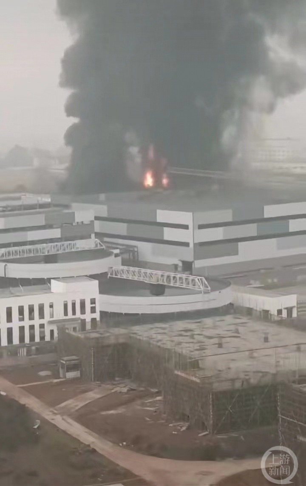

# 四川江安一工业园区起火，2018年曾发生19人死亡的爆燃事故

2月9日下午，多名网友发布视频称四川省宜宾市江安县一工业园区发生火灾，从视频内容来看，一栋建筑物升起滚滚浓烟，同时还能看到熊熊烈火。

_▲火灾现场。图片来源/视频截图_

一名发布了火灾视频的博主称，视频拍摄地点是“江安阳春工业园内”。上游新闻（报料邮箱baoliaosy@163.com）记者第一时间致电江安县工业园区管委会。一名工作人员确认火灾消息属实，同时介绍：“现在火情已经得到控制，暂时没有发现人员伤亡。”至于着火的区域，该工作人员透露：“应该是一个在建项目。”

值得注意的是，这已经不是阳春工业园区首次发生火灾。2018年7月12日18时30分，该工业园区内企业（宜宾恒达科技有限公司）曾发生爆燃事故，该事故共造成19人死亡、12人受伤。

上游新闻记者 赵映骥

编辑：朱亮

责编：王蓉 官毅

审核：冯飞

