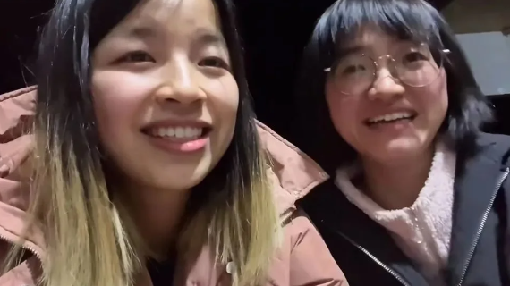

# 夜读｜对别人的命运选择，宽容一些

_视频截图_

最近一部“毕业5年，存款5000，却治愈了几百万人”的视频火了。

两个女孩围着火堆，一脸笑意地讲了自己“高开低走”的人生故事。两人是华中师范大学毕业的，毕业5年，一个曾经在互联网大厂工作，现在存款只有五千多。另一位去中国传媒大学读了研究生，梦想是成为一名编剧，结果一路碰壁，她上一份工作是成都一家火锅店的服务员。镜头中，篝火映在姑娘年轻的面庞上，面庞上满是笑容。

从世俗的角度来说，两个年轻人的职场生涯挺不顺利的，甚至一度走到了社会边缘。但是，为什么说这样的视频“治愈”了几百万人呢？再早之前的《二舅治好了我的精神内耗》也是横空出世，大热一时。

难道“治愈”就是比惨游戏，就是传说中的“你有什么不开心的事，说出来让我开心开心”？

我以为，“治愈”就是通过别人的故事参详自己“活着”的意义：我的活着不是为了活在别人的“标准答案”里，特别是在一个变革时代里，更不要把别人的“标准答案”当成自己活着的意义。

今年春节假期，我怀着一种颇为奇特的心情，重读了余华的小说《活着》。彼时正值我“阳康”后不久，正是有点懵的状态。除夕前一天，又因皮脂腺囊肿发作，背上吃了一刀，心情不免有些灰暗。活着，挺不容易的，我想。

大概二十五六年前吧，也可能更早一些，首次接触《活着》时，居然有一种亲切感。主人公福贵，不就是我那些已经去世或者还健在的祖辈吗？他们生于江南，长于江南，家世或有差异，经历或有不同，但时代的烙印却是一致的。

想到余华是嘉兴海盐人，离我老家不远，一切都解释得通了。但是，亲切感取代不了悲凉感和荒诞感。福贵的一生，不断在失去。他吃喝嫖赌，被人做局，失去了土地和房子，这种失去，本来是挺痛苦的一件事，不想时代翻转，反而成了他保命的理由，接下来，他又不断地失去家人，老婆、儿子、女儿、女婿、外孙，全部先他而去。只有他，孤零零地与一头老牛相伴，还活在世界上。

这次重读《活着》，我特别留意余华在“自序”中的一段话，他说：写作的过程让我明白，人是为活着本身而活着的，而不是为了活着之外的任何事物所活着。作家的观念，当然会投射到作品中的人物身上。

比如，福贵劝有轻生念头的人，“你千万别糊涂，死人都还想活过来，你一个大活人可不能去死”；福贵在晚年总结自己的生活哲学，“做人还是平常点好，争这个争那个，争来争去赔了自己的命。像我这样，说起来是越混越没有出息，可寿命长，我认识的人一个挨着一个死去，我还活着”。

活着当然很好，《活着》本身也不错。当你放弃一些大词和不必要的参照，试着去感受“人是为活着本身而活着的”纯粹性，反而会觉得余华写出了很大一部分人的生存状态。

这是我在初次阅读《活着》时容易忽略的细节，恐怕当时也没有引发相应的关于温情的感受。正是这种温情，像一个支点，让“一个人和他的命运之间的友情”获得了相对宽广的叙事张力。就小说艺术而言，赞赏也罢，批评也罢，平静地看待也罢，不管怎样，《活着》已成为当代文学史绕不开的一个话题。

对别人的命运选择，宽容一些，也就是对自己当下的活着松弛一点。被贴上211名校、研究生的标签，人也可选择欣赏岔路上的风景；真真假假的“二舅”的故事，还是要由“二舅”去过的，旁观者只需要旁观。

