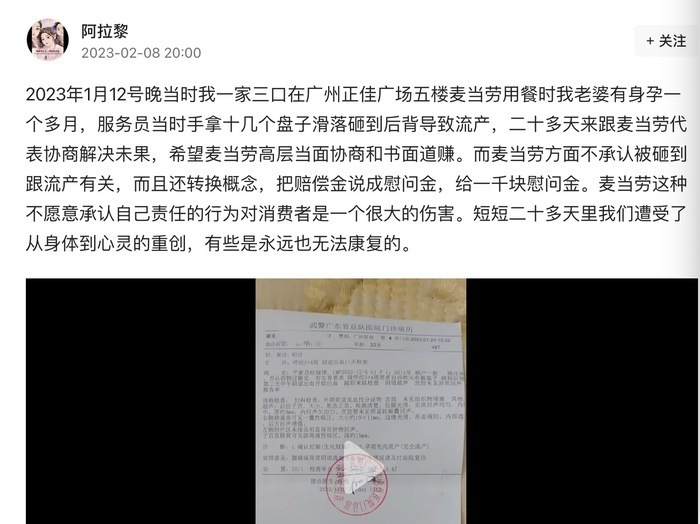
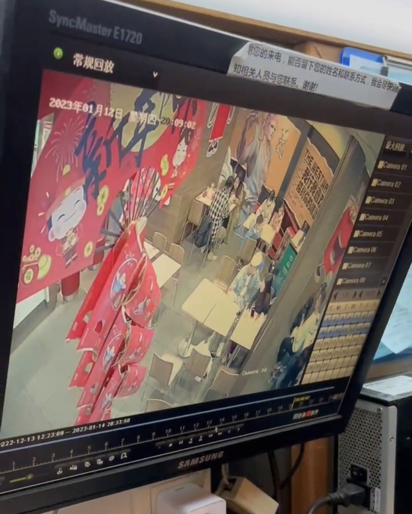
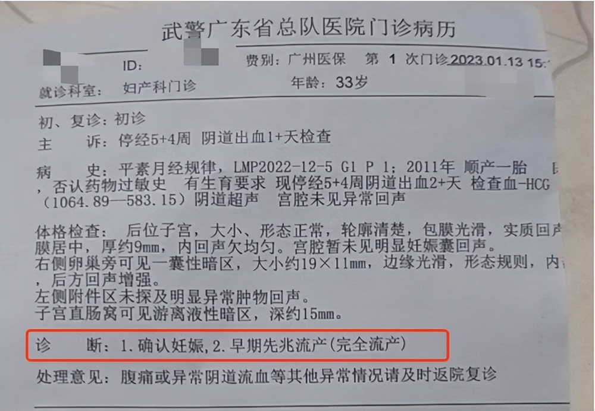
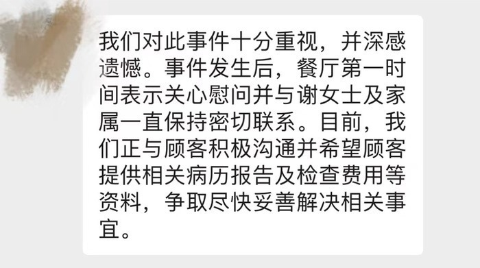

# 广东一孕妇在麦当劳用餐被餐盘砸到致流产？涉事店家回应

2月8日晚，广州的黎先生发文爆料称，1月12日，一家三口在正佳广场麦当劳用餐时，因服务员失手，十几个盘子滑落砸到爱人谢女士后背，导致怀有一个多月身孕的爱人流产。

黎先生介绍，当天在麦当劳用餐时间是晚上8点多，回家之后爱人肚子不舒服见红，次日就医被告知出现流产征兆，1月14日确认流产。黎先生当天到涉事麦当劳店内与工作人员协商并报警查看了监控。黎先生认为，爱人的流产与当晚砸到后背受到惊吓有关，希望麦当劳高层当面协商和书面道歉。

_视频监控录像_

根据黎先生向记者出示的一份武警广东省总队医院2023年1月13日的诊断结果显示：1、确认妊娠；2、早期先兆流产（完全流产）。

_医院诊断结果_

2月9日，广州麦当劳相关工作人员回应新黄河记者称，“我们对此事件十分重视，并深感遗憾。事件发生后，餐厅第一时间表示关心慰问并与谢女士及家属一直保持密切联系。目前，我们正与顾客积极沟通，争取尽快妥善解决相关事宜。”

_麦当劳回应_

黎先生则表示，二十多天来，与麦当劳协商解决未果，且麦当劳方面不承认被砸到跟流产有关，只愿意出具一千元的慰问金。

新黄河记者：曲珈熠

编辑：赵珊珊

