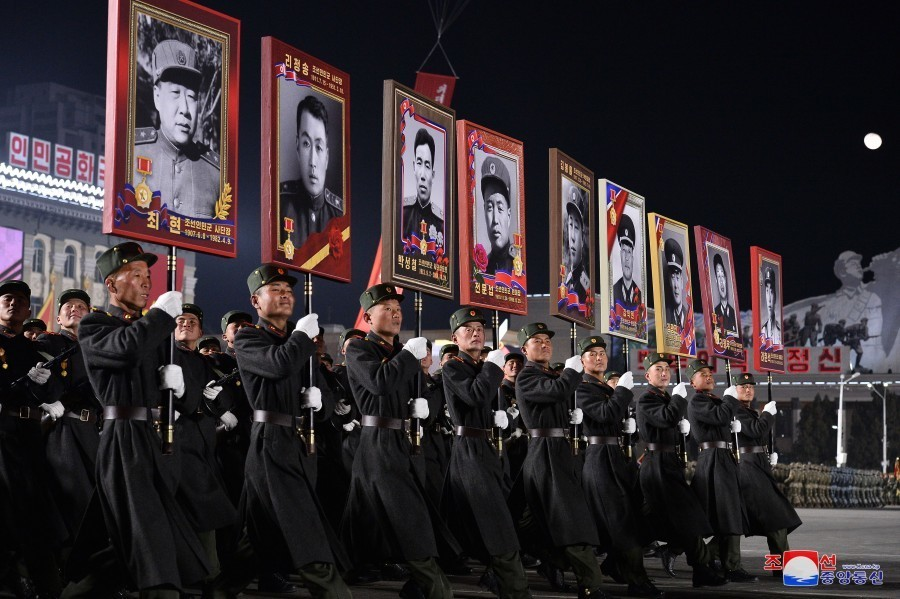
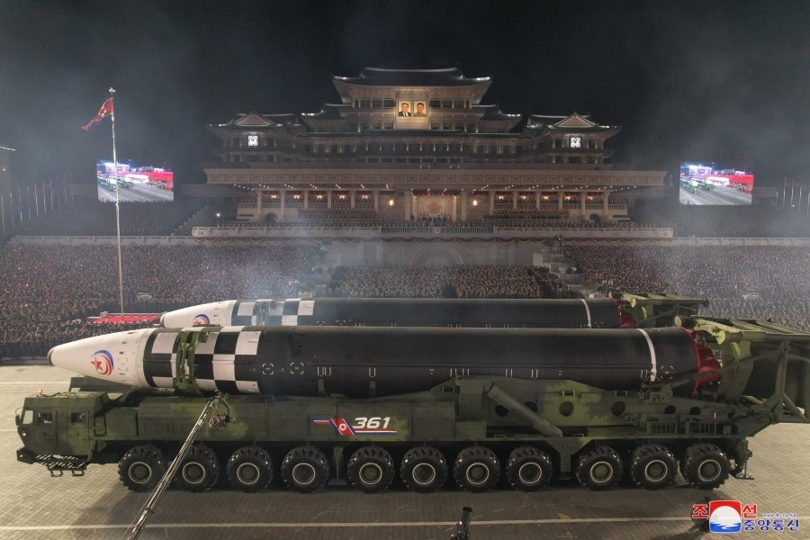
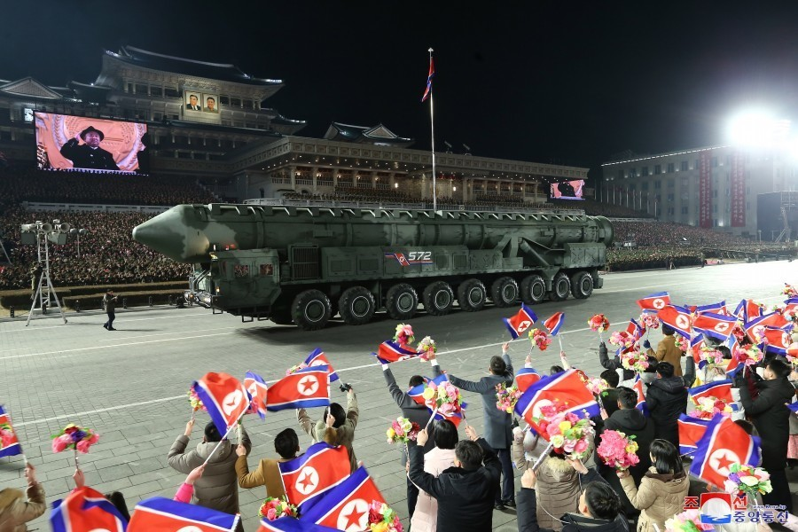

# 朝鲜举行建军75周年阅兵式 新型洲际弹道导弹亮相

【文/观察者网
王世纯】据朝中社2月9日报道，当地时间2月8日，朝鲜当晚8时30分许在平壤市中心的金日成广场举行庆祝活动，随后举行大型阅兵式，纪念朝鲜人民军成立75周年。朝鲜劳动党总书记、朝鲜国务委员长金正恩出席阅兵式。

根据朝中社的介绍，阅兵式上展示了多种新型武器，包括战术导弹方阵、远程巡航导弹方阵、战术核运用部队方阵等在阅兵式上亮相。值得关注的是，朝鲜展示了多达11辆“火星炮-17”洲际弹道导弹发射车和多辆另一种疑似车载机动式固体燃料洲际弹道导弹。

朝鲜《劳动新闻》在官方通稿中没有提及该型导弹的具体型号，但称之为“朝鲜核武力运用的最新变革，展示了朝鲜国共和最强大攻击能力，是朝鲜核对核，正面对决的展示！”。

_朝鲜展示的新型洲际弹道导弹
图源：劳动新闻_

_朝鲜展示了多达11枚火星炮-17洲际弹道导弹
图源：劳动新闻_

_金正恩携女儿视察仪仗队_

阅兵仪式在综合军乐队的特别演奏中开场。阅兵开始后，身上悬挂红白蓝三色朝鲜国旗的伞兵在现场展现了跳伞降落特技表演。朝鲜国务委员会演奏团、国防省中央军乐团在广场演奏席就座。各个阅兵方队在入场曲声中气宇轩昂地步入广场。

值得一提的是，金正恩当天出席阅兵仪式，检阅了兵力和各种装备，但未作演说。此外，在这次阅兵中，朝鲜首次展示了“历史功勋方阵”，包括高举抗日革命先烈肖像的方阵和高举“祖国解放战争时期近卫连肖像”的历史方队。

_朝鲜不朽功勋方阵，包括金策、安吉、崔庸健、吴仲洽、金一、金周贤、吴白龙、姜健等抗日英雄_

_参加本次阅兵的朝鲜祖国解放战争时期近卫连象征方队，包括玄哲海、延亨默、朴松峰、沈昌完、全秉浩等老共和国英雄和崔光、崔贤、柳京守、吴振宇、南日等朝鲜战争时期高级指挥官_

随后各个人员方队接受检阅。在步兵方队方面，朝鲜党中央委员会护卫处方队、国务委员会警卫局方队、护卫局方队、护卫司令部方队、各级前线军方队、海军方队、空军方队、战略军方队、特殊作战军方队、坦克装甲师、机械化步兵师方队和侦察总局方队、第191指挥情报旅方队、军医部门战斗员方队、各大军事教育学院学员方队先后通过金日成广场。

_朝鲜前线作战军方队_

_朝鲜特殊作战军方队_

随后朝鲜空军武装力量开始了阅兵飞行。各型战机在金日成广场上空组成组成五角星图案和数字“７５”等飞行方阵接受检阅。

在飞行表演以后，朝鲜人民军展示了由朝鲜战争时期重机关枪马车方队，摩托车方队、反坦克炮方队、平射炮方队、坦克方队组成的机械化象征方队，随后朝鲜人民军主力武器装备陆续登场。

和去年4月25日的建军节阅兵相比，本次阅兵朝鲜机械化方阵的受阅车辆大幅度减少，仅仅展示了新型主战坦克、自行火炮；两型火箭炮、一种战术弹道导弹、一种远程巡航导弹和“新型战术核导弹”。

最后入场的是洲际弹道导弹方队。作为本次阅兵的最大看点，朝鲜展示了多达11辆“火星炮-17”洲际弹道导弹发射车和一种4辆疑似采用固体燃料发动机的车载机动式洲际弹道导弹。新型洲际导弹采用了和“火星-15”类似的9轴运输起竖发射车，其长度近似于“火星-15”，但采用了3级体制，可能意味着该弹采用固体燃料。

朝鲜《劳动新闻》在官方通稿中没有提及该型导弹的具体型号，但称之为“朝鲜核武力运用的最新变革和共和国最强大攻击能力，是朝鲜核对核，正面对决的展示！”。

在最后一辆新型洲际弹道导弹通过会场以后，阅兵结束，参战官兵和群众高呼“万岁”，耀眼烟花再次腾空绽放，异彩地点缀了建军节的夜空，敬爱的金正恩同志向热烈欢呼的群众亲切挥手还礼。

朝鲜劳动党中央委员会政治局常委、朝鲜民主主义人民共和国国务委员会副委员长、内阁总理金德训，朝鲜劳动党中央委员会政治局常委、党中央军事委员会副委员长、党中央委员会书记李炳哲，朝鲜劳动党中央军事委员会副委员长、党中央委员会书记李永吉和强纯男、朴秀日、郑京择等武力机关负责干部，朝鲜人民军大联合部队和联合部队军政指挥官登上了主席台。

朝鲜劳动党中央委员会政治局常委、党中央委员会组织书记赵甬元，朝鲜劳动党中央委员会书记李日焕、金才龙、全贤哲陪金正恩的女儿在贵宾席就座。

**本文系观察者网独家稿件，未经授权，不得转载。**

