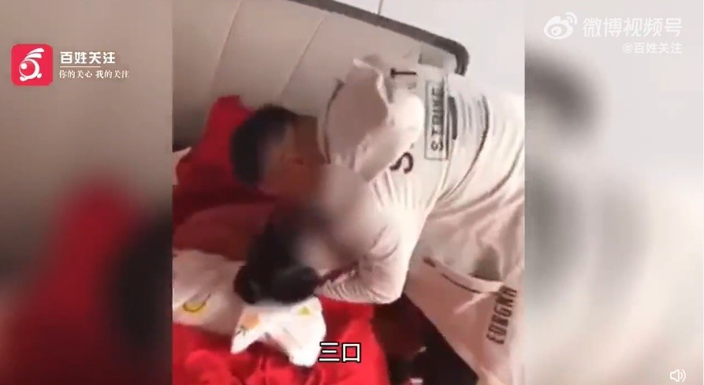
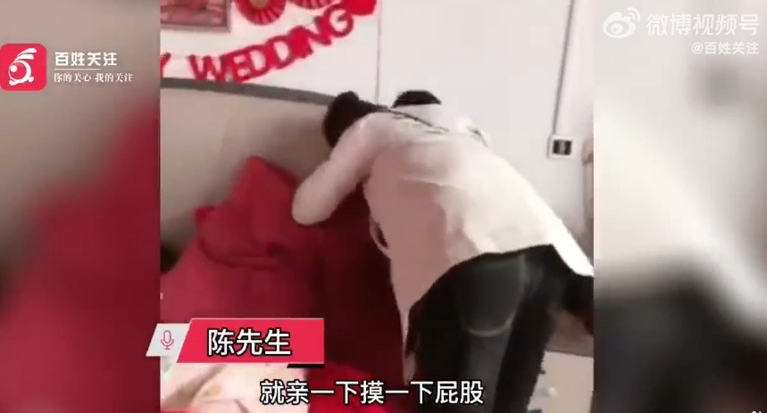
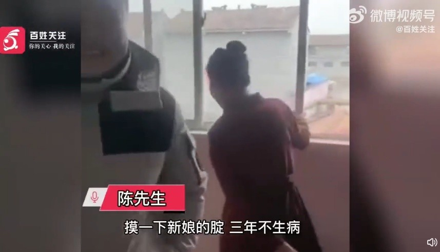

# 江苏徐州丰县一新娘被多名男性吻脸拍屁股，朋友：摸下新娘腚3年不生病

2月9日，据贵州广播电视台“百姓关注”视频报道，2月9日12时许，江苏省徐州市丰县一对新人举办婚礼，亲朋好友亲吻新娘脸部拍打臀部。

视频内容显示，一白衣男子抱着红衣新娘脸亲吻，周围有声音喊着“一口两口三口”，新娘有意闪躲。另一男子也上前亲吻该新娘，用手拍打其臀部。

新人朋友陈先生称就是闹喜，亲一下新娘的脸摸一下她的屁股，其本人和家人都不会反对，都是祖辈传下来的风俗。“就是闹喜，就亲一下摸一下屁股，新娘肯定不反对，家人也不会反对，开心嘛！都是祖辈流传下来的不都这样！”

陈先生透露摸一下新娘的屁股三年生病，闹完新娘也会闹新郎，晚上继续喝酒。“摸一下新娘的腚三年不生病，这是风俗，屁股叫腚，晚上还继续喝酒。”

视频曝光后，不少网友指责这种行为就是占便宜：“这是什么烂风俗！明摆着揩油。”

**【来源：九派新闻综合贵州广播电视台“百姓关注”、网络评论】**

