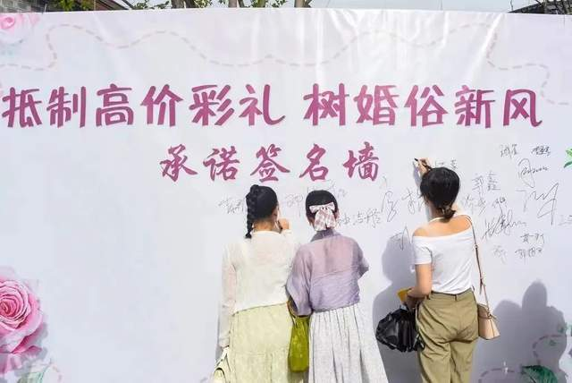

# 结婚数连降8年，县城红娘称不愁生意，彩礼和房子具有一票否决权

单身的人正在变多，结婚的人正在变少。

近日，经济学家任泽平发文称，2021年我国结婚登记对数下降到763.6万对，已经连续八年下降。与此同时，初婚的年龄也大幅推迟。

这样的状况，不光发生在城市，也发生在更广袤的县城。2022年，我国的单身人口突破2.4亿。相比县城，城市里的结婚难的原因，更容易被感知，也更常被社会关注——比如工作、生活压力、与家人的距离，都可以成为城市里的年轻人推迟结婚的原因。

然而，在聚光灯外，县城的婚恋状况有时会被忽视——县城婚恋市场里正发生着什么？它更容易受到哪些因素的影响？卷入其中的年轻人，又面临哪些困境和考验？

于是，一些人选择走进婚介所，寻求红娘们的帮助。而在每一个县城的婚介所中，往往聚集着最迫切、最焦虑的那一批人，在TA们身上，集中体现着当下县城的婚恋困境。而县城红娘作为直接参与者，既是穿针引线之人，也是问题的见证者和解决者。

正如一位中部县城的红娘所言：“县城红娘不缺生意。”只不过，潜规则之下，难谈爱情。

**文 |** 高越

**编辑 |** 易方兴

**运营 |** 月弥

**生育魔咒**

江西遂川县的秦志今年急着结婚，他34岁了。

从相亲第一次见面，到见家长谈彩礼，只花了不到10天。父母急得很，对红娘撮合的女方挺满意，只有一个问题除外：“你这么大年纪了，还能不能生小孩？”

遂川，是江西吉安西南的一个小县城，县城许多人会选择年轻时外出打工，等攒够了买房结婚的钱再回来。秦志也是如此。他之前在温州工厂打工，一直干到了高级技工，现在才开始考虑结婚的事。这在他们县里算晚婚的。在他家里，有个早已结婚、娃都上学了的哥哥。现在，压力都来到了秦志的身上。

红娘刘玉莹是一名80后红娘，她在遂川县做这一行已经两年多。她梳着黑色短发，戴无框眼镜，看起来利落、干练。早年间，她去过很多地方，杭州、义乌、东莞和北京，做过财务，也去中专当过老师。在县城，她已经算是阅历丰富，常被人评价“分析问题一针见血”。做红娘两年多来，闯出了名气，只要坐在店里，为结婚发愁的人就会不断上门。多的时候，一天能谈八九单生意。至于价格，实行“会员制”，先付款，再服务，“999元，介绍六组相亲对象，一对一定制，全程提供辅导”。

但服务的人多了，她也发现，当地男多女少，找媳妇正成为一件难事。比如，会员里，哪怕是身高1米75，条件还不错的的秦志，尽管找到了感兴趣的女方，但依然卡在了生育问题上。

女方也是遂川人，比秦志大一两岁，自己开了家小店，结过婚，有个儿子归了前夫。她目标明确，“只要未婚的”，如果对方介意她离异，“不愿意接触就拉倒”。

红娘刘玉莹觉得，这个女人大方、自信、独立，这在县城里并不多见。但刘玉莹也很清楚，在县城婚恋市场的潜规则里，同样是离异，也存在差别，而这个女人，正属于比较弱势的一类。

县城的众多婚恋潜规则，是当地人绕不开的大山。比如，其中一个偏见是，对于离异的女性来说——“没小孩最好，有女儿也没事，最麻烦的是带个儿子。”

这颇为荒唐。因为一些男方家庭单方面觉得：“女儿是往里拿钱的，儿子是往外掏钱的，（女方）带着儿子，日后少不了负担，多一事不如少一事。”

像这样，在县城，关于生育的许多规矩都如同魔咒，锁在许多家庭的头上。刘玉莹这些年接触了非常多的人，她发现，许多家庭之所以选择早结婚，目的也是为了早生育。今年过年时，刘玉莹刚刚介绍成了一对00年的小两口。女方是幼儿园老师，22岁。当地红娘圈有一种不妥、但很流行的说法：“00后，黄金年龄；90后，趁早抓紧；80后，无人问津。”

河南驻马店平舆县的27岁红娘张慧，她也发现了相同的现象。如今，她手里的00后会员越来越多，有的是自己来的，也有相当多是父母帮忙注册的。

她能理解这种急，几年前，她刚刚从郑州大学毕业，父母立马把相亲提上日程，她家是开建材店的，遇到的每个顾客，父亲都会问问：“你家有没有合适的男孩介绍给我姑娘。”大伯、小姨一干亲戚也跟着忙活，“只要年龄合适，有个工作，就可以找来相亲了”。

面对长辈的好意，“不见不合适”，但见了十多个，一个没成，反倒是相亲经验因此提高，给日后她做红娘打好了基础。

张慧是幸运的，最终，她在父母挑选的一群人当中，“选中了自己喜欢的”。张慧长了一张圆脸，声线也有一种踏实的感觉，能让人信任。她觉得相亲的确给自己带来了帮助，于是做起了县城里的兼职红娘。走在县城里三纵三横的大道上，她常常会突然被叫住，来人拉着她的胳膊，忙着拿手机扫码，再三嘱咐她“一定要给我家孩子介绍个对象”。

结婚早、生娃早，对很多县城来说，历来都是习惯。比如河南南阳下面县城的一个86年的女子，37岁就当了奶奶，她高中辍学，去北京、上海打工，跟同乡的丈夫认识之后，19岁结婚生子。现在，刚出生的孙子比小儿子只小了7岁。

但如今，这个习惯正在面临挑战。比如26岁的宋何燕，在她选择挑战这个习惯之前，她所在的县城里，很多人都选择早婚。她的表妹才21岁，已经定亲，这已经算晚的，更小的堂妹已经生了两个孩子。而小时候一起长大的发小们，大都十八九岁结婚，“先不领证，只办酒席，身边人都这样”。

“什么时候怀孕，什么时候领证。”宋何燕说。

许多年轻人抵抗习惯的方法，是选择离开县城，更愿意到大城市去。而留在县城，意味着只要一毕业，无论高中、大专还是大学，都会在父母的焦虑之下，联系到县城红娘，开始相亲、结婚、生育。

相比之下，在一些红娘眼中，像宋何燕这样的才是个例。宋何燕从小学习好，是她周围唯一考上本科的孩子，一路读到今年，正在上研三。每逢过年，一家人围坐，亲戚一催婚，父母就用“还在上学，不用着急”应对，但奶奶不吃这套，盘着腿指着她数落，说她26岁了，还没结婚生育，“实在不像话”。

但她不想现在结婚。在家里，她会被指责“白读了这么多书”。因此，毕业后，她不打算回县城，要去更远的上海或杭州工作。“逃得远远的，才不会被拉去结婚。”

_▲ 30男30女的集体相亲活动。图 /
受访者提供_

**男女有别**

但关于生育的魔咒，只是禁锢在县城适婚青年们头上的第一层束缚。在这之后，男女双方不对等的评价体系，则让这个寻找合适伴侣的过程，变得更加艰难。

在许多县城的婚恋市场里，存在一些不证自明的“公理”。比如，最受长辈们认可的，常常是公务员，或者其他有编制的工作。但在这一点上，男女是有区别的。

一份有编制的工作，在相亲中，往往选择权更大，尤其是男性。以至于一些人甚至因此“过度膨胀”，定下过于严苛的择偶要求。

这一点，刘玉莹颇有体会。她手里有一位85年的男会员，在有编制的单位工作，个子一米七左右，有轻微的秃顶。但他的标准蛮高，其中一项决不妥协，必须是90后，“连89年的都不行”，而且要漂亮，“得是大家都认同的那种大众意义上的漂亮”。

接连相看了十几个，始终没有相中，每次的回复都是，“我觉得不太合适”。刘玉莹听得明白，这只是他的委婉说辞，“就是觉得看不上人家”。

当红娘两年多，刘玉莹遇到的最苛刻的一个会员，是一个捧着一大摞证书来征婚的人。

来人叫吴利文，他一进门，刘玉莹脑子里的资料库自动开始运转——看起来175cm以上，身高够了；长得挺干净、清秀，模样不错；蛮年轻，应该不到30岁。

就在这时，刘玉莹的判断和筛选被打断了，因为吴利文坐下后的第一件事，是把带来的证书，铺满一桌——研究生证书、奖学金、获奖证书……刘玉莹目瞪口呆，听到对方介绍自己，90后，在医院工作，有编制，早些年在浙江的大医院，刚刚考回老家，房车都有。

对方特别强调，在找到红娘之前，家里的亲戚已经介绍过一圈适龄女生，可惜一个都没成。

听到这，刘玉莹问他：“那你喜欢什么样的呢？”

回答她的是一张照片。一个穿着旗袍的女孩，倚坐在木制的推窗前。吴利文说：“这是我前女友的照片，长得要清秀、好看，看起来也得有气质、有内涵。”

刘玉莹概括地形容：“他想要的是林黛玉那一款，或者是刘诗诗。”

然而，与有编制的男性不同，在县城，如果一位女性太过于优秀，她常常会发现自己没有什么选择的空间。刘玉莹在实践中也发现，不少有编制的女孩，她们的相亲要难上许多，最大的难点在于，跟她们差不多优秀的单身男性，在县城本来就不多。

苏曼是江苏北部县城的一名语文老师。研究生毕业之后，她听了父母的建议，回到县城老家工作。这几年里，她陆续给自己新买了房，又提了车，父母都有稳定收入，于是开始催婚。

但在县城，她的相亲路有些不顺。一个从大城市考回来的、有编制的男生，显得颇为傲慢，比起相亲，更像是面试，问她高中、大学、研究生都是在哪读的，房子在哪个小区，有多少存款，5年内的职业规划是什么……说到最后，对方手指向苏曼斜后的方向，顺着看过去，是一排排建成没几年的居民楼，他告诉苏曼，这里是最好的学区房，“我打算以后住在这儿”。

这个男生跟她说的最后一句话是——“有不少人排队跟我相亲。”话里话外，反复在苏曼面前表现出一副不露怯的样子。回去后，两人再也没联系。

后来，苏曼也不再执着于编制，对方学历不如他，她也愿意接触。有一次，一个专科毕业的男生，对方带她逛公园，压马路，唯一的花销是两杯奶茶，还是苏曼付的钱。

还有个正在做生意的高中学长，特意约在下午，这样不必吃午饭和晚饭，两人的相亲地点，是商场中间的休息椅。见面之后，除了早中午发一句，“你干嘛呢？”之外，再无联系。过了一周，男方还向红娘抱怨：“女生不够主动。”仔细问过才补充了几句，说是见面那天，看到苏曼的手腕太细，太瘦了，“看起来不够有福气”。

这样的不对等，也并非某一个县城的困境。江西财经大学教授欧阳静，写过一篇《县域体制内的“剩女”》的论文，对县城女生婚恋进行过调查，她发现，源于家庭对于男孩和女孩的预期和定位不同，优秀的女生回归县城的比率要高于男生。有些时候，“由于县域体制内女青年，普遍想选择比自己更优秀的体制内男青年为婚配对象，但在县城，无论是数量还是质量上，均无法满足这一择偶要求。”

最后，每次相亲回来，苏曼都一五一十复述给父母听，让他们明白，“自己没有消极抵抗”，而是真的不合适。次数多了之后，父母渐渐理解，不再催婚，让她得到了喘息的空间。

_▲ 相亲自测评分表。图 / 网络_

**一票否决**

比起其他所有因素，县城婚恋市场中，往往有一个雷打不动的底层条件在支撑着这些规则，那就是彩礼和房子。

它们具有一票否决权，如果拿不出来，将无法走进相亲的“准入之门”。这无疑给进入这个婚恋市场的参与者带来了压力和负担。

都说江西彩礼高。2022年的8月4日，是这一年的七夕节，一场集体相亲正在江西吉安遂川县的草林红色圩场小镇举办，一面“抵制高价彩礼，树婚俗新风”的承诺签名墙，立在了最显眼的地方。

_▲
相亲活动上，抵制高价彩礼的签名墙。图 / 受访者提供_

谈彩礼，是相亲中的重要一环，在江西，彩礼一般是20万，为了图吉利，“会定成18.8万，甚至是28.8万”，根据时代数据的调查，江西的彩礼数字，在中国31个省(区、市)中最高。紧随其后，是黑龙江、河北、四川的彩礼，也都在10万以上，一些省份，则要附带房车。

到了农村，则有更多的讲究。比如，结婚当天的礼金，要“三斤三两”，是指一摞摞100元现金称起来，刚好3斤3两重，加起来15万元。还有“万紫千红一片绿”，1万张5元，1000张100元和一把50元，至少15万元以上。

有许多因为彩礼没谈拢，最后没结成婚的例子。比如安阳市汤阴县的老陈，把一辈子的积蓄都拿出来，又欠了20多万的债，才凑齐了县城婚房钱和11万彩礼，给27岁的小儿子娶亲。但婚礼当天，小两口为了礼金的归属一直在争执，最后，不欢而散，原本热闹的婚礼，只剩下他和门上贴的破损的喜字。

红娘刘玉莹也定了一个规矩，如果没有房子，相亲是连“对方的面都见不到的”。86年的池建在当地做水电装修，一年赚小10万，他身高不高，但长得不错，家里三个姐姐、一个哥哥，分家后单独建好了自建房，全都结婚了，唯有他，没建房，也没买房。这些年，在相亲时，次次被拒绝。一听到他没房没车，全都没戏，哪怕解释自己“有些积蓄，能够买房”，对方也不会相信。

常年一个人在家，池建早就学会了做饭，但这在相亲中，并不算加分项。他找到红娘刘玉莹，拿着会员合同前前后后，翻看了五六遍，才下定决心签了字。

在刘玉莹看来，这样的条件，在女生眼里，“就是一无所有”。没办法，“只能找离异的，带一个两个孩子的，他也不能挑了。”

同样的情况，如今也逐渐会发生在女生身上。比如90后的江岚，在电信工作。有一次，她相亲的是一个35岁的离异男士，她们约在自家的自建房见面，房子空有一个外壳，里面还是毛坯，只装了一半，看到灰白的屋子内部，男生丢下一句“不合适”，转头向外走。

红娘还想争取，追过去问，“觉得哪不合适？”

结果被对方一句顶回来，“谁都知道哪不合适！”

江岚面上不显，心里很失落，她家姐弟三个，父母已经去世，建房全靠自己，钱不够，只能一边攒、一边接着建，她有房子的负担，也没有父母能帮衬着带孩子。在相亲市场里，江岚这样的女生，个人条件不错，却因房子被“一票否决”。

作为红娘，刘玉莹其实是更加倡导自由恋爱的。她自己跟丈夫，是同一县城的高中同学，毕业多年后，偶然取得联系，开始恋爱，一个在北京，一个在广州，结婚时，没受父母、亲戚的主导，也没谈房子和彩礼，直接结婚了。

直到5年前，她才带着孩子一起回到了老家，在县城，她被朋友拉着一起搞婚恋创业，丈夫在乡下工作。

然而，像她这样的人，终归是县城的少数。

**代际战争**

结婚并非两个人的事。无论城市还是县城，婚姻大事，都离不开父母等血缘亲戚们的介入。但县城拥有的诸多家族传统、固有评价体系，有时候，会让身处其中的人，感觉更加难以挣脱。

90后的杜宇飞，在外人看来，条件哪里都好，但总觉得他身高只有一米六几是个短板。他在河南驻马店平舆县做医生，家里是做教育的，开了几家辅导机构，名下有几套房，还有车。只是，父母对改善下一代基因很执着，对杜宇飞谈了几年的大学女友一直不满意，只因为对方个子娇小。

杜宇飞抗争过很久，但最终，父母还是把他们拆散，让他考回了老家。

找到当地的红娘张慧时，杜宇飞的父母只有一个要求——女孩的身高，一定要超过1米7，因为要“改善基因”。哪怕杜宇飞直到现在，喜欢的都是比他矮一些的女生。

父母和子女意见有分歧的情况，张慧碰见过不少，“孩子看眼缘、看外形，可能只看到眼前，但父母们已经看到10年之后了”。每当遇到这种分歧，张慧都默不作声。

她觉得无力，这没有对错，是现实和亲情的融合问题，“很复杂的”。

但作为红娘，只能“尽量让双方都满意”。最终，张慧找到了一个身高与杜宇飞相差不多的做教师的女孩，对方和父母都不介意身高，只想找“凭自己的技术吃饭的”。

换句话说，只要双方最看重的条件能够满足，其他次要条件，往往都能妥协。

第一次见面，在公司的相亲小屋，张慧在屋外边看、边等，聊了快30分钟，两个人还没有结束，为了保障见面的次数，防止下次没话聊，张慧赶紧进去叫停两人。离开时，两个人很快约好了下次见面的时间，张慧心里暗喜，“一看就有戏”。

_▲ 相亲小屋的一角。图 /
受访者提供_

最后，两人成功订婚。这是县城红娘们颇有价值感的时刻，后来每次见面，杜宇飞的父母都要拉着张慧的手，叫她“真是恩人啊”。

现如今，许多年轻人去外地工作，对于婚姻之事越来越不急，反而留在县城当地的父母越来越急。

上周末，刘玉莹刚送走一位客户，就又迎来了一对老夫妻，果然，他们是瞒着孩子来的，想为95后的女儿介绍。

老夫妻说，女儿小嘉学护理专业，毕业后留在了厦门，在一家月子中心做护士，小嘉人内向，大学也没谈过恋爱，每天下班后，喜欢躺在家里看电影，不出门，也不爱跟人交际。

小嘉习惯了一个人的生活，自己吃饭，追剧，有时间的时候，就跟朋友、同事去逛街，拍照，看个电影。相比之下，她母亲要急得多，每次打电话，说两句就要拐到找对象上。这也成为母女二人分歧的根源。

对于母亲的催促，小嘉就一句话——“一个人过得挺好的。”

刘玉莹理解她的想法，年轻人在大城市待过后，许多想法会改变，再回到县城里，会不适应当地的婚恋规则。“她们想谈感情，但相亲只有条件。”

而一旦矛盾激化爆发，可能会迎来双输的结局。就像湖北的褚楚，她已经28岁了，跟男朋友谈了4年恋爱，毕业前，打算两个人一起留在武汉，但父母强烈反对，让褚楚一定要考回县城，还发动亲戚轮番打电话劝说。

母亲甚至亲自找到学校，要她同意才肯回去。男朋友没法跟她一起回县城，长期异地也不现实，最后，褚楚最终只能妥协，分了手，考回了老家的事业单位。

回到县城后，褚楚不接受父母安排的相亲，告诉全家人自己要做“不婚主义者”，她不住在家里，不需要父母的生活费，全不受牵制，用自己的方式表达抗争。

她的父母找到红娘，请求帮助，但红娘并不是万能的，当县城婚恋的困境以这样的形式爆发后，红娘只能告诉他们：“如果女孩愿意通过好友申请，我才能劝劝她。”

只是，红娘等到现在，始终没有等到通过的消息。

（文中受访者均为化名）

**文章为每日人物原创，侵权必究。**

