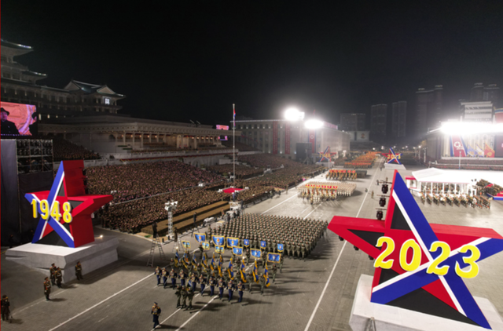
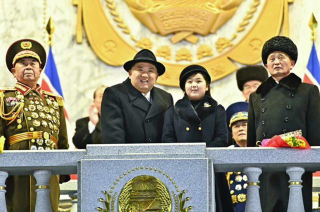
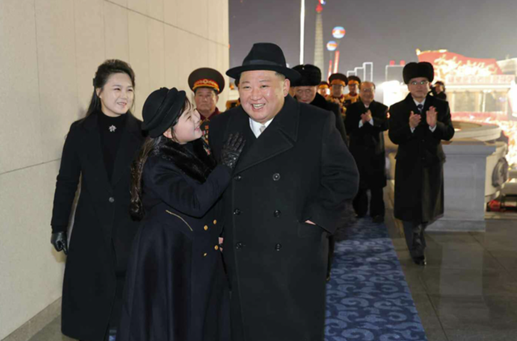
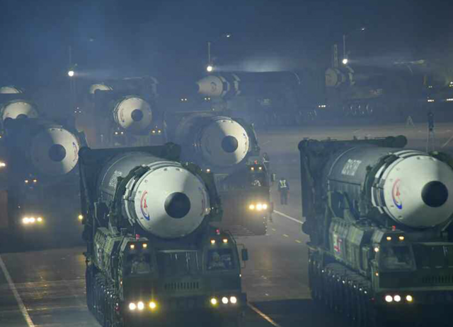
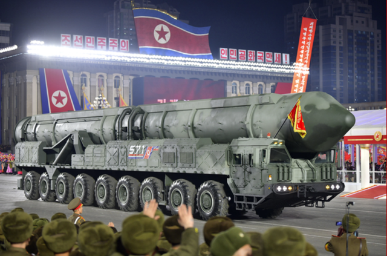

# 金正恩父女首度同台阅兵，有何特殊之处？

据朝鲜中央通讯社消息，2月8日晚，朝鲜人民军建军75周年阅兵式活动，在平壤金日成广场举行。和2020年以来的多数阅兵活动一样，本次阅兵式在夜间进行。韩联社报道称，阅兵式约持续两个小时，有两万多人参与。

朝鲜最高领导人金正恩携妻女出现在主席台上。金正恩在2月7日的建军节晚宴上发表过讲话，此番没有在阅兵式上再次演讲。

朝鲜人民军于1948年2月8日建军。1978年，时任朝鲜最高领导人金日成将人民军诞生时间追溯到抗战时期，建军日亦改为4月25日。2018年，金正恩领导下的朝鲜劳动党中央决定，仍以2月8日为人民军建军日，以4月25日为人民军前身“朝鲜人民革命军”成立日。

朝鲜上一次大规模阅兵，就是2022年4月25日的另一个“建军纪念日”。次月，韩国新总统尹锡悦上台，半岛局势逐渐恶化。2022年下半年，朝鲜进入2017年以来最密集的导弹试射周期，韩美亦采取扩大联合军事演习、部署战略武器等“最大施压”政策应对。

本次阅兵，被外界视作半岛局势全面恶化、进入五年多来“最紧张时期”后，朝鲜的第一次阅兵。朝鲜阅兵前，北约秘书长斯托尔滕贝格和美国防长奥斯汀刚刚访问韩国。

_朝鲜武装力量各部队方队通过金日成广场。图/劳动新闻_

大同江畔的烟花，人民军空军及空降兵的高难度表演，荣誉部队高举战旗的游行，观众挥舞国旗的场面，一如往常。但在不同寻常的半岛气氛中，本次阅兵式亦有诸多新变化。一方面，脱下军装的金正恩带着女儿出场，被朝鲜摄影师记录下“温馨画面”；另一方面，空前数量的洲际弹道导弹发射车驶过金日成广场，疑似新型战术核武器紧随其后，让韩美媒体及分析人士对“下一次核试验将近”更加担忧。

金正恩女儿的“首场阅兵式”

去年年底首次露面的金正恩女儿，自2月7日陪同父亲参加建军节晚宴后，再次出现在2月8日的阅兵式主席台上。这也是金正恩女儿自去年公开亮相后，首次出现在阅兵式的现场。朝中社在报道中特意提到，朝鲜劳动党中央委员会政治局常委、党中央委员会组织书记赵甬元，朝鲜劳动党中央委员会书记李日焕、金才龙、全贤哲等“陪尊敬的女儿在贵宾席就座”。

_金正恩及其女儿在阅兵式主席台上，前排左为劳动党中央军事委员会副委员长李炳哲，右为总理金德训。图/劳动新闻_

朝鲜媒体播发的照片显示，金正恩女儿随父亲一起检阅了“武装力量主要部队军旗”，并在阅兵式期间离开贵宾席，来到主席台前排和金正恩一起观看队列行进与飞行表演。

金正恩亦改变了2022年4月阅兵时穿着的白色元帅服，取而代之的是更常见的黑色圆顶礼帽和大衣。这是他祖父金日成常用的装束。金正恩女儿也是一袭黑衣，服饰、发型、举止乃至鼓掌的姿态，都和一旁的母亲李雪主接近。父女二人不时靠近交谈，朝中社还发布了他们共同观看阅兵的背影照片。

_金正恩及女儿、妻子李雪主在阅兵式现场。图/劳动新闻_

韩联社指出，金正恩女儿自公开露面以来，出席的所有活动均是军事活动，且与朝鲜核武器建设紧密相关，引人注意。此前，金正恩携女儿观看“火星-17”洲际弹道导弹试验、接见试验有功人员并视察核武库，引发外界一系列猜测。韩国统一部2月8日最新回应表示，目前就这些现象得出结论还为时尚早，正“保持所有可能性并观察局势发展”。

金正恩在检阅三军仪仗队之后、阅兵式开始前，检阅主要部队旗帜，也是一项新变化。这其中，朝鲜导弹总局的旗帜2月6日首次出现在劳动党中央军事委员会扩大会议的背景中，这也是朝鲜首次对外披露该机构。而该次会议的主题之一，正是“采取从根本上改进和加强军事工作的机构编制措施”。本次金正恩检阅各部队旗帜，则是朝鲜武装力量机构改革后，具体军兵种、部门和部队第一次集体亮相。

洲际弹道导弹“几何倍增长”

与以往一样，这次阅兵式先有功勋部队游行，其次是分列式，最后才是武器展示环节。在2月8日晚压轴出场的，是战术导弹方队、远程巡航导弹方队、战术核武器运用部队方队和洲际弹道导弹方队。朝中社称，这些大型发射车编队展现了朝鲜国防力量变革发展面貌和“最大核攻击能力”。

引发舆论关注的，首先是洲际弹道导弹方队。朝鲜媒体没有明确导弹型号，但这些导弹的形态及11轮发射车样貌、涂装，都与“火星-17”型洲际弹道导弹一致。其中，领头的编号321号导弹发射车，去年11月刚被授予英雄称号。

_行进中的“火星-17”洲际弹道导弹方队。图/劳动新闻_

朝鲜一直将洲际弹道导弹（ICBM）视为核力量建设的关键组成部分。在朝鲜密集进行核试验的2017年，其洲际弹道导弹研发正式进入国际社会视野。2017年7月，朝鲜两次公开试射名为“火星-14”的导弹，韩国国防部研判后将之界定为洲际弹道导弹。

2020年10月10日，搭载“火星-17”的发射车车队首次在劳动党成立75周年阅兵式上亮相，此后又在2021年和2022年的三次阅兵中出现，本不“新鲜”。但是，在之前四次阅兵中，“火星-17”发射车都仅出现四辆，韩联社曾援引专家分析称，这可能缘于洲际弹道导弹及其载具的生产数量有限。

而这一次，仅据朝中社播发的照片计算，跟在321号发射车之后的，至少还有10辆“火星-17”发射车。换言之，朝鲜在本次阅兵式上展出的洲际弹道导弹数量，相比此前历次阅兵，已经实现了“几何倍增长”。

同时，这也是“火星-17”被韩美政府认定为“具备战斗力”后的首秀。2022年3月到5月间，朝鲜多次试射“火星-17”，其中多次被韩美政府判断为“不成功”或“实为旧型号”。但11月18日朝鲜再次试射“火星-17”，被各方认为确为更具威慑力的新型导弹。韩国专家分析称，其有效射程不止于“到达美国本土”，而是“覆盖美国领土”。

_阅兵式中出现的“新型导弹”。图/劳动新闻_

朝中社2月8日就人民军建军75周年发布报道时，也在梳理近年的军事斗争时特别提到“火星-17”试射，称其“大快人心的雷声压制敌对势力冒险的侵略战争挑衅活动，使他们吓得胆战心惊”。

《韩国先驱报》指出，这次“火星-17”发射车以空前的数量出现，“清楚地表明朝鲜不懈开发并大规模生产可以打击美国本土的强大战略武器”，这与朝鲜年初提出核武库“几何倍扩容”、2月6日新组建“导弹总局”等举措前后呼应。

更值得注意的是，在“火星-17”方队之后，还有一个“型号不明的导弹”压轴出场。朝中社在报道中并未指明该方队的身份，仅以“战略导弹部队”概括。但根据朝鲜媒体播发的照片，确实有一种搭载新型导弹的9轮发射车，在洲际弹道导弹方队之后，成单列纵队通过金日成广场。

韩联社指出，朝方一般将威力强大的武器或新型武器安排在阅兵式末尾亮相。韩国国防安全论坛秘书长申钟宇分析称，出现在“火星-17”型导弹后，意味着这种新武器可能威力更强大，或许是搭载新型固体燃料发动机的中远程导弹。

2022年12月，朝鲜在西海卫星发射场测试了一种新型固体燃料火箭发动机。卡内基国际和平基金会核计划高级研究员 Ankit
Panda称，如今这种新武器出现在阅兵式中，可能意味着朝鲜的固体燃料发动机研发取得长足进展，足以推出新型固体燃料洲际弹道导弹。

朝鲜经常通过阅兵式展示新型武器。自2020年10月在阅兵中披露“火星-17”洲际弹道导弹后，2021年和2022年4月的阅兵式中，都有新型导弹亮相。但完成被国际公认成功的导弹试射，则多是在阅兵式展示之后。

《韩国先驱报》因而援引专家分析称，展示新武器未必意味着形成战斗力，但代表了朝鲜未来一段时期的军工研发方向。固体燃料洲际弹道导弹比液体燃料导弹发射周期更短、生存能力更强，因而独具优势。以此为方向，意味着新成立的“导弹总局”的关键任务之一，可能是实现朝鲜远程打击能力的多样化。

记者：曹然

