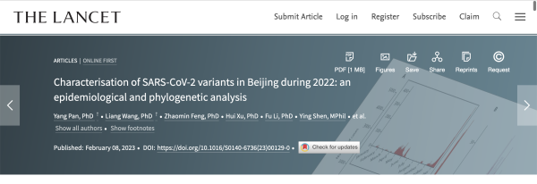
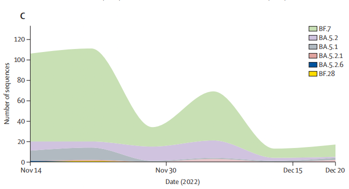
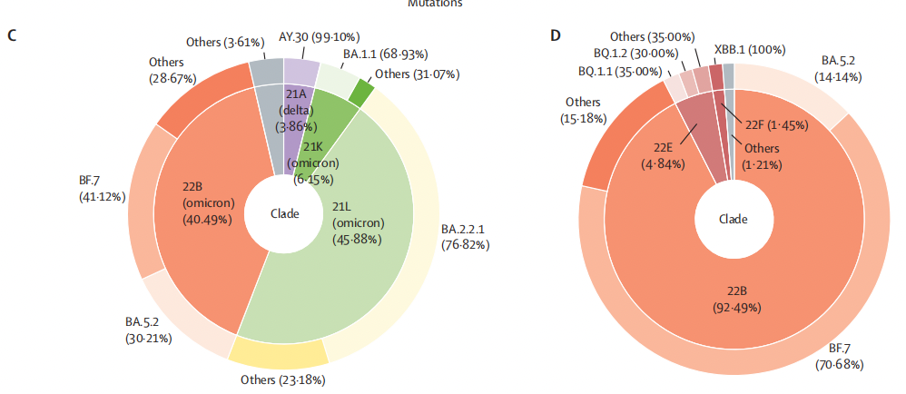
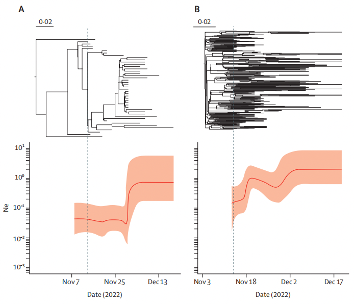

# 高福团队《柳叶刀》发文：北京新冠疫情高峰未见新变异株

·针对北京地区病例的分析表明，中国近期疫情中未见新的COVID-19变异株。

_《柳叶刀》发表高福团队研究论文。_

中国逐步调整防疫措施后，新冠感染病例数量激增，引发人们对可能出现新的变异株的担忧。针对北京地区2022年11月14日至12月20日期间采集的413例新冠（COVID-19）感染新发病例样本进行的基因组分析表明，所有病例均由现有毒株引起，90%以上涉及奥密克戎（Omicron）变异株BA.5.2或BF.
7亚分支，未见新的变异株。

北京时间2月9日，《柳叶刀》（The
Lancet）在线发表了这项研究。文章作者表示，由于北京人口的特点以及高传染性新冠毒株在北京地区的传播情况，上述结果是中国大流行的缩影。

该研究由中国国家重点研发计划和中科院战略优先研究计划资助，由北京疾病预防控制中心、中国科学院、中国疾病预防控制中心和中国科学院大学的研究人员进行，北京市疾控中心副主任王全意与中国科学院院士、中国科学院微生物研究所研究员高福为通讯作者。

_2022年11月14日至12月20日，北京地区发现的局部亚变异株。来源：柳叶刀_

文章称，自2019年12月以来，本研究的作者定期收集北京地区输入型病例和本地新冠病例的呼吸道样本，并随机选择样本进行分析。在2022年12月之前，未有关于病毒在北京地区本地持续传播的报告。在这项最新研究中，作者对北京地区2022年检出的新冠病毒样本进行了分析。使用快速、大规模测序技术生成基因组序列，并使用现有的高质量新冠病毒序列分析其进化历程和种群动态。

研究共纳入2881个高质量序列（其中境外输入型病例来自63个国家和地区），在2022年11月14日（感染病例数量开始急剧增加）至12月20日期间，随机选择了413个新样本进行测序。其中350例为本地病例，63例为输入型病例。

对413个新序列的分析表明，其均属于现有已知的新冠毒株。2022年11月14日之后，北京地区的优势毒株为BF.7，占本地感染病例的75.7%。另一种奥密克戎变异株亚分支BA.5.2占本地感染病例的16.3%。同期输入型病例涉及毒株包括BQ.1和XBB.1，分别占20株和6株，它们是国际间占主导地位的变异株，但在北京本土感染病例中并未检出。

_左图为2022年全年在北京流行的新冠病毒变异株的组成，右图为2022年11月14日之后在北京传播的新冠病毒变异株的组成。
内圈代表分支的组成，外圈代表每个分支中的详细谱系（Pango lineage）。来源：柳叶刀_

2022年11月14日之后，北京地区的BA.5.2和BF.7有效种群数量均有所增加，表明这两个谱系内的遗传多样性增加。BA.5.2有效种群大小在2022年11月14日至25日之间无显著变化，但在2022年11月30日前后急剧增加。与此同时，2022年11月30日前后的BA.5.2感染病例数量也有所增加。自2022年11月14日起，BF.7的种群大小逐渐增加。

_北京地区BA.5.2（左）和BF.7（右）有效种群数量增加的时间轴。来源：柳叶刀_

作者承认本项研究存在一些局限性。虽然只对北京地区2022年的数据（而非中国大陆的数据）进行了分析，但作者表示，这些数据可代表全国的情况。由于强制性大规模检测结束，无法获得2022年12月经实验室确认的新冠病例数，表明真实感染病例数被低估，导致数据中存在一定程度的抽样偏倚。需要更多的样本来研究奥密克戎变异株亚分支的传播性和致病性。虽然病毒的进化速度可能因变异株的不同而存在差异，但作者认为，在疫情暴发初期，病毒的进化速度是恒定的。

高福向《柳叶刀》表示：“鉴于变异株对疫情进程的影响，有必要调查中国近期调整COVID-19防控政策后是否出现新的变异株。我们的分析表明，两种已知的奥密克戎变异株亚分支（而非任何新的变异株）是北京地区当前病例数激增的主要原因，而且放眼整个中国，可能同样适用。然而，随着COVID-19在中国的大规模传播，我们有必要继续密切监测疫情，以便尽早发现可能出现的任何新变异株。”

“世界迫切需要来自中国所有地区和其他地方的及时的基因组和其他数据，例如病例数和死亡人数的可靠数字。快速畅通的重要数据流通是应对持续的新冠肺炎疫情和许多其他健康威胁的关键。”南非斯坦陵布什大学（University
of Stellenbosch）的Wolfgang Preiser教授和Dr Tongai
Maponga在《柳叶刀》配发的文章评论中写道：“我们很高兴看到来自中国的这些急需的数据。令人欣慰的是，该研究并未发现关于新变异株的证据，但这一结果也并非在意料之外：有效控制措施的突然停止可充分解释病例数量的激增。”

然而，他们表示，在根据北京地区的数据得出全国情况的结论时仍需谨慎。“对于一个幅员辽阔、人口稠密的大国，不能根据单个地区的新冠病毒（SARS-
CoV-2）分子流行病学特征推断整个国家的状况。在中国的其他地区，可能会出现其他进化动态，其中可能包括可被人类感染且进一步进化后发生‘回溢’（spill
back）的动物病毒。”

**参考文献：**

https://www.thelancet.com/journals/lancet/article/PIIS0140-6736(23)00129-0/fulltext

