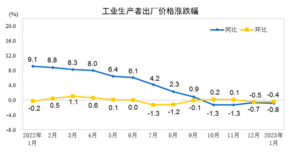
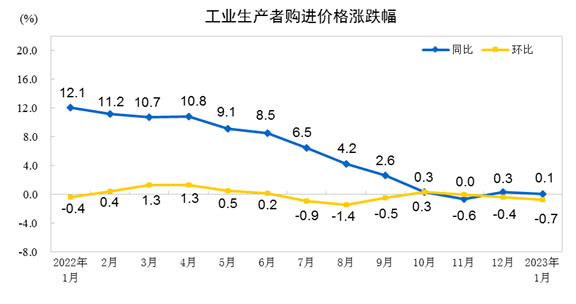
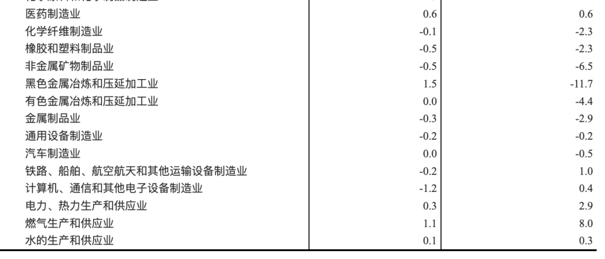

# 2023年1月份PPI同比下降0.8％ 环比下降0.4％

2023年1月份，全国工业生产者出厂价格同比下降0.8%，环比下降0.4%；工业生产者购进价格同比上涨0.1%，环比下降0.7%。

一、1月份工业生产者价格同比变动情况

工业生产者出厂价格中，生产资料价格下降1.4%，影响工业生产者出厂价格总水平下降约1.10个百分点。其中，采掘工业价格上涨2.0%，原材料工业价格下降0.1%，加工工业价格下降2.3%。生活资料价格上涨1.5%，影响工业生产者出厂价格总水平上涨约0.35个百分点。其中，食品价格上涨2.8%，衣着价格上涨1.9%，一般日用品价格上涨1.2%，耐用消费品价格上涨0.3%。

工业生产者购进价格中，燃料动力类价格上涨7.2%，农副产品类价格上涨5.2%；黑色金属材料类价格下降7.8%，建筑材料及非金属类价格下降5.3%，化工原料类价格下降4.7%，有色金属材料及电线类价格下降1.8%。

二、1月份工业生产者价格环比变动情况

工业生产者出厂价格中，生产资料价格下降0.5%，影响工业生产者出厂价格总水平下降约0.38个百分点。其中，采掘工业价格下降1.0%，原材料工业价格下降0.7%，加工工业价格下降0.4%。生活资料价格下降0.3%，影响工业生产者出厂价格总水平下降约0.06个百分点。其中，食品价格下降0.5%，衣着价格下降0.3%，一般日用品价格持平，耐用消费品价格下降0.2%。

工业生产者购进价格中，农副产品类价格下降2.3%，燃料动力类价格下降1.3%，化工原料类价格下降1.2%，建筑材料及非金属类价格下降0.7%；黑色金属材料类价格上涨0.7%，有色金属材料及电线类价格上涨0.4%。

2023年1月份工业生产者价格主要数据

附注

1.指标解释

工业生产者价格指数包括工业生产者出厂价格指数（Producer Price Index for Industrial Products，
简称PPI）和工业生产者购进价格指数。

工业生产者出厂价格指数反映工业企业产品第一次出售时的出厂价格的变化趋势和变动幅度。

工业生产者购进价格指数反映工业企业作为中间投入产品的购进价格的变化趋势和变动幅度。

2.统计范围

工业生产者出厂价格统计调查涵盖40个工业行业大类、1300多个基本分类的工业产品价格；工业生产者购进价格统计调查涵盖9大类、800多个基本分类的工业产品价格。

3.调查方法

工业生产者价格调查采取重点调查与典型调查相结合的调查方法，涉及全国4万多家工业企业。

4.统计标准

工业行业划分标准的依据是《国民经济行业分类》（GB/T4754-2017）。

5.数据说明

由于“四舍五入”原因，有时会出现合计数据与分类数据高值或低值相同的情况。部分分类或行业价格变动幅度较小，按“四舍五入”保留1位小数后涨跌幅为，在表述价格变动情况时视为持平。

