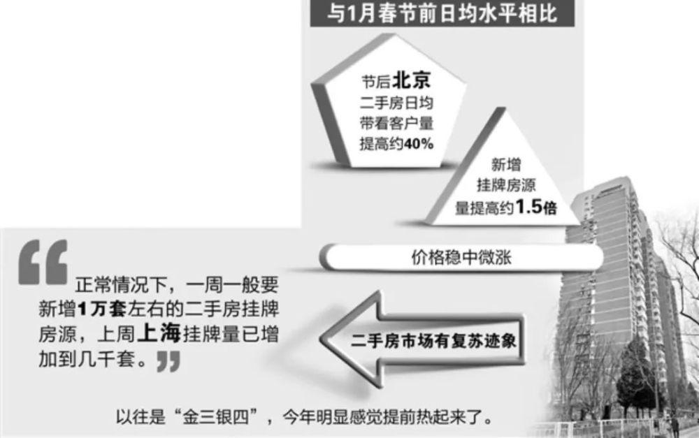
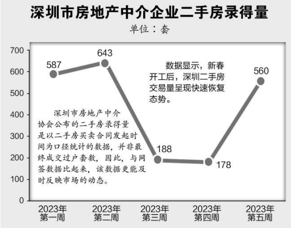

# “公司一天成交500多套房！”北京中介：忙得没时间吃饭

作者：张达 张淑贤 吴家明

有风向标之称的一线城市楼市情况备受关注，特别是最能反映市场真实情况的二手房市场。

日前，证券时报记者对京沪深三地的二手房市场进行了实地调查。
**从调查结果来看，带看量回升是三地二手房市场的共同特征，另外，北京和上海的二手房成交价仍保持稳定，但新增房源挂牌价均有所上涨。**

**北京：成交回暖挂牌价上涨**

“上个周末，看房的人特别多，我们店里的工作人员都忙不过来了！”

2月8日，证券时报记者来到北京丰台区某中介门店探访，一位刚带客户看房回来的工作人员谈及最近市场时发出了上述感慨。

“我周六一天成交了两单、带看了4组客户，有一个客户看中的一个小户型学区房就有12个客户抢，最后被我的客户抢到了……周末两天我忙得饭都没吃上。”上述工作人员对证券时报记者说。

随后，记者又来到丰台区另一家中介门店。由于是工作日，门店内并没有来看房的人，但工作人员同样向记者回顾了上周末看房人挺多的情况，“以前我们片区一个月成交10套房，现在周末两天就成交10套房。”

不止丰台，东城、朝阳、海淀的多位中介人员在被问及最近市场行情时均表示，成交量有所回暖。

海淀区某中介人士对证券时报记者说：“最近看房的人挺多的，成交量也比较多，上周末，我们公司一天成交了500多套房。”

“实际上从去年12月最后一周到现在，北京成交量一直挺大的，今年1月份春节前买房的特别多，因为担心年后涨价。再加上有些客户刚满足购房资格或年终奖发下来了，就开始买房了。”朝阳区某中介人士对证券时报记者说。

他所在小区去年1个月也就成交一两套，而今年1月份成交了8套。

**对于北京二手房成交回暖的原因，证券时报记者采访了多位中介人士，归纳起来主要有两个方面：一是去年底很多人“阳康”后都出来看房买房，疫情积压的购房需求集中释放；二是去年底以来出台了不少购房支持政策，如降利率、减免个税等，而现在购房人大多都是换房客户，有换学区房的，有以小换大、以旧换新的。**

尽管成交量回暖了，但是多位中介人士对证券时报记者表示，现在的成交价格仍比较稳定，跟去年底差不多。不过，他们也同时表示，春节后新出房源挂牌价较春节前有所上涨。

东城区某中介告诉证券时报记者，春节后新挂出来的房源价格比之前高一些，反映了业主对市场看好的心态，但是还没有成交，现在成交的都是之前的库存，如果春节前的这波房源消化完了，预计3、4月份的价格会稍微涨一些。

海淀区某中介给记者举了个例子，“现在约业主谈，同样一套报价580万元的房，年前550万元能卖，现在580万元不一定能谈下来，或者最多只能谈下三五万，谈判空间变小了，谈判难度变大了，这就说明市场在上行。”

对于今年的市场形势，多位中介人士向证券时报记者表达了看好的观点，原因大多基于今年国家对房地产的支持态度。

贝壳研究院首席分析师许小乐接受证券时报记者采访时表示，春节后北京二手房市场活跃度提高。与1月春节前日均水平相比，节后二手房日均带看客户量提高约40%，新增挂牌房源量提高约1.5倍，价格稳中微涨。市场预期整体改善的背景下预计北京楼市持续修复。

**上海：二手房带看量和成交量均回升**

**“以往是‘金三银四’，今年明显感觉提前热起来了。”**
祝女士是上海一家房产中介公司的员工，她告诉证券时报记者，“春节后，其所在中介带看量环比上升了两至三成。”

祝女士同时运营该中介的自媒体平台，“没想到大年初一至初五，还有不少客户在平台上咨询房源信息，其中4组客户年后转换成门店的带看客户。”她说。

另一家房产中介业务员姜先生对证券时报记者说，自初七上班以来就感觉到比年前忙多了，“年前没什么成交，年后人气一下子旺起来了，上个周末，附近一个小区差不多有近百组客户看房，最终成交了近10套房源。”

不过，记者走访几家房产中介门店时并没看到有客户。对此，姜先生回应称，“上班日客户较少，周末时客户特别多，你要是周末过来，门店里几乎没业务员，不是在带看就是在签约，复工以来仅我们这一个门店已成交了3套。”

上海链家研究院监控的数据显示，春节后的二手房市场成交恢复良好，特别是2月份的第一个周末（也是节后第一个周末），链家的成交量较此前增长了50%~60%，带看量增长了30%~40%，说明市场依然存在需求和购买力。

“从成交周期来看，房源成交周期和客源成交周期都有缩短。近几周，房源成交周期由之前最高的82天，下降至67天，客源成交周期则由28天下降至15天，说明目前成交节奏有加快的趋势。”上海链家研究院表示，综合来看，市场筑底企稳的可能性已然增加。

至于二手房价格方面，记者在走访沪上房产中介机构时获悉，目前挂牌价有所提高，但成交价未现明显变动。上述房产中介人员姜先生举例称，门店周边一小区56平米的小两房，年前挂牌价多数在290万元左右，而年后挂牌价已达到300万元左右，成交价未现明显上涨，上周末成交的房源中，价格多数在280万~290万元之间，“如果想卖个更高的价格，建议可以再等等。”

上海中原地产分析师卢文曦接受记者采访时表示，目前上海二手房市场的确有复苏迹象，原因主要是近期楼市暖风不断，提振了购房者对楼市的信心，同时一些置换客户通过出售二手房以获得一手房打新资格，这在某种程度上也推动了二手房交易。

“同时我们发现，二手房的挂牌量恢复得也不错。”卢文曦告诉记者，“正常情况下，一周一般要新增1万套左右的二手房挂牌房源，上周上海挂牌量已增加到几千套。”

**至于上海二手房是否会出现“小阳春”？卢文曦分析，“上半年上海楼市的‘小阳春’应该会出现，但在此之后，上半年应该还是一个不断筑底、稳固市场底部的过程，可能到了下半年市场会有较明显的量价有序回升的状况。”**

**深圳：带看量回升 “港客”也回来了**

“春节过后，前来看房的购房者比年前增加50%左右，其中以关注学区房、大户型的改善型客户居多，租赁需求也有所增加。”在深圳罗湖翠竹从事房产中介工作的黄经理对今年的深圳楼市的信心似乎多了一些，“去年业绩很惨淡，目前楼市利好累积效应开始显现，希望楼市信心也将逐步回归。”

随着春节假期结束以及开工，深圳二手房市场开始展现出一些回暖的迹象。深圳市房地产中介协会公布的数据显示，上周深圳二手房（含自助）录得560套，环比增长214.6%。新春开工后，深圳二手房交易量呈现快速恢复态势。值得注意的是，这里的录得量是以二手房买卖合同发起时间为口径统计的数据，并非最终成交过户套数，因此，与网签数据比起来，该数据更能及时反映市场的动态。深圳贝壳研究院院长肖小平对记者表示，最近一段时间的二手房带看量大概回到了去年12月初的水平。

过去，来自香港的购房者也是深圳楼市的重要组成部分之一。近日，备受关注的深港全面恢复“通关”终于到来。记者在福田和莲塘口岸周边采访发现，不少香港业主都趁着恢复通关回到深圳打理自己的房子，或租或售。

“我在莲塘有一套房子，由于快3年没有回深圳，家里的家电家私很多都已经损坏，这次回来收拾一下，放租或出售还在考虑。”家住香港沙田的陈先生告诉记者，身边也有朋友想回深圳看看，找找楼市的机会。

在莲塘口岸周边，一些房产中介也告诉记者，最近来自香港客户的咨询量明显增多。“由于莲塘口岸新开通旅检功能，加上莲塘和盐田周边的居住环境好，但房价在深圳市区内算相对低位，所以这边的房子开始得到一些香港客户的关注。”某房产中介说。

此外，根据美联物业（深圳）的成交数据显示，在2023年1月的购房及租房交易中，客户使用香港及外籍身份证明文件的交易单，合共占所有交易的10%，比2022年的4%高出6个百分点。

农历春节前后，各省市也针对当地楼市进行政策调整，多地区限购放宽、首付比例降低以及降低首套房贷款利率。不过，记者调查发现，目前深圳各大行房贷利率与去年12月保持一致，首套房利率多为4.6%，放贷额度较为宽松。作为调控最为严格的城市之一，深圳楼市的一举一动备受关注。截至目前，深圳楼市的调控政策并未发生明显变化。

2021年2月8日，被坊间称为“史上最严”调控的深圳二手房参考价出台，至今已经两年时间，而且没有发生变动。对此，深圳中原研究中心认为，参考价原则是一年一调，今年说的则更为“保守”，最终发布与否可能更多取决于未来房地产走势。参考价调整有其合理性，很多二手楼盘参考价与实际成交价差距还是很大，特别是从政府支持刚需、改善群体购房的原则看，刚需、改善产品的调整可能更为优先，但“房住不炒”总基调不动摇更是首要原则，以往经验表明一旦政策变动容易造成房价上涨，过去两年调控取得的成绩可能会功亏一篑，因此，政府对于政策调整非常谨慎，这也是去年参考价未调整的主要原因。

责编：叶舒筠

