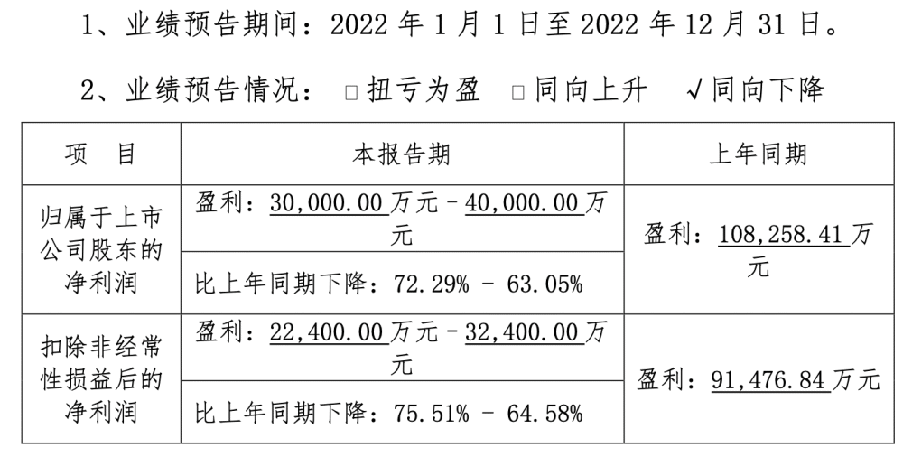

# “支付第一股”拉卡拉净利腰斩背后

《投资者网》丁琬璎

近日，首家A股支付公司——拉卡拉支付股份有限公司（以下简称“拉卡拉”，300773.SZ）发布了2022年业绩预告，预计2022年归母净利润为3亿元至4亿元，同比下降63.05%至72.29%。

对于业绩如此大幅度的下滑，拉卡拉表示，公司面临自2020年疫情疫情爆发以来最大的经营压力，支付业务和科技服务收入均有所下降。

据了解，除了主营业务收入大幅下滑之外，拉卡拉的股权投资在2022年再次亏损，而且亏损金额进一步扩大为逾亿元。

2022年度净利润下降逾6成

公开信息显示，拉卡拉成立于2005年，作为第三方支付公司，其定位为“商户数字化经营服务商”。2011年首批获得支付牌照。2019年4月25日，拉卡拉在深交所成功上市，成为第一家登陆A股市场的第三方支付企业。

目前拉卡拉支付覆盖商超、社区零售店、物流、餐饮、物业、贸易、保险等行业。聚焦支付生态、科技SaaS和新零售三大业务，以中小企业为服务核心，累计服务商户超过2500万家。

根据公司业绩预告，预计拉卡拉2022年归母净利润3亿元-4亿元，同比下降63.05%-72.29%。

数据来源：拉卡拉2022年度业绩预告

据了解，拉卡拉的主要业务包括支付业务、科技服务业务两大类。其中支付业务包括境内支付、跨境支付、支付服务业务，科技服务包括金融科技服务与IT科技服务。

细分来看，2020年疫情爆发以来，线下消费场景下的商户支付结算受到较大影响，拉卡拉支付业务贡献收入下滑较为明显，相比2021年，公司活跃商户进一步减少，支付交易规模下降，从而使得支付业务收入减少。

拉卡拉认为，受到较为复杂的国际政治和经济形势、国内疫情反复及防疫措施升级，对国内经济运行和居民生活造成较大影响。线下商户普遍面临供货不畅、销售下滑、营业时间不确定等多重压力，经营受到显著影响，甚至难以持续；公司分支机构及合作渠道的商户拓展工作因为疫情防控措施受到较大的限制。

公告中还表示，在支付业务收入下降的情况下，公司继续保持对渠道的扶持让利政策，专业化服务费维持在较高水平，导致支付业务毛利率下降。

根据半年报，2022年上半年，拉卡拉支付交易金额2.33万亿元，同比减少10%，公司营业收入30.1亿元，同比减少9%，其中支付业务收入同比减少13%下降至25.55亿元，毛利率同比减少4.24%。

与此同时，受银行向商户新增贷款规模减少影响，金融科技业务拖累了商户科技服务，使得科技服务收入下降。

简言之，主营业务构成的两大板块支付业务和科技服务业受到重创，是拉卡拉业绩大幅下滑的重要因素。

作为中国的支付行业第一股，2022年，拉卡拉除了主营业务面临“自2020年疫情爆发以来最大的经营压力”之外，在股权投资、公司治理方面也面临着不小的考验。

投资“问题公司”亏损扩大

在主营业务收入下滑的同时，2022年，拉卡拉的长期股权投资亏损进一步加大，是影响其归母净利润的重要因素。

业绩预告显示，公司长期股权投资项下的参投上市公司，预告2022年度归母净利润亏损18-22亿元，权益法下预计公司将确认投资损失1-1.3亿元。

业绩预告中虽未披露拉卡拉参投的上市公司名称，不过，根据蓝色光标此前刚刚发布的2022年度业绩预告，其预计归母净亏损正好为18亿元-22亿元，拉卡拉亦在2022年半年报中曾披露，其持有蓝色光标的比例为5.84%，计算之后此项投资预计损失1-1.3亿元。

公开信息显示，2021年，拉卡拉以9.144亿元收购蓝色光标1.44亿股，入股后拉卡拉持有蓝色光标5.84%股份，成为蓝色光标第二大股东。

根据蓝色光标发布的业绩预告，受商誉及无形资产、长期股权投资等减值准备影响，其预计2022年归母净亏损达18亿元至22亿元，扣非后归母净亏损15亿元至19亿元，而上年同期这两项指标为5.22亿元、6.55亿元。

值得注意的是，该业绩预告披露不久，该公司便收到关注函。深交所连发“三问”，要求公司补充披露相关减值测试具体过程，说明相关假设、参数和指标选取与2021年末减值测试时相比是否有重大变化、变化原因及合理性，减值计提时点是否准确，以前年度减值测试是否审慎、合理等；以及相关投资明细、公允价值变动测算过程及依据，是否履行审议程序和信披。

事实上，在投资蓝色光标的第一年（2021年），拉卡拉就因蓝色光标业绩亏损从而投资亏损316万元，而2022年亏损进一步扩大至超1亿。

今年年初，拉卡拉又发布公告，宣布收购一家亏损公司，引起了投资者的不解。

今年1月16日，拉卡拉表示，拟使用自有资金人民币1755万元收购公司联营公司简链科技70%股权，收购完成后，公司持有简链科技股权比例为100%。

对于本次投资的目的，拉卡拉表示，主要是利用简链科技为行业及小微客户提供数字金融科技服务的经验与技术，共同开发公司常年积累的大量行业及小微客户资源，帮助客户解决数字化升级和资金问题，与客户企业构建更加紧密的业务联系与信任基石，为业务的进一步扩展奠定坚实基础。

公告显示，被收购的简链科技目前成立刚满一年，尚且处于亏损状态中：2022年度，简链科技实现营业收入1279.15万元，净利润为-145.76万元。截至2022年12月31日，总资产为2699.15万元，不过，净资产为2494.30万元，比实缴的注册资本还低了160.70万元。

另外，由于公司董事、总经理王国强持有简链科技10%股权，为本次交易的交易对手之一；公司董事长孙陶然、董事李蓬，同时担任本次交易对手之一的考拉科技董事，因此本次交易构成关联交易。

拉卡拉表示，除上述关联关系外，其余交易对手方不存在与拉卡拉及其前十名股东、董监高在产权、业务、资产、债权债务、人员等方面的其他关系以及其他可能或已经造成上市公司对其利益倾斜的其他关系。

然而1755万元70%股权的出价收购一家亏损公司，叠加本次交易构成关联交易，使得本次收购颇受市场关注。

股东减持高管频变

2022年以来，拉卡拉多位重要股东已经进行了大比例减持。截至今年1月末，包括联想控股在内，拉卡拉的股东及董监高等通过二级市场减持累计套现金额在7亿元左右。

去年11月27日，拉卡拉的第一大股东联想控股的减持计划期限届满，其合计减持1682.29万股股份，套现约2.97亿元。今年1月9日晚间，拉卡拉披露，股东未名雅集、创金兴业分别减持了32万股股份、6.61万股股份，均完成了清仓退出。

股东减持甚至清仓的同时，去年12月6日，公司发布关于变更总经理暨补选非独立董事的公告，公告称董事会于近日收到公司董事兼总经理陈烈的书面辞职报告，其因个人原因申请辞去公司总经理、董事职务，辞职后将不再担任公司任何职务，公司董事会同意聘任王国强为公司总经理。

公开资料显示，2015年起，王国强即任拉卡拉支付股份有限公司高级副总裁、执行总裁。此次请辞的陈烈2021年2月才刚刚上任，任职才1年8个月，公开信息显示，今年1月7日，拉卡拉法人已变更为现任总经理王国强。

在近三年时间里，拉卡拉已连续三次更换总经理。陈烈的上一任为舒世忠，曾是中国银联中国银联助理总裁、证通股份有限公司核心创始人之一，2016年底加盟拉卡拉支付，担任集团总裁。

分析人士认为，公司高级管理人员是公司的核心人员，对公司的经营战略制定以及企业未来的发展有决定性作用。有研究表明，企业高级管理人员的变更常常伴随着企业战略架构和经营方式的变化，对企业短期内的业绩状况和长期发展潜力都有重要的影响。

作为核心高管，总经理频频变更，势必会对拉卡拉的经营产生重大影响。在经历了“自2020年疫情爆发以来最大的经营压力”之后，拉卡拉能否在2023年打开增长空间，留待市场进一步观察。（思维财经出品）■

