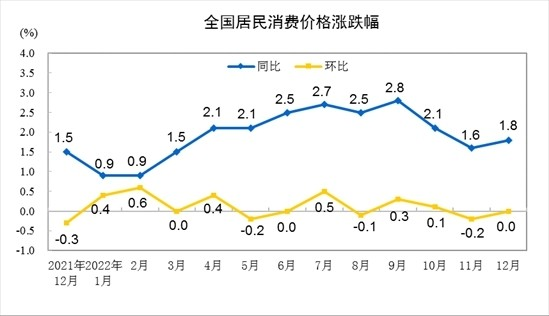
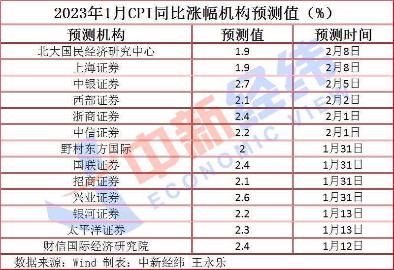

# “菜哥”连涨遇上春节“错月”，1月CPI或重回“2时代”

中新经纬2月10日电 (王永乐)10日上午，国家统计局将公布2023年1月居民消费价格指数(CPI)。多家机构预计，1月CPI同比涨幅2.3%。

_图片来源：国家统计局网站_

**CPI涨幅或重回“2时代”**

国家统计局数据显示，2022年12月，全国CPI环比持平，同比上涨1.8%，同比涨幅连续两个月处于“1时代”。

对于即将揭晓的2023年1月CPI数据，Wind数据显示，截至2月9日，13家机构对12月CPI同比涨幅的预测均值为2.3%。从预测值来看，11家为2%或以上，2家为1.9%，预测值最高为中银证券给出的2.7%，最低为北大国民经济研究中心和上海证券给出的1.9%。若按照机构预测的均值计算，CPI同比涨幅将重回“2时代”。

从机构预测来看，猪肉价格“旺季不旺”，蔬菜价格继续抬升，春节错位导致物价阶段升高。

农业农村部数据显示，2023年1月，猪肉批发价格为23.72元/公斤，环比降18.82%；
28种蔬菜平均批发价格为5.75元/公斤，环比上涨22.60%；鸡蛋批发价格为11.01元/公斤，环比涨6.14%。

油价方面，国家发改委2023年1月对成品油价格上调和下调各一次，汽、柴油价格每吨均累计涨45元。

招商宏观张静静团队预计，1月CPI同比2.1%。该团队分析称，1月CPI涨幅稍高，一定程度上与春节错位和防疫调整有关。今年春节较早，蔬菜等价格上涨也早于去年，带动食品CPI有上升压力。非食品价格可能是推升CPI的主要力量，一方面是春节前家政等服务需求上升、供给下降，价格季节性上涨；另一方面是防疫政策调整后，春节期间旅游相关项目价格有所上涨。

北大国民经济研究中心报告认为，受国际原油下行、疫情影响渐趋平稳、国内消费需求回温和部分商品供应改善影响，食品价格环比有所回升，非食品价格相对平稳，预计1月CPI同比增长1.9%，较上期上升0.1个百分点。

**未来CPI怎么走？**

短期来看，猪肉价格对通胀压力不大，蔬菜价格有望进入下行通道。

2月6日，国家发改委发布消息称，猪粮比价进入过度下跌一级预警区间，国家将启动猪肉储备收储工作。

同日，国家发改委价格监测中心发文指出，随着春节假期收尾，终端消费渐显疲软，屠宰企业开工率低位调整，整体收购难度不大，压价情绪较浓，而养殖端虽有抗价情绪，但生猪出栏压力仍存。

天风证券孙彬彬团队分析称，节后进入猪肉消费淡季，需求端预计继续走弱，同时春节前后生猪出栏不会比去年同期少，预计猪价短期内仍存在下行压力，大幅上行的可能性不大。与此同时，考虑节后蔬菜消费需求走弱，预计蔬菜价格将进入下行通道。

上海证券分析师胡月晓也认为，1月消费品中上涨最为显著的是蔬菜和鸡蛋，蔬菜品种的生产周期较短，最为受当期因素扰动，并不具有持续性；鸡蛋上涨则主要是季节性现象，也不具有持续性。

东方金诚首席宏观分析师王青预计，2023年一季度CPI将延续略高于2.0%的温和走势，其中消费修复有可能推动物价上涨动能增强，但CPI同比超过3.0%的可能性不大。

海通证券宏观经济研究团队称，在服务业通胀的带动下，我国核心CPI表现或将明显回暖。该团队测算，中性涨价情景下，我国核心CPI在二季度就将回升至2%以上，在三、四季度间升破3%。

第一创业宏观报告分析称，考虑到国内CPI环比的季节性波动，预计2023年国内CPI同比为2.0%左右，与上年基本持平；各月呈现两头高中间低的V型走势；一至四季度的CPI同比分别为2.3%、1.6%、1.6%和2.3%。(中新经纬APP)

**中新经纬版权所有，未经书面授权，任何单位及个人不得转载、摘编以其它方式使用。**

