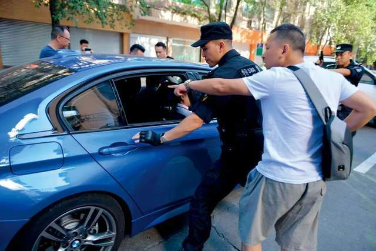
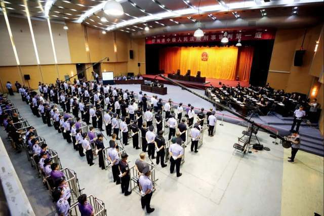

# 《狂飙》剧外的真实扫黑：挖出孙小果案、操场埋尸案，三年打掉3644个涉黑组织

近日，以扫黑除恶为背景的热播剧《狂飙》收官。影视剧的背后，是我国近几年来有关扫黑除恶的几项重大部署。

2018年1月，中共中央、国务院发布《关于开展扫黑除恶专项斗争的通知》，提出为“保障人民安居乐业、社会安定有序、国家长治久安，进一步巩固党的执政基础”，开展为期三年的全国扫黑除恶专项斗争。

专项斗争期间打掉的涉黑组织数超过前10年的总和。2021年9月17日，公安部刑侦局局长刘忠义在国新办新闻发布会上总结说，三年里，全国共打掉3644个涉黑组织、11675个恶势力犯罪集团，破获各类案件24.6万起。

其间，湖南“操场埋尸案”、云南孙小果案等陈年积案被彻查；在海南昌江，作恶30年却逍遥法外的“土皇帝”黄鸿发及其犯罪集团被连根拔起，近200名涉案人员获刑；在黑龙江哈尔滨，涉案金额高达31亿元，犯有强奸幼女、开设赌场等罪行的“李氏三兄弟”涉黑涉恶集团走向覆灭……

_扫黑除恶专项斗争期间，绵阳警方打掉多个涉黑涉恶团伙。供图/绵阳警方_

影视作品有大结局，现实版的扫黑除恶则仍然在路上。专项斗争圆满收官之后，扫黑除恶并未停止脚步。2021年5月，随着中共中央办公厅、国务院办公厅印发《关于常态化开展扫黑除恶斗争巩固专项斗争成果的意见》，扫黑除恶转入常态化阶段。与此同时，全国政法队伍教育整顿启动，外界评价，这是一场刀刃向内、刮骨疗毒的更深入的自我革命。

正如习近平总书记在2020年11月召开的中央全面依法治国工作会议上所说，“要继续依法打击破坏社会秩序的违法犯罪行为，特别是要推动扫黑除恶常态化，持之以恒、坚定不移打击黑恶势力及其保护伞，让城乡更安宁、群众更安乐。”

**让举报者没有后顾之忧**

事实上，我国对于黑恶势力的打击已开始多年。

2000年12月11日，全国打黑除恶专项斗争电视电话会议召开，决定自2000年12月到2001年10月，组织全国公安机关开展一场打黑除恶专项斗争。这是我国首次开展打黑除恶专项活动。2001年4月，中央决定将斗争的时间延长到2003年4月。

2005年，中央明确了打黑除恶的总体目标和要求，即决不能让黑恶势力在我国内地发展坐大，决不能让国外、境外黑社会组织在我国境内立足扎根。2006年2月，中央政法委部署全国开展打黑除恶专项斗争，成立打黑除恶专项斗争协调小组，设立全国“打黑办”。

2018年，专项斗争开始之后，民众注意到，过去喊了多年的“打黑除恶”，已升级为“扫黑除恶”。一字之差，意味深远。中国廉政法治研究会副会长杨永纯分析，这体现了党和国家对黑恶势力零容忍的态度，坚决铲除、不留死角。

扫黑除恶行动在升级，实际上也与黑恶势力在这些年的变化密切相关。中国政法大学教授王进喜分析说，黑恶势力近年来得到有效遏制，但是仍以隐蔽形式存在。他们大多以“公司”形式依托经济实体存在，一些“漂白”的黑恶势力还呈现组织形式“合法化”、组织头目“幕后化”、打手马仔“市场化”等特点。

中国社科院法学研究所研究员熊秋红则指出，黑恶势力正逐渐向政治领域渗透，必须采取应对措施，加大打击力度，否则将成为危害社会稳定、动摇党的执政根基的重大隐患。

黑恶势力的隐蔽与渗透，一方面成为扫黑除恶的难点，另一方面也让受害人敢怒不敢言。四川省绵阳市公安局刑侦支队有组织犯罪侦查大队大队长刘宗瑜对此深有体会。

他告诉《中国新闻周刊》，该大队由11名刑警组成，是扫黑除恶专业队。然而，他们在工作中发现，其他类型刑事案件的受害人、受害人亲属、证人等往往会踊跃举报，但在涉黑涉恶案件中，基于对黑恶势力的恐惧，很少有人会主动报案，证人也不愿作证，这成为办这类案件的一大难点。

在绵阳警方办理的一起涉黑案中，多位受害人不但不敢主动举报，还举家躲到了西藏生活。为固定证据，工作组远赴西藏，找到受害人。刘宗瑜称，办案民警向受害人反复表达了扫黑除恶的决心，并表态将做好保密和保护工作，在案件查清前，绝不公布公安机关的侦查内容、步骤等，甚至还在店内帮其打下手、干了些杂活儿。最终消除了受害人的顾虑，他们向警方敞开心扉，讲述当年的案情，并且回到绵阳指认嫌疑人。

_2019年6月24日，山西忻州市中级人民法院依法公开开庭审理被告人朱强等59人涉嫌黑社会性质组织一案。图/新华_

专项斗争开始后，“群众不敢举报黑恶势力”也很快被作为重点问题，进行了专门探讨。2018年8月，在全国扫黑办第二次主任会议上，中央政法委秘书长、全国扫黑办主任陈一新指出，应着力破解“十个问题”，其中就有这一问题。

之后，《中国纪检监察报》发文称，要进一步发动群众参与、支持扫黑除恶，需要更多实招。比如利用新媒体主动设置扫黑除恶专项斗争议题，提高群众知晓率、参与率；严格落实保护举报人、证人的各项措施，让敢于揭发检举、勇于指认作证的群众没有后顾之忧。

更多的时候，因为主动举报者少，刘宗瑜说，线索大多是警方在梳理复盘过往案件时发现了新的疑点，预判案件背后存在涉黑涉恶行为，进而重查后发现的。

在这方面，绵阳“3·26”杨某某涉黑案就是典型案例。该案是全国扫黑除恶专项斗争中绵阳打掉的第一个案件，被四川省人民检察院和省公安厅列为全省扫黑除恶挂牌督办案件。

杨某某在上世纪90年代成为绵阳当地一个黑社会性质组织的头头。2008年汶川特大地震过后，绵阳开始灾后重建，该组织盯上了这个商机，成立公司，开始长期垄断当地商品混凝土行业，众多建筑商迫于压力，不得不用其混凝土。

杨某某之所以会被警方注意到，是因为2015年的一起案件。某建筑商为了节约成本，悄悄从外地采购混凝土，被杨某某指使数十人殴打至脑震荡，其司机赖某某被人用刀捅成重伤，流血过多昏迷不醒，差点送命。

案发后，被认定为持刀捅人者的是一名未成年人，只被拘留了一个月。但当绵阳警方重新梳理该案时，却从案件相关视频中发现，上述捅人者是赖重伤后才到案发现场的。这个反常的细节，让警方顺藤摸瓜，对杨某某等人的犯罪线索展开秘密核查。当杨某某等38名犯罪嫌疑人全部落网之后，众多受害人没有了顾虑，这才纷纷开始举报。

受害人的担忧与害怕在扫黑除恶进入常态化阶段之后，仍然被作为重点问题解决。陈一新在常态化扫黑除恶的开局之年指出，要保持舆论宣传的热度，充分彰显党中央扫除黑恶势力的鲜明态度和坚定决心；适时召开新闻发布会，及时发布全国扫黑办新推出的重大举措、新挂牌督办的重点案件，有效回应群众关切；加大扫黑除恶专项斗争网上展览馆的宣传力度，陆续播出4至5部扫黑除恶题材影视剧，让“正义必胜”理念深入人心；《反有组织犯罪法》颁布后，要积极开展普法宣传、以案说法，增强群众运用法律武器与黑恶势力作斗争的勇气。

**打伞破网**

2019年初，习近平总书记在《求是》杂志发表重要文章《加强党对全面依法治国的领导》指出，“黑恶势力怎么就能在我们眼皮子底下从小到大发展起来？我看背后就存在执法者听之任之不作为的情况，一些地方执法部门甚至同黑恶势力沆瀣一气，充当保护伞。”

多个案例显示，一些党政干部，特别是政法系统官员被黑恶势力围猎后，甘愿充当“保护伞”的案例屡见不鲜。这些“保护伞”覆盖多个级别，既有省部级官员（如涉及孙小果案中的云南省高级人民法院原院长赵仕杰），也有一些基层派出所民警。他们被围猎后，就开始“保黑护恶”。

扮演“内鬼”、为黑恶势力通风报信是最常见的一种。例如上述绵阳的案件，在扫黑除恶专项斗争期间，绵阳市公安局刑侦支队原政委王万涛主动向杨某某透露案件侦查情况，并为其“献计”，教其如何应对公安机关侦查。

还有的“保护伞”，千方百计帮黑恶势力化解举报线索。2017年3月至2018年2月，甘肃省静宁县公安局先后收到多起反映穆某某涉黑问题的线索，时任局长杨昌宁以“属于民事纠纷”“线索已查清”“未发现穆某某涉黑恶违法犯罪问题”等作出结论，致使该黑社会性质组织坐大成势。

有的涉黑组织被打掉后，人们才发现，其背后的“保护伞”阵容惊人。郭全生（外号“郭秃子”）被称为内蒙古“教父级黑老大”，其“政法朋友圈”包括：内蒙古自治区人大常委会原副主任、自治区政法委原书记邢云，内蒙古自治区公安厅原副厅长、包头市政法委原书记孟建伟，包头市公安局原副局长杜宝君，包头中院原副院长梅学军等。

多位受访者告诉《中国新闻周刊》，“他们为郭全生大肆敛财、摆平各种纠纷保驾护航，而郭全生通过多种手段，搜集官员把柄，进而对其全面操纵。”知情者透露，郭全生常年纵横政商界，在众多案件纠纷中百战百胜，俨然成为内蒙古的“地下政法王”。

现实的诸多案例显示，黑恶势力与其背后的“保护伞”形成互为依赖、互惠共生的关系。习近平总书记在2018年1月召开的十九届中央纪委二次全会上强调，要把扫黑除恶同反腐败结合起来，既抓涉黑组织，也抓后面的“保护伞”。

_2019年11月9日，吉林长春市，吉林省扫黑除恶专项斗争阶段性成果展引来大量民众参观。该展览以黑恶势力犯罪典型案例为主线，通过展示虎皮、枪支、刀具等收缴扣押的涉案物品和430块展板，详细介绍了30起“黑老大”典型案例。图/中新_

打“保护伞”，因此成为扫黑除恶的重中之重。2018年发布的《关于开展扫黑除恶专项斗争的通知》指出，要把扫黑除恶与反腐败斗争和基层“拍蝇”结合起来，深挖黑恶势力“保护伞”。纪检监察机关要将治理党员干部涉黑涉恶问题作为整治群众身边腐败问题的一个重点，纳入执纪监督和巡视巡察工作内容。要防止就案办案、就事论事。对扫黑除恶专项斗争中发现的“保护伞”问题线索优先处置，发现一起、查处一起，不管涉及谁，都要一查到底、绝不姑息。

在扫黑除恶专项斗争进入深水区之后，“打伞破网”成为重点攻克的难题。2019年3月，在中央扫黑除恶第二轮、第三轮督导工作动员培训班上，陈一新对督导的重点工作作出部署，“打伞破网”“打财断血”等被列为督导重点。在后来的督导情况问题清单中，“打伞破网”力度不够成为多省份存在的“通病”。

比如陕西“一些案件见黑见恶不见
‘伞’”，江苏查处的黑恶势力“保护伞”人数较少、级别较低，个别地方不作为导致“保护伞”长期庇护黑恶势力等。黑龙江还被指出，有的地方和部门对干部群众反映强烈的、已坐大成势的涉黑涉恶势力视而不见，斗争不力。

打“保护伞”确实是艰难的。中央纪委国家监委网站发文称，黑恶势力“保护伞”隐蔽性强，“保护伞”往往深居幕后、暗中扶持，而且很多是“大伞”套“小伞”、层层保护，越是“大伞”，与黑恶势力直接接触越少，隐藏得越深。对黑恶势力“保护伞”取证困难，很多黑恶势力“保护伞”具备一定的反侦查能力，熟悉政策法规和办案程序，能够提前隐匿、销毁证据，一旦与黑恶势力形成攻守同盟后，更是很难收集有效证据。因此，“打伞破网”必须深入分析涉黑涉恶腐败和“保护伞”案件的特点，对症下药。

“打伞破网”长效机制也正在建立。2022年1月，十九届中央纪委六次全会指出，要推进“打伞破网”常态化。2022年5月，《反有组织犯罪法》正式实施，系统总结扫黑除恶专项斗争及“打伞破网”实践经验，为未来工作提供强有力的法律保障。

全国人大常委会法工委刑法室董晴介绍，该法第五十条列举了国家工作人员涉有组织犯罪的六种类型，一旦发现国家工作人员存在上述行为，应当立刻启动“全面调查”，既查其充当黑恶势力“保护伞”问题，又查对扫黑除恶工作开展不力、失职渎职等问题。

几年来，“打伞破网”取得了引人瞩目的成绩。截至2022年4月底，全国共查处涉黑涉恶腐败和“保护伞”问题10.1万个，给予党纪政务处分9.2万人。

中央纪委国家监委网站发文指出，仍然要保持严惩高压态势，完善纪法协调联动机制，坚持“大伞”“小伞”一起打，有效推动全面从严治党向基层延伸。健全和政法机关同立案、同督导、同公告机制，将查处涉黑涉恶“保护伞”案件的经验做法机制化常态化。

**“收官不收兵”**

2020年12月25日，扫黑除恶专项斗争的第三年，在全国扫黑办召开第8次挂牌督办案件新闻发布会上，陈一新表示，专项斗争收官不等于扫黑除恶收手。要对黑恶势力违法犯罪露头就打、穷追猛打，决不让黑恶势力及其“保护伞”死而复生、由小转大。

2021年5月，中共中央办公厅、国务院办公厅印发《关于常态化开展扫黑除恶斗争巩固专项斗争成果的意见》。“推动扫黑除恶常态化”还被写入二十大报告、“十四五”规划和2035年远景目标纲要。

刘宗瑜告诉《中国新闻周刊》，专项斗争期间，打击的黑恶势力普遍特点是暴力性和团伙性突出、涉及案件多、社会习气重，从案子上一眼就能看出其暴力性，百姓长期敢怒不敢言。常态化扫黑除恶后，这些黑恶势力的特点是作案行为从线下向线上转移明显，他们多借助网络渠道实施违法犯罪行为，很多都具有网络套路贷、裸聊敲诈等特点，“在这种背景下，我们的打击方式也会随机调整，加大对网络涉黑涉恶行为的打击力度”。

他还表示，还有些黑恶势力隐藏得比较深，有的经过漂白后，摇身一变成为知名企业家，在专项斗争期间没有落网。这部分人员也是常态化扫黑除恶后针对的重点对象，一旦发现线索，也将对他们严厉打击。

西北政法大学刑事辩护高级研究院副院长、北京尚权律师事务所主任毛立新告诉《中国新闻周刊》，扫黑除恶从专项斗争转向常态化打击，主要是克服专项斗争这种运动式执法所带来的弊端，通过日常化、法治化的形式，来避免黑恶势力死灰复燃。常态化扫黑除恶的核心就是要加强日常执法，将黑恶势力消灭在萌芽状态。

一场刀刃向内的政法系统教育整顿也悄然开始。2021年2月27日，全国政法队伍教育整顿动员部署会议在京召开。中央政法委明确表示，此次整顿剑指政法系统顽瘴痼疾，清除“害群之马”。

此次整顿分两批进行，首批为市县两级党委政法委、政法单位，以及省属监狱、戒毒所，于同年2月底至6月底开展整顿；第二批为中央政法委、中央政法单位、省级党委政法委、政法单位，自同年8月开始。

据“中央政法委长安剑”公众号披露，第一批政法队伍教育整顿期间，全国向纪委监委主动投案的政法干警近2万人，立案审查调查涉嫌违纪违法干警49163人，采取留置措施2875人。在政法队伍教育整顿期间，河南省委原常委、政法委原书记甘荣坤，上海市原副市长、市公安局原局长龚道安，江苏省委原常委、政法委原书记王立科等省部级官员被查。

未来，扫黑除恶还有许多工作要做。毛立新指出，《反有组织犯罪法》的施行，为扫黑除恶工作提供了法律依据，对于实现依法治理、综合治理、源头治理，为扫黑除恶常态化起到提纲挈领的作用。

不过，法律还需进一步完善。比如，黑社会性质组织的四个特征还需要具体化、明确化，怎样算是“严重破坏经济、社会生活秩序”，达到什么程度算是“称霸一方”，什么叫“在一定区域或者行业内，形成非法控制或者重大影响”等。如果不够明确，执法者就有太大的自由裁量空间，导致选择性执法。

其次，还要解决利益驱动问题。涉黑案件一旦认定，其组织者、领导者和骨干成员往往被并处没收个人财产，在此背景下，要防范个别案件的出发点就是奔着企业家的雄厚资产去的。

再次，还要完善申诉和救济机制，对存在重大争议的案件，要认真复查，对确有错误的，要及时纠正。

正如陈一新在全国扫黑办召开第8次挂牌督办案件新闻发布会上所说，在扫黑除恶打好专项斗争收官战、除恶务尽歼灭战、源头治理持久战之外，还要打好巩固提升法律战，“将从打击、预防、保障等各个方面，明确工作举措、压实部门责任，为规范化、专业化、精准化扫黑除恶提供坚强法治保障”。

发于2023.2.13总第1079期《中国新闻周刊》杂志

杂志标题：解码“扫黑除恶”之现实版《狂飙》

作者：周群峰

