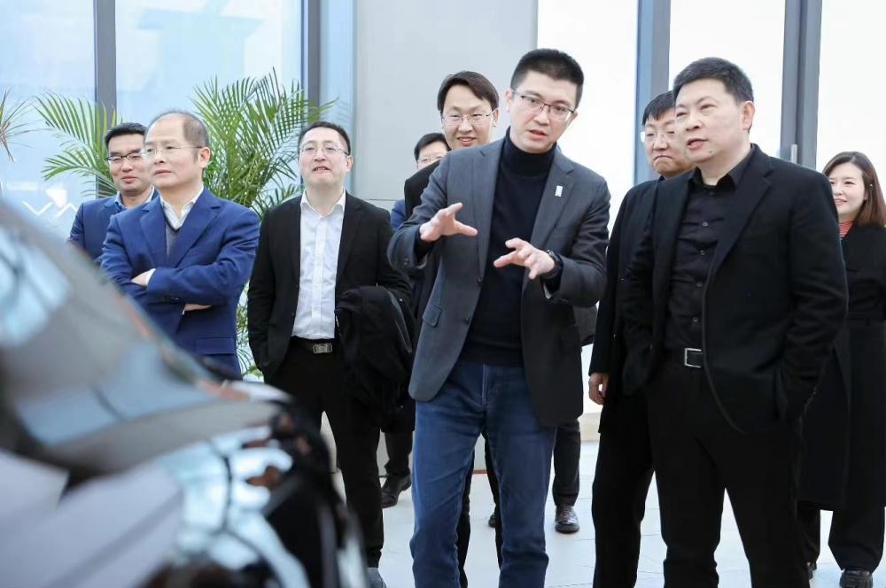

# 余承东回应一财：车BU人事调整，不影响汽车战略方向

2月9日，对于近期“华为车BU王军停职”的消息，华为常务董事、消费者BG CEO、智能汽车解决方案BU
CEO余承东对第一财经独家回应:“（此次）是正常的人事调整变动，（华为在车业务）方向上没有变化。”

有声音认为人事调动背后和王军负责的业务进展不顺有关，对于华为汽车战略调整的诸多猜测，余承东称之为“网上瞎炒作”。

王军此前为华为智能汽车解决方案BU
COO，智能驾驶解决方案产品线总裁，也是华为“HI模式”对外主要负责人。多位华为内部人士向记者表示，王军目前人事关系仍在车BU下面，职位部分显示空白。

当天，华为“HI模式”合作方之一的阿维塔内部人士对记者表示，经过巨量资源投入，HI已经成为华为最重要的技术资产。该人士认为，（人事变动后），华为不会改变该业务运作模式，但未来打法或将有所改变。

**“人事调整”背后**

2月6日，一张余承东与阿维塔科技董事长兼CEO谭本宏一同参观阿维塔新车的照片在网上流出。照片中，余承东身着一身黑色西装站在谭本宏的左边，站在谭本宏右边则为华为轮值董事长徐直军，而过往与阿维塔对接较多的王军缺席了这次活动。

在外界看来，这张照片从另一层面佐证了王军职务变化的猜想。在照片流出前的几天，“王军被停职，余承东将独掌智能车业务”的消息已在汽车圈发酵。

据记者了解，王军最近一次公开露面是在1月中旬。当时，阿维塔在上海举办限量版车型011的用户见面会，王军以合作伙伴身份出现在现场。

“1月底的时候听到过消息，但是内部也没有得到任何正式通知。”阿维塔内部人士对记者表示，在过去的业务对接中，王军一直是华为方面与阿维塔高层之间的直接对话人，并且是阿维塔的首批车主之一，双方团队的联系很紧密。

“看到人事调动的传闻后，也感到比较突然。”上述内部人士说。

_图片来源：华为智能汽车解决方案官微_

近年来，华为曾对汽车板块进行过多次调整，但此次王军职位变动之所以引起外界高度关注，与其负责的板块密切相关。

2019年4月，王军被华为轮值董事长徐直军点将，从华为运营商业务部日本公司调回中国，负责华为在汽车零部件上的业务推进。在华为看来，汽车将是未来十年最具颠覆性的行业之一，从汽车的整体趋势来看，软件正在吞噬并占领整个行业，电子化、软件化、信息化正在代替以前机械动力部分成为价值中枢，这是华为的优势。

同年5月27日，华为内部正式刊发组织变动文件，批准成立智能汽车解决方案BU，隶属于ICT管理委员会管理。该文件指出：华为不造车，聚焦ICT技术，成为面向汽车的增量ICT部件供应商，帮助企业造好车。

这是华为首次对外明确汽车业务的定位，而王军则被任命车BU总裁。

彼时的余承东则主要为华为“卖车”奔走。华为内部人士曾对记者表示，芯片的问题不解决，华为手机业务的萎缩无法避免，对于华为来说，渠道的价值并不能任其流失。“更为重要的是，智选模式下，华为对汽车业务的参与程度更深，从前端产品定义，研发到销售全程支持，这样造出来的车更能还原华为在造车上的理念，技术的落地也更加迅速。”

由此，华为汽车业务的三大合作模式形成，一种为Tier1，即传统零部件供应商模式，为车企供应智能化零部件、另一种为HI模式（Huawei
Inside模式），华为主要与北汽极狐、长安阿维塔以及广汽合作，这两种模式由王军所在的车BU主导。第三种为智选模式，由华为消费者BG团队主导，余承东亲自督战。

“华为内部也有分歧，是直接造华为品牌的车，还是为广大车企提供部件和解决方案，这样的战略决策并不好做，直到这两年才真正厘清该业务的发展路径。”华为轮值董事长徐直军曾在华为分析师大会上对记者表示，中国每年3000万台车，未来会更多，即便只做中国市场，每年能从每台车上平均获得1万元的收入也足够了。

但从华为过去两年对汽车业务的几次调整可以看出，车BU业务的盈利压力逐渐显现。2021年5月，华为内部发文表示，余承东新增智能汽车解决方案BU
CEO，王军为智能汽车解决方案BU总裁。到了9月，王军的职位再次调整，从车BU总裁岗位转任车BU COO，兼任智能驾驶解决方案产品线总裁。

2022年，余承东在中国汽车蓝皮书论坛上公开表示，华为汽车业务是华为唯一亏损业务，当年仅在研发上的投入就达到15亿美元。而在去年12月的一次内部计划制定中，余承东提出，华为车BU要在2025年实现盈利。

华为内部人士对记者表示，原本BU的设定意味着短期内华为对某一潜力较大的业务不做独立盈利要求，但目前车BU成立已经三年，迫切需要解决的问题在于怎么赚钱。该人士认为，外界对于人事调整的解读过于夸张，在华为内部，频繁的人事调整并不少见。

“一边打仗一边调整，这是目前包括汽车业务团队在内的华为人的常态。”上述人士说。

**华为车业务未来走向**

伴随着王军职位的变化，外界担心华为智选模式将会逐步成为华为车BU的重心，而华为HI模式也面临着边缘化的风险。

面对“华为未来在车业务上的方向以及对合作伙伴的战略，是否会随着此次人事调整而变化？”这一问题时，余承东对记者表示，没有发生变化。

但对于汽车业务内融合问题以及智能驾驶解决方案产品线总裁职位人选等问题，截至发稿前，华为车BU方面并未做出回应。

作为华为HI模式的合作方，阿维塔内部人士对记者表示，在华为现有的三种业务模式中，HI模式是最具技术优势和独特性的一种，各方风险共担，利益共享。经过巨量资源的投入，HI已经成为华为最重要的技术资产，目前外界对HI模式的判断为时过早。

“虽然此前因为技术上的磨合，一些车型的交付期受到了一些影响，但未来随着HI车型的陆续上市发布，这种合作模式已经形成了商业闭环。从我们的数据来看，截至今年2月5日阿维塔11累计交付超过2000辆。”上述内部人士对记者表示，目前阿维塔已经进入规模化交付和上量阶段，在经历与问界的合作后，相信华为对汽车和消费者都有更深刻的洞悉，这些经验或将有推进与其他车企下一步的快速发展。

在阿维塔看来，企业在不同发展阶段，需要不同的资源和打法，未来HI模式的打法或许也会有所变化。

以渠道为例，在以往的合作推进中，由于车BU与智选业务相对独立，HI模式下的车型想要进入华为终端渠道并不容易，在推进的过程中，渠道的打通仍需要多层级的认证和不同团队的对接，但在未来，这些障碍或许能够被清除。

阿维塔科技CEO谭本宏曾对外透露，目前也在与华为洽谈渠道合作方式。“在我们渠道数量规模还没有完全达到的时候，华为来帮助我们一把，但不是替代。”

但对于华为而言，随着各支线汽车业务合作方的增多，资源的有效调配与效益最大化成为当下所面临最现实的问题。

2022年8月，华为创始人任正非在《整个公司的经营方针要从追求规模转向追求利润和现金流》讲话中提到，全球经济会持续衰退，消费能力下降，华为应改变思路和经营方针，从追求规模转向追求利润和现金流，以保证度过未来三年的危机。华为一定要把“活下来”作为最主要的纲领，2023年预算要保持合理节奏，盲目扩张，盲目投资的业务要收缩或关闭。

对于汽车业务，任正非提到，“智能汽车解决方案，要加强商业闭环，研发要走模块化的道路，‍‍聚焦在几个关键部件作出竞争力，剩余部分可以与别人连接。”

投资回报周期太长是目前车BU遇到的挑战之一。“HI模式可能走得很难，但兴许才是长久之道。但目前华为的人力模型不支持这种低毛利的商业.”华为一前高管对记者提出了他的担忧。

在去年年底的一场行业论坛上，华为智能汽车解决方案BU
Marketing与销售服务部总裁迟林春也表示，汽车行业整个投资回报周期非常长，这个特点也给华为车BU带来了一定的经营压力。“当前，我们的任务是要有质量地活下去。对于智能汽车解决方案，我们要继续保持战略投入，同时我们也在思考，在当下如何缓解我们的经营压力，把握好当下和未来的平衡。”

迟林春称，最近三年，在汽车零部件研发上，华为累计投入了30亿美元左右，招募了7000多名研发人员。“当前智能驾驶还处在相对的低谷期，距离大规模发展还有较长的路要走。这就意味着未来五年，华为在人工智能上，尤其是软件算法上，还要持续高投入。”迟林春称，主机厂对成本要求非常高，每年要求供应商有3%~5%的降价，但若一家零部件供应商没有达到一定规模，降价几乎不可能。

相较之下，智选模式为华为带来的回报更为可观。

根据网上流传的合作方案，华为与智选厂家的分成大概是1:9，即一辆售价25万价位的汽车，华为能拿到约2.6万元。其中技术授权费用占比20%，剩余则是华为的销售费用。此外，智选车模式下，三电系统、智能座舱等也或由华为提供，按此估算，华为获利还会更高。但这一分成模式并未得到华为与赛力斯的确认。

但从合作方向来看，更多的车企开始倾向于与华为在智选业务上展开合作。除了阿维塔外，包括江淮汽车、奇瑞等多个品牌也在寻求与华为在渠道资源上进行合作。

“外界经常传我们要造车，但是从华为目前的商业模式来看，就知道这是不可能的事情。”华为上述内部人士对记者表示，从投入成本和收益来看，这一模式并不适用于现在的华为发展。至于为什么“不造车”文件决议有效期只有三年，其实很多华为内部的决议文件有效期均为三年，这不是什么特殊时间点。

