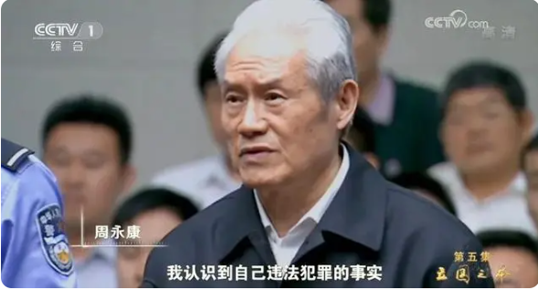
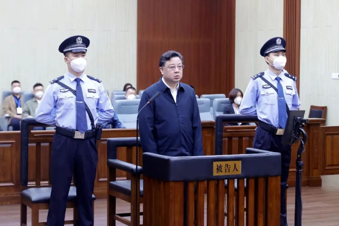

# 再提周永康、孙力军！中央政法委钟政声重磅发文，透露反腐重点新方向

**撰文 | 高语阳**

2月10日，中央政法委长安剑发表署名钟政声文章《深入推进自我革命战略思想在政法战线的具体实践》。

文章围绕中央政法委机关党风廉政建设工作，总结成效、讲明难点，并介绍了下一步机关从严治党的新要求、新举措。

文章再次强调，要彻底肃清周永康、孙力军等流毒影响，进一步净化机关政治生态。

**肃清周永康、孙力军流毒影响**

文章两次提到肃清流毒影响。

在总结十九大以来机关党风廉政建设成效部分，文章提到， **把肃清孙力军政治团伙流毒影响作为严肃政治任务，彻底清除政治隐患。**

在介绍下一步工作的“七项举措”部分，第一项举措就提到， **要严明政治纪律和政治规矩，彻底肃清周永康、孙力军等流毒影响，进一步净化机关政治生态。**

而且， **要及时研判队伍思想动态，重点解决思想上“跑偏”、行为上“出列”等问题。**

2014年12月，周永康被开除党籍并移送司法。2015年1月中央政法工作会议首次提出要彻底肃清周永康案造成的影响。

2015年6月，周永康受贿、滥用职权、故意泄露国家秘密案一审宣判，周永康被判无期徒刑。

时隔5年多，政法系统再一“毒瘤”出现。2020年4月，时任公安部党委委员、副部长孙力军落马。

孙力军被通报政治野心极度膨胀，政治品质极为恶劣权力观、政绩观极度扭曲；为实现个人政治目的，不择手段，操弄权术，在党内大搞团团伙伙、拉帮结派、培植个人势力，形成利益集团，成伙作势控制要害部门，严重破坏党的团结统一，严重危害政治安全。

2022年9月，孙力军受贿、操纵证券市场、非法持有枪支案一审宣判，孙力军敛财6.46亿元，被判死缓，且终身监禁、不得减刑假释。

**避免“软权力”风险**

政知君注意到，钟政声文章中还披露了下一步机关反腐工作的重点新方向。

**首先是避免“软权力”风险。**

全文多次提到“软权力”。文章指出，机关全面从严治党还存在5个难点，其中一点是“软权力”风险还需严密防范。

文中写道， **在一些人眼里，中央政法委是一块“金字招牌”，虽不具体办案、不批项目，但绝不是“清水衙门”。**

**必须严防“软权力”风险，强化关口前移，消除监督盲区、清扫监督死角，防微杜渐、防患未然。**

关于软权力，《人民论坛》曾发文指出，在公权力中，有一种普遍存在的、与硬权力相对的权力形态，叫“软权力”。“软权力”虽带着“软”字，但却不容忽视。它对公私权力结构、行使、监督等产生直接影响，如若滥用，其危害一点儿也不比“硬权力”小。

《人民论坛》发文还提到，“软权力有其自身特点，尤其是以公权力机关官员和国家公职人员透露信息、暗示意图、提出请求等为载体的软权力，监督起来难度极大，除要求监督主体高度重视和责任担当之外，还应当有不同于监督硬权力的特殊方法和制度。”

针对中央政法委机关“软权力”，钟政声文章中提到了2点具体工作：

第一，要用好内部巡查制度， **紧盯利用督查考核评优等“软权力”和机关“金字招牌”影响力谋利等风险** 、人财物管理环节和“八小时之外”，不断完善内控机制。

第二，市域社会治理现代化试点审批和验收不限名额、“宽进严出”、不用“跑部”，避免争试点的“软权力”风险。

接下来，中央政法委机关将持刀刃向内、刮骨疗毒，让“越往后越严”成为常态。坚决惩治不收敛不收手、胆大妄为者，
**重点查处违规干预重大事项、利用机关影响力谋利等问题。**

**加强秘书监督管理**

文章还提到了一个特殊岗位：秘书。

文中指出，机关全员全过程全方位监督新格局正在形成，要坚持从严管好关键人、关键时、关键事。

其中，要突出3个重点领域。 **包括制定秘书监督管理规定，促进秘书自律，严防特权思想和特权行为。**

**强化日常监管，制定谈心谈话、加强秘书管理监督、规范抽调帮助工作人员管理，** 以及请销假、因公因私出国（境）等实施办法，织密监督网络。

政知君注意到，在中央政法委机关层面强调秘书监督管理问题此前并不多见。

另外两个重点领域分别是：推动政法系统实行强制填报、信息直报，做到干预必留痕、违规必追责；创新事业单位财务人员集中管理，优化人员配置，防范廉政风险。

不过，在“严管”的同时，也要做好“厚爱”的工作。

文章写道， **对受到处理的干部，注重做好回访教育，对影响期满、表现好并符合条件的干部，按有关规定正常使用。**

**资料 | 中央政法委长安剑 中国长安网 央视新闻 人民网**

**【版权声明】本文著作权归政知新媒体独家所有，未经授权，不得转载。**

