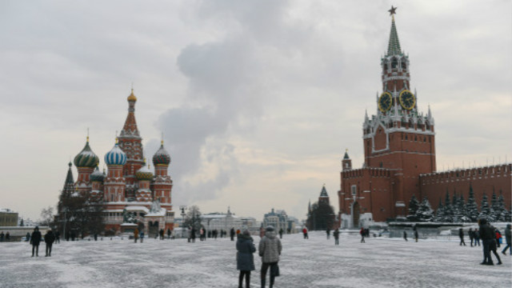

# 地接社成“真空”，俄罗斯旅游恢复较慢，“中国游客觉得不安全”

红场、克里姆林宫、伏尔加河、贝加尔湖、冬宫……在经历了疫情之后，这些昔日颇受中国游客青睐的俄罗斯旅游景点还好吗？

根据中国文化和旅游部相关通知，2月6日起，试点恢复全国旅行社及在线旅游企业经营中国公民赴有关国家出境团队旅游和“机票+酒店”业务。首批公布的试点国家名单中就包括俄罗斯。

不少接受第一采访的俄罗斯旅游条线资深人士认为，虽然俄罗斯位列首批试点出境游的20国名单中，但由于疫情对游客旅游习惯的改变，以及于去年2月底爆发的俄乌冲突等因素，中国游客赴俄罗斯旅游的恢复速度可能会较其他地方慢些。

“俄方非常期待中国游客的到来。”以从事对俄文化交流为主的上海新时代文化交流中心理事长鲁向东告诉第一财经记者，“疫情前，从2014年开始，俄大力发展旅游业，翻新了境内的景点、基建等，旨在吸引更多旅游者。可以说除了能源，其实旅游是俄国民经济增长的主要动力之一。疫情后，中国游客消失了，大部分旅游收入没有了，很多行业相关者失业。因此，他们非常期待中国旅游业的复苏。当地合作伙伴多次询问我们中国出境游何时开放、中国游客何时到来。”

俄外交部此前表示，期待自俄罗斯前往中国的游客量逐渐恢复，并强调，迄今为止，俄方在接待中国游客方面不存在障碍。

**地接社已成“真空”？**

以俄联邦安全局边防局公布的疫情前2019年数据为例，2019年中国公民赴俄罗斯旅行总数为225.7万人次，其中149.3万人次是旅游。

鲁向东告诉第一财经记者，俄乌冲突对俄旅游业的影响是很重要的因素。“冲突使得很多人觉得俄罗斯不安全，冲突也使得国际对俄制裁不断加码，比如在航空方面，对俄罗斯飞机零配件的断供、对俄罗斯航班飞行的限制等。”鲁向东介绍道，疫情前，俄罗斯航空公司(Aeroflot)是中俄旅游航线中的重要力量，但现在制裁对于飞机后续维护不利，导致俄航的航班减少，票价就会走高，直接推高了旅游成本。

主攻俄罗斯旅游条线的上海易达国际旅行社有限公司定制旅游部副经理谭延乐表示，在这样的国际环境大背景下，俄罗斯官方也在考虑给予中国各大航空公司更多的优惠政策，包括增加更多的航点、航线等，以在弥补俄方空缺的基础上，加大两国之间的航班密度。

1月底，俄航公布了最新赴华航班的情况。其中，将从2月15日起开通飞往北京大兴机场的航班，莫斯科-北京航线增至每周3班。莫斯科-
广州、上海的航线也在恢复中。俄航总经理谢尔盖·亚历山德罗夫斯基表示，公司计划将赴华航线增至每周7班。

除了航线影响，鲁向东还表示，国际制裁使得一些国际订房网站不提供俄订房服务，比如Booking（缤客），某种程度上影响了俄自由行的客源。“国内旅行社都觉得俄罗斯旅游市场一定要去，但目前都在观望。”他说，“目前如果不是探亲、商务等刚需的话，赴俄旅游会恢复比较慢。”

谭延乐还注意到，目前，俄罗斯旅游业还出了针对导游的新规，即没有俄导游证不能上岗，因此直接导致中文导游数量与三年前相比锐减。除了会中文导游数量的减少外，一些此前接待中国旅游团的俄罗斯的地接社也在洗牌。“以前这些地接社都是中国人经营或与俄方伙伴合作，疫情导致经营这些地接社的华人或转行或回国。”他说。

谭延乐说，目前在莫斯科、圣彼得堡接待中国游客的（华人）地接社其实已成“真空”。“俄方经营的地接社报价很高，因此不难理解有俄媒报道当前俄团队游的费用会比之前高出一倍多。”他称。

**远东地区较快恢复？**

尽管俄罗斯旅游市场的复苏会较其他国家慢些，但在上述旅游业人士看来，俄罗斯地大物博，旅游资源丰富，因此“今年一定会去再考察下，挖掘一些与不同于疫情前的俄旅游线路，为俄旅游业的全部复苏做好准备”。

“很多喜欢俄文化的人士都要求开发深度游、定制游。”此前，鲁向东也曾带团前往普希金、托尔斯泰等俄罗斯名人的故居考察。“大家对于这些文学家、音乐家等的故居其实非常感兴趣，都希望去看看他们当时的生活环境。”为此，鲁向东和他的团队近来一直在筹备新西伯利亚大铁路的长线旅游。

他说：“与传统的北京直达莫斯科的国际列车相比，新西伯利亚大铁路的长线旅游会时间更长，在走过大半个俄罗斯之际，使游客对俄风土人情有直观的了解。”

谭延乐也表示，如今不以组多少团或者发多少人为目标，而是以自己的组织架构和对市场风向的把控来调整，因此会花更多精力在俄罗斯市场的定制游、小众游路线上。

据俄媒报道，在中国调整和优化防疫措施后，已经有首批游客来到摩尔曼斯克州。俄罗斯北极旅游委员会说：“现在，我们已经看到包括中国在内的亚洲游客需求逐渐增长。首批中国游客已经开始在摩尔曼斯克州旅行，他们是自由行游客。”

据鲁向东了解，疫情前去摩尔曼斯克看极光，颇受中国年轻游客的喜爱。此外，以堪察加半岛为代表的远东游，是近年来比较受欢迎的俄罗斯新旅游地标。“目前勘察加半岛正值冬季，虽然旅游成本比较高，但由于是原生态，再加上当地旅行社的推广，因此在中国市场上比较受欢迎。”他说，此外，贝加尔湖所在的伊尔库茨克、寒极所在的雅库斯克等地区，都是俄罗斯远东游的亮点。

目前，在远东地区生活、工作的中国人相对较多，中企也很多，因此人民币结算交易非常方便，支付宝、银联也很普及。

谭延乐告诉第一财经记者，现阶段俄罗斯远东地区的旅游业态主要以“边境游”的形式存在，消费者主体基本上都是东三省位于边境地区的居民，以及主要目的是来东北旅游的外地游客。而相对于来自其他地区的旅游消费市场，“远东游”一直不温不火，很大一部分原因受制于缺少直飞航班。他说：“如果去欧洲部分旅游，直飞莫斯科没问题；如果亚洲部分旅游，对于中国游客来说，从莫斯科绕道就舍近求远了。其实，远东地区的这些地方政府非常希望与中国直接合作，但是缺少航线是个大问题。”

目前，俄航表示，今年还将增加从克拉斯诺亚尔斯克、伊尔库茨克、符拉迪沃斯托克和哈巴罗夫斯克飞往中国的航班。俄外交部此前表示，增加中俄之间的航班数量和开放边境客运通道，有助于促进两国间的联系，“我们相信，通过共同努力，我们能够确保双边大规模人文交流按计划恢复，这对进一步巩固俄中全面战略协作伙伴关系具有重要意义”。

俄方数据显示，2019年中国到俄罗斯的游客流量增长18%，大部分入境仍通过免签证渠道进行，占访问总数的80.2%。当年团体游的数量与2018年相比增加了18.8%，自由行数量增加了52.3%。

