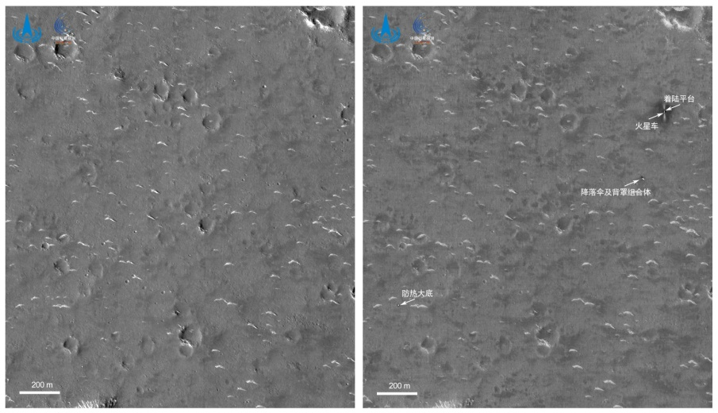
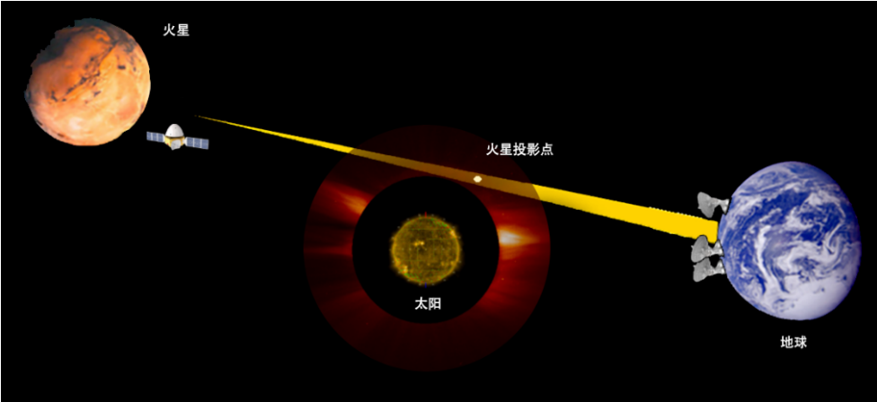
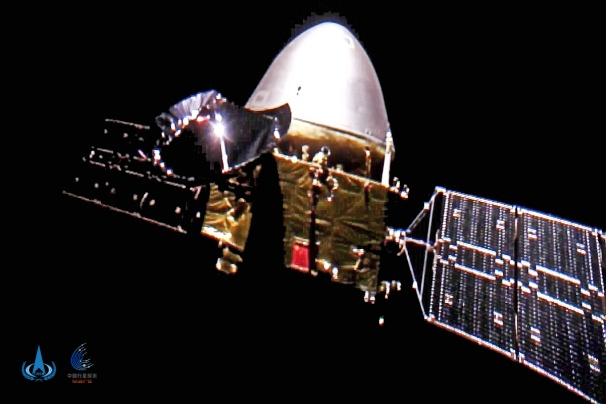
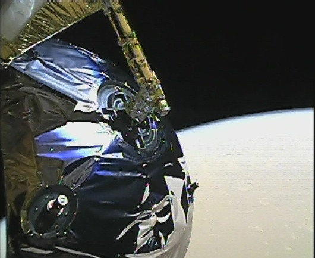
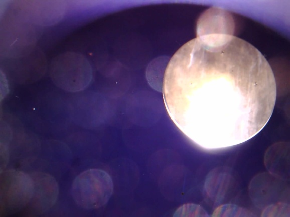
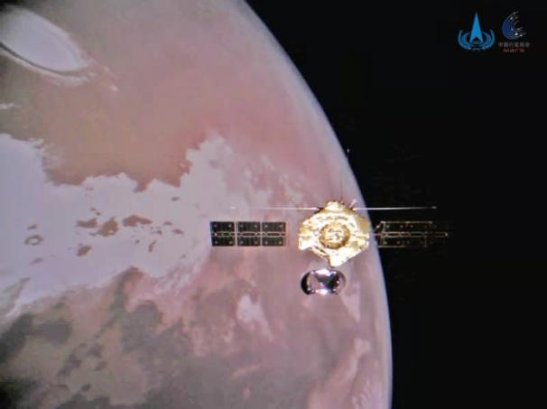

# 天问一号“环火”两周年 将持续开展火星探测

【环球时报-环球网报道 记者
樊巍】2023年2月10日，远在火星执行全球遥感科学探测任务的“天问一号”火星环绕器，已经在火星“上岗”满两年。两年来，环绕器“履职尽责”，获取一手探测数据，取得丰硕科研成果。目前，火星已迎来了春分，火星环绕器在“环绕火星”的岗位上履职，持续开展对火星多维度探测任务。

2021年2月10日19时52分，“天问一号”环绕器按照预设程序开始实施火星制动捕获，3000N主发动机点火15分钟，20时07分左右探测器成功进入环绕火星轨道，成为中国第一颗人造火星卫星，实现“绕、着、巡”第一步“绕”的目标，国家航天局宣布环绕火星成功。火星环绕器由中国航天科技集团有限公司八院抓总研制，攻克并掌握了以导航制导与控制（GNC）、测控、自主管理、环境适应为代表的行星环绕探测能力。

**抓准唯一机会，精确制动捕获**

火星捕获是火星探测任务中技术风险最高、最为关键的环节之一。在火星探测器从地球飞向火星的过程中，能够被火星引力所捕获形成环绕轨道的机会只有一次。实施火星捕获时，“天问一号”火星探测器距离火星表面最近仅400km，稍有偏差就会撞击火星或飞离。由于制动捕获时探测器距离地球1.92亿公里，单向通信时延达到了10.7分钟，地面无法对整个过程进行实时监控，只能依靠环绕器自主执行捕获策略。因此，捕获的成败就成为了火星探测任务成败的关键。

为了确保本次制动捕获成功，八院火星环绕器研制团队设计了器务自主管理器双大脑、姿轨控计算机三核心、测控通信多通道切换策略、发动机双关机策略、3000N和120N发动机两重保险等多项技术，极大地提升了系统的可靠性，确保探测器处于“捕获走廊”直至进入环火轨道，成功制动捕获。

**“太空多面手”，圆满完成探测任务**

火星环绕器分饰了飞行器、通信器和探测器三大角色，是名副其实的“太空多面手”。

自2020年7月23日发射开始，火星环绕器扮演了飞行器的角色，背负着陆巡视器，经过深空机动、四次轨道修正，走过约4.5亿公里的路径，一路上202天的过关斩将，顺利抵达火星。

2021年2月10日，火星环绕器到达火星，正式履职“环绕火星”岗位。按照天问一号任务要求，火星环绕器在火星主要扮演通信器、探测器两大角色。

2021年5月15日，火星环绕器将着陆巡视器准确送入落火轨道、着陆巡视器成功着陆火星，实现了我国首次地外行星着陆。2021年5月22日，在火星环绕器的中继支持下，“祝融号”火星车成功驶离着陆平台，中国人的足迹首次踏足那颗红色星球；中国成为世界上第二个实现火星巡视的国家。火星车踏足火星后，火星环绕器为“祝融号”提供了近半年的中继通信后，圆满完成通信器的角色任务。

2021年11月火星环绕器实施轨道控制，进入遥感使命轨道，正式转入探测器的角色。通过携带的7台有效载荷，环绕器对火星开展了全球遥感科学探测。2022年6月29日，国家航天局宣布：火星环绕器获取了覆盖火星全球的中分辨率影像数据，各科学载荷均实现了火星全球探测，完成既定科学探测任务。2022年12月29日，火星环绕器成功环火687天，完成了一个火星年的环火飞行与探测，环绕器圆满完成探测器的角色任务。

**全面“履职”，创多项国内外首次**

“天问一号”国际首次通过一次任务实现“绕、着、巡”三大任务目标。火星环绕器圆满完成各项工作，获取了大量我国一手的科学数据和工程数据，为我国行星探测工程积累了宝贵的经验。

火星环绕器配置了高分辨率相机、中分辨率相机、次表层探测雷达等7台科学有效载荷，用于实施科学探测。在实施火星捕获前，火星环绕器使用高分辨率相机拍摄了我国首幅火星影像。在着陆火星前，火星环绕器在为期约3个月的停泊飞行中，使用高分辨率相机、中分辨率相机、矿物光谱分析仪，获取了包含预选着陆区优于1m分辨率全色影像图、宽域彩色中分辨率影像图、多光谱信息。着陆火星后，火星环绕器对真实落区、火星车巡视区域进行了成像探测，获取高分辨率影像。

进入遥感使命轨道后，火星环绕器完成了火星全球遥感探测任务，获取了覆盖火星全球的中分辨率影像数据。利用这些影像数据，
**我国的科研人员目前正在绘制国际先进的高分辨率火星彩色全球影像图** 。在环火扩展任务期间，火星环绕器实施了火卫一成像探测，获取了中国首幅“火卫一”图像。

除科学载荷获取的探测数据外，基于火星环绕器平台的工程数据同样取得了丰硕的成果。

2021年9月下旬至10月中旬，太阳位于火星与地球之间，火星环绕器经历了“日凌”期考验，环绕器与地球之间的无线电通信受到太阳的干扰而失去联系。利用这次机会，在国家航天局支持下，中外科学家联合，利用火星日凌期间的通信信号工程数据，获得了太阳临日空间日冕等离子体抛射速度、冕流波等细节结构、初生高速太阳风流等研究成果。

为了实现火星探测器在太空中状态的安全监测，火星环绕器配置了工程测量分系统，包含固连遥测探头、近距离遥测探头等。利用这些工程监测探头，火星环绕器完成了奔火过程中探测器全貌、火星捕获过程、着陆火星阶段着陆巡视器分离、环火飞行环绕器全貌等关键过程及状态可视化监测。

探测器深空自拍

火星捕获

着陆巡视器分离

环绕器火星履职自拍

宇宙浩淼无限，中国人追天的脚步从未停歇。在圆满完成“天问一号”首次火星探测任务后，中国行星探测工程后续任务也在紧锣密鼓地开展。《2021中国的航天》白皮书指出，未来中国将实施小行星探测、火星采样返回、木星系探测等任务。中国航天人将继续探索，助力我国行星探测事业发展、为航天强国建设。

