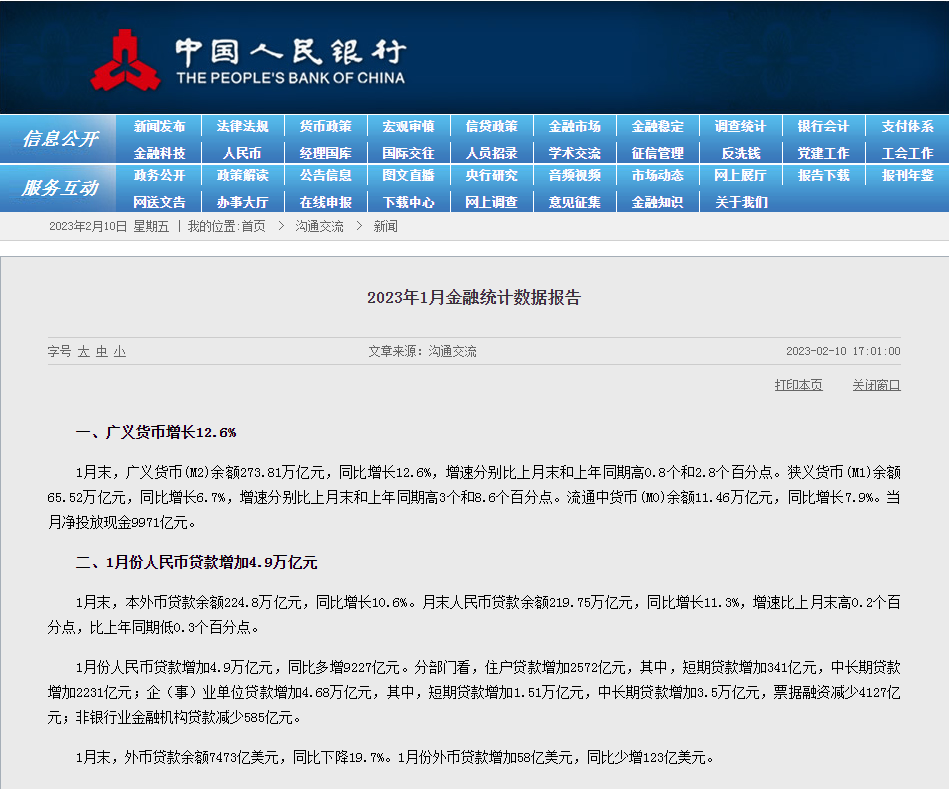

# 央行重磅发布！1月住户存款增6.2万亿，M2增速创6年新高

2月9日，人民银行发布的2023年1月金融统计和社会融资数据显示，1月信贷增长如期实现“开门红”，总量与结构双双好转，社融增量规模显著回升。具体来看，当月我国人民币贷款增加4.9万亿元，同比多增9227亿元；社会融资规模增量达到5.98万亿元，比上年同期少1959亿元。

1月末，广义货币(M2)余额273.81万亿元，同比增长12.6%，增速分别比上月末和上年同期高0.8个和2.8个百分点。记者注意到，当月M2同比增速超过去年11月数据，创下自2016年4月以来的最高值。

专家指出，1月信贷社融全面走强，充分反映出前期政策落地见效与企业预期的好转。可以相信，随着疫情等扰动因素消退叠加政策持续加力，一季度宽信用还将持续发力。不过，全年信贷的不确定性或在居民侧，居民在消费端及地产端的扩表或将成为全年经济的“压舱石”及社融增速的引擎。

1月信贷增长如期“开门红”

按照过往经验，春节假期会对当月信贷投放造成扰动。虽然今年春节假期靠前，但在年初主要银行信贷工作座谈会强调“适度靠前发力”，1月企业预期整体改善，银行去年四季度项目储备充足等多个考虑因素下，市场普遍对首月人民币贷款大增抱有乐观预期。

从信贷结构看，企业部门的信贷需求强于居民部门。数据显示，1月份，住户贷款增加2572亿元，其中，短期贷款增加341亿元，中长期贷款增加2231亿元；企（事）业单位贷款增加4.68万亿元，其中，短期贷款增加1.51万亿元，中长期贷款增加3.5万亿元，票据融资减少4127亿元；非银行业金融机构贷款减少585亿元。

企业中长期贷款继续为1月信贷数据“挑大梁”。天风证券首席宏观分析师宋雪涛表示，1月企业中长期贷款需求继续改善，或受政策支持和基建发力等因素影响。基建方面，今年专项债发行节奏继续前置，超过去年同期。基建的配套融资需求继续对年初企业中长期贷款形成支撑。制造业方面，政策继续发力叠加今年企业预期快速修复，企业内生融资需求开始回升。

今年春节假期期间，商品消费、服务消费回暖明显，购房、购车等消费偏弱。此前多家机构预测居民短期贷款得到改善，本次数据中居民中长期贷款的改善超出预期。

国金证券固收首席分析师樊信江认为，当前地产销售整体仍处于底部修复阶段，预计在一季度各省市促进住房消费、降低首套房利率、一城一策放松认购等系列政策落地后，地产销售有望缓慢回暖，拉动居民中长期信贷规模回升，但修复幅度仍需持续观察。

财政发力前置支撑社融增量

1月份，社融增量规模显著提升，但未及去年1月的6.17万亿元单月历史最高规模，从社融增量结构看，企业债券融资仍是当月主要拖累项。

数据显示，1月对实体经济发放的人民币贷款增加4.93万亿元，同比多增7308亿元；对实体经济发放的外币贷款折合人民币减少131亿元，同比多减1162亿元；企业债券净融资1486亿元，同比少4352亿元；政府债券净融资4140亿元，同比少1886亿元。

年初财政靠前发力明显，地方政府债券发行节奏前置，1月政府债融资保持平稳。据中泰证券研究所统计，1月地方债共计发行6435亿元。截至2月3日，各地披露的2-3月地方债计划发行规模共计11565亿元。

对于企业债券融资，中信证券宏观经济首席分析师程强表示，1月理财市场的赎回压力有所缓解,但是尚未出现大规模回流,信用债利率依旧处于相对较高位置,因此企业发行债券的意愿较低。此外，当月外币贷款的减少，主要在于发达经济体加息导致外币利率偏高,对社融增速产生一定的拖累。

M2增速创6年来新高

1月末，广义货币(M2)余额273.81万亿元，同比增长12.6%，增速分别比上月末和上年同期高0.8个和2.8个百分点。记者注意到，当月M2同比增速超过去年11月数据，创下自2016年4月以来的最高值。

1月末，狭义货币(M1)同比增长6.7%，增速分别比上月末和上年同期高3个和8.6个百分点，反映企业经营和投资活动进一步修复。值得注意的是，当月M1与M2的剪刀差较2022年12月份显著缩小。

此前，居民储蓄存款的大幅上升使得去年四季度M2同比增速持续高增，也导致了M1与M2增速的背离。随着疫情扰动减小，居民存款能否向企业存款回流备受业界关注。

数据显示，1月份人民币存款增加6.87万亿元，同比多增3.05万亿元。其中，住户存款增加6.2万亿元，非金融企业存款减少7155亿元，财政性存款增加6828亿元，非银行业金融机构存款增加1.01万亿元。

中金公司研报认为，由于存款增量的高低主要取决于融资需求是否强烈，从而是否有足够多的其他优质资产能够吸收存款。房地产相关融资需求占社融的比例较大，因此，如果地产的融资需求不强，“资产荒”的局面可能难以明显改善。今年可能依然缺乏足够多的优质资产来吸纳和分流存款资金。预计今年的存款增量依然不低。

樊信江认为，全年信贷的不确定性或在居民侧，居民在消费端及地产端的扩表或将成为全年经济的“压舱石”及社融增速的引擎。

责编：万健祎

