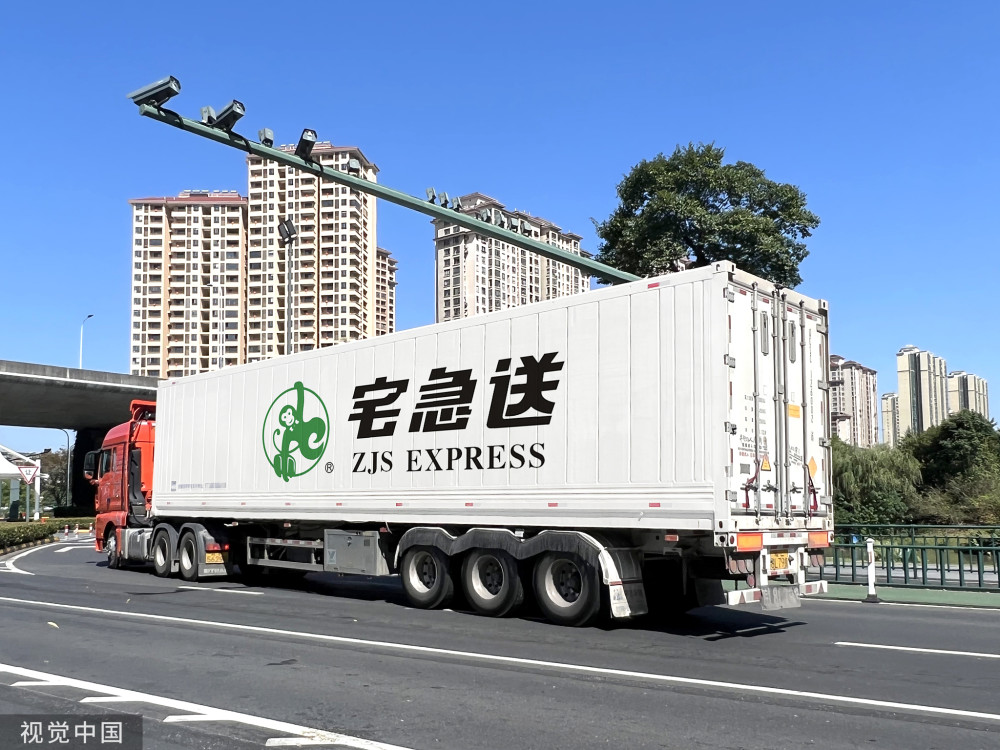

# 昔日快递巨头宅急送关停百家网点，从风光无限到大撤退

出品｜新品略财观（原NBS新品略）

作者｜吴文武

又一家老牌快递巨头正在加速衰落。

近期，据多家媒体报道，昔日快递巨头宅急送关停百家网点，加盟商巨亏，拖欠账款等，陷入衰退泥潭。

宅急送是快递行业的先行者，其创始人陈平更是被誉为“中国民营快递之父”的称号，还曾扬言要收购顺丰。

现如今的宅急送正加速衰落，何以至此？未来何去何从？

01 宅急送百家网点关停，上演大撤退

2023年春节前，广西媒体《南国早报》报道称，广西多地宅急送加盟商反映，他们被宅急送拖欠了一两年的押金和派费，一直没能追回。

《南国早报》记者进行了实地走访调查，了解到宅急送已经于2022年撤完广西所有的直营网点和加盟网点，目前正在整合两广业务。

如同热锅上的蚂蚁一般，最为焦急的是广西的数十名宅急送的加盟商何时能拿回剩余欠款，还是个未知数。

宅急送广西网点已撤完的消息很快引发关注，也撕开了宅急送大撤退的“口子”。

更有消息称，山东、河北、广东、江苏、黑龙江、上海等多省市均出现了宅急送停运且拖欠账款的情况，涉及金额基本都达到数万元。

另据时代财经报道，今年1月，宅急送在江苏苏北地区的一名加盟商已经和宅急送对簿公堂，开始维权。

这名加盟商表示，最近几年以来，从公司制度、运输体系、业务规模等多方面都能感受到宅急送正在走下坡路，然而在2021年5月，整个苏北地区宅急送骤然停止运营，此前并没有通知。

业务量下降，直营关停……更是有宅急送加盟商七年亏损超百万离场，宅急送正上演大撤退，加盟商很受伤。

02 昔日风光无限的宅急送

如今人们很少听到或者用宅急送，如果将时间线拉回到15年前，宅急送是快递巨头。

在中国商业史上，兄弟创业的故事不少，创立宅急送的陈平和陈东升兄弟就是其中之一，陈东升也是泰康保险的创始人。

陈平早年在日本留学，曾在日本一家叫“宅急便”的企业工作过三年，1994年，回国准备创业，当时的陈平发现国内快递配送业务还是空白期，决定将“宅急便”的业务模式复制到中国市场。

陈平和二哥陈东升各出25万元，在北京创立了北京双臣快递有限公司（宅急送前身），当时国内物流行业还处于发展初期，国人对快递并没有太过特别的概念。

创立之初的宅急送什么都送，送鲜花、送烤鸭、搬家，甚至还有过代人送小孩服务，宅急送是中国快递服务行业的先行者。

随着中国经济发展，物流市场也跟着发展，宅急送瞄准了企业物流服务，主要服务于电信、医药、服装、汽车等行业，宅急送迅速发展壮大。

1995年，宅急送和日本一城公司合资成立“北京双臣一城快运有限公司”，有了日资企业注资，宅急送很快开展仓储、分拣、派送等服务。

发展到1998年，宅急送走出京城，进军全国市场，用了一年时间，全国网点从10家增加到30家。

宅急送于2000年成立总公司，进入集团化发展阶段，成立了华北、华南、华东三大物流基地。2002年，宅急送营收突破亿元大关。

凭借宅急送当时耀眼的发展成绩，2003年，宅急送创始人陈平荣膺“2003中国十大创业新锐”荣誉，当年的宅急送以726.29％的增长速度获中国成长企业百强第四名。

后来的宅急送还进军香港市场，2007年是宅急送发展的巅峰时期，年营收突破13亿元，力压“后浪”顺丰，成为“民营快递一哥”。

巅峰时期的宅急送，新品略财观（原NBS新品略）很有体会，当时的宅急送很有影响力，是优选快递服务商之一。

03 宅急送大撤退，何以至此？

然而2007年却成为宅急送的转折点，随着淘宝的快速发展，迎来网络电商时代，快递物流小件化成为新服务。

后来者三通一达就是依靠淘宝的小件电商件快递服务而快速崛起，而宅急送总是很犹豫，战略上总是摇摆不定，被迫开展小件快递业务，还曾扬言要收购顺丰。

然而希望很美好，现实很残酷，后来的顺丰发展势头一路势如破竹，三通一达快速崛起，宅急送渐渐地被竞争对手越甩越远，直至今日网点大撤退，才再次引发关注。

那么，宅急送，为何会渐渐衰落，何以至此？

在新品略财观（原NBS新品略）看来，宅急送之所以会落败至今，除了错失电商物流发展机遇外，激进冒险的经营决策，过度依赖资本等诸多原因都直接影响了宅急送的发展。

第一，误判行业发展趋势，错失电商物流发展机遇。

如果要说宅急送最令人叹息的一点是，误判了行业发展大趋势，错失了电商物流发展机遇。

宅急送曾赶上了企业物流发展黄金机遇，登上行业一哥宝座，但是随着2007年后，中国消费进入电商零售新时代，淘宝快速发展，带动了强劲的电商物流需求。

与京东自建物流体系不同，三通一达加入淘宝物流体系，快速崛起，享受到了电商物流红利，都发展成快递行业主要玩家。

包括后来依靠拼多多崛起的极兔快递，瞄准了拼多多电商物流发展需求，也发展成行业有力竞争者。

错失电商物流发展机遇是宅急送最大的遗憾，没有培养自己的电商物流基因。

第二，激进的经营决策，给宅急送带来了诸多不确定性。

电商物流崛起，宅急送也很快意识到挑战，在没有充足准备的前提下，急匆匆地进入小件快递业务，狠狠狂砸1亿资金扩大业务规模，用了9个月时间，新招员工1万人，新增2000个网点，本以为会很成功，结果却不然。

宅急送有点时运不济，2008年遇到金融危机，原本美国知名投资机构华平计划投资宅急送2亿元，临时放弃投资。原本疯狂投资和扩大规模就耗费巨资，宅急送很快陷入经营危机。

激进的经营决策给宅急送带来了风险和更多的不确定性。

第三，过度依赖资本，忽略行业本质。

宅急送是快递业的先行者，从成立之后就注重引资，的确有了资本注入，企业才能扩大规模，但快递业的本质是服务。

后来，宅急送还曾获得过多家资本的投资，
2014年，宅急送引进复星集团、招商证券、海通证券等战略投资方，2018年，还获得A轮12亿融资，投资者包括居然之家、普洛斯等产业资本及险资。就连在疫情期间的2021年，宅急送还获得了由远洋资本领投的近10亿元的B轮融资。

本以为靠着不断融资，能谋求发展，但宅急送显然过度依赖资本，资本入股后，就有了很高的话语权，企业性质就变了。

宅急送引入资本，陈东升发挥了关键作用，利用资本圈影响力，引进了这些投资机构。

第四，宅急送没有逃过家族式企业发展的弊端。

宅急送是陈氏兄弟创业，后来因为经营理念和战略思维不同，最终也没能躲过家族企业管理的弊端，还曾上演了家族恩怨。

2009年，宅急送创始人陈平出走宅急送，后来在接受《每日经济新闻》专访时坦言，宅急送复杂的家族问题以及与现在的高层在经营理念的不一致是最终迫使自己离开宅急送的重要原因。

虽然后来陈平再次创业电商快递项目星辰急便，还曾获得过阿里和马云的7000万投资，虽然用了不到三年时间，建立了150个运转分拨中心和将近4000个网点，发展速度惊人，但没有解决盈利难题。

2015年，陈平再度回归宅急送，开启了大刀阔斧的改革，牵手泰康人寿推出物流行业保险产品，不到一年后，陈平再次辞职，将近10亿的融资也耗尽了。

此外，宅急送的服务品质和口碑并不好，无法和顺丰相比，多年前，新品略财观（原NBS新品略）曾用宅急送快递过一次金条造型的U盘（礼品），居然丢失了，此后再也不用宅急送。

更重要的是，快递行业经过几轮洗牌潮，迎来了新对手，后来京东快递也全面开放，新入局者极速快递又开始疯狂抢占市场，让原本优势不明显的宅急送，无法接招。

就这样，在多个原因的影响下，宅急送渐渐衰落，市场存在感越来越差。

04 宅急送何去何从？

错失了电商红利，烧光了融资，如今正在上演大撤离，宅急送未来何去何从？

其实，宅急送并不是不思进取，前几年也进行过新业务探索，比如在2018年，宅急送曾尝试配送电商快递，要比顺丰的次日达更快，力度实现弯道超车。

2018年5月，宅急送和鲜生活便利店展开合作，力图实现全国便利网络“1小时达”的配送服务。2018年11月，宅急送还上线了“天猫超市1小时达”的即时配送服务。

从如今宅急送的发展情况来看，宅急送的新业务探索都不顺利。

在新品略财观（原NBS新品略）看来，如今的宅急送很显然已经走到了命运的十字路口，面临经营危机，乃至是生存危机，摆在宅急送面前，可选择的路并不多。

**发展路径一：瘦身缩编，减少成本，力求转型。**

宅急送最近几年一直在走下坡路，不是企业主动选择，而是被逼无奈。

宅急送应该加快进行一场业务大调整，瘦身缩编，减少成本，特别是撤离偏远市场，网点越多成本越高，没有业务量，还不如缩减规模。

更重要的是，宅急送还要力求业务转型，进行更多业务的探索，甚至在未来如果能做好个别优势城市，或者是区域市场的快递服务，不妨这也是一种选择。

宅急送必须改变过去的烧钱模式，靠资本生存，必须回归快递物流服务的行业本质，或将还有自救的机会。

宅急送现任掌舵人王洪涛在近年一次采访中曾表示，如今的宅急送正在做业务转型，在电商小件上做急刹车、重拾公司基因，朝着“供应链物流”方向迈进，为品牌商提供一站式物流服务。

**发展路径二：找一棵大树靠着，进行资源整合未必不可。**

新品略财观（原NBS新品略）认为，宅急送也可以找一棵大树依靠，被现有的快递行业头部企业进行优质资产和资源的合并。

此前以大件物流为主营业务的德邦，后来也曾进军快递业务，发展不及预期。2022年3月，京东物流宣布收购德邦物流，德邦物流加入京东物流体系后，实现了资源整合，效应已经显现。

2023年1月底，德邦股份发布了2022年年度业绩预增公告，预计实现归属于德邦股东的净利润为6.43亿至6.71亿元，同比增长335.07%至354.40%，被京东接手后，德邦净利润大涨三倍。

中国的快递行业已经经过多轮洗牌，现有行业基本格局已经较为稳固。

据中国物流与采购联合会数据，2022年，我国全年社会物流总额预计超过340万亿元，同比增长3.6%左右；物流业总收入预计达到12万亿元，同比增长5%左右。其中，快递业务量累计完成1105.8亿件，比上年净增22.8亿件。

物流是一个国民经济流通关键产业，相信随着未来国内经济的不断发展，物流行业市场规模也将会与之增长。

物流快递行业从过去的价格战，现如今已经进入了时效配送、送货上门等，不仅注重配送时效，更注重快递服务品质的新阶段。

物流快递市场未来的竞争只会日益激烈，行业也会进一步加速洗牌，强者胜出，败者淘汰。

宅急送何去何从，未来只有时间才能告诉我们答案。

