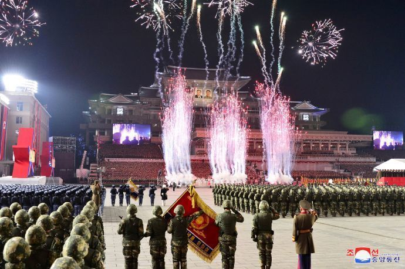

# 朝鲜阅兵展示新型洲际弹道导弹和战术核应用部队，韩媒解读

【环球时报驻韩国特约记者 刘媛 环球时报特约记者
金惠真】朝鲜媒体报道称，朝鲜8日为庆祝朝鲜人民军建军75周年，在平壤金日成广场举行大规模阅兵式。韩媒9日称，阅兵式上最引人瞩目的是朝鲜新型洲际弹道导弹（ICBM）和战术核应用部队。

据朝中社9日报道，8日晚举行的阅兵式机械化方阵，打头阵的是由平射炮纵队、坦克纵队等组成的机械化象征部队，紧随其后的是炮兵部队。介绍战术导弹纵队和远程巡航导弹纵队时，朝中社强调称：“这支战术核应用部队展示了我军强有力的战争遏制力和反击能力。”朝中社称，代表朝鲜国防能力变革与发展、展示朝鲜最强核攻击能力的洲际弹道导弹纵队随后在现场观众热烈的欢呼声中徐徐登场，展现了朝鲜正规武力已具备了彻底控制和粉碎帝国主义暴行的绝对力量。朝鲜《劳动新闻》9日报道称，阅兵广场沸腾着天下第一强军高昂的革命气概和热忱，当天的阅兵式就是传颂朝鲜劳动党建设彻底消灭地球上的任何邪恶、不义势力的战无不胜军力的万古不朽业绩的引以自豪的缩图。

韩国纽西斯通讯社9日称，朝鲜阅兵式出现了KN-25超大型火箭炮、朝鲜版“伊斯坎德尔”KN-23、“火星-17”型ICBM等大量战略、战术弹道导弹。其中，“火星-17”型洲际弹道导弹（ICBM）射程超过1.5万公里，是全球目前块头最大的ICBM。报道还称，值得一提的是，“火星-17”型洲际弹道导弹领队，搭载中远程导弹的移动发射车排成二路纵队紧跟其后。鉴于朝方一般在阅兵式上将威力强大的武器或新型武器安排在后尾亮相，该导弹可能是朝方日前试射的搭载固体燃料发动机的新型导弹。韩国国防安全论坛秘书长申钟宇9日就此分析称，出现在“火星-17”型导弹后，可能意味着该武器威力更强大。

