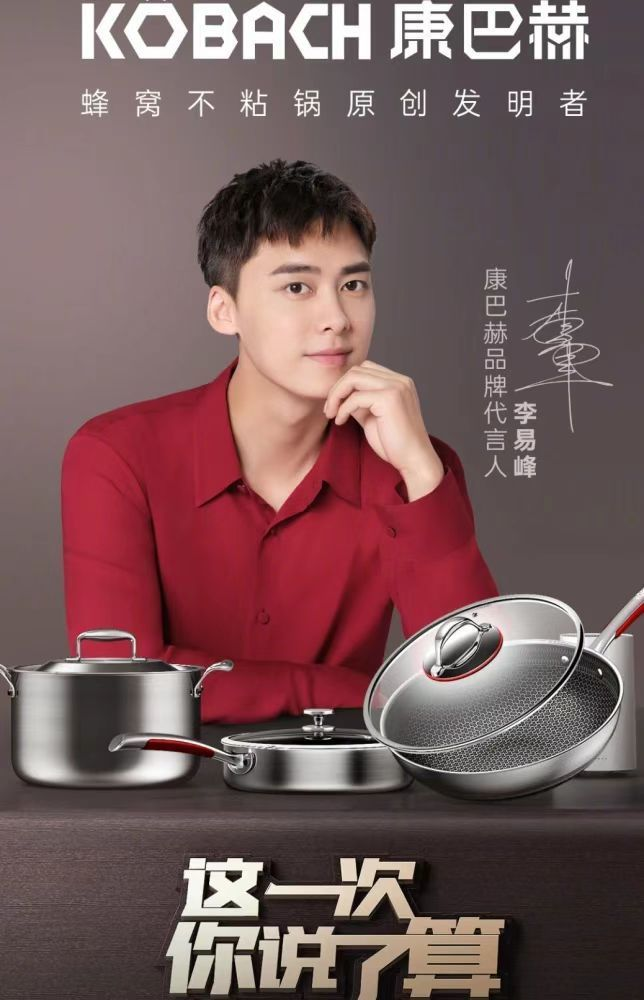
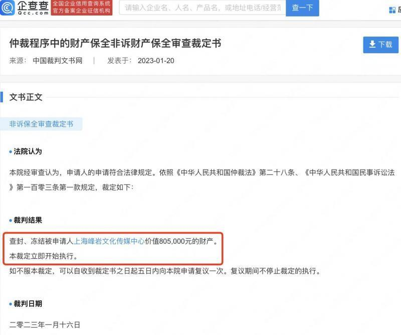
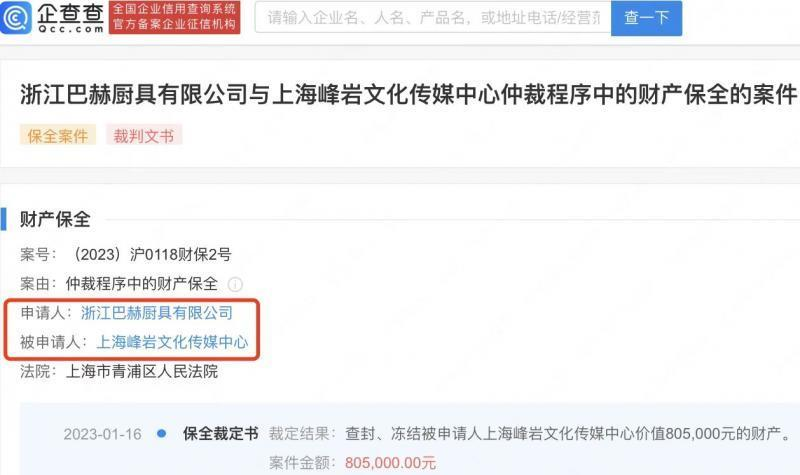
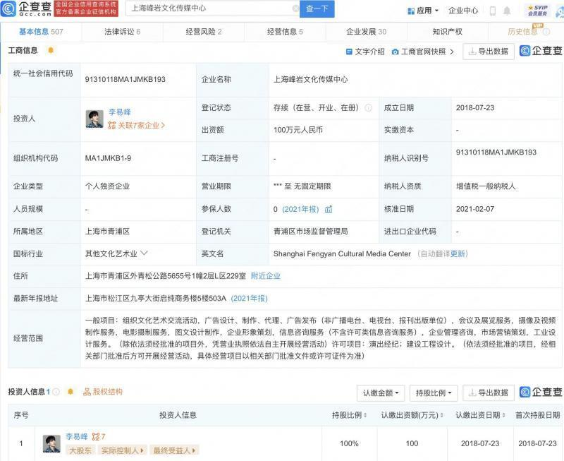

# 李易峰嫖娼事件被曝光后，代言商申请冻结其80万财产

近日，浙江巴赫厨具有限公司与李易峰控股公司上海峰岩文化传媒中心仲裁程序非诉保全审查裁定书公开。文书显示，申请人浙江巴赫厨具有限公司与被申请人上海峰岩文化传媒中心发生纠纷，请求查封、冻结被申请人价值80.5万元的财产。

法院经审查认为，申请人的申请符合法律规定，裁定执行。据悉，李易峰曾为浙江巴赫厨具有限公司旗下品牌康巴赫代言人，在李易峰嫖娼事件被曝光后，康巴赫宣布终止与其合作。

文/北京青年报记者 王磊

编辑/乔颖

