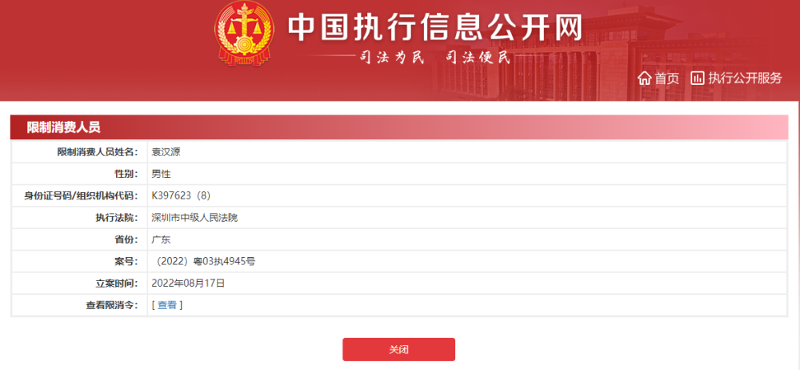
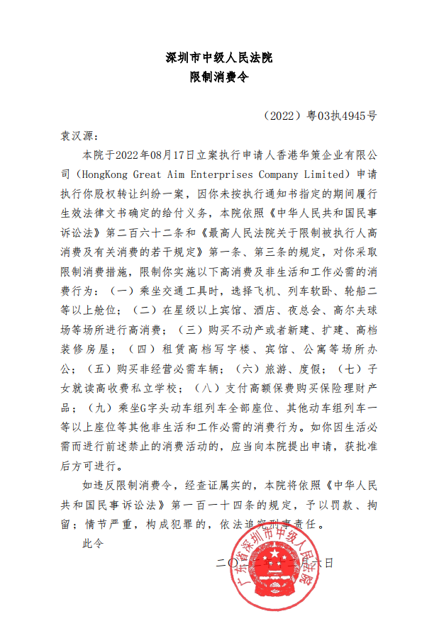
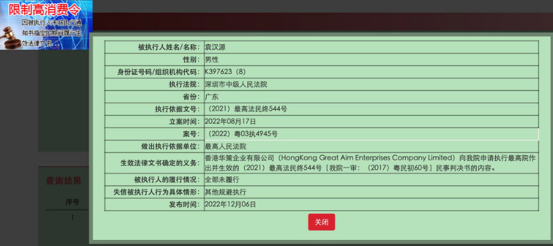
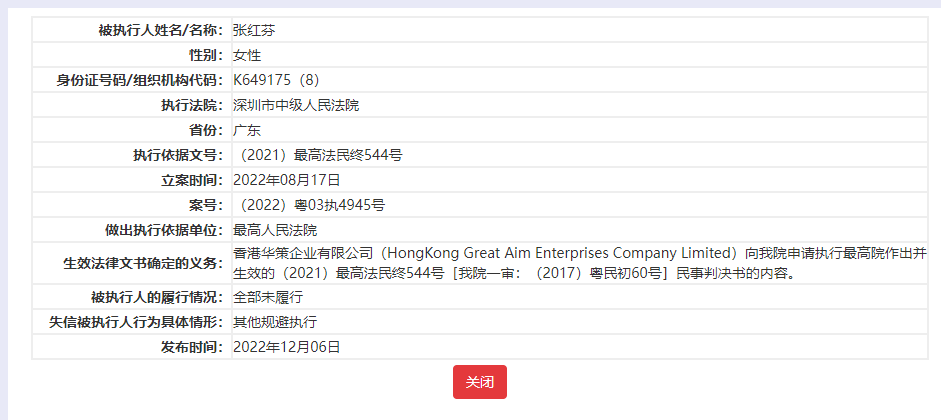
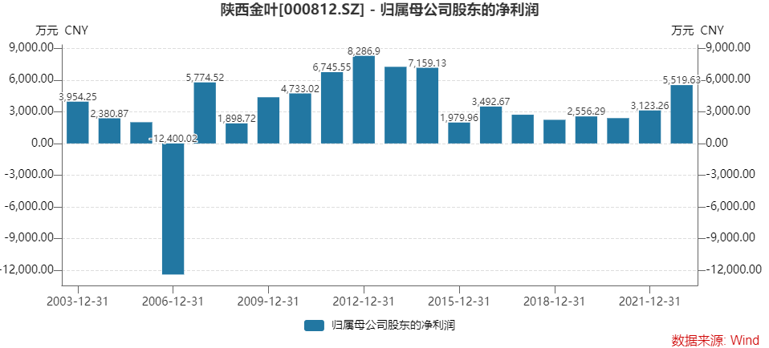

# 流动性告急！前云南首富袁汉源被强制执行超9亿元，遭限制高消费

记者 | 张艺

编辑 |

界面新闻从消息人士处获悉，近日，陕西金叶（000812.SZ）实际控制人及董事长袁汉源被深圳市中级人民法院强制执行，执行标的额高达9.11亿元，案由为股权转让纠纷。同时，其已被限制高消费，并在2022年12月曾被列为失信被执行人。

袁汉源家族正持续在二级市场抛售陕西金叶股份。 **大举减持、高比例质押加上巨额资产正被强制执行，陕西金叶大股东面临的流动性危机不小。**

同时， **陕西金叶的控制权风险也不容小觑。** 多轮减持过后，控股股东及一致行动人最新持股比例已降至20%以下，且又提出新一轮减持计划。

就袁汉源被巨额强制执行及被“限高”一事，界面新闻致电陕西金叶证券事务部，相关人士称，并不知情，没有收到相关消息。在问及此事是否会对上市公司产生影响，该人士称，“应该不会吧”。

界面新闻多次拔打袁汉源手机，均无人接听。据悉，近期袁汉源申请执行异议。界面新闻发稿前，中国执行信息公开网显示，袁汉源失信信息已删除，不过限制消费令依然存在。

前首富被“限高”

袁汉源的一生有起有伏，最高光的时刻是其多年前控股陕西金叶、坐上云南首富之位之时。

公开资料显示，袁汉源现年61岁，历任广州华南纺织有限公司销售部经理，汉华(香港)企业有限公司董事总经理，香港万裕发展有限公司董事总经理。2006年至今，袁汉源均任陕西金叶的法定代表人，现兼任董事长、总经理。

44岁的袁汉源在2006年首次以11.9亿元的资产出现在福布斯中国富豪榜，排名257位，为云南首富，其旗下万裕集团主要从事房地产、生物制药及文化产业。

在连续三年上榜后，袁汉源便在福布斯富豪榜单中消失，如今已被限制高消费。

界面新闻查询中国执行信息公开网发现，2022年12月6日，深圳市中级人民法院对陕西金叶法定代表人及实际控制人袁汉源发布“限制消费令”：限制高消费及非生活和工作必需的消费行为。执行案号为（2022）粤03执4945号。

限消令显示，深圳市中级人民法院于2022年8月17日立案执行申请人香港华策企业有限公司（下称“华策公司”）申请执行其股权转让纠纷一案。因袁汉源未按执行通知书指定的期间履行生效法律文书确定的给付义务，深圳市中级人民法院依照有关规定，对其采取限制消费措施。

限消令明确，限制陕西金叶法定代表人及实际控制人袁汉源不得实施高消费及非生活和工作必需的消费行为，包括乘坐飞机、列车软卧、轮船二等以上舱位及旅游、度假等其他非生活和工作必需的消费行为。

_来源：中国执行行信息公开网_

_来源：中国执行行信息公开网_

**袁汉源此次被强制执行与一则涉及土地使用权的股权转让纠纷案相关。**

界面新闻查询裁判文书网发现，最高人民法院于2022年3月30日出具一则《二审民事判决书》（案号（2021）最高法民终544号）。判决书显示，这起纠纷发生在2016年。

当年9月，张红芬与华策公司、力高公司、广地龙公司签订《股权转让协议》，约定张红芬向华策公司转让其持有的力高公司100%股权，华策公司达到控制广地龙公司及其名下土地使用权益的目的。

作为张红芬、力高公司与广地龙公司的共同最终实际控制人，袁汉源在股权转让补充协议上签字。袁汉源承诺对《股权转让协议》中张红芬的全部合同义务承担连带担保责任。

华策公司于2016年9月至11月分三期共已支付6.75亿元股权转让定金及部分款项，然而，张红芬未能在目标日取得相关行政主管部门对项目用地规划指标的行政批复，进而产生纠纷。

天眼查显示，香港华策企业有限公司成立于2007年，为珠海市华策集团有限公司（下称“华策集团”）关联公司。公开资料显示，华策集团旗下拥有30余家控股子公司或全资子公司，以房地产开发为主业。

华策公司一纸诉讼将袁汉源与张红芬等告上法庭。

华策公司的诉求请求包括返还股权转让的已支付款项、资金占用损失及融资成本损失、预期利益损失、逾期还款违约金等费用合计约10.38亿元。

最高人民法院最终判决金额张红芬需向华策公司返还6.75亿元本金及资金占用利息及逾期还款违约，袁汉源对上述债务承担连带清偿责任。

根据知情人士向界面新闻提供的相关信息，深圳市中级人民法院受理华策公司的申请执行金额共计9.11亿元。

天眼查显示，被执行人履行情况为全部未履行。2022年12月6日，袁汉源和张红芬因“其他规避执行”被列为失信被执行人，同时被发布“限制消费令”。

_(来源：天眼查APP）_

_来源：中国执行信息公开网（2022年12月）_

_来源：中国执行信息公开网（2023年2月10日）_

知情人士提供的相关信息显示，2022年12月，中国执行信息公开网失信被执行人名单中，袁汉源和张红芬均在列。

近期，袁汉源申请执行异议（案号：（2023）粤03执异12号）。2023年2月10日，界面新闻发稿前在中国执行信息公开网查询失信被执行人时，张红芬依然在列，袁汉源信息已被删除。

依据《最高人民法院关于公布失信被执行人名单信息的若干规定》第二条第二款的规定，“失信被执行人积极履行生效法律文书确定义务或主动纠正失信行为的，人民法院可以决定提前删除失信信息。”

陕西金叶声称不知情

对于袁汉源被巨额强制执行一事，截至界面新闻发稿时，陕西金叶并未披露相关公告。公司证券部人士表示并不知情。

就是否需要披露，浙江裕丰律师事务所厉健律师对界面新闻表示，上市公司实际控制人、董事长被列为失信被执行人，且被限高，上市公司是否应当履行信息披露义务要根据具体案情和执行进展来判断。

厉健律师进一步分析，《上市公司信息披露管理办法》并未明确规定上市公司实际控制人、董事长被列为失信被执行人或者被限高消费属于“重大事件”，因此，上市公司通常可以不履行信息披露义务；根据《上市公司信息披露管理办法》第二十二条规定，如果上市公司实际控制人、董事长出现“法院裁决禁止控股股东转让其所持股份；任一股东所持公司百分之五以上股份被质押、冻结、司法拍卖、托管、设定信托或者被依法限制表决权等，或者出现被强制过户风险”，则上市公司应当发布临时公告。

袁汉源与陕西金叶的渊源已有十七年。

陕西金叶是一家老牌上市公司，1998年6月登陆深交所，为烟草配套概念股。2006年，万裕文化产业有限公司（下称“万裕文化”）通过资本运作成为陕西金叶控股股东，袁汉源成为实际控制人，陕西金叶也成为了袁汉源重要的资本运作平台。

在袁汉源的掌舵之下，陕西金叶开拓多项新主业，如今，发展成一家以高等教育、烟品配套及医养产业为主营业务的多元化集团公司。烟标业务占比超六成，教育业超两成，还有少量房地产、贸易、互联网等业务。

主业虽已多元化了，但陕西金叶业绩亮点难寻。

陕西金叶营业收入在2021年才突破10亿元。业绩也未平稳增长，归属于上市公司的净利润峰值发生在2012年，为8286.90万元，之后萎缩。近六年来，其净利润规模多不足3000万元。

陕西金叶自身财务状况已欠佳。截至2022年三季度末，其账上货币资金仅3.52亿元，同时流动负债已创新高达19.14亿元，总负债合计22.17亿元。

袁汉源因而跌落富豪榜。陕西金叶最新市值53亿元。

刚过去的2022年，陕西金叶业绩有所起色。1月30日披露的业绩预告显示，公司去年实现盈利4,935万元至6,558万元，同比增长58%至110%。

增长原因为，教育板块营业收入和净利润有较大幅度增长。同时，报告期内，公司处置原全资一级子公司陕西金叶莘源信息科技有限公司，纳入本年合并的亏损较上年同期减少。

在十余年间，业绩增色有限，陕西金叶却屡被袁汉源及万裕集团拖累。

2009年3月，因债务纠纷，万裕文化持有陕西金叶4593.71万股被西安市中级人民法院司法冻结。

2010年12月30日，因受万裕集团与富滇银行借款纠纷牵连，万裕文化持有陕西金叶4593.71万股被云南省高院司法冻结。另外1600万股也被云南省高院轮候冻结。

此后还有多次大股东股份被司法冻结信息披露。

在2018年至2020年陕西金叶股价低迷期，袁汉源和万裕文化又多次出现被动减持公司股份情况。

2018年6月，袁汉源此前增持陕西金叶股份的资管计划账户单位净值已低于止损值，导致被动减持股份2139.03万股，占公司总股本的2.78%。

2020年3月，因触发协议约定的违约条款，万裕文化被动减持了部分质押给第一创业证券的公司股份457.67万股，占总股本的0.60%。

因万裕文化未在减持事项首次发生的15个交易日前公告相关减持计划，深交所对此违规行为还给予了通报批评处分。

被动减持过后，近两年袁汉源及一致行动人开启了主动减持之路。

大股东流动性危机显现

近年，袁汉源及一致行动人正在二级市场上大举抛售陕西金叶。加上高比例的股权质押，陕西金叶大股东流动性危机显现。

1月16日，陕西金叶公告显示，在2022年11月1日至2023年1月16日期间，公司控股股东、实控人的一致行动人重庆金嘉兴实业有限公司（下称“重庆金嘉兴”）和袁伍妹合计减持公司股份1097.70万股，占公司总股本的
1.43%。

袁汉源通过万裕文化产业有限公司（下称“万裕文化”）控制陕西金叶，袁伍妹为袁汉源的妹妹，重庆金嘉兴实际控制人吴瑞瑜的配偶袁汉辉为袁汉源的弟弟。万裕文化、重庆金嘉兴、袁伍妹和袁汉源构成一致行动人。

这一轮减持过后，万裕文化仍持有陕西金叶13.91%股份；

重庆金嘉兴在2022年7月至2023年1月16日合计减持2.76%公司股份，减持均价5.71元/股，套现1.21亿元，其持股数降至5%以下，为4.998%；

袁伍妹最高持有陕西金叶1581.59万股，占总股本比例2.06%，在多轮减持之后，其已完成清仓。

袁汉源及其一致行动人合计持股比例由22.20%降至18.91%。 **本不高的控制权比例进一步下降，陕西金叶的控制权稳定性风险加剧。**

减持计划未止。

同日，重庆金嘉兴继续提出减持计划，表示因业务发展需要，其计划在未来6个月内以集中竞价方式或大宗交易方式减持陕西金叶不超过
2342.00万股（含），即不超过公司总股本的3.05%。

重庆金嘉兴曾计划向华润深国投信托有限公司转让其持有的陕西金叶股份3845.00万股，占总股本5%，转让价格为5.787元/股，套现2.23亿元。然而在2022年底，这一股权协议转让被终止。

除上述计划外，重庆金嘉兴不排除未来12个月内继续减持其在公司拥有权益股份的可能。

陕西金叶高管也同样在减持。2022年9月9日至2023年1月4日期间，公司董事、财务总监熊汉城以7.12元/股的价格，减持26万股公司股份，只余2500股无限售条件股份，即几乎清仓其所持的流通股份。

**伴随着股东的减持行为，陕西金叶股价频频异动。**

2021年11月至12月期间，公司股价一度成“妖”，短短一个月左右时间，股价自3.50元/股附近涨至最高12.43元/股，涨幅超250%。

大涨过后，袁伍妹以9.4元/股的价格减持了公司766.40万股，占总股的1%，套现超过7000万元。

2022年12月末，陕西金叶股价再度异动，五个交易日涨幅近50%。而重庆金嘉兴和袁伍妹的上述减持行为也涵盖了这段时间。

**各路股东离场的同时，实控人及一致行动人质押比例颇高。**

截止1月16日，大股东合计质押股份数为8500.00万股，占其合计持有股份数的58.49%，占上市公司总股本的11.06%。其余可流通股份还有较高比例正计划减持。

_陕西金叶实控人及一致行动人股份质押情况（2023年1月16日公告）_

