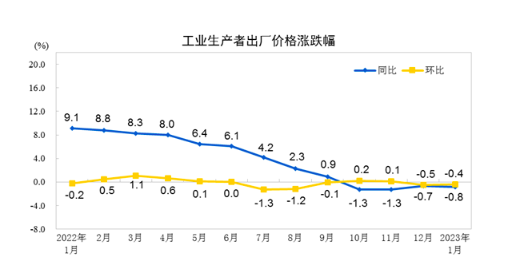

# 节日消费拉动CPI创三个月新高，服务价格大幅上涨

受春节效应和疫情防控政策优化调整等因素影响，1月CPI同比涨幅创三个月新高。国际原油价格波动和国内煤炭价格下行等因素影响，工业品价格整体继续下降。

国家统计局2月10日发布的数据显示，1月份消费者价格指数（CPI）同比上涨2.1%，涨幅较去年12月扩大0.3个百分点；工业品出厂价格（PPI）同比下降0.8%，降幅较上月扩大0.1个百分点，连续四个月负增长。

仲量联行大中华区首席经济学家庞溟对第一财经分析，1月份CPI同比增长温和抬升和PPI同比延续收缩态势，主要原因是基数效应、季节因素叠加需求端回暖特别是节日消费需求提振。预计全年通胀形势仍较为温和可控，不必过度强调通胀对未来货币政策和财政政策空间的压制作用。

国家发改委2月9日召开全国价格工作视频会议强调，2023年各级价格主管部门要以稳物价为重点，强化市场保供稳价、深化重点领域价格改革、规范价格和收费行为。

**核心CPI回升**

从同比看，CPI上涨2.1%，涨幅比上月扩大0.3个百分点。其中，食品价格上涨6.2%，涨幅比上月扩大1.4个百分点。食品中，鲜菌、鲜果和鲜菜价格分别上涨15.9%、13.1%和6.7%；猪肉价格上涨11.8%，涨幅比上月回落10.4个百分点。非食品中，服务价格上涨1.0%，涨幅比上月扩大0.4个百分点；能源价格上涨3.0%，涨幅比上月回落2.2个百分点。

从环比看，CPI由上月持平转为上涨0.8%。受春节等季节性因素影响，鲜菜、鲜菌、鲜果、薯类和水产品价格分别上涨19.6%、13.8%、9.2%、6.4%和5.5%，涨幅比上月均有扩大；生猪供给持续增加，猪肉价格下降10.8%，降幅比上月扩大2.1个百分点。随着疫情防控政策优化调整，出行和文娱消费需求大幅增加，飞机票、交通工具租赁费、电影及演出票、旅游价格分别上涨20.3%、13.0%、10.7%和9.3%。

中金研报分析，各地感染人数已经在达峰后回落，同时新冠疫情转向“乙类乙管”，带动春节服务消费大幅反弹，量价齐升。蔬菜价格受节日需求提振，28种重点蔬菜平均批发价环比上涨21%，同比由负转正，但由于前期储备肉投放叠加压栏养殖户库存释放，猪肉价格旺季不旺。

近期，猪肉价格持续下跌。据农业农村部监测，2023年第五周（1月29日至2月4日）全国农产品批发市场猪肉平均价格为22.43元/公斤，比2022年最高价（第42周）35.36元/公斤下降约37%。1月底至2月上旬，国内猪粮比价已连续三周低于5∶1，发改委2月6日表示，将会同有关部门启动中央冻猪肉储备收储工作，并指导各地同步收储。

据测算，在1月份2.1%的CPI同比涨幅中，去年价格变动的翘尾影响约为1.3个百分点，新涨价影响约为0.8个百分点。扣除食品和能源价格的核心CPI同比上涨1.0%，涨幅比上月扩大0.3个百分点。

东方金诚首席宏观分析师王青表示，二三月份CPI同比涨幅可能延续略高于2.0%的走势，消费修复有可能推动物价上涨动能增强，但CPI同比超过3.0%的可能性不大。2022年以来，核心CPI同比涨幅持续处于1.1%以下的偏低水平，短期内核心CPI或仍将在低位徘徊，这显示当前整体物价保持稳定，也给促消费提供了一定空间。

庞溟认为，扣除食品和能源价格的核心CPI呈现拾阶而上态势，显示消费稳步修复并开启回暖进程。但必须看到，2023年中国经济复苏的关键，依然在全力扩大社会有效需求，特别是积极扩大国内需求，让扩消费在推动巩固和拓展经济运行回升势头方面发挥更大作用。

**工业品价格继续下降**

PPI方面，受国际原油价格波动和国内煤炭价格下行等因素影响，工业品价格整体继续下降。

1月份PPI同比下降0.8%，降幅比上月扩大0.1个百分点。其中，生产资料价格下降1.4%，降幅与上月相同；生活资料价格上涨1.5%，涨幅回落0.3个百分点。调查的40个工业行业大类中，价格下降的有15个，与上月相同。

据测算，在1月份0.8%的PPI同比降幅中，去年价格变动的翘尾影响约为-0.4个百分点，新涨价影响约为-0.4个百分点。

中信证券分析，受各地疫情达峰、国内经济政策不断释放积极信号、海外加息进程放缓等因素影响，1月上游大宗商品价格出现明显涨势。高需求支撑原油价格小幅回暖，国内防疫政策放开对工业产品需求的刺激也支撑铜、螺纹钢等商品价格走高。不过，由于春节期间生产受到一定限制，工业品出厂价格涨势或不及原材料。

王青表示，今年一季度PPI将延续弱势运行状态，因为上年同期基数明显偏高，加之新涨价动能有限，都会明显抑制PPI同比涨幅。尽管PPI走势偏弱，但无论是国际原油价格还是国内煤炭等主要工业原材料价格绝对水平都处在较高水平，还需要有关部门继续做好保供稳价工作。

庞溟分析，预计2023年全球主要能源和金属的价格水平将同比下行10%左右，叠加国内社会有效需求逐步回暖走强，有助于PPI平均涨幅维持在-0.5%至0.5%左右的较低水平。

