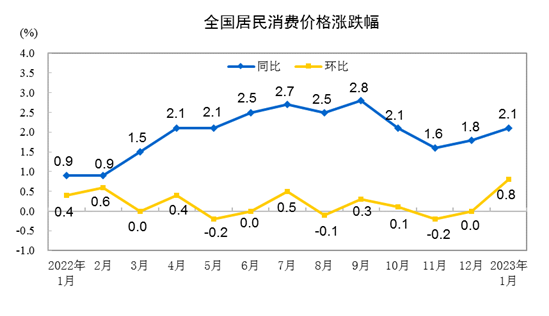
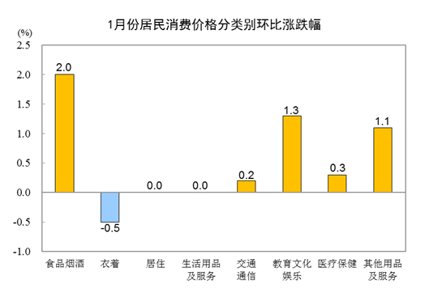

# 重回2时代！1月CPI同比上涨2.1%，机票价格环比涨20.3%

2023年1月份，全国居民消费价格同比上涨2.1%。其中，城市上涨2.1%，农村上涨2.1%；食品价格上涨6.2%，非食品价格上涨1.2%；消费品价格上涨2.8%，服务价格上涨1.0%。

1月份，全国居民消费价格环比上涨0.8%。其中，城市上涨0.8%，农村上涨0.5%；食品价格上涨2.8%，非食品价格上涨0.3%；消费品价格上涨0.7%，服务价格上涨0.8%。

**一、各类商品及服务价格同比变动情况**

1月份，食品烟酒类价格同比上涨4.7%，影响CPI（居民消费价格指数）上涨约1.33个百分点。

食品中，鲜果价格上涨13.1%，影响CPI上涨约0.27个百分点；蛋类价格上涨8.4%，影响CPI上涨约0.06个百分点；鲜菜价格上涨6.7%，影响CPI上涨约0.16个百分点；畜肉类价格上涨6.6%，影响CPI上涨约0.21个百分点，其中猪肉价格上涨11.8%，影响CPI上涨约0.16个百分点；水产品价格上涨4.8%，影响CPI上涨约0.09个百分点；粮食价格上涨2.7%，影响CPI上涨约0.05个百分点。

其他七大类价格同比六涨一降。其中，其他用品及服务、教育文化娱乐、交通通信价格分别上涨3.1%、2.4%和2.0%，生活用品及服务、医疗保健、衣着价格分别上涨1.6%、0.8%和0.5%；居住价格下降0.1%。

**二、各类商品及服务价格环比变动情况**

1月份，食品烟酒类价格环比上涨2.0%，影响CPI上涨约0.57个百分点。

食品中，鲜菜价格上涨19.6%，影响CPI上涨约0.41个百分点；鲜果价格上涨9.2%，影响CPI上涨约0.19个百分点；水产品价格上涨5.5%，影响CPI上涨约0.10个百分点；畜肉类价格下降5.3%，影响CPI下降约0.19个百分点，其中猪肉价格下降10.8%，影响CPI下降约0.18个百分点；蛋类价格下降2.1%，影响CPI下降约0.02个百分点。

其他七大类价格环比四涨两平一降。其中，教育文化娱乐、其他用品及服务价格分别上涨1.3%和1.1%，医疗保健、交通通信价格分别上涨0.3%和0.2%；居住、生活用品及服务价格均持平；衣着价格下降0.5%。

**2023年1月份CPI有所上涨 PPI继续下降**

**——国家统计局城市司首席统计师董莉娟解读2023年1月份CPI和PPI数据**

国家统计局今天发布了2023年1月份全国CPI（居民消费价格指数）和PPI（工业生产者出厂价格指数）数据。对此，国家统计局城市司首席统计师董莉娟进行了解读。

**一、CPI有所上涨**

1月份，受春节效应和疫情防控政策优化调整等因素影响，居民消费价格有所上涨。从环比看，CPI由上月持平转为上涨0.8%。其中，食品价格上涨2.8%，涨幅比上月扩大2.3个百分点，影响CPI上涨约0.52个百分点。

食品中，受春节等季节性因素影响，鲜菜、鲜菌、鲜果、薯类和水产品价格分别上涨19.6%、13.8%、9.2%、6.4%和5.5%，涨幅比上月均有扩大；生猪供给持续增加，
**猪肉价格下降10.8%** ，降幅比上月扩大2.1个百分点。

非食品价格由上月下降0.2%转为上涨0.3%，影响CPI上涨约0.25个百分点。

非食品中，随着疫情防控政策优化调整，出行和文娱消费需求大幅增加，飞机票、交通工具租赁费、电影及演出票、旅游价格分别上涨20.3%、13.0%、10.7%和9.3%；受节前务工人员返乡及服务需求增加影响，家政服务、宠物服务、车辆修理与保养、美发等价格均有上涨，涨幅在3.8%—5.6%之间；受国际油价波动影响，国内汽油和柴油价格分别下降2.4%和2.6%。从同比看，CPI上涨2.1%，涨幅比上月扩大0.3个百分点。

其中，食品价格上涨6.2%，涨幅比上月扩大1.4个百分点，影响CPI上涨约1.13个百分点。

食品中，鲜菌、鲜果和鲜菜价格分别上涨15.9%、13.1%和6.7%；猪肉价格上涨11.8%，涨幅比上月回落10.4个百分点；鸡蛋、禽肉类和水产品价格分别上涨8.6%、8.0%和4.8%；粮食和食用油价格分别上涨2.7%和6.5%。

非食品价格上涨1.2%，涨幅比上月扩大0.1个百分点，影响CPI上涨约0.98个百分点。非食品中，服务价格上涨1.0%，涨幅比上月扩大0.4个百分点；能源价格上涨3.0%，涨幅比上月回落2.2个百分点，其中汽油、柴油和液化石油气价格分别上涨5.5%、5.9%和4.9%，涨幅均有回落。据测算，在1月份2.1%的CPI同比涨幅中，去年价格变动的翘尾影响约为1.3个百分点，新涨价影响约为0.8个百分点。扣除食品和能源价格的核心CPI同比上涨1.0%，涨幅比上月扩大0.3个百分点。

**二、PPI继续下降**

2023年1月份PPI同比下降0.8％ 环比下降0.4％

1月份，受国际原油价格波动和国内煤炭价格下行等因素影响，工业品价格整体继续下降。从环比看，PPI下降0.4%，降幅比上月收窄0.1个百分点。其中，生产资料价格下降0.5%，降幅收窄0.1个百分点；生活资料价格下降0.3%，降幅扩大0.1个百分点。

输入性因素影响国内石油相关行业价格下行，其中石油和天然气开采业价格下降5.5%，石油煤炭及其他燃料加工业价格下降3.2%，化学原料和化学制品制造业价格下降1.3%。煤炭保供持续发力，煤炭开采和洗选业价格由上月上涨0.8%转为下降0.5%。

钢材市场预期向好，黑色金属冶炼和压延加工业价格上涨1.5%，涨幅扩大1.1个百分点。

此外，农副食品加工业价格下降1.4%，计算机通信和其他电子设备制造业价格下降1.2%，纺织业价格下降0.7%；有色金属冶炼和压延加工业价格持平。从同比看，PPI下降0.8%，降幅比上月扩大0.1个百分点。其中，生产资料价格下降1.4%，降幅与上月相同；生活资料价格上涨1.5%，涨幅回落0.3个百分点。

调查的40个工业行业大类中，价格下降的有15个，与上月相同。主要行业中，黑色金属冶炼和压延加工业价格下降11.7%，降幅收窄3.0个百分点；化学原料和化学制品制造业价格下降5.1%，降幅与上月相同；有色金属冶炼和压延加工业价格下降4.4%，降幅扩大0.8个百分点；纺织业价格下降3.0%，降幅扩大0.9个百分点。

此外，石油煤炭及其他燃料加工业价格上涨6.2%，涨幅回落3.9个百分点；石油和天然气开采业价格上涨5.3%，涨幅回落9.1个百分点；煤炭开采和洗选业价格由上月下降2.7%转为上涨0.4%。据测算，在1月份0.8%的PPI同比降幅中，去年价格变动的翘尾影响约为-0.4个百分点，新涨价影响约为-0.4个百分点。

