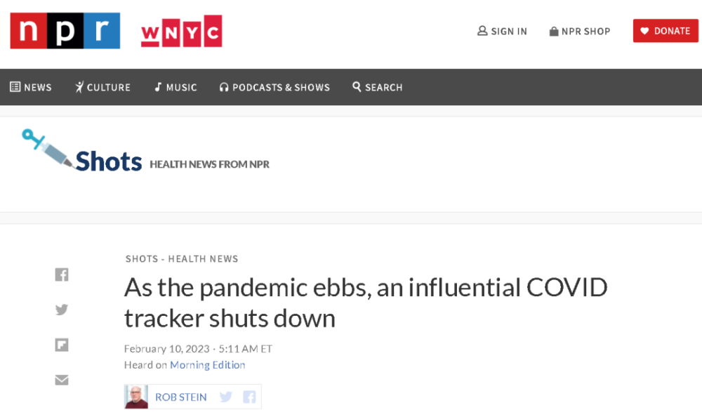
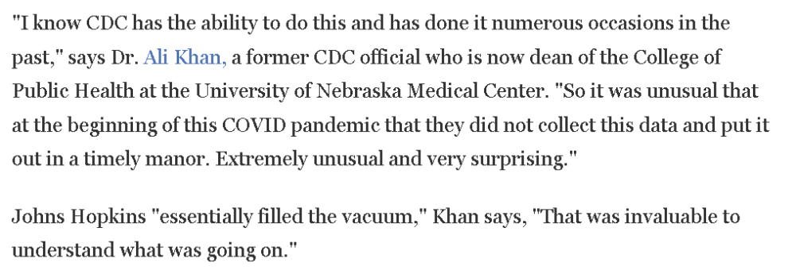

# 3月10日，美国“新冠资源中心”即将关闭，新冠疫情世界地图将成为历史

耿直哥

当地时间2月10日，美国约翰·霍普金斯大学的“新冠资源中心”（The Johns Hopkins Coronavirus Resource
Center）宣布，该中心将于今年3月10日起停止搜集和报告新冠疫情数据。

这意味着，这个曾经为人们了解世界各地的新冠疫情形势提供了很大帮助的机构，以及该机构最为知名的新冠疫情世界地图，将成为历史。

如下图所示，约翰·霍普金斯大学的“新冠资源中心”已经在其官网上宣布了这一消息，表示该中心将在3月10日起停止对于新冠数据的实时报告，该中心也将在运作了3年后关闭。

不过，该声明表示，约翰·霍普金斯大学将持续通过其他途径为人们提供疫情资讯。

这一消息也引起了国内外网民的关注。在社交平台上，有人在感谢该机构，尤其是该机构著名的疫情世界地图在过去3年里帮人们认识全球疫情形势提供的帮助，但也有人嘲笑该机构及其发布和更新的疫情世界地图，称这不过是一个“可笑的学生项目”。

不过，美国全国公共广播电台（NPR）对于约翰·霍普金斯大学“新冠资源中心”即将关闭一事的报道，却打了这些嘲笑者的脸。

在这篇题为“随着疫情的退潮，一个很有影响力的新冠追踪网站关闭了”的报道中，NPR介绍说，虽然约翰·霍普金斯大学“新冠资源中心”知名的新冠疫情地图，最初是于2020年3月由该校的副教授劳伦·加德纳（Lauren
Gardner）和来自中国陕西的中国留学生董恩盛发起的，但这个很快得到了新闻记者和学者们支持的项目，不仅极大地添补了当时美国和全球疫情信息缺失，更令从普通人到决策者都有了做出判断、制定相关政策的依据——包括NPR在内的诸多美国和西方主流媒体，也都在不断引用该数据，为受众提供实施的疫情信息。

在NPR的采访中，一名曾在美国疾病控制与预防中心（CDC）工作过的前官员还表示，由于当时CDC并没有做好疫情信息的搜集和报告工作，约翰·霍普金斯大学的疫情地图不仅及时地添补了信息的空白，而且为人们认识疫情提供了“无价”的帮助。

一名来自美国纽约一家医院的传染病学专家更坦言说，约翰·霍普金斯大学的这个新冠疫情地图，已经成为日常必看的项目，因为这一方面可以帮助他了解疫情的变化，一方面也是在见证历史。

另外，这个项目还给美国的女性赋权带来了很积极的意义。因为NPR表示，这个项目的参与者绝大多数都是女性。其中，作为项目创始人的加德纳还在去年获得了美国生物医学界知名的拉斯克医学奖，以表彰她的这个追踪世界疫情形势的地图项目。

最后，对于这个项目如今即将走向终点一事，加德纳说她的心情是“苦乐参半”的，但她也表示现在到了该翻篇的时候了。

她还希望美国CDC和公共卫生系统能多在疫情信息搜集和报告工作上投入力量，好在未来更好地应对疫情。但如果新的疫情卷土重来，她表示自己也会重新做好准备。

