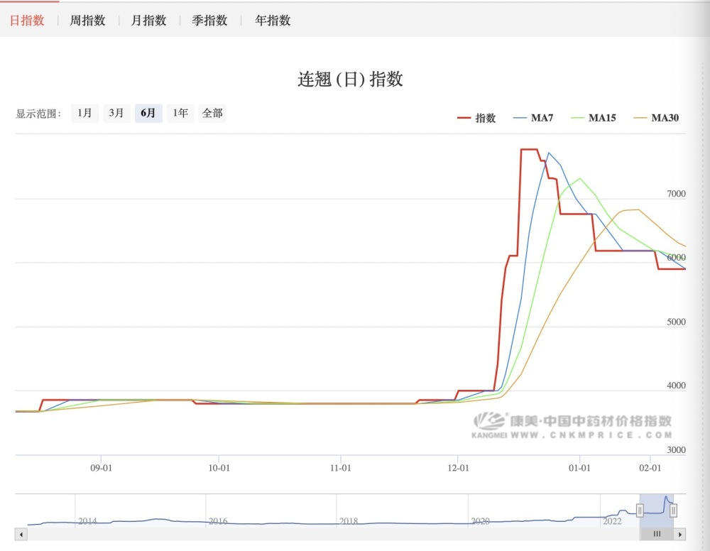
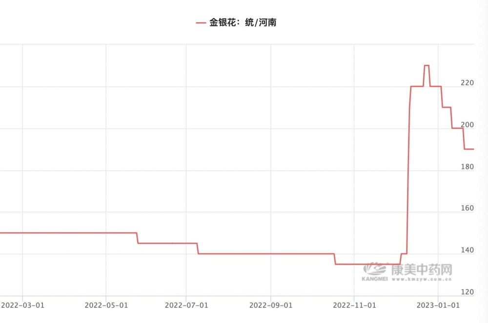
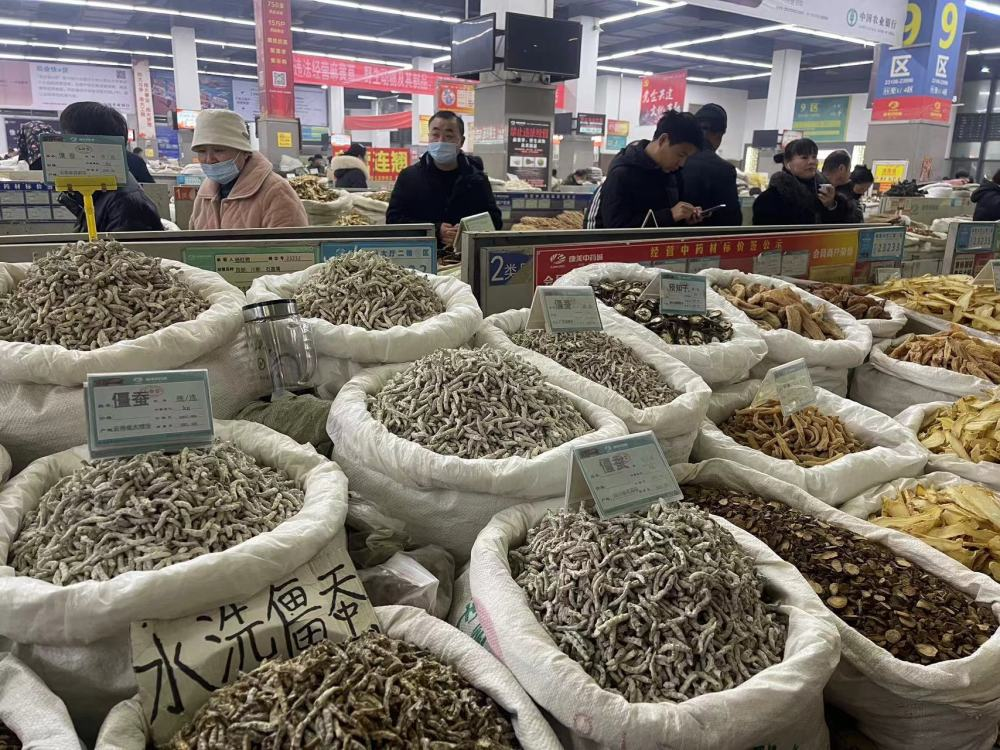

# “疯狂的中药材”：有人高价卖出上百吨货，转眼又得亏本卖货

记者 | 李科文

编辑 | 谢欣

在经历了2022年底疫情防控政策调整后的一波抢购潮之后，一路狂涨的中药材原料价格开始从顶峰回落。

以连花清瘟的原料连翘为例，界面新闻记者日前走访安徽亳州康美中药城获悉，统货连翘（即，不分质量﹑规格﹑品级，按统一价格购进或出售的商品）价格已从最高时的190元/kg回落至的150元/kg（2023年2月9日价格）。

而在2022年底，从2022年12月9日到12月16日，短短不到一个星期内，连翘的价格曾一度从110元/kg涨至190元/kg。并在高位持续了近一个星期。

连翘也并非唯一价格大起大落的中药材，在感冒发烧类中药的带动下，具有清热解毒功能的金银花、板蓝根、藿香等中药材、清肺祛湿类中药材五指毛桃（南芪）等，也在最近呈现类似价格走势。

在这种情况下，安徽亳州康美中药城的众多中药材商也在剧烈的价格波动中随波逐流，有人虽然在价格高点卖掉了百吨的货，但在大跌后也不得不低价亏本卖出手中的存货。

但同时，据康美中药城质量管理部刘洋清向界面新闻介绍，由于中药材原料呈现产地属性——橘生淮南则为橘，生于淮北则为枳，不同产地的中药材决定了其药性的情况。而在现实中，中药材原料种植主虽也有规模化种植，但整体上仍是小农经济模式，存在道地药材不同产地混种的情况。此外，部分还有中药材为野生采摘，中药材的质控与溯源仍是长路漫漫。

暴涨后批发商却不一定赚到大钱

“在疫情防控政策调整初期，许多中药材原料进货价与销售价几乎是一天一变……铺位四周全是围着向我问价想要购买连翘的客户，那段时间走了百吨的连翘，一批原料刚到货马上就被抢空。”一位在亳州康美中药城的批发连翘的中药材原料批发商向界面新闻描述销售这样描述当时最火热的场景。

亳州是中国中药材之都，康美中药城则是全国最大的中药材交易市场。此处的中药材原料批发价格基本指导着全国的中药材原料价格走向。由于中药材原料市场呈现“小而散”的特点，价格浮动频繁，容易出现“囤货与哄抬价格”的情况。

在中药材交易中有统货与选货两类货物之分，前者指分档次等级的货物。统统按一个价格购进或出售；后者则是在统货基础上做了再筛选的、质量品质更为上乘的货物。由于统货不能被直接用于制作中药饮片，因此在销售中，可被直接药用的连翘价格更高。

据界面新闻了解，近期选货连翘最高达约280元/kg。不过，目前亳州市场选货连翘也已回落，青翘不包检货220元/kg左右，挥发油合格货240元/kg左右，黄翘170元/kg左右。

金银花的原料价格也上演了类似的“疯狂”。界面新闻走访现场的金银花批发商户得知，在2022年底短短不到一个星期内，统货金银花的价格也同比上涨，从2022年12月9日最初的140元/kg涨至12月23日最高时的230元/kg。

但金银花特殊的地方在于，有金银花批发商户向界面新闻记者介绍，在疫情防控政策调整前，金银花批发价格曾出现倒挂现象，即销售价格低于生产者的出厂价格，虽然其不清楚具体是什么原因。但这也导致了下游需求突然暴涨后，迅速出现供不应求的情况。

刘洋清则解释称，中药材原料销售出现倒挂是正常现象。若某一时间段内某一种药材货量全部集中于市场，该产区的药材就会相对更少出现价格上升。据界面新闻了解，目前亳州市场混金银花山东一级货220元/kg左右，药厂货160元/kg左右；河北青花好货260元/kg左右，一般货220元/kg左右。

此外，从2022年12月5日到12月14日，统货板蓝根价格曾一度从14元/kg涨至23元/kg，并在高位持续了近一周，而目前价格已回落至的17元/kg；统货广藿香价格则从最高时的29元/kg回落至21元/kg，其在2022年底曾在不到二个星期内从13元/kg涨至29元/kg。

上游原料中药材价格的剧烈变化也反映到了终端销售上，有消费者在社交平台反映称，往常在线上购买的中药配方中的中药材涨价均两倍起步。

不过，虽然感冒发烧类的中药材原料经历了“疯涨”，但康美中药城的销售商却并不一定都挣了大钱。

原因在于，这些销售商们长期从事中药材原料的进货、销售，而非以投机形式入场，中药材原料市场除了因“小而散”呈现价格浮动频繁的特点之外，也容易出现“囤货与哄抬价格”，这也导致中药材原料进货价与销售价也是一天一变。而进货价格的频繁波动很容易让中药材原料批发商吐出获利。

一般情况下，中药材原料批发商会从个体药材种植户手中收购小量药材，需要更大货量时则会从更大的中药材收购贩子手中进货。前述提及的连翘的中药材原料批发商表示，那段时间他进货连翘常被友商出价更高“截胡”。他看着连翘进货价格从最初的130元/kg左右，涨到200元/kg左右，虽然后悔，但也不得不进维持生意正常运作。他坦言，在那段价格暴涨时期，虽然初期自己因为提前低价进货或还有部分存货而赚到了钱，但随着需求与价格回落，但进货价却更高了，到了后期自己还得赔本出存货。

种植户种药“价格优先”，“道地药材”难溯源

总的来看，自2021年国家药监局提出中药质量控制和生产全过程管理要求，中药生产企业需要验证生产工艺标准、采购道地溯源药材、升级改良产能设备等后，中药材上游原料价格总体就开始呈上行趋势。国家发改委授权的康美·中国中药材价格总指数显示，中药材价格总指数从2019年的1215.32点上升至2022年的1742.82点。其中，上涨品种中有243个，占比47.18%。

按照中药理论，中药材原料呈现产地属性——橘生淮南则为橘，生于淮北则为枳，不同产地的中药材决定了其药性的情况，这是在中药材独特的存在。其中，道地药材指经过中医临床长期应用优选出来的，产在特定地域，与其他地区所产同种中药材相比，品质和疗效更好，且质量稳定，具有较高知名度的中药材。

2021年，国家药监局公布了第一批、第二批共196个中药配方颗粒国家标准，对中药质量控制和生产全过程管理提出了要求，生产企业需要验证生产工艺标准、采购道地溯源药材、升级改良产能设备等（2021年11月1日起正式实施）。

按新国标生产新产品必须使用道地药材，而且对药材选用非常严格，由此中药材上游原料价格总体呈上行趋势。从成本上升的构成来看，主要还是来自于原材料的变化。

不过，虽然经过了市场大起大落的洗礼，但目前国内的中药材种植主要仍还是小农经济种植、一家一户为主。药材种植户往往看到市场上某品种行情好，就扎堆种某个品种。但由于药材成熟需要个一年半载，等到收采，供求突然剧增增加，需求保持不变，下乡的收购商压低价，反而形成了“药贱伤农”。

“实际上，中药材的种植收成率很低，不超40%。”一位中药材种植大户向界面新闻介绍。药材品质与产量由药材种苗决定，造成此原因的一个主要因素是种植户选苗不佳。

另一位中药材种植大户也介绍，大部分种植户选种苗不会关注药材种苗产地与质量，只关注种苗的价格高低。在现实中，能严格根据品质种植的种植户占市场的比例非常低。这也造成了另一方面的影响——道地药材的真实性难以溯源。

此外，许多种植户会把各地的药材种苗进行混合种植。前述中药材种植大户举例说，像贵州道地药材太子参，如今在福建、河北都有研制与发展种植，这就导致某些在贵州种植的太子参的种苗不一定来自贵州当地，可能是来自福建、河北的。

“这类肯定不属于道地药材”，康美中药城质量管理部刘洋清表示，每个地方的道地药材有自己特色，有自己特殊的性状可以被鉴定与鉴别的。“像东北的人参，若在安徽种植就会长的像萝卜一样。”

刘洋清表示，溯源的初衷是保持产品质量。但中药材品种众多，此外，有些药材是野生的，小型中药饮片厂没有自己的药材种植基地，根本没有能力完成这一部分。以后，大宗中药材原料有实现溯源的可能性，但像部分野生或小用量的中药材原料的溯源，则还有很多困难要探索与克服。

中药材的产量与质量通常会影响到中下游的利润空间，对此，一些中药企业已经开始建立自己中草药种植基地，解决上游的药材的供应问题，同时溯源保证药材原料质量，还能避免某些年份某些药材价格极值波动的影响。

但这对于整个中药材市场来说，这样的模式还只占很少的一部分。

