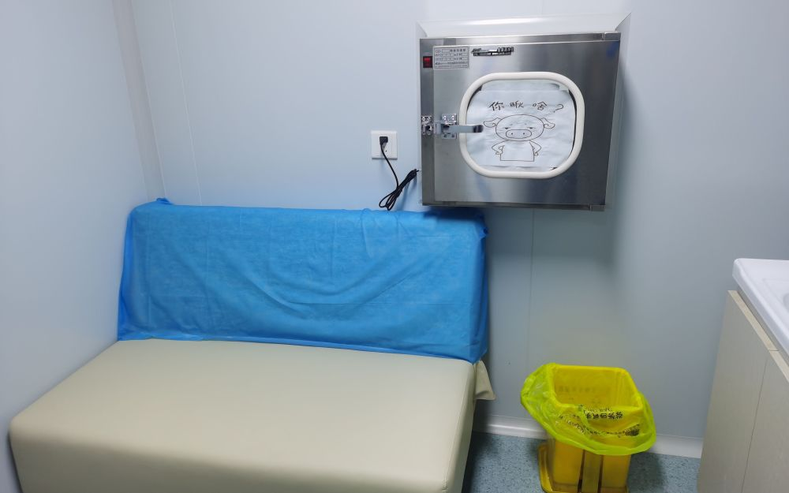

# 关于捐精，你懂多少？记者实探北京人类精子库

近期，云南省人类精子库面向大学生招募志愿者的消息在网上引发关注。随着高校相继开学，陕西、北京等多地都发布了类似的“英雄帖”，号召大学生捐精。

对于“捐精”，网友们好奇中带着几分戏谑。作为一种人道主义行为，捐精某种程度与献血无异，而其流程更为复杂，对样本要求更多。

近日，新京报记者探访了国家卫健委科研所人类精子库，并向值班医生咨询了捐精流程、隐私保护等大众关心的问题。

**志愿者需登记身高、发育、兴趣爱好等信息**

2月10日下午，北京市海淀区大慧寺路12号，院落大门处挂着“国家卫健委科学技术研究所”“中国人口学会”等牌匾。在一栋六七层高的建筑内，顺着“精子库”的引路标志上二楼，就能找到此行的目的地。

根据国家卫健委妇幼健康司公示的名单，截至2020年12月31日，我国经批准设置人类精子库的医疗机构共27家，其中，北京地区有两家人类精子库，分别设在国家卫生健康委科学技术研究所和北京大学第三医院。

在电梯斜对面的一间屋子里，来访者会接受医生的简单体检与信息登记。我们来到精子库时，正有几位自供精的男性市民在等待报告。

在说明来意后，医生首先翻开一本印着彩色马赛克的小册子，检查了我们的色盲色弱等情况，并读取身份证信息，在国家辅助生殖技术管理信息系统中进行供精候选人“查重”——根据规定，一位男性只能在一家精子库进行精子捐献。

之后，我们得到了一份《捐精志愿者初筛登记表》。在这份表格里，需要登记捐精者的姓名、年龄、民族、电话、婚育情况等基本信息，以及一系列体检生理信息，包括既往病史、生活史（烟酒嗜好、有害物质接触史等）、身高、体重、发育情况、毛发分布、皮肤、第二性征发育、生殖系统检查。除此之外，还要填写兴趣、爱好与特长等信息。

如果这一阶段初筛通过，医生会给来访者一个小的带盖取精杯。咨询室里一共设置了三间取精室，摆放有沙发、电视、洗手台、紫外线消毒器，墙上张贴了洗手7步法和取精注意事项，洗手台通过脚踏控制出水。

_取精室的墙上张贴了洗手7步法和取精注意事项。新京报记者
戴轩 摄_

医生告诉我们，前两次的取精都是属于测试阶段，如果精子达标，从第三次开始，志愿者才会进入里间，进行正式的捐精流程。里间的取精室与外间陈设相似，唯一不同的是多了一个传递窗，取精杯可直接从窗户传递到相连的实验室。传递窗的玻璃上贴了一张俏皮的猪脸简笔画，写着“你瞅啥”，阻挡了内外的视线。

据了解，前来捐精的爱心人士中，有一半为在京高校大学生，以北大、清华、北交大等学校居多，或与年轻人更易接受新观念有关。

有位医生告诉我们，为号召大学生参与捐献，他们曾去高校开办讲座，发现不少女生也很好奇并接受这一公益事业，有的女生还会陪男朋友来捐献精子。

在北京人类精子库大学生“征集令”发出不久，已有大量志愿者拨打咨询电话。

_国家卫生健康委科学技术研究所人类精子库内的取精室。新京报记者
戴轩 摄_

**从捐精到可供精 周期在一年左右**

我们首次探访所接触到的项目，只是捐精的第一步。据了解，从体检、精子质量测试、正式多次捐精、精子复检到最终可以向医疗机构供精，整个周期可能在一年左右。

在此期间，志愿者需要耐心配合一系列要求。

在正式捐精阶段，志愿者需要捐精5-10次，每次捐献日期自定，正式捐精周期不能超过4个月，最短时间不限，每次取精要求禁欲3-7天。

捐精期间，如发现身体健康状况有变化，尤其是与传染病、性传播疾病有关的变化，应当及时报告；如果发现筛查过程中没有调查到的有关遗传因素的资料，也应当毫无保留地提供。

在停止捐精后，志愿者依然要与精子库保持联系，提供健康及遗传信息资料的最新情况，并保证在停止冻存精液后30天和6个月再次接受健康检查。

如果在捐精期间出现不洁性生活、多次捐精质量不合格等情况，捐精中止。

由于流程复杂、周期较长，精子库会给予捐精志愿者一定的交通和误工补贴。完成全部捐精流程，志愿者可获得总计最高5150元的捐献补贴。此外，可以免费接受价值1500元以上的体检，包括染色体、微生物、精液、乙肝、丙肝、HIV等检测，尤其是精液与染色体检查，大部分人从未做过，可了解自己的生育状态。

■ **知道多一点**

**1.符合哪些条件可捐献精子？**

我们注意到，各地精子库对志愿者的要求不一，捐精前可先通过官方网站等了解相关信息。

北京人类精子库要求，志愿者原籍为中国的男性公民，并拥有二代身份证；未来一年常住北京，具有大专及以上学历或在读；年龄20-40周岁，净身高170cm以上，体重指数【BMI=体重（kg）/身高²（m²）】＜30；五官端正，无残疾或其他生理缺陷，无明显脱发，有良好的生活习惯，无不良嗜好，无传染病、遗传病史和性传播疾病史，无重度近视（视力＜600度）色盲、色弱、高血压和心脏病等。

复旦大学人类精子库要求志愿者为中国公民，具有爱心，遵纪守法；21周岁-45周岁；未来至少一年在上海居住；无家族遗传病、色弱、乙肝等传染疾病，身体健康，无明显脱发，165cm及以上，无明显超重。

**2.哪些人不能捐精？**

根据《人类精子库管理办法》，人类精子库不得采集有下列情况之一的人员的精液：

有遗传病家族史或者患遗传性疾病；

精神病患者；

传染病患者或者病源携带者；

长期接触放射线和有害物质者；

精液检查不合格者；

其他严重器质性疾病患者。

**3.捐献的精子将用于何处？**

根据复旦大学人类精子库信息，人群中约有10%的夫妇有不孕不育的问题。北京人类精子库介绍，京津地区已婚夫妇不孕不育比例高达15%，其中40%是因为男性精子问题，国内许多生殖中心用精夫妇需排队等待1-2年。

我国积极开展对不孕不育的治疗，使无子女的夫妇能够获得一个子女，从而减轻他们心理和社会上的压力。因丈夫无精子不能生育的夫妇可通过供精人工授精的方法解决生育问题。

**4.捐精和供精最多几次？**

供精者只能在一个人类精子库中供精，一个供精者的精子最多只能提供给5名妇女受孕。

北京人类精子库医生介绍，供精完成后，精子库也将持续追踪受精者怀孕、胚胎发育、分娩等情况，如果发现精子质量不佳，会对该份剩下的精子进行销毁。

**5.捐精对身体是否有害？**

据复旦大学人类精子库，男性青年随着性器官的发育，睾丸产生精子，前列腺和精囊等分泌精浆，两者合成精液，精液内主要成分是水分和少量有机成分。

男子每次射精约2-6毫升，正常情况下，当精液达到一定量后，体内已无处可容纳，即所谓“满则溢”。其排出体外主要有3条途径，即遗精、手淫、性交。所以，正常男性每周有2-4次排精发生，并不会影响身体，反之，较长时间没有排精，会产生性情烦躁、记忆力不集中等不适感。

无论是青少年还是中老年人，适度的手淫不仅无害，而且有益于身心健康，有利于满足生理需要。供精不会影响身体健康。规律的射精，有利于精液新陈代谢和身体健康。

**6.捐精者和受精者能得知彼此信息吗？**

人类精子库医生告诉我们，捐精是一项“双盲”行为，双方隔着辅助生殖医疗机构和精子库，彼此的隐私信息不得向对方泄露。

通过医生，不孕不育患者可以提出偏好，也可以获悉精子主人的年龄范围、身高、体重、爱好等信息作为参考，但不能得知对方的姓名、联系方式等信息，也不可越过医疗机构直接来精子库申请精子。

供精者完成捐精后，也不可获得精子后续的使用人和使用情况信息，不追查受精的夫妇相关资料，对出生的小孩既没有任何权利，也不承担任何义务。

■ **小贴士**

**在京大学生如何联系精子库？**

有意捐精的在京大学生可通过以下方式联系报名：

1、客服微信：boyjzk；客服QQ：1986420510

2、关注微信公众号“北京人类精子库”，留言“学历+电话号码+所在城市”

3、发送短信“报名捐献”到18518094516

新京报记者 戴轩 周博华 李欣侗

编辑 刘梦婕 校对 吴兴发

