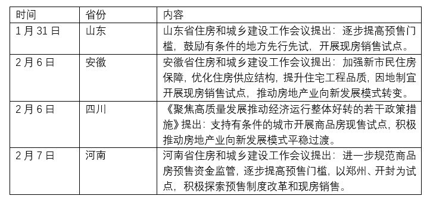

# 四省提出试点，海南占比已近四成！现房销售会全面铺开吗？

2月7日，河南省住房和城乡建设工作会议在郑州召开，会上通报了2023年重点工作。会议明确，今年将进一步规范商品房预售资金监管，逐步提高预售门槛，以郑州、开封为试点，积极探索预售制度改革和现房销售。

在此前多地土拍环节试点现房销售后，“现房销售”在多省住建工作会议中被提及，那么，后续是否会有更多的省份跟进？当前全国现房销售情况又如何呢？

四省提出“现房销售试点”

今年1月17日，全国住房和城乡建设工作会议召开，会议指出，房地产工作要融入党和国家事业大棋局，锚定新时代新征程党的使命任务和当前的中心工作来展开。一是稳预期；二是防范风险，要“抓两头、带中间”，以“慢撒气”的方式，防范化解风险；三是促进转型。各项制度要从解决“有没有”转向解决“好不好”。有条件的可以进行现房销售，继续实行预售的，必须把资金监管责任落到位，防止资金抽逃，不能出现新的交楼风险。

“住建部首次系统、明确提出现房销售概念，也要求各地政府和房企关注预售制度改革。”业内人士说。

据澎湃新闻不完全统计，全国住房和城乡建设工作会议召开以来，已有山东、安徽、河南、四川等四省提出现房销售试点。

其中，山东、安徽及河南均在近期召开的省住建工作会议中提出。

多地已在土拍环节试点现房销售

各地探索“现房销售”并非第一次，此前多地将“现房销售”写入土地出让文件中。

据不完全统计，2021年以来，北京、杭州、福州、合肥、西安、宁波、济南等地在土拍环节均试点现房销售。

以合肥为例，合肥于2022年8月24日发布的第三批集中供地公告中首次推出现房销售地块，其中，蜀山区SS202210号地块明确提出“按精装现房销售实施”。北京于2021年第二轮集中土拍时首次试点竞现房销售面积地块——大兴黄村海户新村地块。

在业内人士看来，彼时提出现房销售多少受到烂尾楼风波的影响，出于保交楼的立场而提出的。部分城市的项目出现“停工”现象，对购房者置业情绪和预期均带来不利影响，而现房销售既能够保护消费者的权益不受侵害，也能对楼盘质量和交付行为进行约束，有利于“保交楼、稳民生”。

对于现房销售试点的探索，最早或可追溯至2014年。

2014年7月9日，上海市黄浦区五里桥街道一宗地块的出让预合同中首次提出了“该地块内建成房屋不得预售，须以全装修现房销售”。

据不完全统计，2016年至2020年间，房地产市场活跃度较高，深圳、苏州、南京、杭州、中山、成都、海南等城市均在土地端设置现房销售条件，抑制土地市场热度。

2020年3月，海南发布《关于建立房地产市场平稳健康发展城市主体责任制的通知》。此次政策明确，新出让土地建设的商品住房实行现房销售制度。2020年5月，《海南省住房和城乡建设厅关于明确本地居民多套住房限购政策及现房销售有关问题的通知》发布。政策明确，在2020年3月8日后（含3月8日），通过出让取得的土地建设的商品住宅，实行现房销售制度。

这也让海南成为全国首个省级出台现房销售政策的省份。

对于实行现售制度的背景，时任海南省住建厅厅长在当日举行的新闻发布会上表示，因商品住房实行预售制度引发的质量投诉、合同纠纷、延期交房、配套设施不落实、违规销售甚至开发商收钱跑路等一系列问题，成为房地产投诉和纠纷的最主要因素。为从根本上杜绝因预售制度带来的系列问题，《通知》提出改革商品住房预售制度。

海南现房销售规模近四成

从全国现房销售情况来看，据易居房地产研究院监测数据，当前全国现房销售规模占比约为14%。2022年，全国现房销售面积为1.6亿平方米,同比下降2.3%。现房销售数据出现小幅降温和全国房地产市场降温的大环境有关。

数据显示，2022年全国新建商品住宅成交面积同比下滑26.8%，全国期房销售面积同比下滑29.6%。从实际反馈情况看，2022年楼盘停工烂尾风波事件影响了购房者信心，也使得部分购房需求从期房市场转入到现房市场中。

从各省市表现看，2022年全国31省份中，海南的现房销售规模占比最高，为39%。

易居研究院报告显示，当前我国积极推进现房销售模式的改革，很大程度上和2022年停工断贷事件有关。

统计显示，江苏和河南属于现房销售规模较大的省份，分别为1942万平方米和1555万平方米。湖北的销售面积同比增速最大，为32%。同时，最近3年现房销售的面积，湖北、江西、广西、江苏、重庆等省份的占比拉升态势最为明显，比如说湖北在2020年和2021年现房销售的占比均为9%，而到了2022年上升为15%。

现房销售会全面铺开吗？

2021年多家房企出现债务危机，部分楼盘出现烂尾或面临烂尾风险的背景下，对于“取消商品房预售制”、“实行现房销售”的讨论层出不穷。

2022年两会期间，亦有人大代表建议提高预售门槛直至现房销售。

全国人大代表、江西省住房和城乡建设厅厅长卢天锡呼吁，逐步提高商品房预售许可门槛，建立商品房预售履约担保机制，同时调整购房款付款方式，从购房人“一次性全额”付款，变成按工程进度分期付款。同时，进一步细化明确全国统一的商品房预售许可条件，逐步提高预售许可门槛（如多层主体封顶、高层主体结构2/3，超高层主体过半），直至过渡为现房销售。

对房企而言，现房销售也是其不得不直面的问题。有房企人士表示，预售制度下各地楼盘达到一定的预售条件即可销售，现房销售就意味着资金回笼周期变长，资金压力更大。在拿地时，现售要求会研判。

易居房地产研究院研究总监严跃进提到，预计后续各地在住房和城乡建设工作会议中都会提及现房销售的试点工作，从点状式的试点逐渐演变为组团式的发展模式，尤其是一些重点省会城市会加入到试点的大军中。同时有几项工作会明显提速，包括商品房预售资金监管政策会逐渐规范、预售门槛将结合短期和中长期做差异化调整、供地政策会不断嵌入现房销售条款、现房销售的制度和流程会加快制定、“交房即交证”会和现房制度改革紧密捆绑等。

不过，中指研究院指数事业部市场研究总监陈文静指出，近年来，部分省市陆续进行商品房现房销售试点工作，其中海南省已要求全面现房销售，热点城市部分地块亦在拍卖环节设置现房销售条件，短期来看，进行现房销售试点的城市或有增加，但全国大范围推广的可能性相对有限，更多城市仍将采取预售制。

陈文静提到，短期来看，为实现“保交楼”，预计预售资金监管及预售政策或将保持严格状态，政策也将更加规范，各地或结合当地实际情况灵活调整预售资金监管和预售条件，促进房地产市场供需两端预期稳定。

