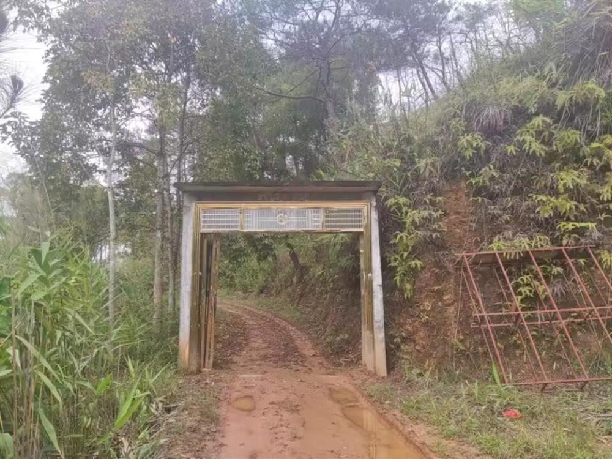
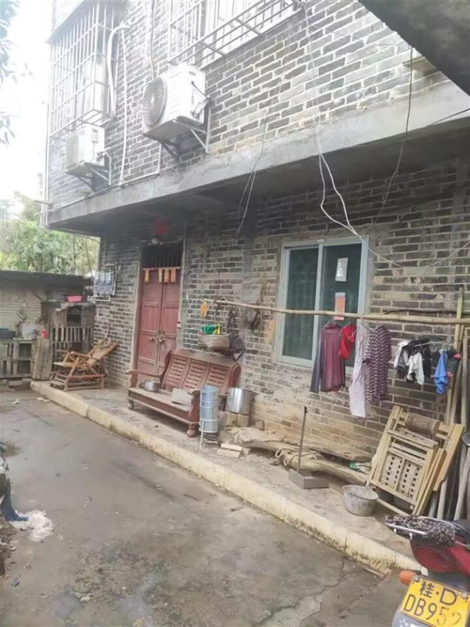
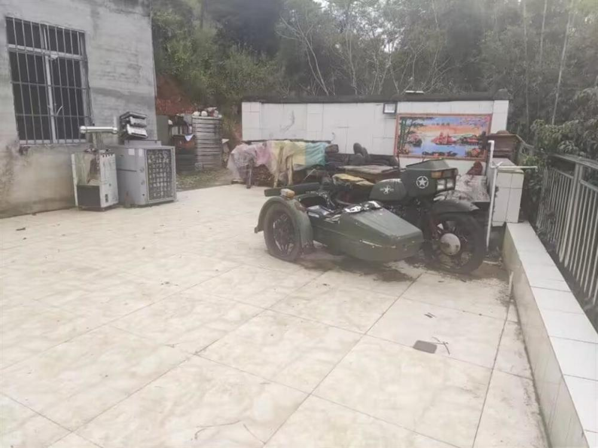
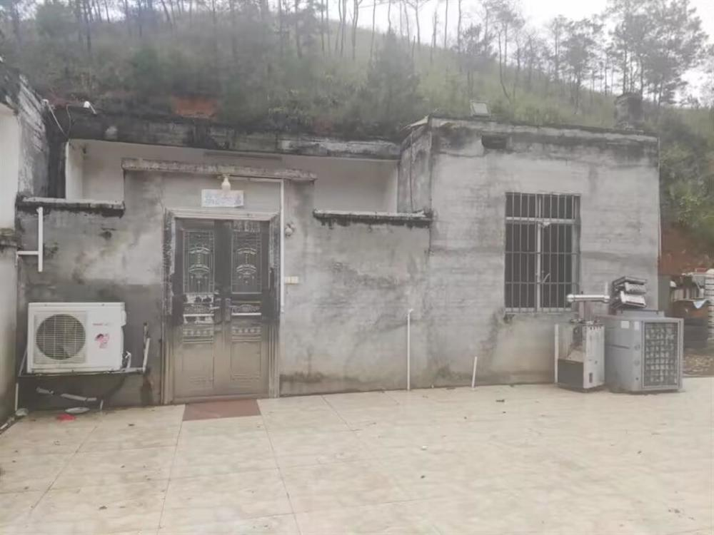
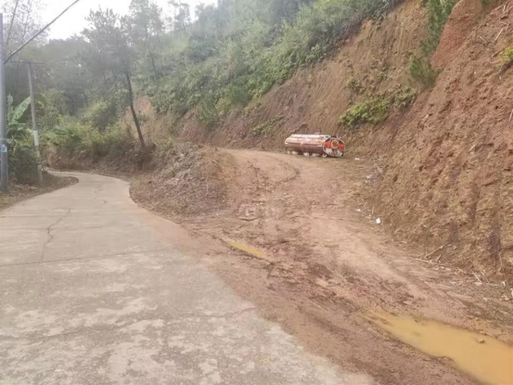

# 实探绑架藤县原县委书记的嫌犯住宅：出入口隐蔽，养有两条看家狗

极目新闻记者 张万军

2月10日，警方通报广西梧州藤县一村民伙同他人涉嫌绑架该县原县委书记黄东明的消息，引发舆论关注。11日，极目新闻记者实地探访在逃嫌犯陈克政的老家，发现该房屋和其兄弟、父母的房子相连，只有单独的一条路出入，比较隐蔽，且养有两条看家狗。

_到陈克政及其弟弟父母家之间的一个门_

2月10日12时许，极目新闻记者来到陈克政位于藤县新庆镇富荣村底村的老家。富荣村距离新庆镇大约8公里，是一个位于群山环抱中规模较大的乡村，有村民4000余人。陈克政的老家位于从新庆镇通往富荣村村道边的一条百余米长的泥土路的终点，该处只有三户人家，从外向里分别是陈克政、弟弟陈松、陈克政父母的家，目前三家的大门都紧锁着。

_陈克政父母的房子_

其中，陈克政的老房子是一栋宽约7米、长约12米的一层平房，房子大门紧闭，门口及周边堆放着一辆报废的摩托车、一些破废的机械、几件旧沙发等物品。和陈克政房子相邻的是他弟弟陈松的房子，也是一栋面积约80平方米的一层平房。最里面的一栋房子是陈克政父母的旧房子，是一栋三层楼房。该栋房子前面屋檐下，晾晒着一些衣服。极目新闻记者刚靠近三栋房子共同的院子，就有一条黑狗和一条黄狗冲到门口狂吠起来。

_陈克政家的院子_

记者在现场看到，这三家的房子都背靠山体，位于山体的中间位置，从上而下俯瞰村道，其间有茂密的树木隔离。其右下方数米远处有一栋民房，但从下方很难看到陈克政三家的情况。有报道称，1月12日下午，警方正是在陈克政弟弟陈松的家里找到了被绑架的藤县原县委书记黄东明。

_陈克政房子正面_

极目新闻记者采访了附近多位村民，他们均表示没有注意到警方到陈克政及其弟弟家展开搜查及解救人质的过程，有人是看到陈克政的通缉令后才知道此事的，有人是近期在网上才得知此事。记者向富荣村多名村干部了解陈克政家庭的情况，他们都表示不便介绍。

_从村道进入陈克政家的土路_

（来源：极目新闻）

