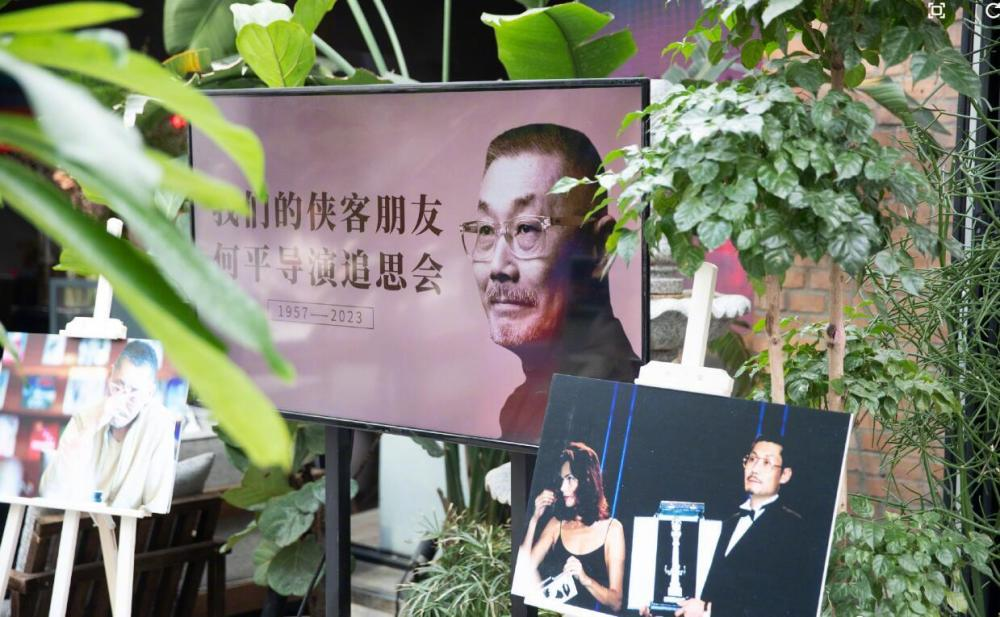
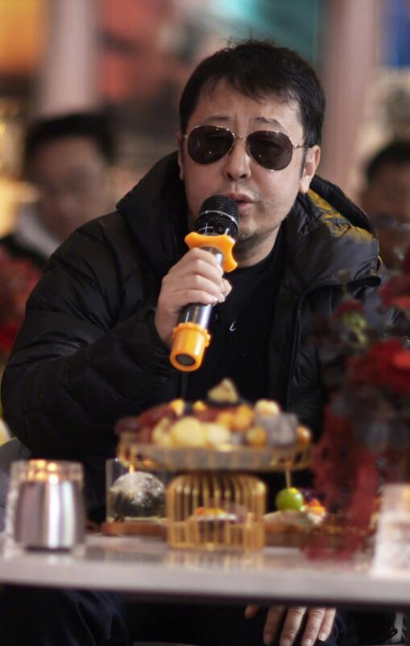

# 导演何平去世一个月，冯小刚、陈道明、张艺谋到场送别悲痛发言

2月10日是著名导演何平去世一个月的日子，这天由中国电影导演协会和西影集团在北京为他举办了追思会，追思会现场大咖云集，冯小刚、陈道明、陈凯歌、张艺谋、陆川等众多亲友到场送别故人。

何平导演在1月10日因病去世，得知何平去世的消息后，诸多导演、演员都纷纷发文祭奠。今日在“我们的侠客朋友——何平导演追思会“现场，众人集聚分享与何平导演的相处点滴，送他最后一程。

据资料显示，何平导演出生于1957年，代表作有《双旗镇刀客》《炮打双灯》《天地英雄》等等，其中他凭借《炮打双灯》获得第十四届金鸡奖最佳导演。

据报道，这场追思会选择了何平导演生前喜欢的形式来呈现，周围放置了许多绿色植物，像是一场老友们聊电影的聚会，洒脱随意又很温暖。

报道指，主持人刘仪伟开场后，冯小刚导演率先发言，冯小刚直言何平是自己踏入电影行业的“引路人”，冯小刚分享了与何平之间相识相交的点滴，还回忆了何平当年鼓励自己的话。何平曾在他执导的《甲方乙方》《不见不散》《大腕》等多部影片中担任监制，可见二人友谊深厚，冯小刚指，何平对中国电影市场化贡献极大，是中国导演与海外市场的桥梁。

导演张艺谋之后也发表了致词，送别老友，他对何平的离世感到很吃惊，回忆起两人当年在招待所聊电影聊到天亮的日子。最后他忍不住悲叹：“江湖从此再无何爷，我们都很怀念他。”

陈凯歌回忆了与何平导演等人在西影厂招待所聊电影创作的往事，他表示，“何平导演的溘然长逝是中国电影导演群体的损失。”最后，他还称身为好友为表达一份心意，希望在画像前为何平鞠三个躬。

陈道明作为中国电影家协会主席，与何平的交集并不多，但也曾一起喝过几次酒，他提及何平猝逝也十分惋惜与遗憾，陈道明表示：“我学高尔夫那么多年，终于学会了，他不在了，何平导演一直是我的一个榜样，我也希望能像他一样体面、率真的老去。”

报道还称，何平导演的儿子何邴杰夫作为亲人代表也有发言，向到场的嘉宾与亲友表达感谢。尽管他并未从事电影行业，但很佩服父亲的电影人生。

他还分享了生前与何平之间的对话，指父亲说他一生活得很精彩，没有太多遗憾。

追思会的最后，歌手栾树上台献唱，全场嘉宾在歌声中与共同的“朋友”何平导演做最后的道别，再见！

愿何平导演一路走好，天堂再无病痛！

