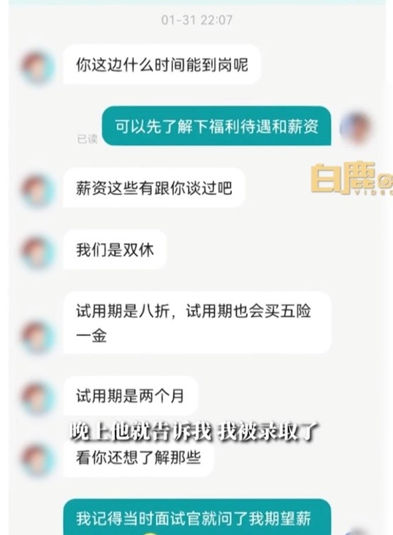
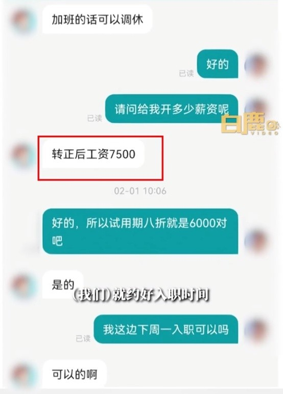
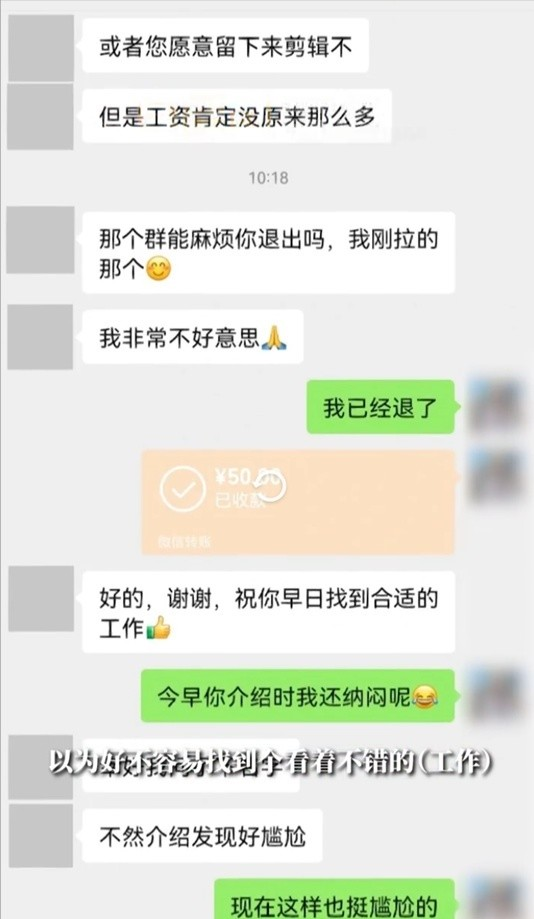

# 小伙入职1小时被HR告知招错人，“名字对不上，补偿50元”

2月11日，据白鹿视频报道，近日，在广东广州，25岁小伙入职第一天，被HR告知招错人补偿50元，引发网友热议。

聊天记录显示，1月31日，当事人吴先生曾与HR在招聘平台沟通，HR问他什么时候可以到岗，他表示想要了解一下薪资，HR称薪资已经谈过，公司是双休，试用期是八折，也会买五险一金。

吴先生表示自己的专业是视频剪辑，去公司面试的岗位也是剪辑岗位。当天下午面试完，HR告诉自己被录取了，期待薪资7000元，公司录取后给7500元。

随后，他们约了入职时间。当天在公司待了一个多小时，人事才来找吴先生说，名字对不上，招错人了。

“他们要招的是编导，不是剪辑，一直在说抱歉，补偿了50元打车费”，吴先生说。

HR跟吴先生说，如果愿意留下来可以剪辑，但是工资肯定没之前的高。随后，HR让吴先生退了公司群。

吴先生表示自己也很无奈，找了两个多月的工作，好不容易找到工作，公司还招错了。

对此，网友也表示不可思议，“不可能招错了，可能又不需要了”，“给了Offer了，可以劳动仲裁的”，“走后门的来了？”“招错了的概率比复活恐龙的难度还低”。

**【来源：九派新闻综合白鹿视频、网友评论】**

