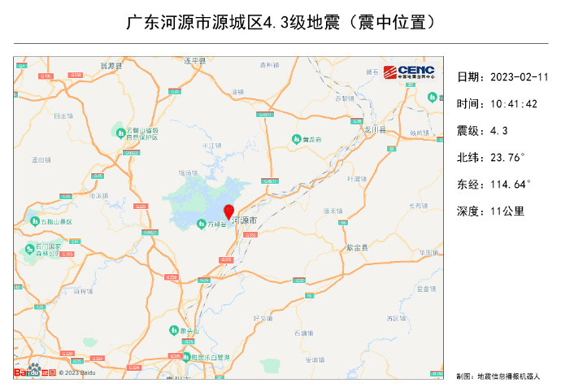
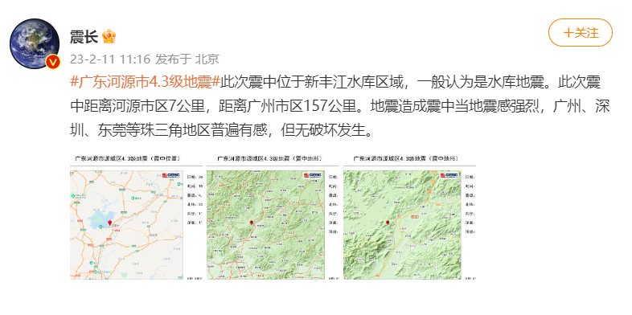

# 广东河源4.3级地震震中位于水库区域，一般认为是水库地震

中国地震台网消息，2月11日10时41分在广东河源市源城区（北纬23.76度，东经114.64度）发生4.3级地震，震源深度11千米。 ​​@震长
发布，此次震中位于新丰江水库区域，一般认为是水库地震。此次震中距离河源市区7公里，距离广州市区157公里。地震造成震中当地震感强烈，广州、深圳、东莞等珠三角地区普遍有感，但无破坏发生。
​​​

​

​

