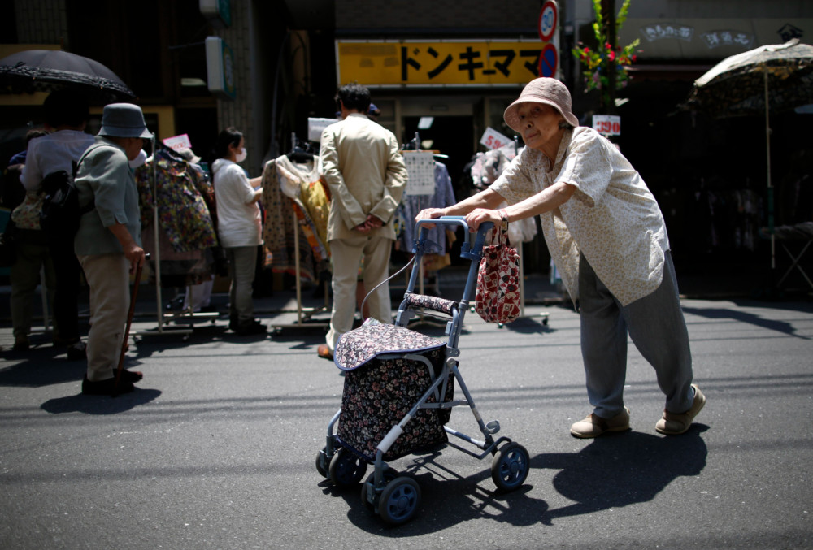
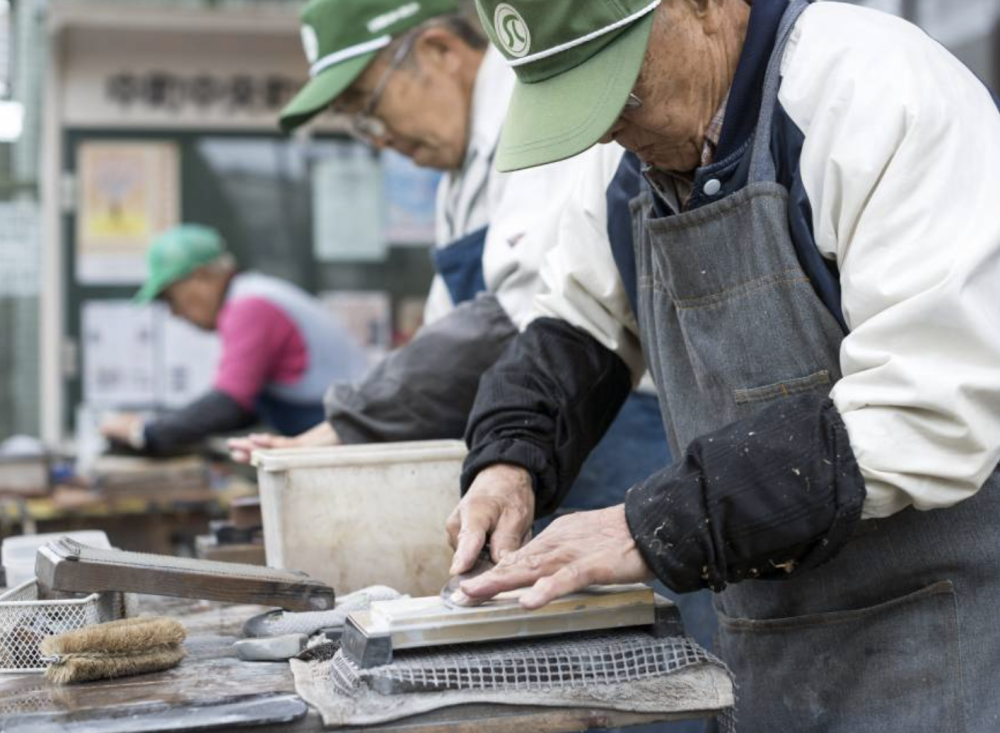

# 延迟退休到70岁的日本，如今怎么样了

本文来源：时代周报 作者：马欢

73岁的大岛良每天凌晨1点多就起床了，简单收拾一下后，便开着卡车出发，去往东京周边的菜市场上，将各类新鲜蔬菜打包装车，运给东京的餐馆。

这并不是一份轻松的工作，需要搬运的蔬菜盒子往往重达8公斤，73岁的老人搬起来费力又伤腰。

因为忙于工作，大岛良没有任何时间搞业余爱好，下午回到家后，匆匆吃完饭，晚上6点前就入睡了。

在做卡车司机前，大岛良曾是一名白领，年轻时也换过好几份工作。然而，随着日本延迟退休年龄，他在接近退休时发现，像他这样的合同工，这辈子注定享受不到企业提供的稳定退休福利，只能每月领取约6万日元（约合人民币3078元）的基本国民老金。

图源：社交媒体

“很累，其实我一点也不想工作，也不开心，”大岛良叹气道，医生说他的脊椎软骨磨损得厉害，“但没办法，为了活下去。”

20世纪70年代前，日本施行的是55岁退休制，70年代后，日本正式迈入老龄化社会。为了缓解养老压力，此后几乎每隔10-20年，日本政府都会修改法律，把退休年龄延长5年。

1986年，日本将退休年龄由55岁延迟至60岁，并在1998年实现退休义务化的全面化；2006年，退休年龄正式定在了65岁，于2013年全面普及。然而这并不是最终方案，自2021年4月1日起，日本政府宣布实施《改正高年龄者雇佣安定法》，正式进入70岁退休的时代。

延迟退休，意味着全社会要共同努力，鼓励老年人参与劳动，也意味着更多的老年人，必须活到老干到老。

对于日本政府、企业和个人而言，这是一个巨大的挑战。

**85岁的合同工**

85岁的饭田欣子是东京郊区一家美容专柜的销售员，每天除了在柜台销售护肤品，她还提供美容护肤服务。

饭田严格意义上并不算是公司的正式员工，她只是一名合同工，收入也是以销售的提成为主。但她为人亲切、经验丰富，销售业绩并不比那些年轻员工差。饭田的很多老顾客年龄都在65岁以上了，她说，“只要身体还允许，我就继续干这份工作。”

85岁在工作的饭田（图源：社交媒体）

每年的6月和12月是饭田最忙碌的时候，这两个月她要全力以赴冲业绩，争取在公司销售排行中榜上有名。

饭田的主管说：“饭田她们和客户的关系维系了很多年，建立了很深的信任。”

饭田这样的年长员工在日本随处可见，他们的存在，推动日本政府和企业逐步完善年长员工的就业问题。

日本政府正不断鼓励企业延长年长员工的工作年限。2021年4月，日本正式实施《改正高年龄者雇佣安定法》。该法案规定，日本企业可以通过提高或取消退休年龄以及返聘等方式，为有意愿工作到70岁的老年人确保就业机会。年满65岁的企业员工可以自愿留在原公司，也可以选择到其他公司再干5年，直至70岁后退休。

不过，这部法案并不具有强制效应。

在此之前，很多日本企业早已开始行动，比如发酵乳饮料制造商养乐多，该公司在日本本土至少有约5000名年龄在60岁以上的销售人员都是合同工，以女性为主，主要通过上门推销的方式销售饮料。

图源：社交媒体

许多大型日本企业仍然要求员工严格执行“两步走”的退休路线：必须在60岁时从高薪职位上退下来，然后以合同工的身份，在薪酬较低的岗位上继续工作10年，此后彻底退休。

大部分日本企业认为，把年长员工留在高级职位上会增加公司的成本。日本经济团体联合会就曾表示，延长年长员工的工作年限，会打击年轻员工的积极性，影响他们的晋升空间。

在这种观念下，即便是拥有特殊技能的专业人才，在接近或达到退休年龄后，也无法继续担任原来的工作，只能转为合同工、临时工或者小时工。而合同每年一签，随时可能会被企业辞退。调查显示，大部分企业员工的收入较60岁以前，减少了30%-70%。

数据还显示，这些老人们，主要被雇用为店员和收银员，占总数的22%，其次是运输业和制造业员工，占18%。由于幼儿园和老人院也非常缺乏人手，这些领域的临时工也有12%。此外，日本的酒店旅馆行业近来也积极聘用年长的服务员和厨房助理。

大部分老人们对此并不抱怨，而是默默承受，继续工作。

**打工来凑养老钱**

2022年，日本总务省汇总了2021年65岁以上人口的就业人数，比2020年增加6万人，达到909万人。这已经是该数据连续第18年增加了，再一次刷新了历史最高纪录。

目前，日本65岁以上人群的就业率为25.1%，65～69岁人群的这一比例为50.3%，首次超过50%。

破纪录的数据背后，是日本劳动力和养老金问题日趋严重。

图源：图虫创意

截至2022年9月15日，日本65岁以上的老年人有3627万人，与前一年相比增加了大约6万人，老龄化率已经达到29.1%。日本国立社会保障与人口问题研究所的预测报告显示，到2050年，日本劳动力人口（15岁至64岁）将减少为5275万，65岁以上老人占比则将上升至38%。

同时，日本通过社保制度向全民支付的养老金、医疗等社保支出也连年创新高。日本养老金的缺口，在1995年为4295亿日元（约合人民币223亿元），到2020年，已超过13万亿日元（约合人民币675亿元）。

缺口需要靠发行债务等手段来填补。截至2022年6月，日本的公共债务估计为8.7万亿美元（约合人民币59万亿元），占日本国内生产总值的比例高达惊人的266%，位列全球发达国家榜首。

为了解决老龄化导致的劳动力不足、缓解社保资金压力，日本政府不得不推进延迟退休。而对于大部分日本老人说，在退休后工作，更是不得已的事情。

2019年6月，日本金融厅发布报告称，如果一对日本退休夫妇，男性年龄在65岁及以上、女性在60岁及以上，退休后再活30年，就需要在领取养老金的基础上，还拥有2000万日元（约103万人民币）的金融资产，才能维持正常老年生活。

但日本目前户主为老人的家庭，拥有超过这个储蓄金额的仅有39.5%。

存款不够，打工来凑。

NHK纪录片《老后破产：名为“长寿”的噩梦》中，展示了老龄化背后社会现实。即便年轻时年收入超过1000万日元的中产精英，最后也不免因为经营失败没有工作，成为老后破产大军的一员。

日本总务省统计局数据显示，日本65岁以上老人的贫困率达到27%。

乐观的人依然乐观。饭田就表示，年轻的时候，丈夫曾希望她在家里当全职妈妈，照顾两个孩子。所以她有好几年时间都是白天背着丈夫工作，下班回家准备午餐和晚餐。好在她坚持下来了，一直工作到现在。

如今，饭田的丈夫已经去世20多年了。她认为自己算是幸运的了，毕竟更多的老人只能打零工，工资也不如她，只能拿最低水平的工资，例如去便利店和饭店当店员。“人生永远充满竞争。”她说。

