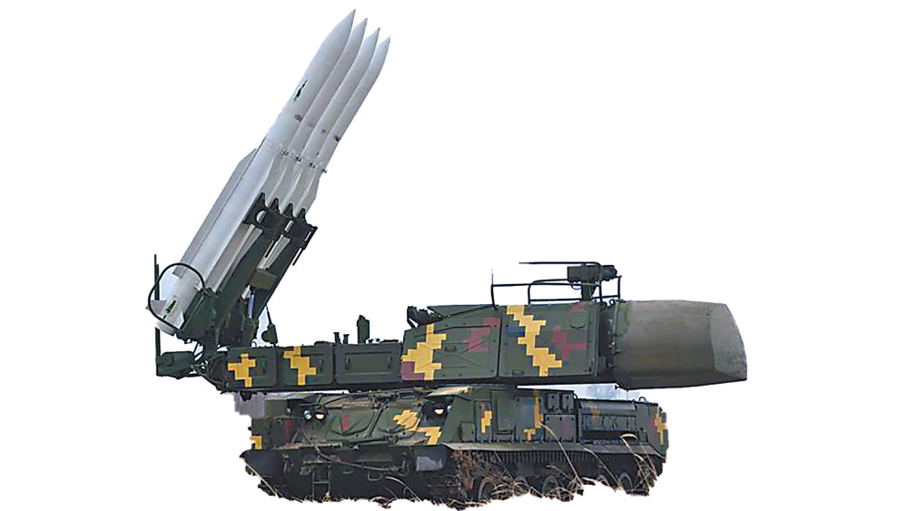
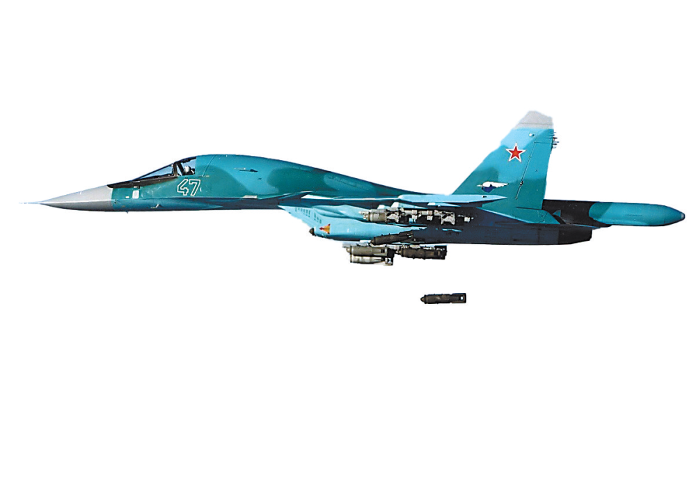

# 影响俄乌冲突进程的关键装备：谁在主宰乌克兰天空？

【环球时报特约记者
晨阳】不同于美国几次发动局部冲突时的“恃强凌弱”，俄乌冲突交战双方的实力差距没那么悬殊，再加上俄罗斯、乌克兰和北约投入了大量先进武器装备，因此这次“冷战后规模最大、持续时间最长的局部冲突”也被全球军事界看作是最新军事战略和武器装备的“试金石”。时值俄乌冲突爆发临近一周年，《环球时报》策划了“影响俄乌冲突进程的关键装备”系列报道。

**相似的开局，不一样的后续**

按照西方流行的军事理论，现代战争的开端通常是以大规模空袭和导弹打击拉开序幕，目的是摧毁对手的防空系统、指挥控制中心、部队集结地、机场和弹药库等关键目标，使对手难以组织有效防御和反击，从而为地面攻势扫清障碍。

俄乌冲突同样是以俄空天军发动的大规模空袭开始。英国皇家联合军种国防研究所的评估报告显示，俄军在2022年2月24日俄乌冲突爆发当天出动了约300架次战机，发射了超过100枚战术弹道导弹和巡航导弹。外界一度认为，拥有装备优势的俄军将迅速掌握制空权，并通过高强度的对地攻击转化为战场优势，因此俄乌冲突后续进程将与此前几次局部冲突类似。

这种推断来自俄乌双方的空军实力对比。根据西方情报部门的评估，俄乌冲突爆发前，乌克兰空军只有米格-29、苏-27战斗机各约30架，以及若干苏-24战斗轰炸机和苏-25攻击机。它们大都落后于时代，与俄空天军相比不但在数量，而且在质量上也明显落在下风。俄空天军的苏-57、苏-35、苏-30SM等先进战斗机在探测能力和导弹射程方面占据优势，针对乌克兰空对空导弹的电子对抗措施也更有效。

但出乎外界预料的是，俄空天军发动的第一波打击在持续时间和规模上都相当有限，远低于预计水平。特别是俄空天军未能有效压制乌克兰空军和防空系统。五角大楼的统计显示，俄空天军的出动规模一度下降到每天100架次的规模，远远低于美国在局部战争中的战机出动频次。在1991年的海湾战争中，多国联军空军平均每日出动3000架次；在空袭南联盟期间，北约空军平均每日出动规模也在400架次以上。尽管此后俄空天军组织过几次大规模空袭，但平均每日出动架次仍只有140架次左右，相对于乌克兰庞大的国土面积而言，这样的空袭力度远远不够。

在此期间，俄空天军还遭受到惨重的损失。尽管乌军宣称“击落上百架俄军战斗机”的说法不太可信，但通过社交媒体流传的视频和照片可以确认，俄军苏-35、苏-30SM战斗机、苏-34战斗轰炸机与卡-52武装直升机等先进型号都被击落。

对于为何出现这样的情况，外界说法不一。西方普遍的观点认为，俄空天军飞行员训练不足，通信指挥链路不畅，战机缺乏实时对地打击能力。而且俄军战机配备的精确制导弹药数量过少，绝大部分任务中投掷的都是无制导炸弹，因此不得不采用低空投掷的方法以提高命中精度，但这反过来又给了乌军便携式防空导弹偷袭的机会。

而俄“自由媒体”网站则认为，俄空天军很快已认识到俄乌冲突将持续相当长时间，需要保持足够的战力以备北约突然武力介入。因此俄军虽然在俄乌边境地区部署了数百架各型战机，但保留了最精锐的空中力量用于对北约的威慑，这在很大程度上影响了俄空天军投入战场的能力。

无论如何，此后俄乌冲突的空中战场出现奇怪的情况：俄军拥有理论上的制空权，但并没有能将其转化为战场优势。俄军地面部队得不到来自空中力量的侦察、支援和掩护。尤其是出于对乌军防空系统的忌惮，俄空天军战机很少在乌克兰西部出现，主要依赖“伊斯坎德-M”弹道导弹和从俄罗斯境内发射的空射巡航导弹对乌克兰西部基础设施和重要目标进行打击。而乌克兰空军虽然在俄乌冲突爆发时进行了及时疏散，得以避免战机全部在地面被摧毁的命运，但毕竟整体实力与俄空天军相比差距过大，所谓“击落40架俄军战机的乌克兰王牌飞行员‘基辅幽灵’”不过是乌克兰的战时宣传。如今乌克兰空军已经沦为一支“存在空军”，虽然仍偶尔起飞战机，但很少实际参战。

**首次基于导弹和无人机的消耗战**

为了夺回制空权，先进战斗机一直是乌克兰重点争取的军援项目。乌克兰总统泽连斯基9日在欧洲议会发表演讲时敦促欧盟“坚持到底”继续为乌克兰提供支持，包括提供先进战斗机。但西方多国对此态度犹豫，除了担心此举激怒俄罗斯外，也质疑乌克兰能否用好这些昂贵的现代化装备。

考虑到乌军飞行员的驾驶习惯，最初美欧都倾向于直接向乌克兰提供俄制战斗机。去年3月，波兰曾建议将该国装备的米格-29战斗机转交给乌克兰。但在具体交付问题上，美国与波兰意见不一，该计划被放弃。今年1月，俄罗斯卫星网称，波兰曾以散件形式秘密向乌克兰移交了一批米格-29。

随着乌军原先装备的俄制战斗机相继战损，再加上北约拥有的俄制战斗机数量太少，性能也普遍落后，乌克兰近来一直要求直接提供西方现代化战斗机。公认最适合乌克兰空军的西方战斗机是美制F-16战斗机。因为它的维护相对简单，具备多样化作战能力。乌克兰空军发言人伊格纳特宣称：“两个由12架F-16战斗机组成的中队，再加上预备队，就足以帮助扭转局面，对抗俄罗斯的空中力量。”

美国《商业内幕》网站2月5日则认为，瑞典“鹰狮”战斗机更符合乌克兰的实际需求。这种轻型战斗机本身就是冷战时期为应对可能与苏联爆发的冲突而研制的，在设计上强调减少对地面设备的依赖，可在糟糕的战备公路上起飞。“动力”网站还透露，英国有可能向乌克兰提供“台风”战斗机，法国也暗示可以提供去年退役的“幻影2000”战斗机。但伊格纳特承认，即便是乌军现役飞行员也需要经过半年甚至更长时间的培训才能驾驶西方战斗机起飞参战。此外，西方战斗机大都需要高质量的混凝土跑道，但乌克兰西部可以利用的空军机场不但数量有限，而且设备简陋、跑道现状堪忧。

相比于乌克兰执意要求西方提供先进战斗机，美欧方面更青睐强化乌克兰的防空能力。美国《防务新闻》称，美国和其他国家给乌克兰的武器应该与制胜战略保持一致，“将乌克兰推向西方制空权之路，无助于他们取胜。”报道称，俄乌冲突的教训是，当代空战更倾向于利用机动的地面防空系统，而不是昂贵的固定翼飞机获得制空权。“乌克兰试图依靠西方援助的先进战斗机获得制空权的任何尝试，都将是一个代价高昂的错误”。

相比于乌空军战斗机的战果寥寥，乌军防空导弹对俄军战机的活动构成很大威胁。报道注意到，去年10月以来，俄军大量发射远程导弹和无人机袭击乌克兰基础设施。西方普遍认为俄军此举是意图加大对乌克兰政府的压力。但《防务新闻》称，俄军这些攻击可能有另一种军事逻辑：通过消耗取得制空权。报道称，面对俄军更先进、数量更多的战斗机，乌克兰通过分散和机动的防空系统——开火后迅速转移到新位置——以避免被摧毁。这种战法让俄军战斗机无法发挥制空权带来的优势，并在战场上伤亡惨重。

报道称，“俄军从错误中吸取了教训并调整战略，转而使用导弹和无人机来削弱乌克兰的防空系统。虽然当前俄军没有能力及时找到并摧毁足够多的乌克兰机动防空系统，但通过大规模发射无人机和导弹攻击，让乌军防空系统过度消耗宝贵的地对空导弹，也可以达到同样的效果——乌军防空系统因无弹可用而哑火。”美媒认为，“俄乌冲突是世界上第一次基于导弹和无人机的空中消耗战”。虽然西方向乌克兰援助了大量防空系统，仍远远无法满足战场消耗，这种局面才是当前乌克兰最需要警惕的。

**无人机成“天空主宰”**

在昂贵的有人驾驶飞机面对防空系统处处受限的情况下，无人机成为俄乌冲突中的“天空主宰者”。俄乌冲突前期，乌军从土耳其进口的“旗手”TB-2武装无人机非常活跃，协助乌军地面部队取得了一系列战果。五角大楼评估报告称，之前各国军事专家普遍认为，这类非隐形无人机很难在现代化的防空系统面前存活，因此美军在发展无人机时努力强化高速、隐形等高技术特征。但俄乌冲突中，性能并不先进的TB-2面对俄军强大的防空系统仍频繁出手，接连摧毁大量坦克、火炮等重型装备，在蛇岛附近海域击沉俄黑海舰队的多艘“猛禽”级高速快艇，并引导乌军炮兵精确打击俄军目标。更让西方军事观察家吃惊的是，TB-2还摧毁了伴随俄军机械化部队开进、提供空中掩护的“道尔”“山毛榉”系列野战防空系统，创造了现代无人机作战的新纪录。美国专家的相关分析认为，尽管这些野战防空系统理论上是“无人机克星”，但它们配套的雷达难以连续开机警戒，乌军无人机往往能抓住俄军防空系统的这些漏洞发动致命攻击。

除了TB-2无人机外，乌军还改装了大量民用无人机用于侦察和轰炸，甚至用它们向战壕里的俄军士兵投掷迫击炮弹。但这种战法也导致乌军无人机的消耗速度很快。最近几个月乌军用少数改装的老式图-141无人机对俄境内目标发动远程攻击。目前乌克兰正要求美国提供更先进的“灰鹰”武装无人机，但美国政府还没有松口。

相比乌军在无人机创新使用方面的有声有色，忽视无人机发展的俄军在俄乌冲突初期非常被动，仅有的“海鹰-10”等无人机被证明已落后于时代，俄军不得不利用电子干扰、激光武器等各种软硬防御手段来对付乌军无人机。但从去年10月开始，俄军利用“天竺葵-2”自杀无人机对乌克兰基础设施发动一系列大规模空袭。这种无人机最大航程达1000公里，以民用摩托发动机为动力，配备简单的导航系统，最低造价只有几千美元，而用于拦截它的乌军防空导弹造价高达数十万甚至上百万美元。对于这种廉价无人机，乌克兰和西方始终没有合适的应对手段。

