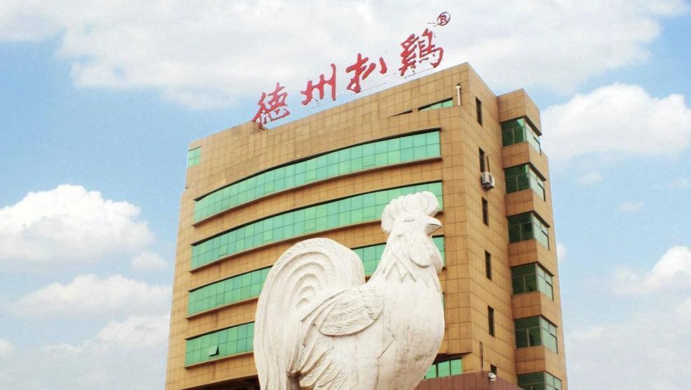
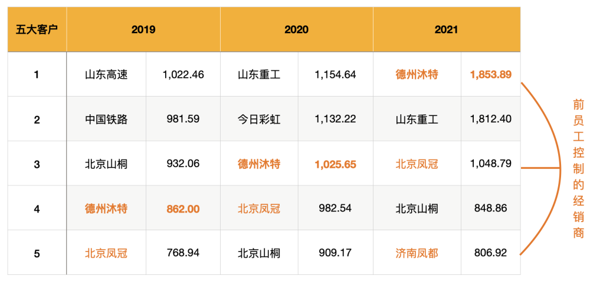
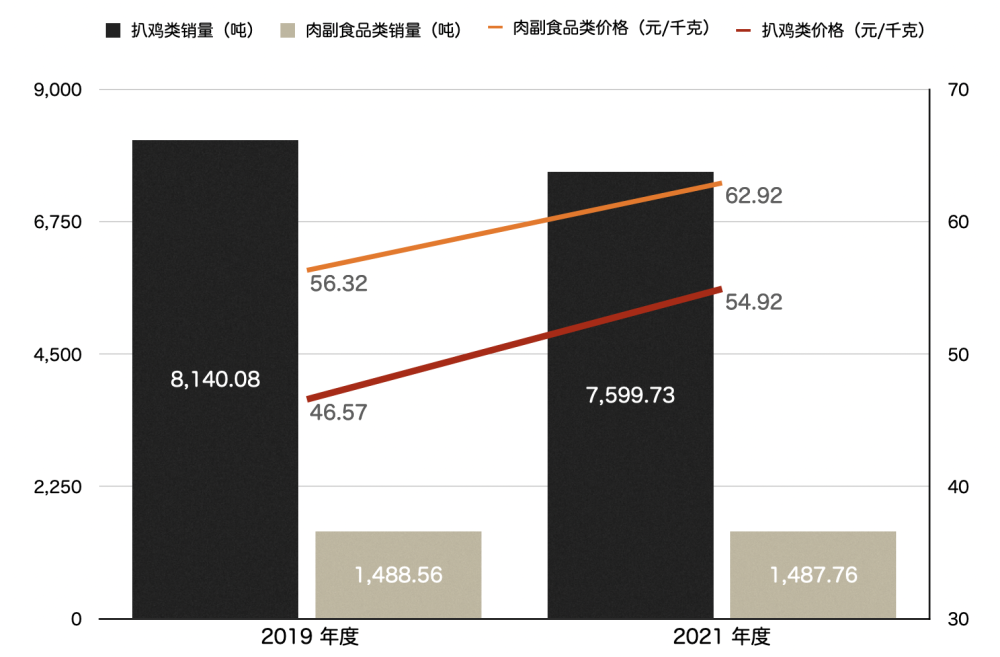
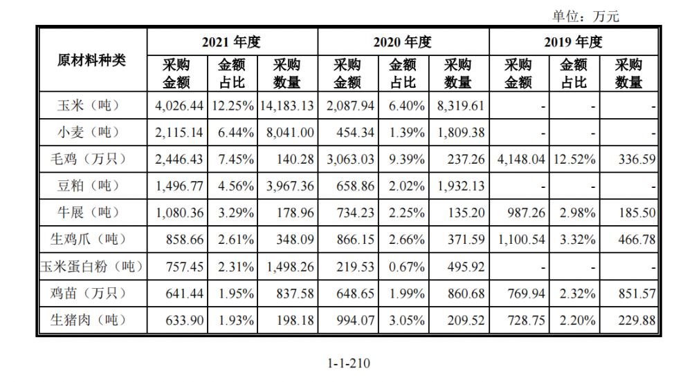

# 德州扒鸡申请上市遭证监会51问：是否存在利益输送、铁路不再是大客户

_山东德州扒鸡股份有限公司_

山东德州扒鸡股份有限公司（以下称“德州扒鸡 ”）的上市之路，有了新进展。

近日，德州扒鸡IPO申请获证监会反馈，监管共提出多达51个问题、接近2万字的反馈意见，涉及公司历史沿革合规性方面，前员工控制加盟商、食品安全、广告宣传多个方面。

值得注意的是，全面注册制下，主板IPO红绿灯规则有变。澎湃新闻从投行人士处获悉，产品为食品、家电、家具、服装鞋帽等相对传统、行业壁垒较低的大众消费企业，从事快消餐饮连锁业务企业，经营稳健但没有多少成长空间的为黄灯行业，上市或受限。而德州扒鸡，似乎在黄灯受限行业中。

**股权转让存在多处瑕疵**

招股书数据显示，崔贵海、崔宸、陈晓静分别直接持有公司股份2255.40万股、2000万股和200万股，持股比例分别为
25.06%、22.22%和2.22%；崔贵海与陈晓静为夫妻关系，崔宸为两人之子，上述三人通过直接持股、间接持股合计控制公司60.06%的表决权股份，为公司共同实际控制人。

德州扒鸡虽为家族企业，但自然人股东较多。

据招股书披露，扒鸡集团原主营业务为扒鸡等卤制品的研发、生产和销售，以及酒店餐饮等业务。为做大做强扒鸡主业，扒鸡集团、崔贵海、焦林杰等110名股东发起设立扒鸡股份，专业从事扒鸡等卤制品研发、生产和销售。从2010年成立至今，德州扒鸡共进行了15次股权转让。截至2021年12月最后一次股权转让后，德州扒鸡的股东人数达到106家，其中自然人股东90多位。

证监会在近期的反馈意见中对股东的实际数量产生了疑问，要求发行人说明是否存在或曾经存在股东人数超过200人的情形，是否存在通过股份代持方式规避200人规定的情况。

扒鸡集团历史股权转让存在多处瑕疵。澎湃新闻还注意到，2010年，发起扒鸡股份时，扒鸡集团股东共有42人。2012年，扒鸡集团退出时，却只向39位自然人转让，且原股东与受让名单并非一致。

原始的42人之中，只有33人出现在扒鸡集团的股权的受让名单，该名单还增加了7名新员工。虽然未出现在受让名单中的9人，有7位老员工持股体现2010年扒鸡股份设立的发起人之列，但仍有持有出资比例达1.73%的第五大股东吴英溟、出资比例0.04%的周胜民两位老员工的持股流向成谜，是否向新增7位新员工转让，还是另做退股处理，扒鸡股份没有对此次股权转让说明相关股权转让细节。

2012年9月26日，多位员工将持有的合计79万股以4.6元/股的价格转让给外部投资者胡振强，但不到三个月时间，胡振强以8.75元/股的价格将手中全部79万股转让给天图投资，净赚327.85万元。那么胡振强是谁，招股书除冠之以“外部投资者”外，无任何说明。

更蹊跷的是，天图投资进入之后，德州扒鸡的股价却出现下跌。新外部投资人钟兵，在2014年12月，以7.25元的价格，受让200万股份； Gloryfarm
Investments Limited 和Marlus Investments Limited，以同样的价格在同月以同样的价格受让520万股。

这种情况不止出现一次，2021年初，天津天图、深圳天图、马亮亮等34名股东以16元~17.65元的价格转让德州扒鸡股份，2021年10月，股东恒丰汇富与海南颐和签署股份转让协议时，股价再次回落到15元/股。

这同样引发证监会关注。

证监会近期在反馈意见中同样要求德州扒鸡说明历次增资、股权转让的背景、原因及合理性、价格及定价依据（结合对应上年及股权变动当年的市盈率说明），说明前后次增资或股权转让价格存在差异的原因及合理性；增资或股权转让价款支付、资金来源、税收缴纳等情况，是否存在出资不实的情况，是否存在利用低价转让规避税收缴纳义务的情形；历次增资、股权转让是否履行公司决策和有权机关核准程序，股权转让是否真实，历次股权变动是否存在纠纷或者潜在纠纷，是否存在委托持股、利益输送或其他利益安排等等。

**2021年，五大客户中三大均被前员工控制**

德州扒鸡是人们记忆中的美食，在高速服务区、火车上，人们远途出行时，德州扒鸡的“出境率”较高的地方特产。2019年，德州扒鸡的第一大客户就是山东高速集团旗下公司，第二大客户是中国铁路北京局集团有限公司等，采购金额均在千万级别上下浮动。那一年，德州扒鸡的营收规模在6.87亿元。

2020年，疫情暴发的第一年，“高速”与“铁路”两大客户就此消失在德州扒鸡的五大客户名单上，取而代之的是山东重工集团旗下公司与北京今日彩虹商贸有限责任公司。北京今日彩虹商贸有限责任公司在2020年度销售金额达1132万元，但是这样千万级别的大客户“昙花一现”，并没有出现在前后2019年及2021年的五大客户中。2020年度，德州扒鸡的营收规模维持在6.82亿元。

2021年，德州扒鸡的销售规模达7.2亿元。但是，其前五大客户名单再次出现变动，德州沐特商贸有限公司（简称“德州沐特”）、山东重工集团旗下公司均以1800万元以上的销售金额，成为第一大及第二大客户。

其中，德州沐特成立于2019年，当年就成为德州扒鸡的第四大客户，其采购金额没有受到疫情影响，在2019年-2021年实现三级跳，分别为862万元、1025.65万元、1853.89万元，2021年的销售规模同比增长达80%。

_制图：澎湃新闻记者 戚夜云_

2021年，德州扒鸡的前五大客户中第三大至第五大客户，分别为北京凤冠呈祥食品有限公司等（简称“北京凤冠”）、北京山桐商贸有限公司、济南凤都商贸有限公司（简称“济南凤都”）。其中北京凤冠呈祥食品有限公司等采购规模也是年年攀升，2019年-2021年的销售规模分别为768.94万元、982.54万元、1048.79万元。北京山桐商贸有限公司采购金额逐年递减，而济南凤都则是首次出现在五大客户名单中，销售规模达806.92万元。

然而，德州沐特、北京凤冠、济南凤都均为德州扒鸡前员工控制经销商，也就是说营收规模实现正向增长的2021年，前五大客户中的三大客户均被前员工控制经销商。证监会要求德州扒鸡披露前员工控制经销商的基本情况，允许前员工控制经销商加盟的原因及商业合理性，以及前员工控制经销商的销售收入、毛利及占比，销售价格和毛利率与发行人其他经销商、直营店是否存在显著差异，是否存在未披露的前员工控制经销商或者实际控制人、董监高、关键岗位人员及相关方控制的经销商。

**主要产品销量下滑**

2019年-2021年，德州扒鸡实现营业收入分别为6.87亿元、6.82亿元、7.2亿元；对应实现的归属净利润分别为1.22亿元、0.95亿元、1.2亿元。澎湃新闻注意到，2021年虽然在营收规模上保持正向增长，但是这种增长却是依赖“涨价”而促成的，德州扒鸡的核心产品的销量出现下滑。

德州扒鸡主要产品分为扒鸡类与肉副食品类。剔除2020年疫情影响来看，2019年扒鸡类销量为8140.08吨，2021年降为7599.73吨；肉副食品类在2019年销量为1488.56吨，2021年微降至1487.76吨。

在销量下降的前提下，德州扒鸡营收似乎更多依靠产品涨价，2019年，扒鸡类销售价格为56.32元/千克，2021年增长至62.92元/千克；而肉副食品类在2019年与2021年的价格分别为46.57元/千克、54.92元/千克。

澎湃新闻还注意到，核心产品扒鸡的原材料毛鸡与鸡苗采购量也在逐年下滑，2019年-2021年的毛鸡采购数量为336.59万只、237.26万只、140.28万只；鸡苗三年对应的采购量为851.57万只、860.68万只、837.58万只。

与数据呈现相反的是，德州扒鸡称，随着公司食品制造业务的不断发展和产品销售规模的持续扩大，公司德州生产加工配送中心的扒鸡生产线的产能基本实现了充分利用，在销售旺季，产能已达饱和，无法进一步满足市场对公司产品的需求。

然而，事实情况是，2021年，德州扒鸡无论是产能利用率，还是产量，以及销量均低于2019年水平。

2021年，德州扒鸡的扒鸡类产能达8648.01吨，产量7790.05吨，产能利用率是90.08%。2019年，德州扒鸡的扒鸡类产能达8445.87吨，产量8108.06吨，产能利用率是96%。

德州扒鸡称，此为保持并扩大公司的行业领先地位，公司需要增加资本性投入以扩大产能。如公司低温产品特性导致运输半径较短，目前只能覆盖山东及京津冀周边省份，产品配送半径限制已经成为制约公司未来营业水平持续增长的主要瓶颈。希望开拓江浙沪等优质区域，以扩大公司产品市场的占有率。

本次IPO，德州扒鸡拟募资7.5778亿元，其中4.5亿元用于德州扒鸡（苏州）有限责任公司新建食品加工项目、7094万元用于速冻扒鸡生产线建设项目、2.4亿元用于营销网络及品牌升级建设项目建设。

不过，证监会要求德州扒鸡说明，此次募集资金数额和投资项目是否与发行人现有生产经营规模、财务状况、技术水平和管理能力等相适应。请结合发行人产能利用情况，说明上述募投项目必要性，是否符合成本效益原则。

