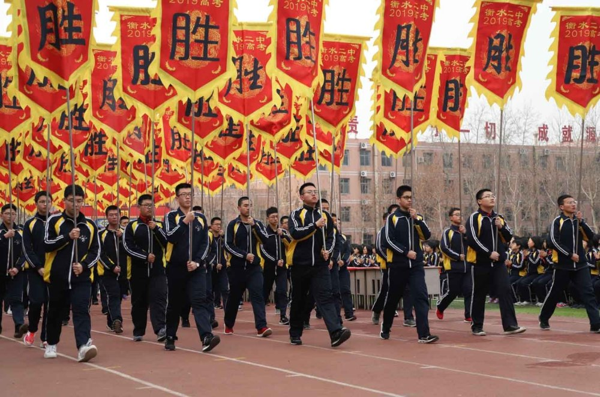

# 爱恨衡水二中：高分、求救与伤痕

_2019年2月26日，衡水二中高三年级举行高考励志动员大会，百面“胜”字旗方队入场。
（视觉中国/图）_

2023年2月6日清晨6点45分，天仍未亮。河北省衡水市问津北街街道两侧，商贩们纷纷走出店面，在零下3℃的黑暗中临街摆摊，卖校服、床单与早餐。衡水市第二中学暨河北衡水外国语学校（以下简称衡水二中）校门口时不时有学生进入，喇叭循环播放着“请送完学生的家长迅速离开，不要在校门口聚集”。

这一天，正是衡水二中高一、高二学生开学的日子。相较前一天学生返校放行李时将街道堵得电摩托都难以通过的情形，开学日人流已少了很多。

十多天前，一篇控诉衡水二中教学管理模式的文章《衡水二中学生的发声，救救我们》在网络流传，引发舆论关注。发文者自称是衡水二中学生，因抑郁问题处于休学阶段，并诊断出左脚脚趾骨折，正在医院住院治疗。文章表示，在衡水二中，教师以体罚、辱骂逼迫学生出成绩，吃饭时间安排、宿舍纪律要求、跑操要求等不合理，身边有不少同学出现心理问题。

但在风暴中心，这样的控诉不是新闻。多位衡水居民称未曾听说这封“求救信”，但对衡水二中采取的教学模式早有耳闻。在了解文章内容之后，校门口卖校服的商贩对南方周末记者说：“不严不出分，总不能和小学老师一样吧。”

商贩的看法并非孤例。“它那个环境一定能造就人才。”一位孩子正在衡水二中就读的家长如此说。一位孩子毕业于本地另一所高中的家长也对衡水二中模式表示理解：“不过分的（体罚）差不多都能接受。”

作为河北省的高考名校，衡水二中自2004年强势崛起后成就不断，争议亦不断。不是所有人都能接受它，适应它，成为被它“造就的人才”。十年前曾在衡水二中就读的边丽向南方周末记者讲述，两次挨了老师的巴掌后，她转学回到老家；这段糟糕的回忆也给她带来绵延至今的后遗症，“做什么都害怕”。

因一封“求救信”而被全社会审视的，或许是衡水二中内部已长期存在的教学模式。2023年1月29日，南方周末记者致电衡水二中办公室，接线的工作人员当时告知，学校在放假，要等校领导回来后方可对“求救信”作出回应。开学后，南方周末记者于2月8日再次致电，说明来意后，对方挂断了电话。

制度：罚站、罚蹲、跑饭、跑操

作为衡水本地人，夏淳在入读二中前就听过，二中有“严格的军事化管理”，但她没得选。中考结果出来，她的分数够不上本地最好的衡水中学，按照学校实力排位顺下来，她只能去二中。

最初，二中给她的印象不错。夏淳初中便就读于一所管理严格的学校，甫入高中，她发觉二中的环境、饭菜比初中好。高一疫情期间，漫长的网课也令她对校园生活感受不深。如今回头来看，她觉得会有那样的感受，或许是因为“心理预期过于低了”。

进入高二，线下授课恢复后，夏淳逐渐体验到了过去传闻中的种种制度。她向南方周末记者提供了一份手写的其所在班级作息时间表，从清晨5：30至夜晚11点，学生们的一天仿佛被一张细密的网包裹起来。

与网相配合的是各类细致的管理制度与规定：跑操不能掉鞋、摔跤；叠被子需叠成豆腐块；13：40至14：40、22：05至23点不得去厕所，不一而足。

学生在校内时间颇为紧凑。夏淳回忆，三餐用餐都只有15分钟左右，为了节省时间，会有许多学生买了早、晚餐后，用袋子装好，走在路上用手抓着吃。因为“跑饭”时太急而不慎摔倒的也大有人在。

紧凑生活中不时出现种种惩罚。“求救信”中称，衡水二中存在严重的老师体罚学生现象，包括罚站、罚蹲。多位受访者也告诉南方周末记者，他们曾亲身经历或见证过同学遭遇体罚。

夏淳回忆，罚站通常是少数几个人，但罚蹲几乎人人都经历过。她曾因违反规定在晚上11点前去上了厕所，而被罚站一天。罚蹲原因是月考偏科——单科班级排名与总分班级排名差10名及以上，一罚就是一个月，每天都要蹲上一节晚自习。

跑操亦被学生视为常见体罚手段。夏淳称，跑掉鞋、摔跤、队列不齐均可能导致加圈，至于加圈数量则看老师心情。一次，夏淳被罚跑了五圈，跑完后她一吃饭就吐了。

最为严厉的惩罚或许是挨打。在南方周末记者采访的6位衡水二中在读生或毕业生中，大多数称自己没有被老师打的亲身经历，边丽是个例外。进入高二后，一次老师让边丽打扫卫生，她因理解偏差漏了打扫宿舍。老师发现后问她，边丽认为没有犯错，反驳了老师。边丽回忆，那时自己“态度可能不太好”，老师便给了她脖子一巴掌。

挨了一巴掌后，边丽闹着要转学，学校把打她的老师换了，她暂时打消了离开的念头。约莫一个月后，她做错了一道数学题，老师让她站上讲台，随后，她的脖子又挨了一巴掌。边丽决定转学，回到老家读书。

目前就读于衡水二中的刘珂说，她对于诸如跑操、内务、体罚等制度习以为常，却难以忍受校内各类测试与训练一轮轮的打磨：早晚饭前后15分钟要做物理或历史题，中午有常占用午休的语文及英语自助训练，每天前三节晚自习有限时训练，还有周测、月考等。2022年，因疫情导致封校，她在学校待了近100天，一度产生过放假离开学校就不再回来的念头，“不想再体会那种生活”。

升学率：“薄弱学校的破壁之道”

最初，衡水二中并非如今的模样。

衡水二中创建于1996年，2003年晋升为省级示范性高中。河北省教育厅主办的河北教育网显示，当时，与许多省级示范性高中相比，衡水二中面临着“建校晚、实力弱、没有优质生源、没有雄厚师资、没有高效管理、整体办学成绩亟待提升等诸多发展难题”。

2004年，衡水二中的“灵魂人物”、现任校党委书记秦海地来到衡水二中担任校长。他当时面临的状况是，学生入学的中考成绩一般都排在全市千名以后，市区的很多学生宁可辗转上百里路到各县中学去上学，也不愿去二中。另据《河北教育》，到2005年前，被二中录取的学生报到率不到50%。

秦海地提出“低进优出”的办学理念。他在2012年发表的文章《一所薄弱学校的“破壁”之道》中解释：“低进是指学校面临的现实——学生入学的标准低，即入学成绩较低；优出是指我们追求的目标——学生升学的质量高，综合素质优良。”

为了实现这样的改造，一整套改革措施很快付诸实施。据秦海地自述，来到二中不久，他就将办公楼定名为勤耕楼，除非出差，他总是第一个到校。他试图在校内形成“一切用质量说话”的氛围，引导教师将精力全部放在提升学生成绩上；无论是评优评先还是晋升职级，只要有成绩，教师一定会有回报。

2017年，当时在衡水二中宣传中心工作的魏青松接受《三联生活周刊》采访时称，按照学校里绩效工资序列，班主任多于大课任课教师、多于年级主任、多于行政岗老师，校长并非学校工资最高的教职人员。

秦海地自述重视激励学生。他曾写道，要使得二中学生在相同时间内比其他学生跑得更远，激励教育是核心。清晨的跑操制度就是激励教育的形式之一，“每天准时进行、看似简单的运动，却是对学生意志的磨炼和信心的激励”。

衡水二中管理模式的另一个重点则是狠抓行为习惯。据《河北教育》，衡水二中针对三四流学生行为习惯不佳的特点开展“养成教育”，从学生的内务抓起，通过严格的制度规范学生行为，将高效、认真的习惯从生活渗透至学习中。

魏青松向《三联生活周刊》总结，靠着包含每天五点半起床跑操、以军队标准要求的寝室内务、严格的作息纪律（过点不睡觉为违纪）等在内的改革措施与题海战术相配合，衡水二中迅速摆脱了过去的窘境。

2006年，衡水二中的二本上线率达到60%；2008年，学校出了首个考取北大的学生，应届生本一上线人数、上线率均名列衡水市第二，仅次于有“高考工厂”之称的衡水中学。

“大不必谈升学率而色变，更不必以闭口不提升学率视为追求素质教育之清高。”2012年，秦海地在《刍议高中素质教育与高考升学率》一文中如此评价追求升学率。他同时批评一些学校“盲目跟风，追求标新立异，甚至渐有作秀之嫌，致使教育理念纷繁芜杂，教学模式眼花缭乱……认为唱歌、打球、弹钢琴等，校园热热闹闹就是素质教育，其实不然”。

这一年，衡水二中本一上线率61.16%，文理应届生本一上线率均位列河北省第二，11人考入清华北大，成为省内名副其实的高考名校。

成绩：“保证这种节奏对自己有利”

作为衡水二中“低进优出”教学理念的受益者，刘海晏在2021年高考中超常发挥，考上了一所985院校。回忆在衡水二中的三年，她心情复杂，“又爱又恨”。

“如果我置身事外，像其他网友一样看待衡水模式，我一定会对它痛恨至极。”刘海晏说，最初，她也觉得这套模式太急、太严格。她的高中时光是“有些空白”的，日复一日的学习与做题偶尔令她痛苦。

但到后来，刘海晏慢慢适应了，甚至不需要谁的提醒，就会按照这个制度去做，“保证日常的这种节奏对自己是最有利的”。她发觉，身边的同学虽然也不喜欢这一套，可它带来了切实的利益，因此也很少有人反抗。

在她看来，如果换一所不这样严格的学校，她或许无法取得如今的成绩。“我知道在那个时候，衡二对我来说其实是最好的选择，所以我也不后悔。”

“不严能出成绩？”一位来自张家口市的衡水二中毕业生家长对南方周末记者说，孩子是“小树不剪不成材”。在二中的三年里，他觉得孩子成绩突飞猛进，独立生活能力也很强。

一位衡水本地的教育博主则表示，在高考700分也不一定能上清北的河北，又想要人性化的管理，又想出成绩，几无可能。“如果你们也活在河北，也到衡水来，你们就会感谢二中，感谢衡中，感谢这边的教育。”

为这套出成绩的教育体系承担代价的，不只是学生，一线教师也承载着重压。“求救信”除了控诉老师体罚学生，也称老师之间恶性竞争严重，“让老师变成了没有感情，迎合学校制度的监工”。

池雯毕业于衡水二中，后来又在二中代课近半年。她不喜欢校方“让你把全部时间都投入到工作的态度”，也不喜欢学校一些带PUA色彩的话。她回忆，曾有校领导在给新教师培训时称，他们都是考研考公失利的人，要感谢学校收留失败者。

她发觉，教师们如学生一般，也是严格量化管理的对象。她记得，学校要求老师在学生上课期间不能离开办公室上厕所、打水，在办公室内也不许说话或接打电话。另外，备课本要写得满当，一周内得写满合计六本听课本、教学反思本与作业批改记录。学校有专门的工作人员巡查教师，若发现教师违纪就会扣钱，还会把教师的名字与违纪项目写在办公室外一面墙的通报上，每天更新。

学生的成绩也关乎教师能否保住饭碗。池雯称，周测、限时训练等考试中，如果班级在某科出现成绩下滑，老师可能会被领导谈话；一旦班级在月考等全年级排名的考试中连续四次倒数第一，老师会被停薪停职。

池雯回忆，虽说学校对新教师与未签合同的教师还算仁慈，但巨大的压力之下，她在代课那段时间里仍常难以入睡，满脑子想着如何上课。最终，在临近签订实习合同之际，她选择离职：“感觉在衡二工作就像又上了一次高中，不想再上一次了。”

伤痕：“再学习我真的会吐”

自2004年改革至今已历19年，衡水二中擦亮了“低进优出”的金字招牌。不过，横亘于前的另一个问题是：学生走出衡水二中之后呢？

于刘海晏而言，衡水二中给她的财富并不仅限于一纸名校录取通知书。经过高中三年磨炼，她自觉变得很能吃苦、忍耐，心理素质也颇为强大，顶得住生活与大学里的学习压力。

她坦承，衡水二中的模式或许对一些学生造成了“极大的身心伤害”，“不过我觉得普遍来说，大家过去之后就都过去了”。

但并非所有学生的伤痕都能愈合如初。紧凑的生活作息在夏淳身上留下不少后遗症，因为洗漱时间严重不足，夏淳在校时常用凉水洗头，至今仍很容易偏头疼。

回到老家一所管理轻松不少的学校就读后，边丽考上了一所985院校。然而，时至今日，她仍觉深受十年前衡水二中经历的影响，害怕身份地位比她高的人，“因为二中就是一个拿权威压你的地方”。她的胆子越发地小，不敢与人交流，“二中可能加重了我的封闭性”。

夏淳则记得，曾有校领导在一次大会上对高三学生说，他们只需要学习，世界、家长与他们无关，也没必要去关心。她无法忍受话语中透露出的与世界割裂的冷漠。

如此环境下，夏淳认为，人际关系也极易出现问题。她的一位多年好友，因为在二中时一次考试没能考过她，从此她“做什么都是错的”。夏淳也变得敏感，总会揣摩朋友是否真心对她，对处理人际关系不再积极。她甚至习惯于用学校的思路，即成绩、家境这样的量化指标去看待人。“我不可避免地带有它的印记，而且很深。”

夏淳高考略微失常，考上了一所中游985院校。在大学里，她自觉经过高中三年的压抑后，处事悲观，没有心力去尝试诸如社团招新这样的新事物。“做不好就不要去试，这就是学校（衡水二中）的教育理念”。此外，由于高中时的疯狂学习，她如今已经不想再去努力，甚至对长时间高强度的学习产生了应激反应，“我真的会吐”。

如今再看衡水二中的教学模式，夏淳觉得，其形成有客观原因：因为生源不佳，它“用尽一切办法去压榨每个人的潜力，让它在高考分上得到体现”。她记得一位老师曾对她说过的话：许多衡水二中的学生，潜力在高中阶段就已经被挖掘殆尽，“你们之后就是平平无奇的”。

尽管距离高考到来还有时日，2023年1月，刘珂告诉南方周末记者，她已经有了一个模糊的高考目标，那就是到南方去读大学。

但在那之前，她仍要在衡水二中备战高考。她将一次次路过校园里的八个大字：“惟冀有才，于斯为盛。”

（文中受访者均为化名）

南方周末记者 姜博文 南方周末实习生 胡怡芹

