# 苏联搞砸的火箭，马斯克干成了

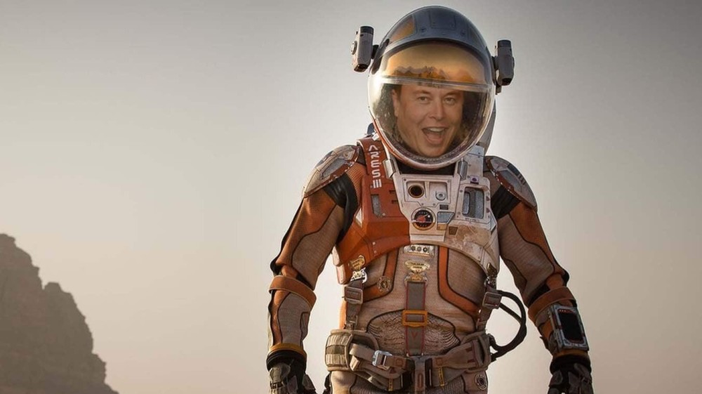

_头图 | Twitter_

**“炸了！炸了！”**

曾几何时，这是美国媒体对美国太空探索技术公司SpaceX报道时，最常用的标题格式。在过去两年，SpaceX的星际飞船（Starship）进行过无数次的测试，屡屡遭遇爆炸和损毁。

较为严重的一次，是2021年3月第12次星际飞船原型测试爆炸事件。其中炸出无数的碎片，让SpaceX花了三个月才清理干净。

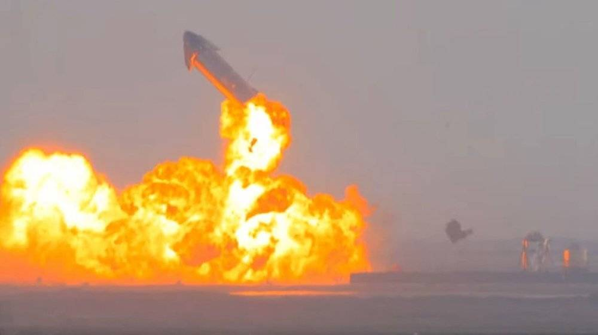

_2021年SN10
Starship爆炸_

契诃夫曾说过：“困难和折磨对于人来说，是一把打向坯料的锤。打掉的应是脆弱的铁屑，锻成的将是锋利的钢。”而如今的SpaceX正从阴霾中缓缓走出，并迎来新的里程碑。

北京时间2023年2月10日凌晨5时，美国当地时间2月9日晚间，SpaceX成功进行了一次超重型火箭助推器原型Booster
7的静态点火测试。虽然没有全发动机点火，而且整个点火过程虽然只持续了约5秒的时间，但它已经超越了苏联N1火箭一级30颗NK-15发动机同时点火的记录。

_SpaceX 31个引擎静态点火_

SpaceX创始人埃隆·马斯克在社交媒体平台上写到：“团队在开始前关闭了1个引擎，1个引擎自行停止，所以总共有31个引擎点火。但仍有足够的引擎进入轨道！”

**我们很多读者可能并不了解，这种将大量小型发动机并联组合成载人登月火箭这种技术方案有多么危险。**
因为，当一个系统变得复杂时，它的可靠性就会大大降低。SpaceX能并联如此多数量的火箭，同时还能保证系统运行的可靠性，这本身就是一件难于上青天的事情。

在上世纪60年代美苏冷战期间，双方曾围绕载人登月进行过长时间的太空竞赛。

因为技不如人和资金缺乏的原因，苏联无法在同样的时间研发出像美国土星5号那样的大推力运载火箭。但随着美国的土星5号火箭在同期进行了多次成功发射，苏联高层坐不住了。为了抢在美国阿波罗飞船之前完成载人登月任务，苏联高层甚至跳过了N1火箭的独立测试飞行测试，在该火箭的第一次发射时就为其搭载了联盟7K-L1登月飞船。

_30个并联NK-33发动机：像不像煤气灶？_

时间紧任务急，苏联的科研人员们只能寄希望于大力出奇迹了。他们将30台NK-33型发动机并联组成N1火箭的1级结构，用“众筹”的方式试图提升火箭的1级推力。按理说，NK-33发动机的足够先进，一度是人类历史上推重比最高的火箭发动机，直到21世纪被SpaceX的默林火箭发动机超越。

但问题在于，放在1969年1月的这个时间点上，构成N1火箭1级推进结构的30台NK-33发动机才刚刚出厂，并没有经过点火测试，还因为各种调试过程以及发射气象条件不佳的原因在发射台上被风吹日晒了四个星期。最终在1969年2月21日的第一次试验发射中，N1火箭因为1级火箭中的其中1个发动机的意外熄火，引发系统关闭了所有30个推进火箭。随后在点火3分钟后，N1火箭失去动力在距离发射塔52公里处坠毁。

在共3年多的时间里，N1火箭进行了4次发射，无一例外地以失败告终。其中的第二次事故里，由于其中1台发动机吸入异物，导致承担1级推进任务的全部30个发动机在火箭升空200米后全部熄火，进而致使N1火箭携带着2300吨推进剂在发射台坠毁并爆炸。

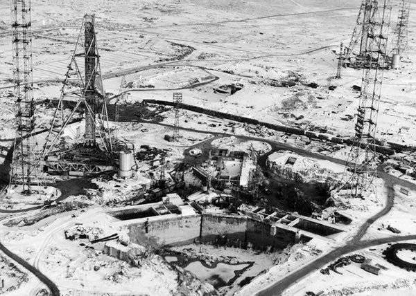

_爆炸后的发射台_

直到爆炸发生半小时后，现场人员才被允许走出掩体，而当时天空中还在下着煤油雨。这次爆炸破坏力相当于7000吨当量TNT，炸碎了方圆10公里内所有建筑物的玻璃，火光在相距发射场35公里外的列宁斯克市都清晰可见。不过幸好因为疏散即使，事故并没有造成人员伤亡。但这次发射彻底炸毁了火箭发射台，导致工作人员用18个的时间对其进行了重建。在4次连续失败后，苏联被迫放弃了载人登月项目，在冷战的太空竞赛中渐渐落后。

如此来看，SpaceX将超过30个引擎进行并联，难度显然不言而喻。而这次的静态点火虽然没有让飞船升空，但却意味着星际飞船完成了进行轨道发射前最后一步。接下来的3月或者4月，我们很可能就能看到星际飞船进行首次轨道飞行测试——距离马斯克的火星移民计划，又近了。

**“总有一天，星际飞船会带我们去火星”。** 马斯克说道。

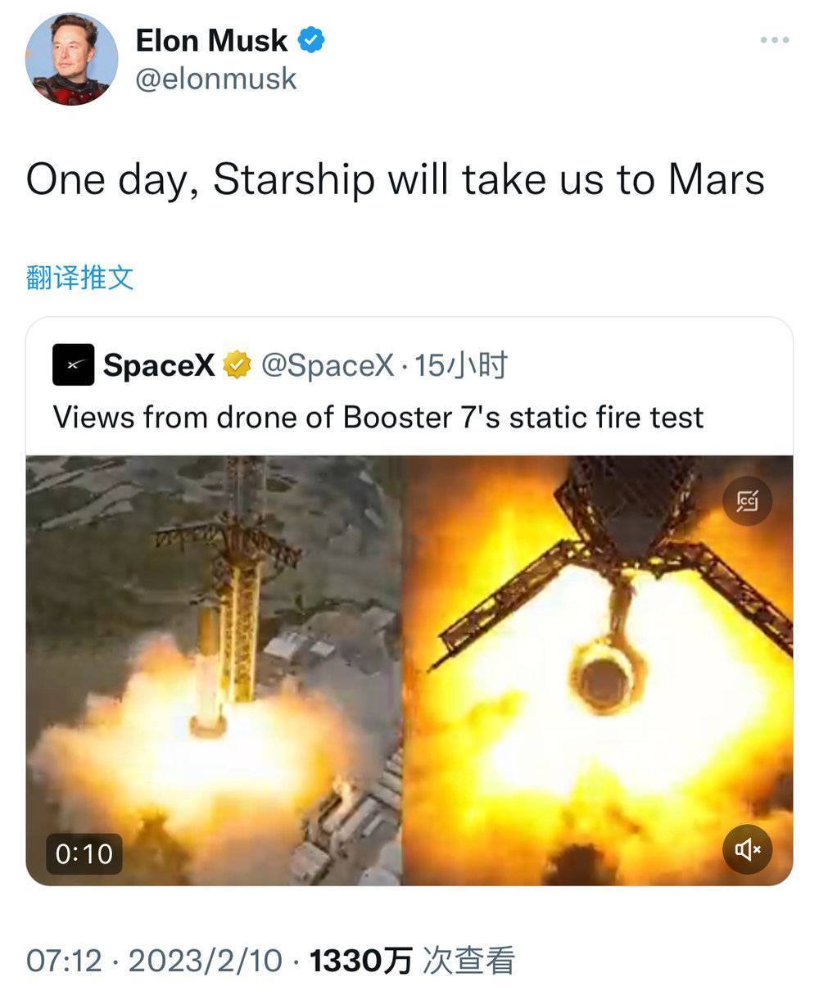

**成功点火，意味着什么？**

SpaceX的星际飞船（Starship）由两个可重复使用的部分组成，一个是约70米高的第一级助推器Super
Heavy，一个是50米高的航天器Starship。它们被统称为星际飞船——代表了一个完全可重复使用的运输系统，旨在将船员和货物运送到地球轨道、月球、火星及更远的地方。

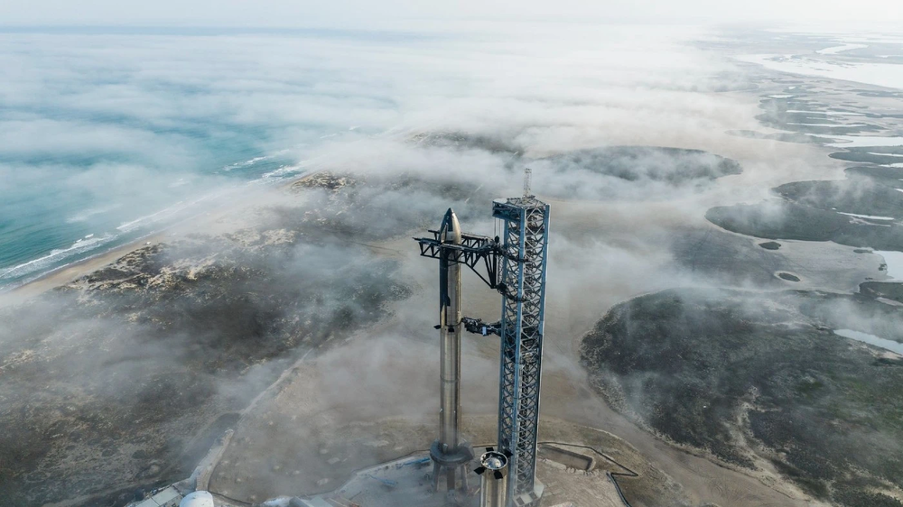

_Starship_

星际飞船的第一代原型机为星虫（Starhopper），第二代原型机（Starship No.X）简称为SNX，X为编号。超重助推器（Super Heavy
Booster No.X）简称BX，X为编号。

从2019年开始，星际飞船已经历过数十版的迭代和进化，其中部分原型机在测试中炸毁。到目前，航天器Starship迭代到了SN24，而助推器Super
Heavy则为Booster 7。

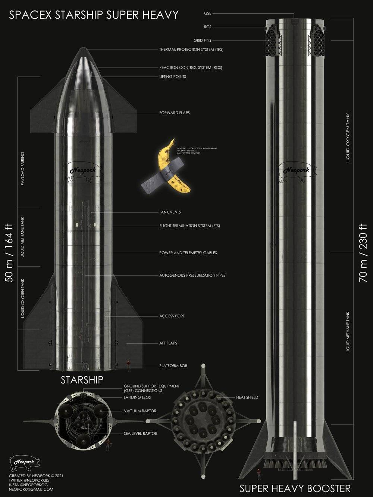

航天器在上，助推器在下，两者均由SpaceX的猛禽发动机（Raptor）提供动力，以液态甲烷和液态氧 (CH4 / LOX) 为燃料。其中，助推器Super
Heavy上有33个猛禽火箭发动机，而Starship上有6个。这次成功进行静态点火测试的，正是底部的助推器Super Heavy。

值得注意的是，SpaceX在猎鹰9号火箭上用的并不是猛禽，而用液氧煤油的梅林发动机（Merlin rocket
engine）。虽然它也能够撑到马斯克太空移民的目的地——火星，但在其上面却得不到补充的能源。而且，液氧煤油容易出现积碳、结焦，难以重复使用。

所以，SpaceX开发了猛禽发动机，其动力来源正是火星上能制造出来的——甲烷。

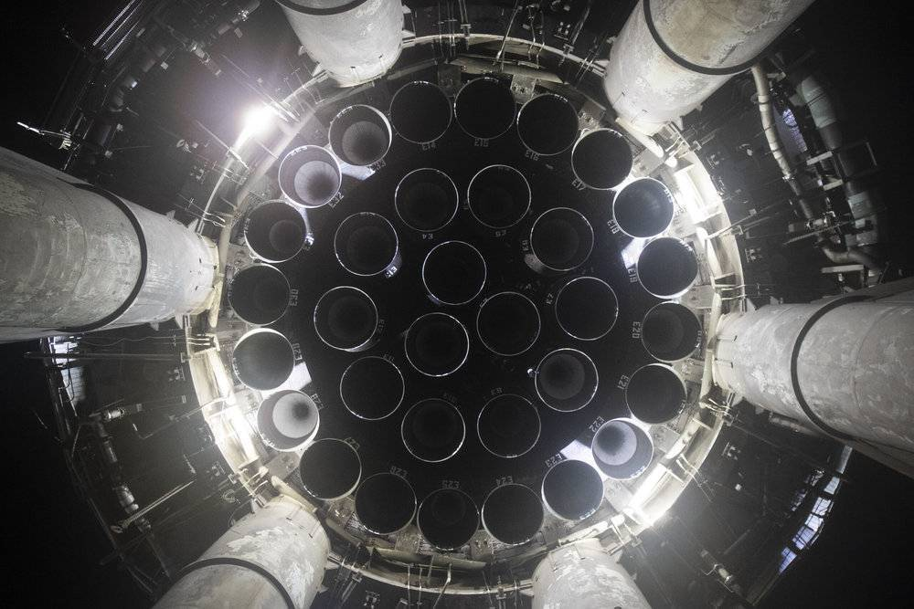

_Raptor猛禽火箭发动机_

猛禽发动机是世界上第一种实用化的甲烷火箭发动机，同时也是世界上第一种实用化的全流量分级燃烧火箭发动机。

所谓的全流量分级燃烧发动机，是通过使用多个燃烧室，部分燃料先进入预燃室燃烧，产生的推力再推动涡轮泵，驱动全部燃料进入主燃烧室燃烧并产生推力，可以将每一丝的燃料都转换成推力。

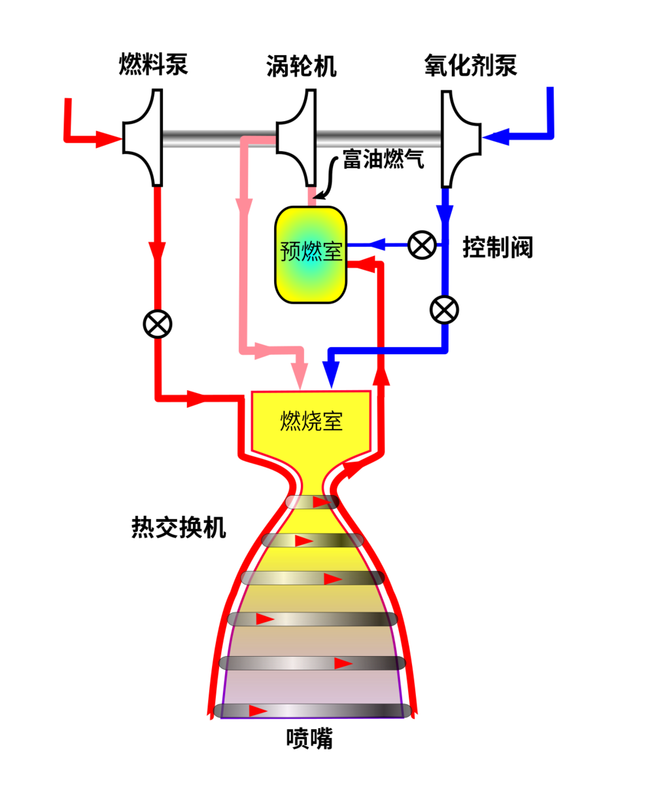

猛禽发动机的直径仅有为1.3米，室压约30兆帕，单台推力不低于200吨，尽管推力略小于蓝色起源（亚马逊创始人贝索斯的商业太空公司）的BE-4，但体积和燃料利用率却远优于后者。

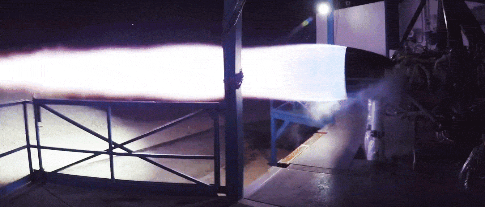

_猛禽火箭发动机_

**但与其说猛禽发动机是烧甲烷的，不如说是“烧钱”的。**

在2009-2015年间，猛禽发动机一直由SpaceX公司自筹资金研制｡到2016年，美国空军决定支持SpaceX公司的液氧/甲烷发动机研制项目，并提供了3360万美元的研制资金，但同时还要求SpaceX自己也要投入6730万美元的研制经费｡

所以，复用性也是猛禽发动机开发的基础要求之一。马斯克之前表示，未来安装在星际飞船上的猛禽发动机可免维护使用100次，简单维护后可以重复使用1000次。

理论上，复用次数越多，意味着单次发射的成本越低，最终“太空船票”也就会越来越便宜。但短期内，太空旅行仍是有钱人的游戏。

上太空，仍是富人的游戏

任何事物都是明码标价的，太空旅行也不例外。

2022年4月，载有首个全平民乘组的美国“SpaceX Crew Dragon”商用飞船抵达国际空间站。除NASA前宇航员迈克尔·洛佩斯-
阿莱格里亚之外，此次搭乘飞船参加太空旅行的乘客还包括美国人拉里·康纳、加拿大人马克·帕西以及以色列人伊尔坦·施蒂比。这3位乘客各自要为旅行支付5500万美元。

贝索斯的蓝色起源，首次亚轨道飞行的票价高达2000万美元，在可重复使用的运载火箭的帮助下，如今的票价已降至每次二三十万美元之间。

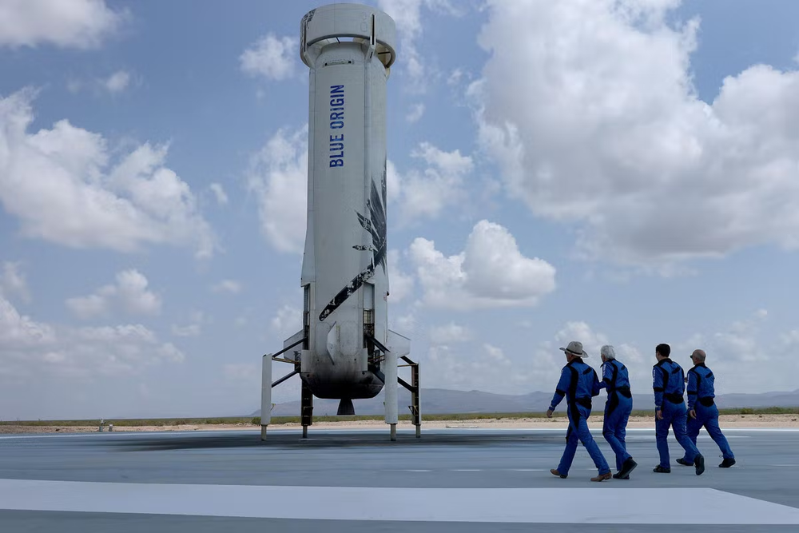

_蓝色起源_

理查德·布兰森带领的维珍银河去年发售的太空旅行机票售价为45万美元，但要先付15万美元押金，旅行时长为90分钟。期间将提供几分钟的离座失重体验和地球景色观赏项目。

与蓝色起源和维珍银河在“太空边缘”观光不同，SpaceX的太空旅行是正儿八经的要送富人们到月亮上去。日本富豪前泽友作（Yusaku
Maezawa）在2018年重金包下的SpaceX绕月之旅的所有座位。在2022年12月，他宣布了10名机组人员，其中还包括了韩国明星BIGBANG成员TOP。

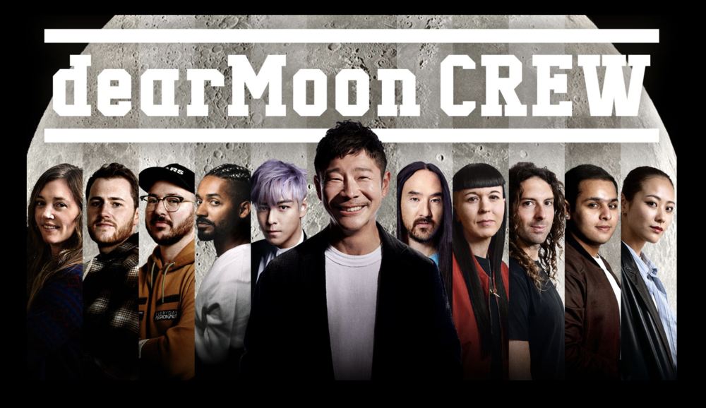

_前泽友作的机组人员_

这次绕月之旅，是要到达距离月球表面200公里以内的地方。最初计划使用猎鹰重型与龙飞船的组合运载器，但后来改为星际飞船（Starship），也就是这次进行发动机静态点火测试的那艘。

最早的计划是2023年四季度发射，但以现在的进度来看，虽然星际飞船的静态点火测试完成，但真正要奔赴月球仍有待时日。

在发动机静态点火之前一天，SpaceX总裁兼首席运营官 Gwynne
Shotwell公开表示，星际飞船需要经过数百次无人飞行验证后，才能用于载人飞行。星际飞船会先用于载人登月任务，而后再考虑在登陆火星任务中使用星际飞船。星际飞船首次载人登陆火星的目标时间，或许可以是在2030年。

最后能不能上月球和火星再说，至少现在的SpaceX靠已经开始有盈利的迹象了。Shotwell表示，SpaceX公司的关键业务线正在盈利，美国国家航空航天局所依赖的主要火箭发射服务之一已经成为该公司的盈利来源之一。

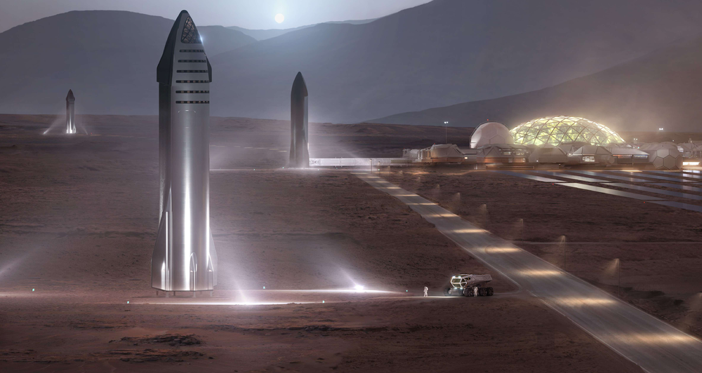

_马斯克的火星移民计划_

去年，SpaceX取得了几个新的里程碑成就。该公司在2022年共发射了61次火箭，几乎是2021年31次发射的两倍。猎鹰9号运载火箭也借此成为了一年内单一型号发射次数最多的火箭。此外，SpaceX的卫星互联网服务星链（Starlink）的用户超过了100万。她还表示，在2022财年，若不包括发射相关费用，星链有一个财季现金流为正。

**写在最后**

在SpaceX的官网上，写着马斯克曾说过的话：“你想要早上醒来睁开眼睛时，希望我们的未来会更好——这就是作为一个太空文明的意义所在。就是相信未来，认为未来会比过去更好。我想不出还有什么比去宇宙中，在那里和星辰在一起更令人兴奋的了。”

但目前看来，太空旅行的兴奋感都是留给富人们去享受的，普通老百姓们还在为特斯拉涨涨跌跌的那几千块，而争论不休。

出品 | 虎嗅汽车组

作者 | 王笑渔

标题 | 周到

