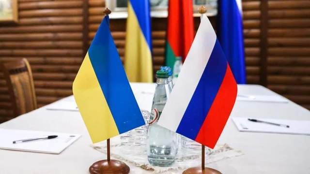
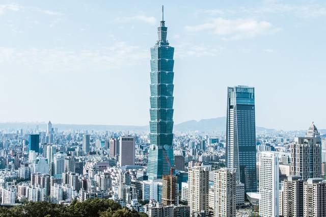
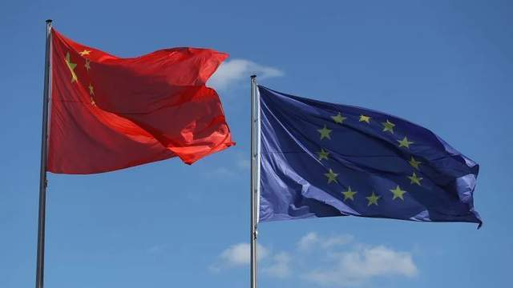
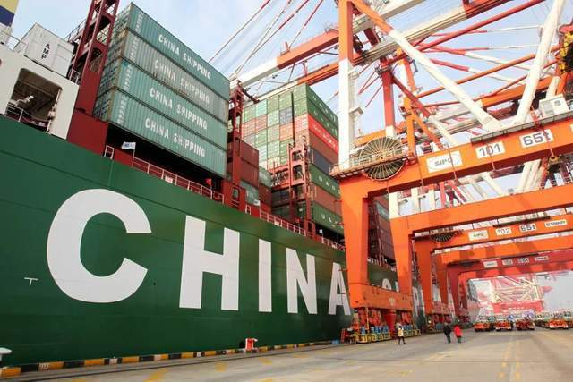

# 驻欧盟大使傅聪的60分钟吹风会，信息量极大

2023年2月8日，中国驻欧盟使团团长傅聪大使出席欧盟智库欧洲政策中心（European Policy
Center）举办的“60分钟吹风会”，与主持人、知名学者莎达（Shada Islam）对话交流，并回答现场观众提问。

以下是答问实录：

**莎达：大家好！感谢参加欧洲政策中心与中国驻欧盟大使傅聪阁下的在线政策对话。大使先生，欢迎来到布鲁塞尔！欢迎来到欧洲政策中心！**

**傅聪：** 感谢邀请！这是我的荣幸。

**莎达：我是欧洲政策中心的高级顾问莎达·伊斯兰，很高兴能促成与大使的60分钟对话。大使先生，您抵达布鲁塞尔已经两个月了，在此之前大使职位空缺了将近一年，我们对您的到来感到由衷的高兴。我注意到，您到任以来一直非常忙碌，与欧盟政策制定者、欧洲议会议员和一些学者、记者进行了广泛接触与交流。您非常乐观，对外界表示希望中欧关系进入一个新的时代。同时，您也非常坦诚，承认当前中欧关系有不少麻烦，处于不稳定状态。当然，我们在谈论中欧关系时，也离不开中美关系，这对布鲁塞尔发生的事也会有影响。大使先生，在提出所有这些困难的问题之前，我想先请您谈谈抵达布鲁塞尔以来的感受。**

**傅聪：**
谢谢你，莎达。首先，我非常荣幸和高兴来到布鲁塞尔出任中国驻欧盟大使。确实，在抵达布鲁塞尔之后将近两个月的时间里，我一直在忙着会见各界人士。应该说我得到了欧方同事们很好的接待。在所有这些会见中，我一直努力向各界传递的信息是中国非常重视中欧关系。中方认为中欧是伙伴而非对手。我们相信合作和伙伴是中欧关系的主旋律。我在这儿的工作就是推进中欧关系，改善氛围，取得具体成果，将双方关系带到更高水平。因为在中方看来，中欧关系十分重要，特别是在当前世界政治和地缘政治发生深刻变化，世界经济经历黯淡时期的大背景下。我有责任推动中欧加强合作，共同促进世界进步。

**中国疫情防控政策优化调整不是突然变化**

**莎达：是的，从世界经济来说，我们正在走出疫情。我的第一个问题是，中国似乎一夜之间改变了疫情清零政策，这令许多欧洲人感到意外。一些人包括商界担忧，这显示出中国决策突然变得不可预测。你对此有何评论？**

**傅聪：**
事实上，在这个问题上并没有不可预测性。首先，这不是政策的突然变化。过去三年，我们一直在根据疫情形势调整政策。比如，我们的疫情防控方案和诊疗方案已经更新了10次。现在的是第十版方案。最近我们之所以将动态清零政策调整为取消限制，特别是在人员流动方面，是因为我们看到病毒发生了变异，奥密克戎变异株传播力增强，但致病力大幅减弱。同时，中国已通过疫苗接种建立了群体免疫。我们做出决定时也借鉴了其他国家，包括欧洲国家的经验。因此，我不认为这种调整显示出任何不可预测性。中国重新开放后，人们对中国经济感到乐观，这也会对全球经济产生积极影响。人文交流和旅游市场都欣欣向荣。前不久我同欧洲旅游业界人士进行了交流，他们对中国游客重返欧洲的前景相当乐观。你知道，欧洲是一个对中国游客非常有吸引力的目的地。

**解决乌克兰危机的正确方是回到谈判桌**

**莎达：现在让我们谈谈您对改善欧中关系，让欧中关系进入新时代的希望和抱负。当前欧中有不少意见分歧。中国同俄罗斯的友谊是引发争论的一个主要原因。欧中在人权和台湾问题上也有争论。让我们先从去年乌克兰战争爆发前的中俄友谊“无上限”联合声明开始谈起。我们刚刚听说，俄方邀请习近平主席访俄。欧洲对此表示担忧，因为对欧洲人来说这是一个事关存亡的问题。我们的关切是，中国没有利用自己的能力、同俄罗斯的关系和友谊施压俄从乌克兰撤军，回到谈判桌前。**

**傅聪：**
中方在乌克兰危机上的立场是一贯的。我们认为，所有国家的领土完整都应该得到尊重，国际法特别是联合国宪章应该得到遵守，各方的合理安全关切都应该得到重视。我们主张和平谈判，支持和推动一切有利于实现和平的努力。这就是中国的立场。

刚才你说中国没有运用自身影响力，这并非事实，因为就在冲突开始的第二天，习近平主席就同普京总统进行了一次非常重要的通话。在通话中，中国呼吁和平和谈判。此后中国的立场一直是呼吁停止战争，停止杀戮，因为人们在被杀害。当许多人谈及使用核武器的危险时，中国清楚表明自己反对使用核武器。我们正在运用自身影响力推动和平。我们不仅同俄罗斯对话，也同乌克兰对话。我们还在同欧洲对话。

坦率地说，中方非常担心冲突可能升级。我们不相信提供武器能够解决问题。我们十分担心人们关于在战场上取得完全胜利的言论。我们认为正确的方法应该是回到谈判桌。我们呼吁尽快举行和谈，以便各方的领土完整和安全关切都能得到重视。

**莎达：是的。如果习近平主席真的访问莫斯科，他将向俄方表明中方立场。他会去吗？**

**傅聪：**
我不知道。还没有宣布。正如我经常说的，中俄关系是多层面的，不是单一议题关系。中俄领导人经常进行互访很正常，正如我们计划同欧盟开展互访一样。因此，如果习主席出访莫斯科，我不会感到惊讶，但我今天没有任何消息要宣布。事实上，我刚才提及的信息会被传递给俄方。这一点毋庸置疑。我们主张停止敌对，迅速开启谈判。

**莎达：但是大使先生，我想您能够理解，如果这次访问确实发生了，那将向世界其他国家传递一个信息，即在俄罗斯入侵乌克兰之时，中国同俄罗斯正在紧密合作，不是吗？**

**傅聪：**
正如我所说，中国同俄罗斯有传统友谊，我们的关系是多层面的。中俄关系不会由一个议题来主导，不会将其他合理议题排除出去。我们会讨论许多其他事情。当然我相信，乌克兰问题是其中一个不可避免的话题。但正如我所说，我们主张和平，主张谈判。这是肯定的。

**违背在台湾问题上的承诺将从根本上动摇双边关系基础**

**莎达：大使先生，让我们来谈一谈欧中关系。欧中在许多问题上都有困难。因为新疆的人权问题，欧中相互制裁。您曾说希望双方同时采取行动解除制裁。您刚来不久，有新的认识和见解。您认为同时取消制裁应如何实现？**

**傅聪：** 确实如此。刚才你提到中欧之间存在分歧，其中一些问题我们认为需要紧急和谨慎处理。头号问题就是台湾问题。尽管你还没有问到，我想先谈一谈。

**莎达：请便，因为人们将乌克兰发生的事情同中国对台意图相提并论。**

**傅聪：** 你又提到了乌克兰。我必须首先声明，乌克兰问题与台湾问题是完全不同的两个问题。乌克兰是一个主权国家，而台湾是中国的一部分。两者没有任何可比性。

关于台湾问题，我必须说，一个中国原则是中方的一条红线。我必须非常强烈地重申这一点，因为坚持一个中国原则是中国同所有其他国家，包括欧盟关系的基础。我必须提请人们注意欧共体1975年与中国建交时做出的重要承诺。当时欧共体承诺，所有成员国在台湾问题上采取中华人民共和国接受的立场。欧共体还承诺不与台湾发展任何官方关系，也不与台湾签署任何协议。这些都是非常具体和重要的承诺。

但现在一些人似乎认为任何国家都有权解释自己的一个中国原则。我们看到，欧共体的基本承诺受到了侵蚀，一些议员访问了台湾，欧盟机构的高级官员也访问了台湾，甚至出现了一些关于欧盟与台湾签署投资协议的讨论。这些都直接违背了欧共体在1975年中欧建交时做出的承诺。如果这些承诺被违背，将会从根本上改变或动摇双边关系的基础。我想提请欧盟伙伴注意这个问题的严重性。

你提到了人权问题，的确，中欧有分歧。但我认为，对所有国家来说，谁都不会反对人权或对人权说“不”，对吧？关键是如何解释人权。比如，人权是否包括发展权？由于不同的背景、历史、文化，各国在具体问题上有不同的看法，因此在处理这些问题时，各国的做法也会不一样。我们知道，欧盟国家对中国的人权问题有一些担忧。与此相对，我们对于欧盟国家的人权状况也有关切。如何处理这些分歧？这是关键。我们认为，正确的做法是对话和讨论。通过对话，我们可以阐明各自立场，增进彼此理解，减少误解。

关于人权问题的另一点是，我们应当将在人权问题上的分歧放在适当位置，而不是扩散到所有领域。中国同欧盟的关系是多层面的，如果我们让分歧扩散到其他领域，将使中欧关系变得非常困难。中欧投资协定就是这种情况。

**莎达：我一会儿会重新提到这个问题。如果您不介意的话，我想回到台湾问题。近日，捷克当选总统与台湾领导人通话。您刚才谈到这会从根本上改变中欧关系。我想说的是，这对欧盟来说是一个相当重的威胁。台湾是世界贸易组织的一个成员，它以观察员身份参加了世界卫生大会。如果台湾是世界贸易组织的成员，我们当然可以与台湾签订投资协定。**

**傅聪：**
不，我们不接受同台湾签署协定。台湾地区是以单独关税区身份加入世贸组织，不是一个国家，不能与其签署条约。这与基于条约或官方协议的双边关系不同，不是同一回事。关于台湾地区参与世界卫生组织问题，我曾在世卫组织工作，所以我了解有关背景情况。中国台湾省，我想用正式的名称，曾被邀请作为观察员参加世界卫生大会，是基于一个中国原则。台湾地区不再有权作为观察员参加世卫大会的原因，也是由于台湾当局拒绝承认一个中国原则。台湾地区因此失去了参会资格，因为世卫组织只向主权国家开放。

**莎达：大使，我有点不理解中国在国际上孤立您称之为台湾省的做法。台湾是重要的芯片生产地，在国际舞台扮演越来越重要的角色。我在想，现在是否到了应该在台湾问题上采取“与时俱进”的政策的时候了？**

**傅聪：**
实际上，中国并未阻止台湾开展同世界的经贸合作。我们的立场是，台湾可以（与其他组织或国家）保持经贸关系，只要这不隐射台湾拥有国家主权。这是最基本的要求，因为台湾是中国的一部分。确实，台湾是非常重要的半导体生产地，也是该领域有影响力的参与者。我们没有采取任何阻止措施。相反，台湾当局却试图阻止向中国大陆出口芯片，不是吗？我们并未阻止台湾发展经济关系，问题是他们正试图利用一切机会将其提升到政治层面。捷克当选总统与所谓的台湾“总统”通话，这意味着什么？这难道不是政治性质的吗？对吧？

**莎达：我觉得这又是一个如何解读的问题** 。

**傅聪：** 不，我不认为可以作其他解读。因为他们都自称“总统”，如果不是一个主权国家，就不应该有“总统”，不是吗？

**莎达：欧洲担忧中国对台湾省采取愈加强硬的立场。这种担忧合理吗？中方对台湾是否会越来越强硬，如果不是现在就进攻的话？大家对可能会出事的担忧是否在上升？**

**傅聪：**
不，我不认为中国很强硬。中国实际上采取的是过去几十年一贯的立场，只不过我们用更明确的措辞表达而已。说到强硬，我们知道有些人说中国在台湾问题上很强硬。大家需要知道一个事实，我们不否认采取强硬立场，但每次中国这么做都是对外部挑衅的回应。最近一轮的挑衅非常明显，美国前国会众议长佩洛西窜访台湾。我们实际上要求美方叫停访问，但佩不顾中方反复交涉执意窜访。你期待中方坐视主权被其他国家践踏吗？我们当然要对此作出强烈反应。但请记住，中国从来不挑事，我们是在回应挑衅。所以中国没有强硬。

**中欧同时解除制裁或请欧方提出建议**

**莎达：是的。大使，我们已经谈过了乌克兰和台湾问题。正如您所说，欧中关系是多面向的，我想回到经济问题上，谈一下中欧投资协定。由于双方相互制裁，该协定目前处于搁置状态。您提到如果协定不能正式获批，也许可以部分实施，我认为这想法很有意思。目前全球经济增速放缓，我们需要开放的市场。中国副总理刘鹤不久前出席达沃斯世界经济论坛时表示，中国已重新开放，欢迎国外投资，并将在国际舞台上发挥更重要作用。这对欧中关系意味着什么？**

**傅聪：**
确实，在重新放开、取消人员往来限制措施后，中国已重回世界舞台。中共二十大为中国今后5年及未来更长时期的发展擘画了宏伟蓝图。这次重要会议的主要成果之一，是明确了中国将坚持改革开放，坚持社会主义市场经济。这对世界经济是个利好。我们鼓励外国投资者回到中国，我们实际上在促进贸易方面做了许多工作。更具体来说，即使在新冠疫情期间，中国和其他国家的贸易也未受严重影响，但人员交往和接触受到影响。所以我们鼓励大家回到中国。我们的企业家也在走出去，寻找投资机会。

关于中欧全面投资协定。该协定是双方7年艰苦谈判的成果，双方都显示了巨大的灵活性。有一点需要牢记，这是一份互利共赢的协议，不是谁对谁的恩赐。我们知道，世界经济处在艰难时期，一些欧洲经济界人士对中国市场准入有些抱怨。实际上，这份协定将解决所有这些问题，特别是在当前情况下。当所有经济体都在想方设法提升经济时，这个有效的工具却被搁置了。我们不想追溯历史，讨论在制裁问题上到底谁对谁错，因为这种讨论不会有结果。

我们应该向前看。一个办法是双方同时解除制裁。我们也很务实，如果出于某些原因同时解除制裁行不通，我们对其他提议持开放态度。我们等待听取欧方的提议。我们的建议是同时解除制裁，如果你们认为不够好，请提出一些建议，我们愿意进行研究。但总的原则是，这些提议应建立在互利共赢的基础上。你不能只选择协议中对你有利的部分，而忽视、无视对我们有利的条款。正如我刚才提到的，这是一份经过7年谈判达成的一揽子协议，我们从协议中挑选的任何部分都应坚持互利共赢原则。如今，欧洲人和欧洲政府喜欢说对等，对等原则也应体现在这里。

**把政治和经济问题挂钩将失去战略自主**

**莎达：中国一直表示支持欧洲战略自主的愿望和计划。大使，您也曾对欧方采取贸易防御措施持批评态度，我认为这应当也是欧洲战略自主的一部分。您如何看待这个问题？欧盟难道不应像中国目前做的那样，努力减少对外部关键原材料或设备的依赖？**

**傅聪：**
首先，我想说，我们支持欧洲战略自主。事实上，我们一直清晰、明确表明这一主张。但我认为你对战略自主的解读有点片面。我们认为，当讨论贸易和经济时，我们应当遵守世贸组织规则，对吧？有些规则必须遵守。坦率地说，我们正关注所谓欧盟政策工具有关做法并感到担忧。我们认为这些工具有时是基于保护主义，有时让政治过多干预经济。坦率地说，这不是战略自主。把政治问题与经济问题挂钩，将使你失去战略自主。这是我的理解。我们应在商言商，为什么要让那些企业家来学习政治问题？而且一些对中国政治上的指责实际上是基于虚假信息，有时甚至是彻头彻尾的谎言。然后你要求企业家遵守基于虚假信息制定的一些所谓规则。

**莎达：您认为中国一些出口商和制造商正面临这些不公平的规则，能举个例子吗？**

**傅聪：**
比如，你刚才提到的新疆问题，存在许多骇人听闻指责，其中“种族灭绝”尤甚。我希望大家理解“种族灭绝”的真正含义。“种族灭绝”是指德国对犹太人的大屠杀，是（白人）对北美洲印第安人的大屠杀。

**莎达：“种族灭绝”也指降低一个社会群体或种族的作用、人口和影响。**

**傅聪：** 这是对“种族灭绝”概念的宽泛解释。实际上，在新疆问题上，维吾尔族人口从200万……

**莎达：“种族灭绝”可能也指控制一个社会群体的信仰。**

**傅聪：**
在新疆问题上，首先我想说维吾尔族人口从200万大幅增加至1200万。这当然不是所谓“种族灭绝”。说到信仰，你可以看看新疆有多少清真寺，人们可以自由去做礼拜。问题是欧盟出台的一些贸易规定提到了“强迫劳动”等问题。一项正在制定的规定要求企业进行尽职调查，证明不存在“强迫劳动”。

**莎达：没错，在供应链上。**

**傅聪：** 我们认为，这样做是没有道理的，因为这会增加企业的成本，有时也会给各种无端指责以可乘之机，反过来干扰商业。

**莎达：是的。大使，尽职调查不只针对中国，针对面更广。接下来，让我们回答一些提问。先从经济方面的问题开始，有一个关于太阳能板的问题。有报道称太阳能组件的出口可能将被限制，您有何评价？不知大使您是否听说过该问题，是否存在担忧？显然，当我们大力发展可再生能源时，存在许多补贴行为。中国过去一直给企业补贴，且不认为这些企业独立于政府。所以为何欧盟不采取保护措施以支持自己的国有经济和国有企业？**

**傅聪：**
我先回答补贴问题。实际上，中国是世贸组织《补贴与反补贴措施协议》的缔约方，已经取消了所有协议中的禁止性补贴。所以中国目前所有的补贴都符合世贸组织规定。这点需要明确。

其次，实际上我们不认为所有的国家补贴都是不好的，因为有些补贴可以为企业提供投资方面的指导。它们有助于绿色经济发展，不是吗？但这些补贴需要符合国际规则，也就是世贸组织规则。所以，如果欧洲最终决定向其企业提供补贴，那我们将需要研究这些补贴是否符合世贸组织规则。如果违反了，我们就将采取措施。

**莎达：是的，有可能会引发他国的反应。**

**傅聪：** 关于太阳能板的问题，坦率地说，我不知道提问者具体指什么？

**莎达：有些报道称，太阳能组件出口可能被限制。**

**傅聪：** 被谁限制？

**莎达：被中国。**

**傅聪：**
我不清楚。我可能要慎重回答，因为我不清楚中国将如何采取限制措施。我没听说中国政府宣布了任何措施。对中方而言，与之相反情况才是事实，不是吗？中国向欧洲、美国出口的太阳能板被进口方严格限制，而不是中国。中国至少不会采取全面限制措施。

**莎达：是的，大使，世界正在发生变化，正如提到的补贴和出口管控等问题。我们看到美国正对中国采取许多出口限制，贸易格局也在变化。让我们回到下一个问题，因为我认为这是一次非常有意义的对话。大使，再次感谢您的坦诚和开放。有一个关于中国与中东欧国家“14+1”合作的问题。以前是“17+1”、“16+1”，现在是“14+1”。相关合作前景如何？**

**傅聪：**
实际上对中方而言，我们愿与所有国家开展合作。中国—中东欧国家合作倡议由中国和一些东欧国家共同提出，目的是由中方帮助建设一些基础设施，双方已经成功开展了一些合作项目。我们希望继续相关合作。但孤掌难鸣，一方想合作，如果另一方不愿意，这是他们的选择。我想明确一点，中方的目的从来不是分裂欧洲。事实上，了解有关合作机制的人告诉我，中国与一些国家提出合作倡议是专门为了帮助这些国家发展经济，以满足他们加入欧盟的条件。

**莎达：是的，这很有帮助。大使，“一带一路”倡议是中方与中东欧国家合作的重要部分。欧盟也提出了“全球门户”战略，许多人认为是与“一带一路”倡议对抗和竞争。我的问题是，您觉得两者能发挥协同作用吗？双方应该合作还是在不同的轨道竞争？**

**傅聪：** 的确如此。请原谅我的直白，但我们知道欧盟发起这个计划就是为了抗衡中国的“一带一路”倡议。

**莎达** ： **欧盟从未如此说过。**

**傅聪：**
那很好，我希望这又是虚假信息。但我想强调，中国从积极角度看待欧方计划。我们完全可以互相联接。世界如此之大，对基础设施的需求也很大，没有一个国家可以垄断或者独自满足这些需求。

**莎达：需求达万亿。**

**傅聪：** 没错。因此我们很高兴与欧盟携手合作，共同在非洲、中亚落实计划。我已经同欧盟官员就如何在中亚开展合作进行了一些沟通。

**莎达：我这里有一个问题，您可能会感兴趣，他提及在非洲开展合作。中方对此持何立场？您之前提到，这是一个您愿意同欧方合作的议题。**

**傅聪：** 正是如此。中国愿意同各方一道，帮助非洲兄弟发展经济。

**莎达：之前那位观众想澄清一下他的问题，他是指一些出口限制将影响硅片、黑硅和称之为锭子的产品，这已引起部分企业恐慌，因为这些都是太阳能产业必需的材料，供您参考。**

**傅聪：** 如果我理解正确的话，这不涉及太阳能板本身，而是一些原材料。

**莎达：是的。有观众提出了一个问题。您刚才提到了对等，但您怎么理解对等？欧盟对中国公司的开放程度是否应同中国对欧盟公司的开放程度一致？这是对等吧？**

**傅聪：**
对等是一个原则，各方都应遵守。但至于如何解释，我认为不应该“以牙还牙”。我们的经济结构不同。这就是为什么我说，中国同欧盟和欧洲国家在经济上总体是互补的。

**莎达：但中国是怎么做的？说实话，在制裁问题上，中国的做法确实“以牙还牙”。**

**傅聪：** 只有在必要的时候，中国才会“以牙还牙”。但经济问题更复杂，不是吗？

**中方倡导合作安全和共同安全观**

**莎达：让我们谈谈可持续发展目标和中国提出的全球发展倡议和全球安全倡议，因为中国和欧盟都在谈论多边主义，以及他们如何坚定捍卫多边主义。这里有一个问题，想了解中国对包括世界银行、国际货币基金组织，以及《巴黎协定》等多边机构改革的看法、计划或设想。这些都是可持续发展目标的支柱，但在我看来，这些目标现在都严重偏离了轨道。**

**傅聪：** 的确如此。首先，中国同欧盟一样都倡导多边主义。谈到全球治理，中国更是一些主要机构改革的有力倡导者，这包括世界银行和国际货币基金组织。

**莎达：所以中国会继续推动全球发展倡议，虽然我们并没有过多谈及这个问题。**

**傅聪：**
事实上，中国提出了两个重大倡议：全球安全倡议和全球发展倡议。这两个倡议都是为了加强全球合作，无论是在发展领域还是在安全领域，这是总的原则。全球发展倡议主要通过“一带一路”倡议来具体实现，所以这些都是相关联的。关于安全问题，我们认为全球安全格局正经历深刻变化。

**莎达：确实，我们可以看到这一点。**

**傅聪：**
如果你读一下习近平主席关于全球安全倡议的声明，就会发现我们提倡合作的安全观。安全只有通过合作和共同安全才能实现。不可能一些国家享受绝对安全，而其他国家的合理安全关切遭到忽视。这是关键。我们还主张应该遵守国际法，特别是《联合国宪章》。我们的倡议没有任何不可告人的目的。我知道，有些人认为中国想破坏或者说重构世界秩序。

**莎达：你们不想吗？**

**傅聪：**
不想。事实恰恰相反，我们主张致力于或者说重新致力于维护《联合国宪章》。这怎么能说是重构世界秩序呢？而且合作安全和共同安全都是二战后形成的一些基本概念，也是很多其他原则的基础。所以说，我们并不是要重构任何秩序。我们只是想让世界变得更美好。

**莎达：但这是一个中国拥有更大影响力的更美好世界。**

**傅聪：**
当然，我们希望拥有更大影响力，但不是像有些人指责的那样，以全球体系为代价来实现。哪个国家不希望在世界上有更大的影响力？随着中国的发展，我们当然希望看到中国在国际舞台上发挥更大作用，能够更好捍卫自身合法利益。

**中国在联合国系统任职人数远落后于西方国家**

**莎达：有人会说，中国已经在这样做了。中国已经对一些国际组织施加非常大的影响，而且一些国际组织的领导职位也由中国人控制。**

**傅聪：**
这种说法有点儿夸大其词了。的确，中国候选人当选了一些国际组织的负责人。但中国作为一个大国，同时也是联合国会费的第二大出资国，为什么不能有中国人担任国际组织负责人呢？你可以看一下，有多少联合国机构是由美国人担任负责人的，你再看看有多少重要职位掌握在英国和西方国家手中。如果你比较一下，就会发现中国还差的很远。我曾在联合国系统工作，我知道，就在联合国系统中担任职位的数量而言，中国远远落后于西方国家。

**美日荷半导体出口管制不符合任何一方利益**

**莎达：大使先生，我们的对话即将接近尾声。我还有一个问题是关于出口管制的，您如何看待荷兰最近决定加入美国对中国实施的技术出口管制？**

**傅聪：**
首先，我们还没有看到有关协议的内容。我不明白他们为什么要搞得如此神秘。其次，我们认为这是一个政治干预技术和商品贸易的典型案例。我们知道，这不符合荷兰的利益，不符合欧洲国家的利益，坦率地讲，在经济上也不符合美国的利益，很多美国公司也在抱怨。但美国出于政治和地缘政治考虑，试图将中国排除出全球供应链或者说同中国脱钩，达到其遏制中国的目的。我认为世界不应允许这种危险趋势继续发展，否则将导致两个“平行体系”。

**莎达：分裂的世界。**

**傅聪：** 没错。这不是我们愿意看到的。

**中国的大门将进一步开放、高水平开放**

**莎达：**
但是很多人，包括欧洲商界人士都在担心，中国正在退出全球经济。您刚才谈到了中国正在重返世界，但中国也有“双循环”战略。这是否表明，不仅仅是美国，很多国家也在变得更加内顾？

**傅聪：**
不是这样的。我知道“双循环”战略引发了很多关注，但外界对这个战略的解读并不准确。关于“双循环”，我们确实强调国内市场的重要性。但中国拥有如此巨大的市场，国内消费理应成为经济发展的重要动力，这无可厚非。可这并不意味着中国要对其他国家关闭大门。正如我刚才所说，中国的大门只会越开越大，中共二十大响亮而明确地传递出这个声音，这是中国最权威的政策宣示。大家完全可以放心，中国的大门不会关闭，对外开放的政策还将继续。如果有变化的话，那就是中国的大门将进一步开放、高水平开放。现在我们正在讨论制度型开放，这意味着外国企业将参与标准和规章制度的制定，将以更可预测和更具法律保障的方式参与中国经济。这些对外国企业来说都是利好消息。所以中国的大门不存在关闭的风险，这就是我想传达的信息。

**外交官的工作是争取朋友并捍卫国家利益**

**莎达：这的确令人鼓舞，尤其是在当前的经济困难时期。还有3分钟，这里还有另外一个问题是关于“战狼外交”。您可能听说过，或者可能参与过。现在“战狼外交”结束了吗？这种外交是一个错误吗？我们未来会较少看到它吗？**

**傅聪：** 我其实并不知道人们说的“战狼外交”是什么意思，可能是因为中国的外交官们越来越直言不讳了。

**莎达：没错，我们对此很享受。**

**傅聪：**
你应该享受，难道不是吗？对我们以及所有外交官来说，最重要的工作或任务之一就是争取朋友，这也是我们正在努力做的事情。与此同时，当中国的核心利益受到威胁时，所有中国外交官都有责任站出来，竭尽所能地捍卫国家安全和利益。这并不意味着中国的外交官是“战狼”，这是各国外交官的共同使命。我不知道当美国外交官在几乎所有问题上批评中国时，你管他们叫什么？

**莎达：好的，我们谈论的不是美国，而是欧盟和中国的关系。非常感谢您。还有很多观众提出了问题，大使先生已经回答了很多。如果我没有再问关于乌克兰或台湾的问题，那是因为大使先生在一开始已经详实回答过了。但是，大使先生，我也想告诉您一些问题被反复提出，比如中国要求欧盟不在美国和中国之间选边站队，但中国已经选择同俄罗斯站在一起，甚至无视国际法。这是不断被提出的问题，也正是我们的关切，而且在我们的坦诚公开对话中，听到这些声音非常重要。大使先生，最后还有一分钟，我想请您谈谈对未来四年的设想和期待。**

**傅聪：** 我主要有两个任务：一是改善中国和欧盟之间的政治环境，二是希望推动中欧这一重要双边关系取得一些实实在在的成果。所以我在这两方面都在努力。

**莎达：非常感谢您来到欧洲政策中心，谢谢您的坦率和开放态度。您传递了一些非常强烈的信息，我们还需要时间来消化和吸收它们。期待着与您下次对话。再次感谢您！也感谢各位与会来宾！再见！**

来源丨中国驻欧盟使团

