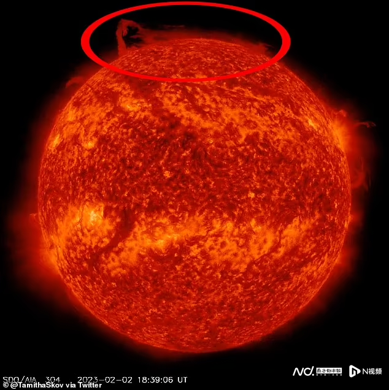
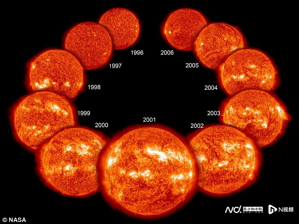

# NASA拍到太阳北极一块断裂脱落，前所未有的事件令人困惑

美国宇航局（NASA）的太阳动力学观测站近日拍摄到太阳北极一块断裂脱落的惊人视频，显示一个巨大的等离子体丝现在像龙卷风一样围绕着太阳北极旋转。这是一个前所未有的事件，令科学家感到困惑。

_太阳北极突出部的一大块物质从极地断裂脱落。_

据报道，太阳动力学观测站在社交媒体推特上发布的视频显示，太阳北极突出部的一大块物质从极地断裂脱落，正在太阳北极周围一个巨大的极地漩涡中旋转。

NASA表示，这是一个巨大的等离子体丝，或电化气体，看起来就像从太阳表面射出的细长的、不均匀的线，被太阳的磁力拴住。

天文学家们对此感到困惑，他们推测这个突出物与太阳磁场的逆转有关，这种逆转每一个太阳周期都会发生一次，而突出物每11年就会精确地出现在太阳极冠周围55度的纬度上。

_太阳磁场的逆转每一个11年太阳周期都会发生一次。_

天文学家之前已经观察到了脱离太阳的丝状物，但这是第一次有一个丝状物以旋风的方式在该地区循环。

2015年，有两条长长的太阳物质丝从太阳中挣脱出来，喷发到太空中。

上面的那条首先断裂，将黑暗的等离子体送往它下面的一个活跃区域。一两个小时后，下面那条丝线爆发了。

科学家们还没有确定是什么原因导致最近的观测中的等离子体丝围绕太阳旋转，而不是喷射到太空中。

最近太阳活动的增加是由于它即将进入11年太阳周期中最活跃的阶段，该周期将在2024年达到活动高峰。

_NASA太阳动力学观测站。_

天文学家正在观察到强烈的太阳辐射、更多的太阳物质抛射、太阳黑子的增加，以及更猛烈的太阳耀斑。

2022年8月，欧洲航天局（ESA）的盖亚（Gaia）航天器做出了一个令人不寒而栗的预测：我们的太阳几乎已经走过了它的一半寿命。

当到达终点时，太阳将膨胀并吞没地球。不过，来自该飞船的数据表明，这至少在未来50亿年内不会发生。

盖亚确定太阳的年龄约为45.7亿年，通过识别其质量和成分，该设备估计了太阳将如何演变。

太阳的消亡之路始于100至110亿岁左右，届时它的体积迅速增大。

由此开始，太阳奔向死亡，最后成为一个冷淡的白矮星，这是一个死亡恒星的热而密集的核心。

文/南都记者 陈林

