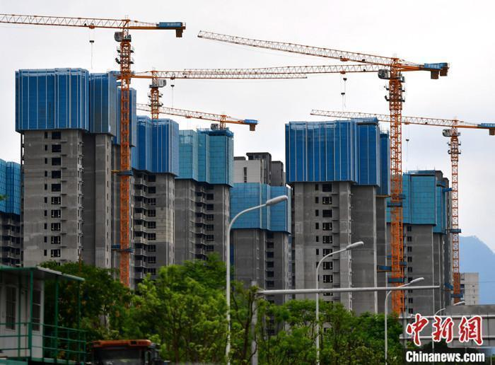
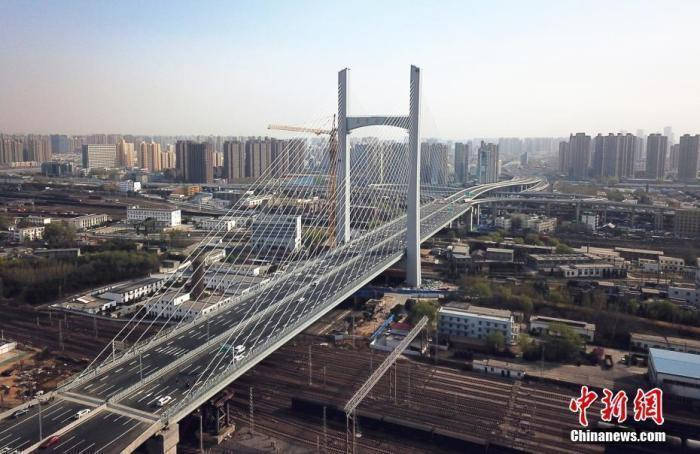

# “一手交钱一手交房”，现房销售还有多远？保交楼、防风险是重点

中新网2月12日电(中新财经记者
左宇坤)“有条件的可以进行现房销售，继续实行预售的，必须把资金监管责任落实到位，防止资金抽逃，不能出现新的交楼风险。”1月17日召开的全国住房和城乡建设工作会议明确提出。

此后的近一个月内，已有山东、安徽、河南、四川四省明确了现房试点。从“鼓励”到“试点”，距离“一手交钱一手交房”还有多远？

_正在建设中的房地产楼盘。
中新社记者 张斌 摄_

**试点现房销售，防风险是重点**

1月31日，山东省住房和城乡建设工作会议召开，会议提出，逐步提高预售门槛，鼓励有条件的地方先行先试，开展现房销售试点。

2月6日，在安徽省住房和城乡建设工作会议上，安徽省住建厅相关负责人透露，2023年安徽将因地制宜开展现房销售试点。

2月6日，四川省人民政府关于印发《聚焦高质量发展推动经济运行整体好转的若干政策措施》的通知中提出，支持有条件的城市开展商品房现售试点，积极推动房地产业向新发展模式平稳过渡。

2月7日，河南省住房和城乡建设工作会议召开，会议明确，今年将进一步规范商品房预售资金监管，逐步提高预售门槛，以郑州、开封为试点，积极探索预售制度改革和现房销售。

曾经的房地产黄金时代，商品房预售制能够快速回笼资金，快周转模式对行业加速发展起到了重要作用。进入新的周期，房地产业向新发展模式平稳过渡，保交楼、防风险成为工作重点，现房销售试点也被多地提上议事日程。

_郑州一景。
丁友明 摄_

以河南省为例，中指研究院指数事业部市场研究总监陈文静指出，河南省“保交楼”任务较重，2023年又是“保交楼”的重要节点。本次河南省结合实际情况提出新的要求，是对主管部门政策的进一步落实。

“郑州已供应土地和新房都很多，在售和潜在供应量非常大，房价又持续下跌。实施现售不会因供应周期长、建设成本高而使得供应跟不上，从而导致全社会房价上涨，也就符合住建部提出的‘符合条件的城市探索现售模式’。”广东省城规院住房政策研究中心首席研究员李宇嘉指出。

**尝试升级，有何不同？**

相比期房销售，“一手交钱、一手交房”的现房销售对于消费者而言具有所见即所得的明显优势，能有效规避烂尾、质量争议等风险，也自然得到了购房者的青睐。

“2022年全国新建商品住宅成交面积同比下滑26.8%，全国期房销售面积同比下滑29.6%，这反过来说明现房销售市场没有遇到较大的下跌。”上海易居房地产研究院数据显示，全国现房销售规模明显比期房销售行情要好。

“宁愿多花20万，也一定要买现房。”社交平台上，不少买房人这样交流呼吁着。但某省会城市的一位房地产销售对中新财经表示，当前购买现房同样需要多留心。

“在目前以期房为主的大环境下，开发商好、品质好、地段也好的房子是很难‘熬’成现房的，可能是当地购买力不足，或者存在其他不利因素成为滞销盘。”他表示，还有一种情况是有些地方期房限价、现房不限价，开发商捂盘惜售。总之消费者不要因为现房而放松警惕，一定要注意观察。

_资料图：夕阳下美丽的福州一景。
王东明 摄_

但对于开发商来说，现房销售对现金流、施工能力的要求更高，也因此推行起来难度较大。

李宇嘉认为，在现阶段，如果土地价格、建设成本不变，现售会抬高建设成本，从而影响这类房子的销售。所以现售制度下，必须要求政府在地价上让利，以降低开发成本，进而稳定房价预期，也能降低购房的成本。

多地已此前进行过尝试。2014年，上海市黄浦区五里桥街道一拍卖地块的出让预合同中提出“该地块内建成房屋不得预售，须以全装修现房销售”；2022年，福建福州在一宗地块的土拍中要求，该宗地按现房销售实施，规划房屋竣工验收之后，竞得人方可申请房屋销售手续。

“2021年上半年之前，各地主要是通过设定现房销售模式，促进房企理性拿地、促进地价平稳；之后则主要是从防范烂尾楼风险、防范房企金融风险蔓延等角度出发，这也是各地探索房地产新发展模式的重要体现。”上海易居房地产研究院研究总监严跃进指出。

**“鼓励”到“试点”，取消预售制的时机到了吗？**

在“防风险”的基础上，预售制是否可能在这一阶段被取消？

“保交楼、烂尾楼问题，本质上是预售资金监管不严所致，而并非预售本身有什么问题。”李宇嘉认为，更重要的是加强流程和资金的监管。

陈文静也认为，短期来看，为实现“保交楼”，预计预售资金监管及预售政策或将保持严格状态，政策也将更加规范，各地或结合当地实际情况灵活调整预售资金监管和预售条件，促进房地产市场供需两端预期稳定。

在严跃进看来，此前对于预售制的改革，更多是从鼓励及自愿的角度出发；今年则跳出了鼓励和自愿的范畴，反映出对现房销售推进的力度有所加大，相关领域改革的节奏明显加快。

“从过去的‘鼓励’升级为‘试点’，这也意味着现房模式改革之路的正式开启。各地还是要把握政策大趋势，主动研判现房销售市场，为各地现房模式的推进创造更好的条件。”严跃进说。

