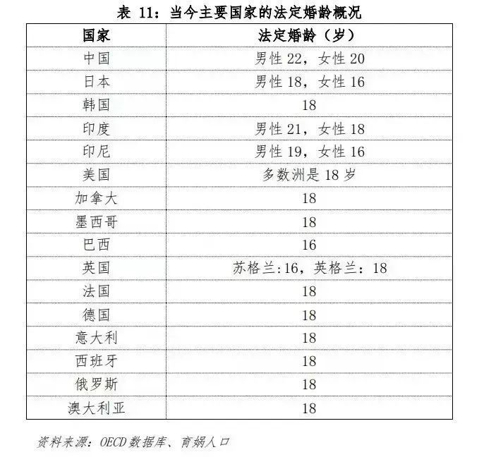

# 任泽平回应建议“降低法定婚龄到18岁”：有误读，并非必须要18岁结婚

关于建议“降低法定婚龄到18岁”网上讨论的统一回应：我国法定婚龄远高于国际水平，是计划生育时代提倡晚婚晚育的历史遗留问题，现在国家开始放开并鼓励生育，降低法定婚龄到18岁，从科学和国际经验的角度，是再正常不过的，但是这一话题为什么引发了广泛的社会讨论和争议？原因无非是社会的固化认识和思维惯性。

给大家科普一下一个常识：中国法定结婚年龄男性22岁、女性20岁，远远高于欧美亚世界各国，与之对比的是，日本男性18岁、女性16岁，美国男性18岁、女性18岁，印度男性21岁、女性18岁，德国、法国、加拿大、墨西哥等男性18岁、女性18岁。

可见，中国法定结婚年龄明显偏大，改革迟缓，影响年轻人婚姻、生育、家庭幸福等一系列问题。

作为计划生育时代提倡晚婚晚育的历史遗留问题，降低法定婚龄正当其时，大势所趋，是利国利民的善政。简单讲，目前过高的法定婚龄是计划生育时代提倡晚婚晚育遗留下的“阑尾炎”，是该改革了。

需要说明的是，降低法定婚龄到18岁，是还权于民，就是把选择权还给老百姓，每个人自主选择的权力扩大，而不是必须要18岁结婚，网上有些解读存在误读。

建议有关媒体和专家，一定要研究中国经济的真问题，用知识推动社会进步，科学理性为民生发声。正心正念，坚持做长期正确的事。

**附《中国婚姻家庭研究报告》摘要：**

我国结婚率从2000年的6.7‰上升到2013年的9.9‰，随后逐年下降，2020年结婚率下降到5.8‰；离婚率从2000年的0.96‰上升到2020年的3.1‰。

2013年，我国结婚登记对数为1346.93万对，2021年结婚登记对数下降到763.6万对，连续八年下降。另外，初婚年龄大幅推迟。2021年安徽省初婚平均年龄分别为男31.89岁，女30.73岁。

结婚人数下降的原因：一是年轻人数量下降，二是适婚人口男多女少，三是养育成本高，四是结婚成本高，五是社会竞争激烈、就业压力大，六是年轻一代的婚姻观念已经发生改变。

建议：增加大城市住宅土地供应，给予有孩家庭购房补贴；降低生育、养育、教育成本；建立男女平等、生育友好的社会支持系统；放宽收养和送养条件；法定婚龄降到18岁；保障单身女性生育权。

超低生育率以及年轻人口的迅速萎缩，已成为中国社会面临的重大挑战。要提升生育率，政府部门需出台相关政策措施鼓励年轻人结婚生育，积极出台相关政策降低年轻人的结婚生育成本。此外，社会各方也需要引导年轻人树立积极的婚恋观，共同关心适婚人群的婚姻问题，积极创造有利条件，帮助更多的单身青年走进婚姻、建立家庭。

