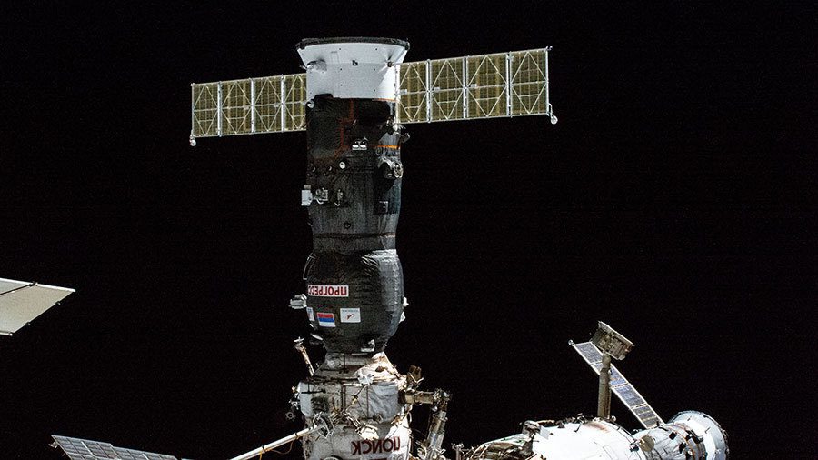

# 俄“进步MS-21”货运飞船出现密封失效现象，国际空间站宇航员未受威胁

（观察者网讯）据俄罗斯塔斯社2月11日报道，俄罗斯国家航天集团当天发布消息称，停靠在国际空间站的“进步MS-21”货运飞船出现密封失效现象。目前飞船的对接舱门已经关闭，国际空间站内的温度和气压处于正常状态，宇航员没有受到任何威胁。

_塔斯社报道截图_

密封失效的具体原因仍在调查中。俄罗斯国家航天集团载人航天项目主管谢尔盖·克里卡廖夫表示，飞船发生泄漏的确切位置尚未得到确认，俄罗斯专家将研究可行的调查方法，“间接信息指向冷却系统，但这还不能确定。”

克里卡廖夫说：“遗憾的是，（泄漏发生的）确切位置是不可见的。我们需要想办法确认破洞的外观和可能的原因，因为外部调查获得的高质量图像可以帮助我们缩小调查范围，了解发生了什么，以及事件是如何发生的。”

此外，正在密切监测国际空间站状态的美国国家航空航天局（NASA）宣布，将会协助俄方调查漏气事故的原因。该机构在一份声明中说：“NASA专家正在协助俄罗斯同事排查‘进步MS-21’货运飞船泄漏的原因。官员们正在监控所有国际空间站系统。”

“进步MS-21”货运飞船于2022年10月26日从哈萨克斯坦境内的拜科努尔航天发射场升空，在10月28日与国际空间站俄罗斯舱段“搜索”号（Poisk）小型研究模块对接。该飞船共向国际空间站运送了超过2500千克的货物，原计划在今年2月18日与空间站分离。

俄国家航天集团发言人表示，泄漏减压不会影响“进步MS-21”货运飞船在下周六（18日）与国际空间站分离的计划，也不会影响后续的载人航天任务。

_与国际空间站俄罗斯舱段“搜索”号小型研究模块对接的“进步MS-21”货运飞船
图自NASA_

对于本次事故，克里卡廖夫还补充说，“在国际空间站停靠数月的货运飞船发生冷却系统泄漏，这种情况与我们的飞船（联盟MS-22）去年12月中旬发生的事故类似。”

他强调，俄国家航天集团将进行“深入分析”，避免在未来的发射任务中遭遇类似的问题。俄专家将会仔细检查发射准备顺序，以及组装温控系统时使用的材料和技术，“确保这不是任何形式的系统性错误是最重要的。”

2022年12月15日，停靠在国际空间站的俄罗斯“联盟MS-22”号飞船仪表设备舱外壳受损，造成冷却系统泄漏。塔斯社称，负责调查此次事故的委员会研究认为，“联盟MS-22”号飞船的泄漏是由微流星体撞击引起的。

**本文系观察者网独家稿件，未经授权，不得转载。**

