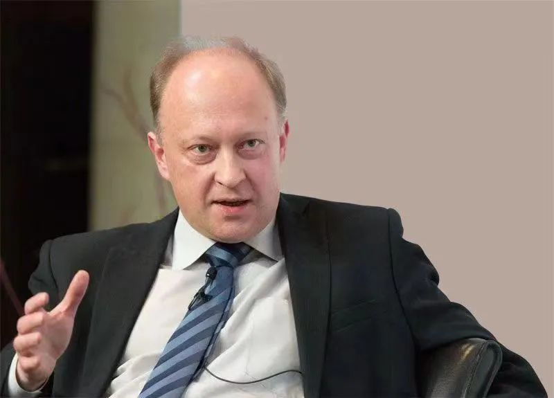
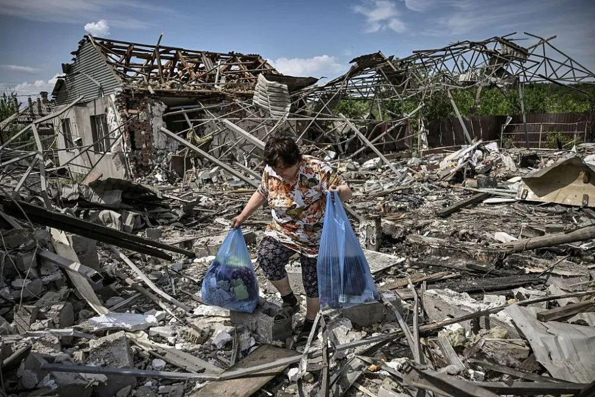

# 俄罗斯真想“由打转谈”了？

2月11日，俄罗斯外交部副部长谢尔盖·韦尔希宁在接受俄罗斯红星电视台采访时表示，俄罗斯准备与乌克兰接触，在“不应有任何先决条件”并“根据现状”的情况下开始对话。

在俄乌冲突持续一周年之际，韦尔希宁的言论被国际社会视为一种积极信号。但也有声音指出，他的说法并不新鲜。2022年11月，乌克兰总统泽连斯基提出“俄罗斯撤军并赔偿损失”的谈判先决条件后，俄罗斯外交部另一位副部长亚历山大·格鲁什科就曾说，谈判需要“无先决条件”和“基于现实”。

“这一次，你可以理解为（和以往不同）。”2月11日晚，俄罗斯国际事务委员会总干事科尔图诺夫说。过去数月，这位被西方媒体视为“克里姆林宫智囊”的莫斯科政策界人士曾多次对《中国新闻周刊》表示，虽然冲突各方经常做出愿意谈判的表态，但其实都希望在战场上争取更大的优势，“只有精疲力竭，双方才会坐下来寻求政治解决途径”。

_科尔图诺夫_

如今，科尔图诺夫认为，政治解决途径依然遥远，但俄乌双方开始对话接触的可能性确实有所上升。一个细节是，2023年1月，俄罗斯外交部司长阿列克谢·波利丘克接受采访时，还在强调俄乌之间的谈判必须“没有西方调解人存在”。但在2月11日的表态中，韦尔希宁坦言，决定能否与俄罗斯会谈的不是乌克兰，而是西方主要国家，并暗示“如果拜登先生及其幕僚足够谨慎和明智的话”，双方或能开始对话。

“任何敌对行动最终都会以谈判告终。” 韦尔希宁说。

2022年2月24日俄军对乌发起“特别军事行动”前，双方已就顿巴斯问题进行了长达八年的谈判。冲突升级后，双方于3月3日到7日在白俄罗斯进行初步对话。一系列线下和在线接触后，俄罗斯外长拉夫罗夫与乌克兰外长库列巴于3月10日在土耳其安卡拉会面。同月29日，双方代表团在土耳其伊斯坦布尔再次会晤，讨论俄军撤回2月24日前控制线、乌克兰永久中立、国际安全保障、双边元首会晤等一系列关键议程。分析人士后来认为，这是一年来的冲突中，双方离暂时停火最近的时刻。

然而，2022年4月后，涉及杀害平民的“布查事件”和马里乌波尔惨烈的围城战，及其背后反映出的双方强烈的“以战争取胜”的意愿，最终导致伊斯坦布尔会晤未能继续。但科尔图诺夫强调，双方仍保持一定程度的接触。

在冲突相关问题上，双方在土耳其进行了多轮有关交换战俘的谈判。在非官方渠道，俄乌政策界人士一直就和平谈判的“技术性问题”保持交流。“下一步的目标，就是将对‘小问题’的讨论逐渐扩展到对‘大问题’的讨论。”

2月11日的采访中，科尔图诺夫说，目前仍然不能判断未来几个月内是否一定有官方谈判发生，但各方应抓住难得的契机，推动俄乌双方先建立起更稳固的沟通渠道。“这包括在没有停火、继续冲突的背景下保持交流。只有这样，当双方想就任何问题达成一致的时候，我们能有达成一致的渠道。”

截至2月11日，俄军仍在努力完成对乌克兰顿涅茨克州东北重镇巴赫穆特的合围，并在顿涅茨克州南线组织新攻势。1月中旬，俄军占领距巴赫穆特仅18公里的小镇索莱达尔后，激战近一月，仍未切断巴赫穆特守军的对外通道。乌方统计称，巴赫穆特前线双方在2月10日到11日间进行了至少39次交战。西方情报机构认为，俄军推进速度低于预期。

此外，俄罗斯空军和海军2月10日到11日对乌克兰南部各主要城市基础设施进行了空袭及无人机、无人艇攻击。其中，俄军无人艇首次参战，破坏了敖德萨州的一座公路铁路桥。分析人士认为，这是对泽连斯基近日访问欧洲、推动西方援助先进战斗机的回应。双方在前线的动向，都没有转入和谈的迹象。

_顿巴斯地区冲突持续
民众在废墟里找可用物品 图/视觉中国_

**从讨论“小问题”到讨论“大问题”**

**中国新闻周刊：2月11日，俄罗斯外交部副部长韦尔希宁表示，俄罗斯准备好与乌克兰进行“没有先决条件”的谈判。这被各方视为一个积极信号。但在过去一段时间，类似的声明出现过很多次，正如你此前接受采访时曾总结的，当时双方并非真有谈判的意愿。那么这一次，韦尔希宁的声明是否有所不同？是否展现了更多的诚意？**

**科尔图诺夫：**
是的，我认为可以这么理解。韦尔希宁强调的是，目前我们的对话不要预设任何条件，首先要确保双方通过政治途径保持接触，开始交谈。这包括在没有停火、继续冲突的背景下保持交流，包括公开的和非公开的政治接触。只有这样，当双方想就任何问题达成一致的时候，我们能有达成一致的渠道。

这不是俄方第一次表达出接触的意愿。今年1月，在东正教圣诞节前夕，普京总统提出了圣诞停火的建议，并通过暂时停火观察乌克兰方面的反应，没有得到积极反馈。但与此同时，俄乌双方也就一些“小问题”实现了持续接触，比如我们经常有关于交换战俘的谈判。下一步的目标，就是将对“小问题”的讨论逐渐扩展到对“大问题”的讨论。

我认为，现在俄方的想法是先开始某种谈判。最终的政治解决方案还很遥远，但我们可以先就一些具体的停火、人道问题展开对话，而非追求立刻全面解决危机。

**中国新闻周刊：除了交换战俘等与武装冲突相关的谈判，“特别军事行动”开始之后，俄乌之间是否还有其他领域的对话接触？这些接触能推动两国政府间的对话吗？**

**科尔图诺夫：** 俄乌政策界没有完全中断联系，我和基辅的同行仍有一些交流。我认为他们中不乏理性、客观的人，包括一些前高级官员。

在政策界的非官方对话中，我们讨论的也是“小问题”，主要是技术性问题。比如，如果我们能达成和平协议，谁来监督、如何监督协议的履行，如何处理这一过程中产生的争议，等等。总有很多技术性问题可以讨论。

我不好说这些乌克兰政策界人士在多大程度上能影响决策者，或者他们和泽连斯基当局关系如何，以及这些讨论背后是否反映了一些乌克兰政府的立场，但坚持这种对话接触本身就是重要的，我们一直在做我们能做的事。

**中国新闻周刊：过去一年，我们一直看到有俄方官员表达对话接触的意愿，但我们也经常听到与此相反的激进声音，它们同样来自俄罗斯政治人物。我想未来一段时间，这种状况仍将继续。我们应该如何看待那些强硬的言论？这些言论会成为俄乌接触的障碍吗？**

**科尔图诺夫：**
俄罗斯是有一些这样的政治人物，但他们的言论并不总是代表克里姆林宫的立场，也并不意味着俄罗斯政策界对“特别军事行动”及其目标的共识性结论。有些人相信这能为他们博取政治资本，但事实上并非如此。我会对这些言论持保留态度。

**双方无法很快回到“伊斯坦布尔时刻”**

**中国新闻周刊：你刚才强调了“无条件”开始谈判，但韦尔希宁也提到谈判“要考虑俄方的目标”，那么在未来的谈判中，哪些条件对俄方来说其实是不可接受的？**

**科尔图诺夫：**
关于“俄方的目标”，如果我们遵循克里姆林宫对此的解释，其定义是模棱两可的。一开始提到的目标包括对乌克兰的非军事化和中立化，也包括保卫顿巴斯的人民不受侵害。现在我们不能准确地说“特别军事行动”的目标一定是什么。

但可以确定的是，有些条件对俄方来说是非常难接受的。比如涉及已经被“并入”俄罗斯联邦的四个地区。这已经被写入俄罗斯宪法，政府很难后退一步。同样清楚的是关于“吞并克里米亚”的问题。

对于这些难题，我推测唯一可能可行的谈判结果是：现在由俄罗斯控制的一些地区将处于“不确定状态”，即这些地区继续由俄罗斯控制，乌克兰政府则继续主张主权，但双方同意不再使用军事手段解决这个问题。

这种协议并非是不可能的。去年3月，俄罗斯和乌克兰外长曾在伊斯坦布尔谈论过这个话题。当时的一种方案是：通过公投解决争议地区的归属问题，该公投会由双方一起在未来15年内完成。本质上，这是将地区的未来交给下一代人而非这一代相互仇恨的人去决定。

**中国新闻周刊：你提到2022年3月双方在伊斯坦布尔的会晤，这是过去一年双方最接近停火谈判的机会。你会建议双方先回到“伊斯坦布尔时刻”吗？**

**科尔图诺夫：**
很难说这些方案是否还可以被讨论。双方现在都采取了强硬得多的立场，回到这些条件会比去年3月时困难的多。乌克兰方面提到了越来越多的“冲突前”问题，比如2014年的克里米亚危机，甚至是苏联解体之初的边界划分。俄乌之间，在这些问题上的立场目前是不可调和的。

所以话说回来，现在最基本的目标是先接触、再停火，然后再去讨论双方可能接受或拒绝的政治解决方案。我们看不到其他选择，唯一的办法就是用非常渐进的方式去结束冲突。

或许我们无法很快回到“伊斯坦布尔时刻”，但可以先共同讨论如何管控局势，避免进一步升级；然后就限制冲突的暴力程度达成更多的共识，逐步过渡到更复杂、更有意义的问题上。

**“泽连斯基或许不能公开表现出让步”**

**中国新闻周刊：接下来是关于乌克兰方面谈判立场的问题。哪些条件是泽连斯基政府绝对不能接受的？在去年3月的对话接触中，美国政府曾试图影响乌方的谈判进程，如今美国政府是否会更希望谈判不发生，推动乌克兰在战场上取得更大的“胜利”？**

**科尔图诺夫：**
众所周知的是，泽连斯基政府之前提出过和平谈判的条件：不会有任何领土上的让步，要追究战争罪行，获得多边安全保障，并加入欧盟和北约，等等。其中诸多条件，不是俄罗斯单方面可以承诺的。

我们并不知道泽连斯基近期是否会做出更灵活的表态。考虑到乌克兰国内政治的现状，他或许不能公开表现出让步。所以我们可能需要等待一段时间，才能知道在这些条件中，哪些是可以协商的，哪些是不可调整的。

我一直和美国政界人士及专家接触。从我和他们的对话中判断，我认为美国政府对乌克兰问题的政策缺乏一致性和连贯性。他们只是秉承一些基本的原则：首先，乌克兰不能失败，乌克兰必须作为一个独立的、和俄罗斯处于对立关系的国家存在。

其次，如你提到的，他们想要“更大的胜利”，想要“击败普京”，但其具体意义并不明确。这取决于美方认为可以通过这场冲突削弱俄罗斯的实力到何种程度。

最后，他们希望在欧洲建立新的安全秩序，其目的是在未来防止同类冲突重演。

从根本上说，这些原则并不完全拒绝对话接触。我们可以看到美国国内也有关于其国家战略和对俄政策的讨论。从现在开始，未来几个月内，我们将更好地了解美国真正想要什么，以及在他们看来俄方终止这一切所需要承担的成本。

**中国新闻周刊：欧洲国家及世界其他主要国家会比美国更愿意看到和平谈判开始吗？他们的态度能否推动美国同意对话接触？**

**科尔图诺夫：**
这就是正在发生的情况，特别是一些新兴国家正在参与这个进程。我们看到巴西总统卢拉在会见拜登时主动提到希望和中国、印度等一起参与俄乌冲突的调停工作。如果主要发展中国家能就当前的局势达成共识性的立场，各方不能不加以重视。

当然，在所有“调解联盟”的构想之上，众所周知的是，这些国家之间还存在许多合作的鸿沟。共同调停俄乌冲突，能否成为亚非拉各国跨越鸿沟的契机，还有有待观察。

记者：曹然

