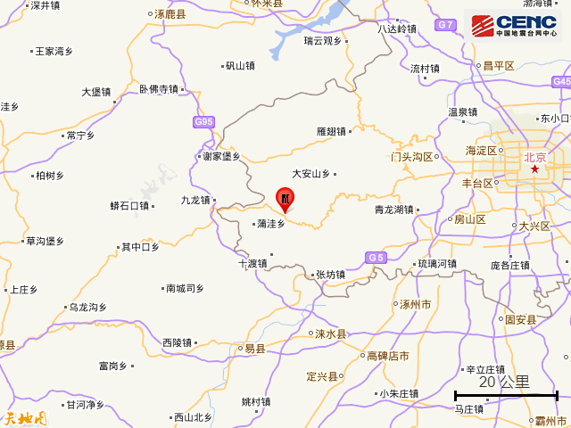
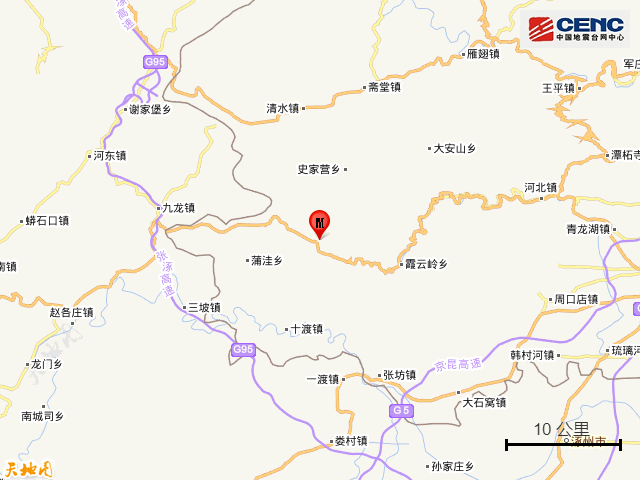
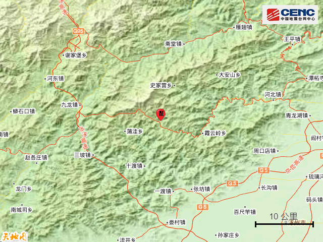
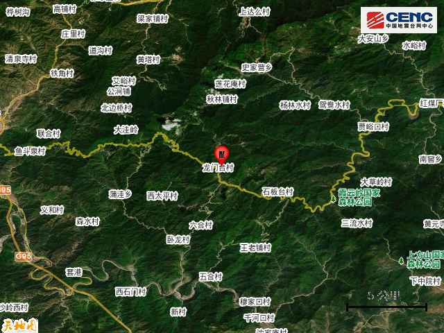
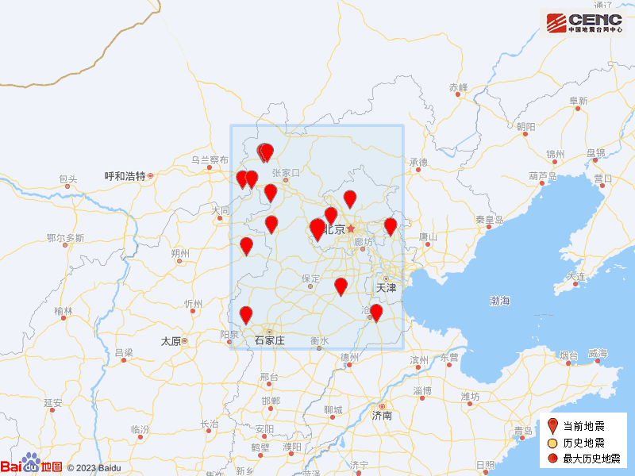

# 北京房山区发生2.8级地震，震源深度14公里

据中国地震台网正式测定，2月12日16时42分在北京房山区发生2.8级地震，震源深度14公里，震中位于北纬39.76度，东经115.63度。

震中5公里范围内平均海拔约797米。

根据中国地震台网速报目录，震中周边200公里内近5年来发生3级以上地震共16次，最大地震是2021年6月22日在河北张家口市张北县发生的3.9级地震（距离本次震中188公里），历史地震分布如图。

